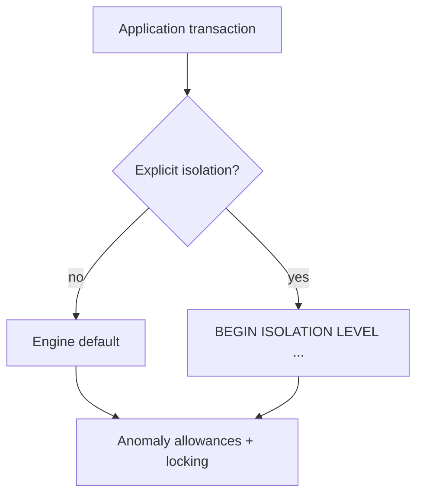
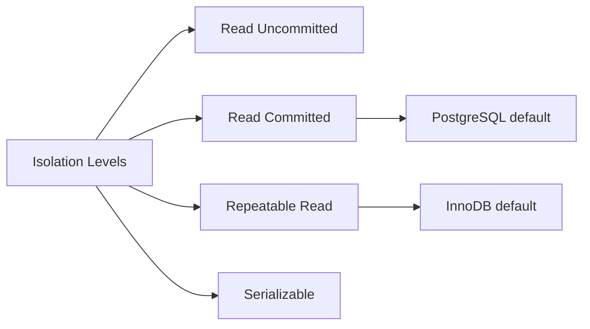
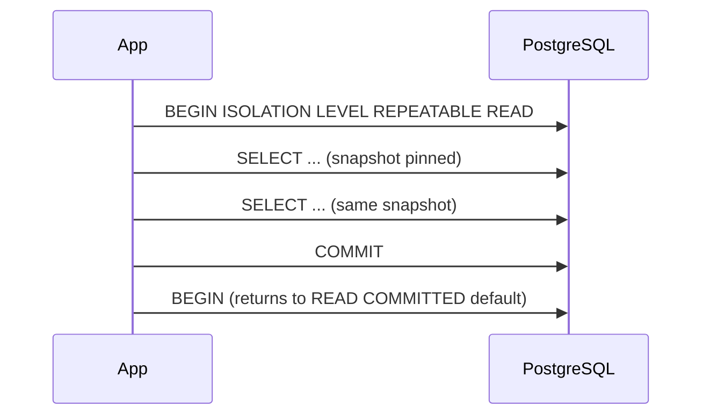

# Isolation Levels and Product Defaults

## Overview

SQL defines four **isolation levels**—READ UNCOMMITTED, READ COMMITTED, REPEATABLE READ, SERIALIZABLE—each forbidding a subset of anomalies. **Products implement levels differently**: PostgreSQL defaults to READ COMMITTED with statement-level snapshots; MySQL InnoDB defaults to REPEATABLE READ with next-key locks; SQL Server defaults vary by edition and RCSI setting. **Default ≠ safest**; defaults optimize common throughput with documented anomaly allowances.

## Learning Objectives

- State anomaly prevention matrix for standard isolation levels
- Document PostgreSQL, MySQL InnoDB, and SQL Server default behaviors
- Set session/transaction isolation explicitly in SQL and drivers
- Choose level per workload (OLTP reporting, batch, inventory)
- Avoid assuming ORM default matches database default

## Prerequisites

- [[08-Databases/05-Transactions-and-Isolation/Anomalies Dirty Nonrepeatable Phantom Serialization|Anomalies Dirty Nonrepeatable Phantom Serialization]]
- [[08-Databases/05-Transactions-and-Isolation/Locking vs MVCC|Locking vs MVCC]]

## Difficulty

`intermediate`

## Estimated Time

- Reading: 2 hours
- Exercises: 3 hours
- Mini project: 3 hours

## History

ANSI SQL-92 standardized levels from phenomena definitions, but implementations predated precise specs. Database vendors documented deviations (Oracle SI ≈ RC, Postgres RR stronger than standard for phantoms on keys). Cloud managed services inherit engine defaults—operators must read engine docs, not SQL standard alone.

## Problem It Solves

- **Portable SQL myths** ("SERIALIZABLE everywhere")
- **Cross-database bugs** when app tested only on Postgres defaults
- **Reporting drift** under READ COMMITTED multi-statement transactions
- **Over-serialization** when global SERIALIZABLE chosen unnecessarily

## Internal Implementation

### Standard anomaly matrix (simplified)

| Level | Dirty | Non-repeatable | Phantom |
| --- | --- | --- | --- |
| READ UNCOMMITTED | Allowed* | Allowed | Allowed |
| READ COMMITTED | No | Allowed | Allowed |
| REPEATABLE READ | No | No | Allowed* |
| SERIALIZABLE | No | No | No |

\*PostgreSQL maps READ UNCOMMITTED to READ COMMITTED. PostgreSQL RR blocks many phantoms via predicate locks on unique indexes / SSI interactions—see engine note.

### Product defaults (2020s common)

| Engine | Default | Notes |
| --- | --- | --- |
| PostgreSQL | READ COMMITTED | New snapshot per statement |
| MySQL InnoDB | REPEATABLE READ | Next-key locks, gap locks |
| SQL Server | READ COMMITTED | RCSI optional (MVCC reads) |
| SQLite | SERIALIZABLE | Database-level locking simplified |



## Mermaid Diagrams

### Structure



### Sequence / Lifecycle — setting level per transaction



## Examples

### Minimal Example — session isolation

```sql
-- PostgreSQL 15+
SHOW transaction_isolation;  -- read committed

BEGIN TRANSACTION ISOLATION LEVEL REPEATABLE READ;
-- transaction-scoped
SELECT transaction_isolation();  -- repeatable read
COMMIT;

SET TRANSACTION ISOLATION LEVEL SERIALIZABLE;  -- next transaction only in PG
BEGIN;
-- serializable
COMMIT;
```

### Production-Shaped Example — TypeScript per-request isolation

```typescript
// Node 20+ / pg — explicit level for reporting snapshot
import pg from "pg";

export async function monthlyReportSnapshot(
  pool: pg.Pool,
  month: string,
): Promise<{ orders: number; revenue: string }> {
  const client = await pool.connect();
  try {
    await client.query("BEGIN ISOLATION LEVEL REPEATABLE READ");
    const orders = await client.query(
      `SELECT count(*)::int AS c FROM orders WHERE date_trunc('month', created_at) = $1::date`,
      [`${month}-01`],
    );
    const revenue = await client.query(
      `SELECT coalesce(sum(amount),0)::numeric AS s FROM orders WHERE date_trunc('month', created_at) = $1::date`,
      [`${month}-01`],
    );
    await client.query("COMMIT");
    return { orders: orders.rows[0].c, revenue: revenue.rows[0].s };
  } catch (e) {
    await client.query("ROLLBACK");
    throw e;
  } finally {
    client.release();
  }
}
```

## Trade-offs

| Dimension | Upside | Downside | When it matters |
| --- | --- | --- | --- |
| READ COMMITTED | Fast, default tooling | Cross-statement drift | most CRUD |
| REPEATABLE READ | Stable multi-select | Still not full serial | financial reports |
| SERIALIZABLE | Strong invariants | Aborts/retries | inventory |
| Global override | Uniform behavior | Hidden perf cost | platform teams |

### When to Use

- REPEATABLE READ for multi-query consistent snapshots in one txn
- SERIALIZABLE for contended invariants without manual lock choreography
- Document chosen level in service runbooks per endpoint

### When Not to Use

- Do not set SERIALIZABLE globally to "be safe"
- Do not assume Spring `@Transactional` isolation without checking default
- Do not port MySQL gap-lock assumptions to PostgreSQL blindly

## Exercises

1. Build anomaly matrix experiment suite for Postgres at RC, RR, SER.
2. Compare same concurrent test on MySQL RR vs Postgres RC (if available).
3. Find ORM default isolation for your stack; document override mechanism.
4. Measure serialization failure rate under synthetic write skew at SERIALIZABLE.
5. Write decision table: endpoint → isolation level → rationale.

## Mini Project

**Isolation policy linter.** Code search for BEGIN without isolation; flag inventory paths.

## Portfolio Project

Isolation level chapter in [[08-Databases/projects/Isolation Anomaly Clinic/README|Isolation Anomaly Clinic]].

## Interview Questions

1. PostgreSQL default isolation level?
2. Which anomalies does READ COMMITTED allow?
3. Difference between SET TRANSACTION and BEGIN ISOLATION LEVEL?
4. Why does InnoDB default differ from PostgreSQL?
5. When would you choose REPEATABLE READ for a report?

### Stretch / Staff-Level

1. Explain SQL Server RCSI and how it changes locking READ COMMITTED.
2. Design connection pool policy when some requests need SERIALIZABLE.

## Common Mistakes

- Testing concurrency only at default level
- Mixing isolation in nested transactions incorrectly (savepoints don't upgrade isolation)
- Ignoring driver autocommit wrapping individual statements
- Confusing **read committed** with **monotonic reads** in distributed systems

## Best Practices

- Set isolation explicitly on sensitive code paths
- Implement retry on 40001 for SERIALIZABLE
- Document product-specific deviations from ANSI matrix
- Service txn boundaries → [[07-Backend/08-Data-Access-and-Persistence-Patterns/Transactions as Used by Services|Transactions as Used by Services]]

## Summary

Isolation levels name allowed anomaly classes; engine implementations and defaults determine real behavior. PostgreSQL's READ COMMITTED is statement-snapshot oriented; stronger levels pin snapshots or detect serial conflicts. Portable applications set isolation deliberately, test under concurrency, and retry serializable failures—never assume ORM or SQL standard labels alone describe production semantics.

## Further Reading

- [[00-References/Databases/README|Databases References]]
- PostgreSQL — Transaction Isolation
- MySQL — InnoDB Transaction Model

## Related Notes

- [[08-Databases/05-Transactions-and-Isolation/Snapshot Isolation and SSI Concepts|Snapshot Isolation and SSI Concepts]]
- [[08-Databases/05-Transactions-and-Isolation/Anomalies Dirty Nonrepeatable Phantom Serialization|Anomalies Dirty Nonrepeatable Phantom Serialization]]
- [[08-Databases/06-Concurrency-Internals/Hot Rows Write Skew and Contention|Hot Rows Write Skew and Contention]]
- [[07-Backend/08-Data-Access-and-Persistence-Patterns/Transactions as Used by Services|Transactions as Used by Services]]

## Progress Checklist

- [ ] Explained from first principles
- [ ] Drew at least one Mermaid diagram
- [ ] Implemented a minimal version
- [ ] Documented trade-offs and non-goals
- [ ] Completed exercises
- [ ] Practiced interview questions aloud
- [ ] Linked prerequisites and dependents
