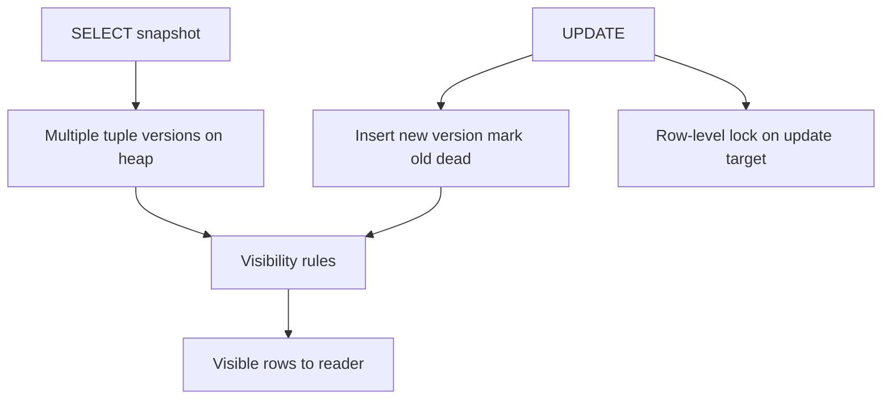
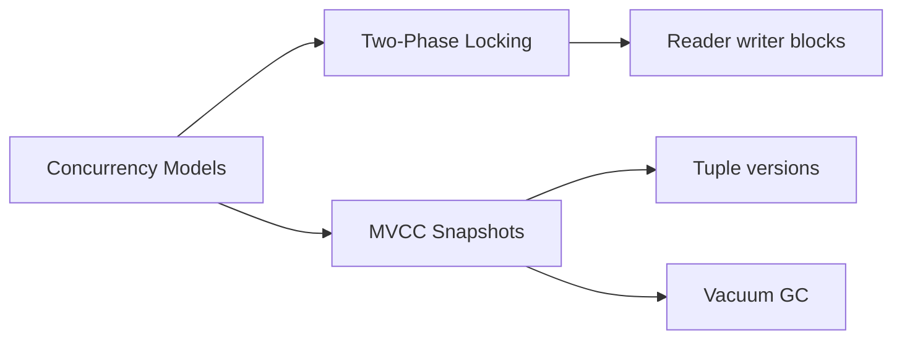

# Locking vs MVCC

## Overview

Engines implement isolation with **two-phase locking (2PL)**—readers/writers block on lock acquisition—and/or **multi-version concurrency control (MVCC)**—readers see snapshot versions while writers create new row versions. PostgreSQL is MVCC-first: reads rarely block writes; writes conflict via row-level locks and serialization checks. Understanding both models explains bloat, vacuum, lock waits, and why "SELECT doesn't lock" is only mostly true.

## Learning Objectives

- Contrast 2PL blocking behavior with MVCC snapshot reads
- Explain tuple versioning (xmin, xmax) and visibility rules at a high level
- Describe when MVCC still acquires locks (UPDATE, DELETE, SELECT FOR UPDATE)
- Predict reader/writer interaction under load
- Connect MVCC to vacuum and long-transaction horizons

## Prerequisites

- [[08-Databases/05-Transactions-and-Isolation/ACID as Engine Contracts|ACID as Engine Contracts]]
- [[08-Databases/01-Storage-and-Buffer-Pool/Tuple Layout and Oversized Values|Tuple Layout and Oversized Values]]

## Difficulty

`advanced`

## Estimated Time

- Reading: 2.5 hours
- Exercises: 3 hours
- Mini project: 4 hours

## History

2PL dominated early System R–era systems. MVCC (InterBase, PostgreSQL, Oracle read consistency) decoupled readers from writers by retaining old versions. MySQL InnoDB combines MVCC with next-key locks for phantoms. SQL Server offers READ COMMITTED SNAPSHOT (MVCC) vs locking read committed. Hybrid designs are the norm; pure locking readers are rare in modern OLTP.

## Problem It Solves

- **Reader/writer blocking** killing throughput on read-heavy workloads
- **Lock escalation** incidents on poorly scoped queries
- **Surprise waits** on `SELECT FOR UPDATE` vs ordinary SELECT
- **Storage bloat** from retained versions when vacuum cannot reclaim

## Internal Implementation

### MVCC visibility (PostgreSQL simplified)

Each tuple carries **xmin** (inserting xact) and **xmax** (deleting/updating xact). A snapshot includes **xmin/xmax horizon** and active xact lists. A tuple version is visible if inserted before snapshot and not deleted for snapshot.



### Locking still appears

| Operation | MVCC read? | Locks? |
| --- | --- | --- |
| Plain SELECT | Snapshot, no row locks | None typically |
| SELECT FOR UPDATE | Snapshot + lock | Exclusive row lock |
| UPDATE/DELETE | Creates version | Row lock on latest |
| DDL | Catalog locks | AccessExclusive etc. |

2PL systems may hold shared locks for duration of transaction on reads—writers block.

## Mermaid Diagrams

### Structure



### Sequence / Lifecycle — UPDATE under MVCC

```mermaid
sequenceDiagram
    participant R as Reader txn
    participant W as Writer txn
    participant Heap
    R->>Heap: SELECT sees version v1
    W->>Heap: UPDATE creates v2 marks v1 dead
    W->>Heap: row lock held on key
    R->>Heap: SELECT still sees v1 snapshot
    W->>Heap: COMMIT
    Note over Heap: v1 dead; vacuum reclaims later
```

## Examples

### Minimal Example — observe lock wait

```sql
-- Session A
BEGIN;
UPDATE products SET stock = stock - 1 WHERE id = 10;
-- Session B
BEGIN;
UPDATE products SET stock = stock - 1 WHERE id = 10;
-- B waits on row lock until A commits/rollback
```

### Production-Shaped Example — explicit locking when MVCC insufficient

```typescript
// Node 20+ — counter increment needs row lock or atomic UPDATE
import pg from "pg";

export async function incrementCounter(
  pool: pg.Pool,
  key: string,
): Promise<number> {
  const client = await pool.connect();
  try {
    await client.query("BEGIN");
    const { rows } = await client.query(
      `SELECT value FROM counters WHERE key = $1 FOR UPDATE`,
      [key],
    );
    const next = (rows[0]?.value ?? 0) + 1;
    await client.query(
      `INSERT INTO counters (key, value) VALUES ($1, $2)
       ON CONFLICT (key) DO UPDATE SET value = EXCLUDED.value`,
      [key, next],
    );
    await client.query("COMMIT");
    return next;
  } catch (e) {
    await client.query("ROLLBACK");
    throw e;
  } finally {
    client.release();
  }
}

// Prefer: UPDATE counters SET value = value + 1 WHERE key = $1 (single statement)
```

### Visibility sketch (TypeScript educational)

```typescript
type Tuple = { xmin: number; xmax: number | null; data: string };
type Snapshot = { xmin: number; xmax: number; active: Set<number> };

function visible(t: Tuple, snap: Snapshot, currentXid: number): boolean {
  if (snap.active.has(t.xmin)) return false;
  if (t.xmin >= snap.xmax) return false;
  if (t.xmax !== null && t.xmax < snap.xmin) return false;
  if (t.xmax !== null && !snap.active.has(t.xmax)) return false;
  return true;
}
```

## Trade-offs

| Dimension | Upside | Downside | When it matters |
| --- | --- | --- | --- |
| MVCC reads | Non-blocking reads | Version storage + vacuum | read-heavy OLTP |
| 2PL | Simpler visibility | Readers block writers | legacy batch |
| Row locks | Precise conflicts | Deadlocks, waits | hot updates |
| FOR UPDATE | Predicate safety | Contention | booking flows |

### When to Use

- Default MVCC SELECT for read scalability
- `FOR UPDATE` / atomic UPDATE for read-modify-write
- Single-statement atomic updates instead of read-then-write

### When Not to Use

- Do not long-hold `FOR UPDATE` across network calls
- Do not assume MVCC eliminates all locking on writes
- Do not disable vacuum assuming MVCC is free

## Exercises

1. Demonstrate reader not blocked by writer in PostgreSQL with timing sleep in writer txn.
2. Cause deadlock with two transactions locking rows in opposite order; read deadlock graph.
3. Inspect `xmin`, `xmax` via page inspection or `contrib` tools conceptually—document tuple lifecycle.
4. Compare `pg_locks` during plain SELECT vs SELECT FOR UPDATE.
5. Rewrite read-modify-write counter to single UPDATE statement.

## Mini Project

**Lock wait histogram.** Instrument app with lock timeout logging; classify waits by query.

## Portfolio Project

MVCC visibility simulator in [[08-Databases/projects/Isolation Anomaly Clinic/README|Isolation Anomaly Clinic]].

## Interview Questions

1. How does MVCC allow reads without blocking writes?
2. When does PostgreSQL acquire row-level locks?
3. What are xmin and xmax?
4. Compare 2PL and MVCC reader behavior.
5. Why does MVCC require vacuum?

### Stretch / Staff-Level

1. Explain PostgreSQL HOT updates and when new index entries are avoided.
2. How does InnoDB next-key locking differ from PostgreSQL phantom handling?

## Common Mistakes

- SELECT then UPDATE without locking under concurrent writers
- Holding transactions open during HTTP calls (blocks vacuum + locks)
- Confusing table-level DDL locks with everyday MVCC reads
- Expecting MS SQL locking RC behavior on PostgreSQL defaults

## Best Practices

- Keep transactions short; push work outside txn boundary per Backend guidance
- Prefer atomic SQL updates over app-side read-modify-write
- Monitor `pg_stat_activity.wait_event_type = Lock`
- Tuple layout details → [[08-Databases/01-Storage-and-Buffer-Pool/Tuple Layout and Oversized Values|Tuple Layout and Oversized Values]]

## Summary

Locking coordinates conflicts by blocking; MVCC coordinates by preserving versions visible to snapshots. PostgreSQL readers usually proceed without row locks, but writers still lock rows and create dead tuple versions requiring vacuum. Correct concurrency design chooses atomic statements, explicit locks when invariants demand them, and short transactions to limit bloat and waits.

## Further Reading

- [[00-References/Databases/README|Databases References]]
- PostgreSQL — MVCC and Explicit Locking
- Bernstein & Goodman, "Concurrency Control in Distributed Database Systems"

## Related Notes

- [[08-Databases/05-Transactions-and-Isolation/Anomalies Dirty Nonrepeatable Phantom Serialization|Anomalies Dirty Nonrepeatable Phantom Serialization]]
- [[08-Databases/06-Concurrency-Internals/Vacuum Version GC and Bloat|Vacuum Version GC and Bloat]]
- [[08-Databases/06-Concurrency-Internals/Latches Locks and Lock Managers|Latches Locks and Lock Managers]]
- [[08-Databases/08-PostgreSQL-Engine/PostgreSQL MVCC and Autovacuum|PostgreSQL MVCC and Autovacuum]]

## Progress Checklist

- [ ] Explained from first principles
- [ ] Drew at least one Mermaid diagram
- [ ] Implemented a minimal version
- [ ] Documented trade-offs and non-goals
- [ ] Completed exercises
- [ ] Practiced interview questions aloud
- [ ] Linked prerequisites and dependents
