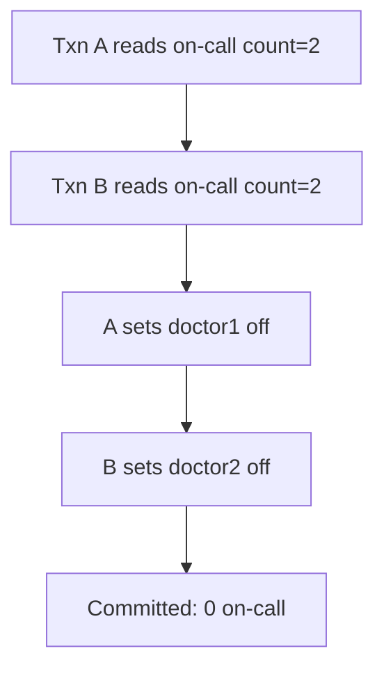
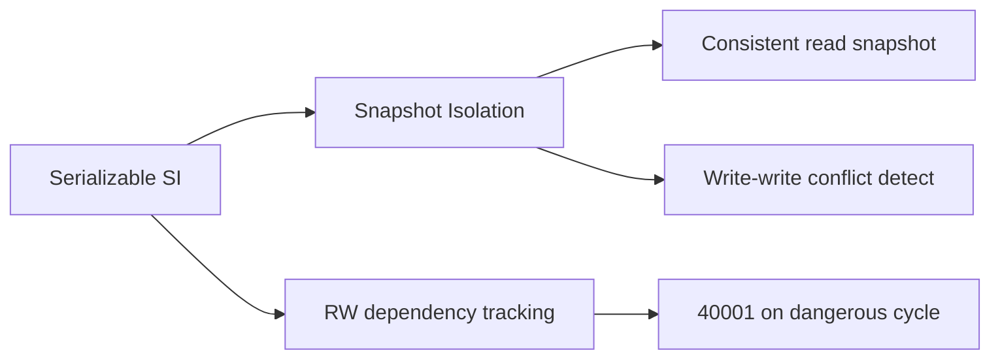
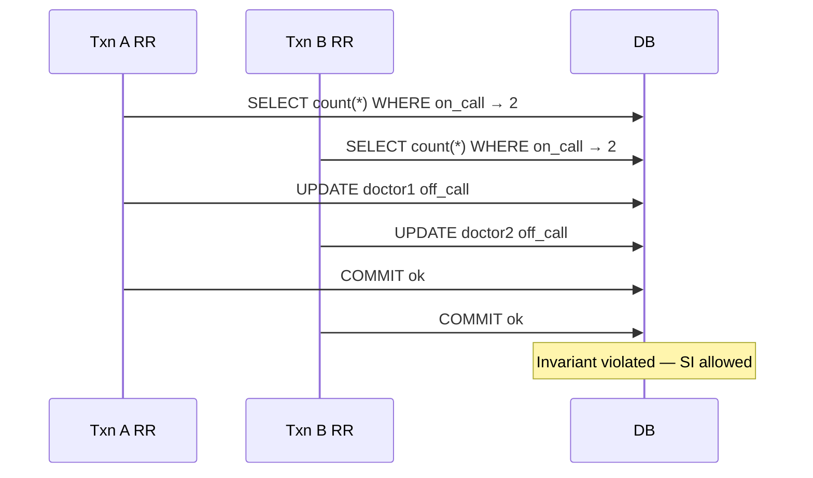

# Snapshot Isolation and SSI Concepts

## Overview

**Snapshot Isolation (SI)** gives each transaction a consistent view of the database as of transaction start (or first statement), with writes committed only if no **write-write conflict** on touched rows. SI prevents dirty and non-repeatable reads but **allows write skew** and some serialization anomalies. **Serializable Snapshot Isolation (SSI)** adds **dependency tracking** to detect dangerous read-write cycles and abort transactions to provide true serializability—PostgreSQL's SERIALIZABLE mode.

## Learning Objectives

- Define snapshot isolation visibility and first-committer-wins rule
- Construct write skew example SI allows but serializable execution forbids
- Explain SSI rw-conflict detection and serialization failure (40001)
- Contrast SI (Oracle, PostgreSQL RR) with SSI (PostgreSQL SERIALIZABLE)
- Design mitigations: constraints, locks, SSI, or application serialization

## Prerequisites

- [[08-Databases/05-Transactions-and-Isolation/Locking vs MVCC|Locking vs MVCC]]
- [[08-Databases/05-Transactions-and-Isolation/Isolation Levels and Product Defaults|Isolation Levels and Product Defaults]]

## Difficulty

`expert`

## Estimated Time

- Reading: 3 hours
- Exercises: 4 hours
- Mini project: 5 hours

## History

Berenson et al. critiqued ANSI levels and described Snapshot Isolation (1995). Cahill et al. introduced **SSI** (2008), proving efficient serializable enforcement atop MVCC snapshots. PostgreSQL 9.1 added SSI for SERIALIZABLE. SI remains popular for performance; engineers must know its holes (write skew) explicitly.

## Problem It Solves

- **False confidence** in REPEATABLE READ preventing all races
- **Write skew** in invariant "at least one on call" patterns
- **Over-locking** when SSI can replace manual predicate locks
- **Retry storms** when SSI used without idempotent design

## Internal Implementation

### Snapshot Isolation rules

1. Reads come from snapshot taken at transaction start (Postgres RR) or statement (RC).
2. Writes create new versions; commit fails if another transaction committed conflicting write first.
3. No automatic detection of **read-write dependencies** across disjoint rows.

### Write skew classic

Two transactions read overlapping predicate ("count on-call doctors ≥ 1"), both see two on-call, each sets one off-duty—result zero on-call though each txn validated threshold.



### SSI detection (simplified)

Track **rw-dependencies**: if T1 read data later written by T2 and T2 read data later written by T1, forming dangerous structure → abort one transaction with `serialization_failure`.

## Mermaid Diagrams

### Structure



### Sequence / Lifecycle — write skew under SI



## Examples

### Minimal Example — write skew reproduction

```sql
-- PostgreSQL — REPEATABLE READ
CREATE TABLE doctors (name text PRIMARY KEY, on_call boolean NOT NULL);
INSERT INTO doctors VALUES ('alice', true), ('bob', true);

-- Session A: BEGIN RR; SELECT count(*) WHERE on_call; → 2
-- Session B: BEGIN RR; SELECT count(*) WHERE on_call; → 2
-- A: UPDATE doctors SET on_call=false WHERE name='alice'; COMMIT;
-- B: UPDATE doctors SET on_call=false WHERE name='bob'; COMMIT;
-- Both succeed — zero on call
```

### Production-Shaped Example — SSI with retry

```typescript
// Node 20+ — SERIALIZABLE for predicate invariant
import pg from "pg";

async function withSerializable<T>(
  pool: pg.Pool,
  fn: (c: pg.PoolClient) => Promise<T>,
  maxRetries = 3,
): Promise<T> {
  for (let attempt = 0; attempt < maxRetries; attempt++) {
    const client = await pool.connect();
    try {
      await client.query("BEGIN ISOLATION LEVEL SERIALIZABLE");
      const result = await fn(client);
      await client.query("COMMIT");
      return result;
    } catch (err: unknown) {
      await client.query("ROLLBACK");
      if (isSerializationFailure(err) && attempt < maxRetries - 1) continue;
      throw err;
    } finally {
      client.release();
    }
  }
  throw new Error("exhausted serializable retries");
}

function isSerializationFailure(err: unknown): boolean {
  return typeof err === "object" && err !== null && (err as pg.DatabaseError).code === "40001";
}
```

### Constraint mitigation (SQL)

```sql
-- Materialize invariant — exclude-only-one style requires careful modeling
-- Example: at most one active promotion per product via partial unique index
CREATE UNIQUE INDEX one_active_promo ON promotions (product_id)
WHERE active = true;
```

## Trade-offs

| Dimension | Upside | Downside | When it matters |
| --- | --- | --- | --- |
| SI (RR) | Fast reads, MVCC | Write skew holes | general OLTP |
| SSI | True serializable | Aborts, rw tracking CPU | invariants |
| SELECT FOR UPDATE | Explicit | Contention | hot rows |
| Constraints | Engine enforced | Modeling effort | uniqueness rules |

### When to Use

- SSI when invariant spans predicate reads + disjoint writes
- Partial unique indexes for "at most one active" patterns
- FOR UPDATE when row set is small and known

### When Not to Use

- Do not use SERIALIZABLE without retry budget and metrics on 40001
- Do not assume RR equals serializable
- Do not ignore write skew in scheduling/on-call systems

## Exercises

1. Reproduce write skew; then retry under SERIALIZABLE until abort observed.
2. Fix on-call doctors with CHECK constraint requiring expression—explain limits.
3. Implement `withSerializable` retry with jitter; graph abort rate vs concurrency.
4. Draw rw-conflict graph for two-transaction skew pattern.
5. Compare FOR UPDATE vs SSI latency on same workload.

## Mini Project

**Skew clinic.** Three scenarios: write skew, lost update, phantom—document which level fixes each.

## Portfolio Project

[[08-Databases/projects/Isolation Anomaly Clinic/README|Isolation Anomaly Clinic]] — SSI module.

## Interview Questions

1. What anomaly does snapshot isolation allow that serializability forbids?
2. Explain write skew with concrete example.
3. How does PostgreSQL SSI differ from REPEATABLE READ?
4. What is error 40001?
5. Mitigations for write skew besides SERIALIZABLE?

### Stretch / Staff-Level

1. Explain SSI "dangerous structure" detection at high level (rw-edges).
2. When is materialized constraint better than SSI for throughput?

## Common Mistakes

- Calling PostgreSQL RR "serializable enough" for all invariants
- No retry logic on SERIALIZABLE
- Infinite retry loops without backoff cap
- Confusing snapshot isolation with **linearizable** distributed reads

## Best Practices

- Model invariants into constraints when possible
- Metric serialization failures and p99 retry latency
- Keep serializable transactions short and narrow
- Hot row patterns → [[08-Databases/06-Concurrency-Internals/Hot Rows Write Skew and Contention|Hot Rows Write Skew and Contention]]

## Summary

Snapshot isolation delivers consistent reads with MVCC efficiency but permits write skew when transactions read overlapping predicates and write disjoint rows. SSI extends SI with dependency tracking to abort non-serializable histories—PostgreSQL SERIALIZABLE. Engineers must recognize skew-prone patterns, choose among SSI, locking, and constraints, and implement disciplined retries.

## Further Reading

- [[00-References/Databases/README|Databases References]]
- Cahill et al., "Serializable Isolation for Snapshot Databases"
- PostgreSQL — Serializable Transaction Isolation

## Related Notes

- [[08-Databases/05-Transactions-and-Isolation/Anomalies Dirty Nonrepeatable Phantom Serialization|Anomalies Dirty Nonrepeatable Phantom Serialization]]
- [[08-Databases/06-Concurrency-Internals/Hot Rows Write Skew and Contention|Hot Rows Write Skew and Contention]]
- [[08-Databases/05-Transactions-and-Isolation/Isolation Levels and Product Defaults|Isolation Levels and Product Defaults]]
- [[07-Backend/08-Data-Access-and-Persistence-Patterns/Transactions as Used by Services|Transactions as Used by Services]]

## Progress Checklist

- [ ] Explained from first principles
- [ ] Drew at least one Mermaid diagram
- [ ] Implemented a minimal version
- [ ] Documented trade-offs and non-goals
- [ ] Completed exercises
- [ ] Practiced interview questions aloud
- [ ] Linked prerequisites and dependents
