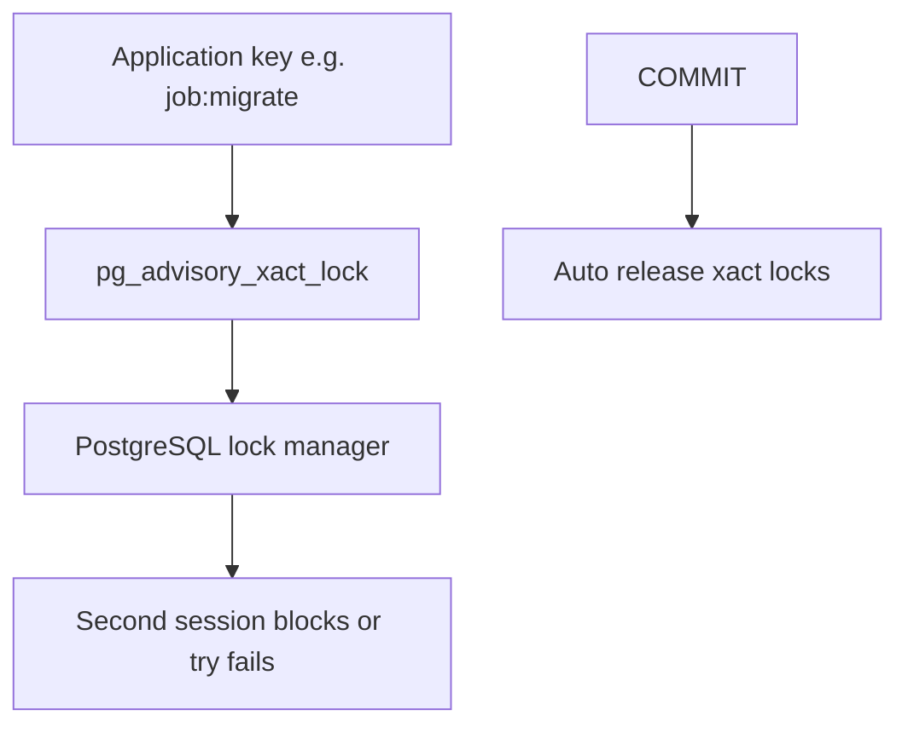
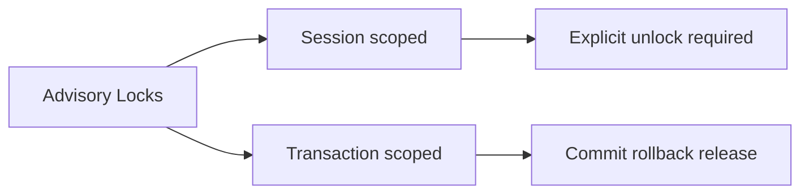
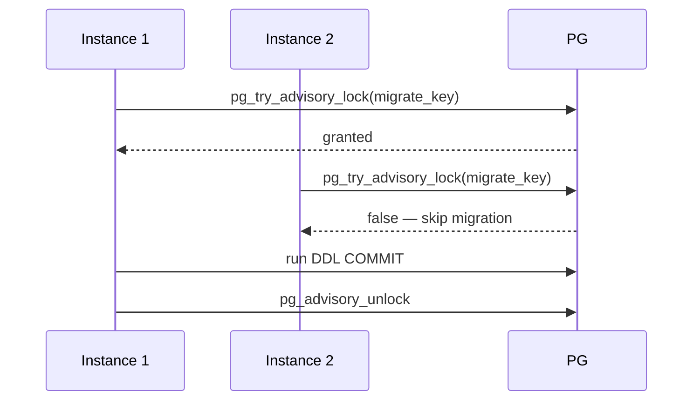

# Advisory Locks as Engine Primitives

## Overview

**Advisory locks** are application-defined locks implemented inside the database engine—**not tied to table rows**. PostgreSQL exposes session-level and transaction-level advisory locks via functions like `pg_advisory_lock(key)` and `pg_try_advisory_xact_lock(key)`. They coordinate cross-transaction workflows (migrations, cron deduplication, shard maintenance) using the engine's existing lock manager without creating dummy rows.

## Learning Objectives

- Distinguish advisory locks from row/table locks and mutexes in app memory
- Choose session vs transaction-scoped advisory locks
- Implement try-lock patterns with timeouts for job orchestration
- Avoid deadlock and forgotten unlock scenarios
- Compare advisory locks to Redis locks and `SELECT FOR UPDATE`

## Prerequisites

- [[08-Databases/06-Concurrency-Internals/Latches Locks and Lock Managers|Latches Locks and Lock Managers]]
- [[08-Databases/05-Transactions-and-Isolation/Locking vs MVCC|Locking vs MVCC]]

## Difficulty

`intermediate`

## Estimated Time

- Reading: 1.5 hours
- Exercises: 2.5 hours
- Mini project: 3 hours

## History

PostgreSQL advisory locks existed early as a flexible coordination hook. ORMs rarely wrap them; platforms use them for **schema migration leaders**, **background job singletons**, and **logical replication cutovers**. They complement but do not replace row locks—misuse creates cluster-wide bottlenecks if lock keys collide.

## Problem It Solves

- **Duplicate cron execution** across N app instances
- **Concurrent migrations** corrupting schema
- **Dummy lock rows** anti-pattern (`SELECT * FROM locks WHERE name='x' FOR UPDATE`)
- **Cross-service coordination** when single DB is source of truth

## Internal Implementation

Advisory locks use the same **lock manager** with special lock tags (two 32-bit ints or one 64-bit key). Session locks persist until released or disconnect; transaction locks release at COMMIT/ROLLBACK.



### Session vs transaction locks

| API | Scope | Release |
| --- | --- | --- |
| `pg_advisory_lock` | Session | `pg_advisory_unlock` or disconnect |
| `pg_advisory_xact_lock` | Transaction | COMMIT/ROLLBACK |

## Mermaid Diagrams

### Structure



### Sequence / Lifecycle — migration leader



## Examples

### Minimal Example — transaction-scoped lock

```sql
BEGIN;
SELECT pg_advisory_xact_lock(hashtext('nightly-aggregate'));
-- only one transaction proceeds; others block
-- ... work ...
COMMIT; -- lock released automatically
```

### Production-Shaped Example — singleton job in TypeScript

```typescript
// Node 20+ — try lock; skip if another worker owns job
import pg from "pg";

const JOB_KEY = 42_001; // or hashtext('invoice-export')

export async function runExclusiveJob(
  pool: pg.Pool,
  work: () => Promise<void>,
): Promise<"ran" | "skipped"> {
  const client = await pool.connect();
  try {
    await client.query("BEGIN");
    const { rows } = await client.query(
      "SELECT pg_try_advisory_xact_lock($1) AS ok",
      [JOB_KEY],
    );
    if (!rows[0].ok) {
      await client.query("ROLLBACK");
      return "skipped";
    }
    await work();
    await client.query("COMMIT");
    return "ran";
  } catch (e) {
    await client.query("ROLLBACK");
    throw e;
  } finally {
    client.release();
  }
}
```

### Key hashing helper

```sql
SELECT pg_advisory_xact_lock(hashtext('tenant:' || :tenant_id::text));
```

## Trade-offs

| Dimension | Upside | Downside | When it matters |
| --- | --- | --- | --- |
| Xact advisory lock | Auto release | Holds lock during whole txn | short jobs |
| Session advisory lock | Cross transactions | Forgotten unlock | long pipelines |
| vs Redis lock | DB authoritative | Loads lock manager | single-DB apps |
| vs row lock | No dummy table | No payload row association | global mutex |

### When to Use

- Migration leader election on one database
- Singleton cron per cluster
- Short critical sections tied to DB transaction

### When Not to Use

- Do not use as distributed lock across regions without CRDT/lease design
- Do not hold advisory lock across slow external I/O inside long txn
- Do not collide keys between teams without namespace convention

## Exercises

1. Run two psql sessions competing for same advisory lock; observe blocking vs try.
2. Demonstrate automatic release on disconnect for session lock.
3. Implement `runExclusiveJob` and stress with parallel workers.
4. Compare dummy `locks` table FOR UPDATE vs advisory lock overhead.
5. Document key namespace scheme for your org (`hashtext` prefixes).

## Mini Project

**Migration leader.** Only one CI job runs DDL using advisory try-lock + metrics.

## Portfolio Project

Advisory lock patterns in [[08-Databases/projects/Database Engines Workbench/README|Database Engines Workbench]].

## Interview Questions

1. What is an advisory lock?
2. Session vs transaction advisory lock?
3. How does `pg_try_advisory_xact_lock` differ from blocking lock?
4. When prefer advisory lock over SELECT FOR UPDATE on a row?
5. What happens to session advisory locks on disconnect?

### Stretch / Staff-Level

1. Compare PostgreSQL advisory locks to MySQL GET_LOCK limitations.
2. Design multi-step saga with advisory locks without deadlocking migrations.

## Common Mistakes

- Random lock keys without central registry
- Session locks without `finally` unlock
- Long transactions holding xact locks during HTTP calls
- Using advisory locks across logically separate databases

## Best Practices

- Prefer `pg_try_advisory_xact_lock` for short DB-bound work
- Namespace keys: `hashtext('service:job:name')`
- Set `lock_timeout` when using blocking advisory locks
- Distributed coordination product design → [[09-System-Design/08-Coordination-Consensus-and-Locks/Distributed Locks Leases and Fencing Tokens|Distributed Locks Leases and Fencing Tokens]]

## Summary

Advisory locks expose the engine lock manager for application-chosen keys, enabling mutexes without dummy rows. Transaction-scoped locks auto-release at commit; session locks demand explicit cleanup. They excel for single-database leader election and short coordinated work—not as a general distributed lock service across regions or engines.

## Further Reading

- [[00-References/Databases/README|Databases References]]
- PostgreSQL — Advisory Locks
- PostgreSQL — Functions for Advisory Locks

## Related Notes

- [[08-Databases/06-Concurrency-Internals/Latches Locks and Lock Managers|Latches Locks and Lock Managers]]
- [[08-Databases/06-Concurrency-Internals/Hot Rows Write Skew and Contention|Hot Rows Write Skew and Contention]]
- [[08-Databases/08-PostgreSQL-Engine/Online DDL Costs vs Migration Process|Online DDL Costs vs Migration Process]]
- [[07-Backend/08-Data-Access-and-Persistence-Patterns/Migrations as Operational Process|Migrations as Operational Process]]

## Progress Checklist

- [ ] Explained from first principles
- [ ] Drew at least one Mermaid diagram
- [ ] Implemented a minimal version
- [ ] Documented trade-offs and non-goals
- [ ] Completed exercises
- [ ] Practiced interview questions aloud
- [ ] Linked prerequisites and dependents
