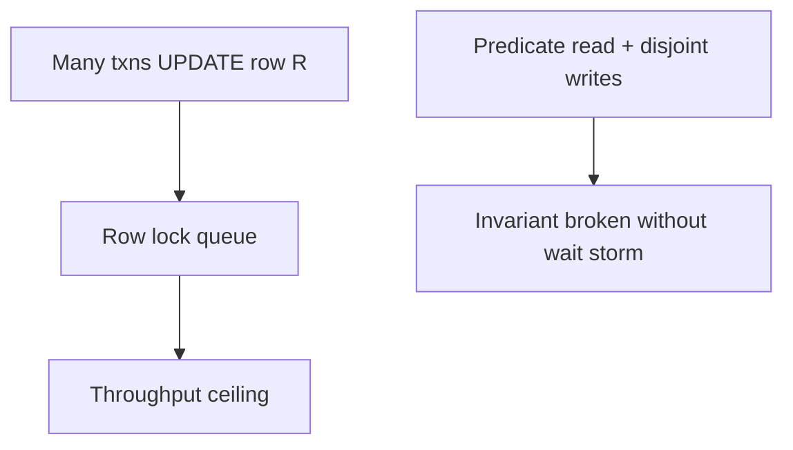
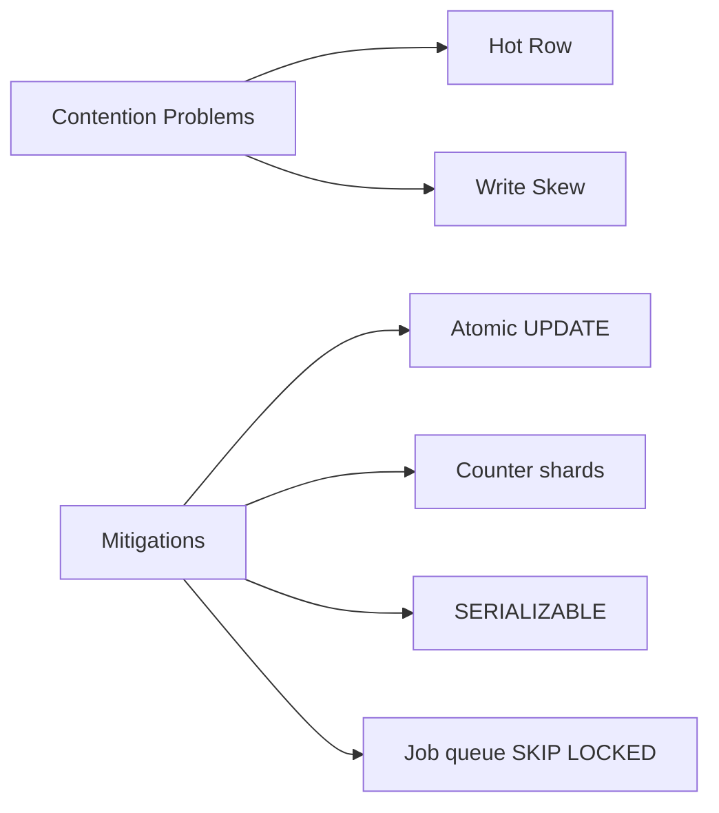
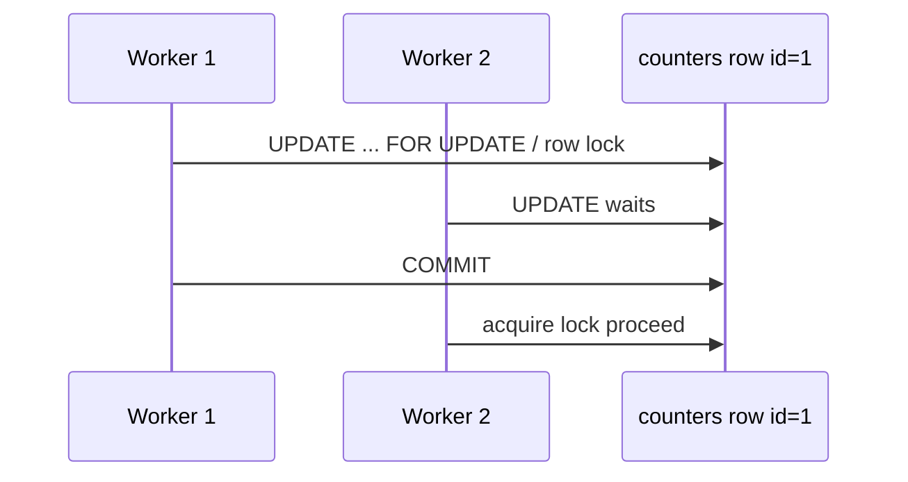

# Hot Rows Write Skew and Contention

## Overview

A **hot row** is updated by many concurrent transactions—global counters, inventory buckets, session tokens—creating **lock contention** and throughput collapse. **Write skew** is a logical race where disjoint writes violate a predicate invariant despite snapshot-consistent reads. Mitigations include row splitting, queue tables, atomic SQL updates, advisory locks, SERIALIZABLE/SSI, and application-level sharding of counters.

## Learning Objectives

- Identify hot row access patterns from waits and query shapes
- Distinguish lock contention from write skew failure modes
- Apply atomic UPDATE, `FOR UPDATE`, and partition strategies
- Measure p99 latency impact of contended updates
- Design schemas that spread write load without breaking invariants

## Prerequisites

- [[08-Databases/05-Transactions-and-Isolation/Snapshot Isolation and SSI Concepts|Snapshot Isolation and SSI Concepts]]
- [[08-Databases/06-Concurrency-Internals/Latches Locks and Lock Managers|Latches Locks and Lock Managers]]

## Difficulty

`advanced`

## Estimated Time

- Reading: 2.5 hours
- Exercises: 4 hours
- Mini project: 5 hours

## History

Web-scale systems hit counter row limits early (Twitter snowflake IDs, sharded counters). Write skew research formalized failures under SI. Modern OLTP uses **advisory locks**, **SKIP LOCKED** job queues, and **append-only event logs** to avoid single-row choke points.

## Problem It Solves

- **Single-row UPDATE storms** on `view_count` or `inventory`
- **Inventory oversell** from read-modify-write without locks
- **Scheduler skew** breaking "at least one worker" invariants
- **Connection pileups** waiting on one row lock

## Internal Implementation

### Contention vs skew

| Pattern | Symptom | Mechanism |
| --- | --- | --- |
| Hot row | Lock waits, low TPS | Same row serialized |
| Write skew | Wrong invariant, no long waits | Disjoint writes after predicate read |
| Lost update | Last writer wins | Missing lock/version check |



### Mitigation menu

1. **Atomic expression**: `UPDATE t SET c = c + 1 WHERE id = $1`
2. **Sharding counters**: N rows summed at read time
3. **Queue + SKIP LOCKED**: workers claim jobs
4. **SERIALIZABLE** with retries for skew-prone invariants
5. **Advisory locks** for coarse app-defined serialization

## Mermaid Diagrams

### Structure



### Sequence / Lifecycle — hot counter



## Examples

### Minimal Example — atomic vs read-modify-write

```sql
-- Good — single atomic statement
UPDATE inventory SET qty = qty - 1 WHERE product_id = 42 AND qty > 0;

-- Bad pattern in app — two round trips without lock
-- SELECT qty ...; if qty>0 UPDATE ...
```

### Production-Shaped Example — sharded counter

```typescript
// Node 20+ — spread increments across shard rows
import pg from "pg";

const SHARDS = 8;

export async function incrementMetric(
  pool: pg.Pool,
  metric: string,
): Promise<void> {
  const shard = Math.floor(Math.random() * SHARDS);
  await pool.query(
    `INSERT INTO metric_shards (metric, shard, value)
     VALUES ($1, $2, 1)
     ON CONFLICT (metric, shard) DO UPDATE SET value = metric_shards.value + 1`,
    [metric, shard],
  );
}

export async function readMetric(pool: pg.Pool, metric: string): Promise<number> {
  const { rows } = await pool.query(
    `SELECT coalesce(sum(value),0)::bigint AS total FROM metric_shards WHERE metric = $1`,
    [metric],
  );
  return Number(rows[0].total);
}
```

### Job queue with SKIP LOCKED

```sql
BEGIN;
SELECT id FROM jobs
WHERE status = 'pending'
ORDER BY created_at
FOR UPDATE SKIP LOCKED
LIMIT 1;
-- process job
UPDATE jobs SET status = 'done' WHERE id = $1;
COMMIT;
```

## Trade-offs

| Dimension | Upside | Downside | When it matters |
| --- | --- | --- | --- |
| Atomic UPDATE | Simple | Still serializes one row | moderate contention |
| Counter shards | Higher write TPS | Approximate/fan-in read cost | metrics |
| SERIALIZABLE | Correct invariants | Aborts | scheduling rules |
| SKIP LOCKED queue | Worker parallelism | Complex ops | background jobs |

### When to Use

- Sharded counters for high-frequency metrics
- SKIP LOCKED for work queues
- Constraints + SSI for skew invariants

### When Not to Use

- Do not shard primary keys for inventory without reconciliation logic
- Do not use advisory locks globally without timeout discipline
- Do not ignore `qty > 0` check in UPDATE WHERE clause

## Exercises

1. Benchmark single-row counter vs 8-shard design at 100 concurrent clients.
2. Reproduce write skew on-call doctors; fix with SERIALIZABLE and with constraint.
3. Build SKIP LOCKED worker loop in TypeScript; measure throughput vs `FOR UPDATE` blocking.
4. Graph `pg_stat_activity.wait_event` during hot row test.
5. Design inventory model avoiding single global row per SKU.

## Mini Project

**Contention lab.** Load generator + three mitigation implementations compared.

## Portfolio Project

Hot row scenarios in [[08-Databases/projects/Isolation Anomaly Clinic/README|Isolation Anomaly Clinic]].

## Interview Questions

1. What is a hot row and how do you detect it?
2. Difference between hot row contention and write skew?
3. Why is `UPDATE c = c + 1` better than SELECT then UPDATE?
4. What does FOR UPDATE SKIP LOCKED enable?
5. How would you implement a high-rate view counter?

### Stretch / Staff-Level

1. Design rate limiter storage without hot row on single counter.
2. When does sharded counter read amplification dominate write gains?

## Common Mistakes

- Global sequence row for all IDs
- Caching counter in Redis without durability contract
- SERIALIZABLE on hot path without shard partitioning
- Lost update with ORM read-modify-save

## Best Practices

- Push invariants into WHERE clauses and constraints
- Monitor lock wait time on top updated relations
- Queue heavy write serialization through log tables
- Service patterns → [[07-Backend/08-Data-Access-and-Persistence-Patterns/Transactions as Used by Services|Transactions as Used by Services]]

## Summary

Hot rows serialize concurrent writers at the lock layer, crushing throughput; write skew breaks invariants without obvious waits under snapshot isolation. Mitigations combine atomic SQL, schema designs that partition write load, queue patterns, and stronger isolation where logic demands it—chosen with measured contention and correctness requirements, not defaults alone.

## Further Reading

- [[00-References/Databases/README|Databases References]]
- PostgreSQL — SKIP LOCKED and Row Locking
- Kleppmann, *Designing Data-Intensive Applications* — transactions chapter

## Related Notes

- [[08-Databases/05-Transactions-and-Isolation/Snapshot Isolation and SSI Concepts|Snapshot Isolation and SSI Concepts]]
- [[08-Databases/06-Concurrency-Internals/Advisory Locks as Engine Primitives|Advisory Locks as Engine Primitives]]
- [[08-Databases/06-Concurrency-Internals/Latches Locks and Lock Managers|Latches Locks and Lock Managers]]
- [[08-Databases/06-Concurrency-Internals/Vacuum Version GC and Bloat|Vacuum Version GC and Bloat]]

## Progress Checklist

- [ ] Explained from first principles
- [ ] Drew at least one Mermaid diagram
- [ ] Implemented a minimal version
- [ ] Documented trade-offs and non-goals
- [ ] Completed exercises
- [ ] Practiced interview questions aloud
- [ ] Linked prerequisites and dependents
