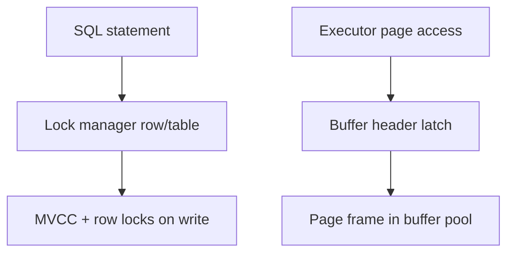
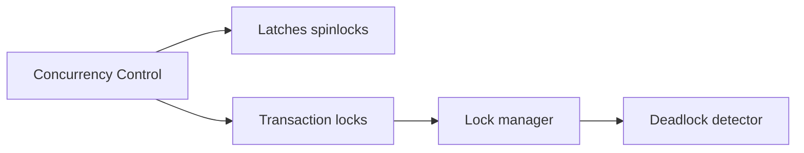
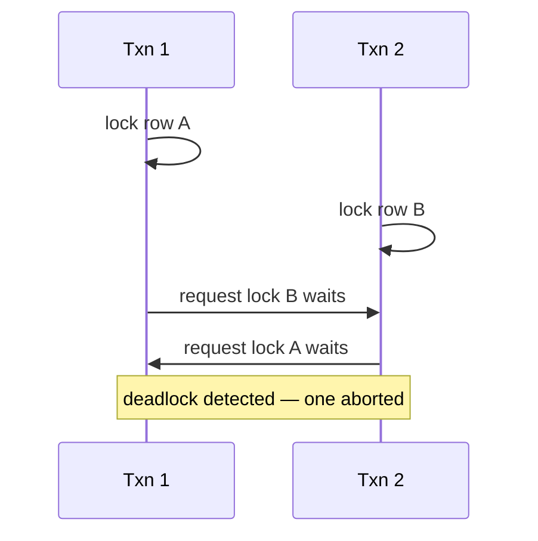

# Latches Locks and Lock Managers

## Overview

Database engines use **latches** (short-lived internal mutexes protecting in-memory structures) separately from **locks** (transaction-level concurrency control visible to SQL). The **lock manager** tracks row/table/advisory locks, orders acquisition, detects **deadlocks**, and exposes waits to monitoring views. Confusing latches with locks leads to wrong tuning—`max_connections` storms affect latches; long transactions affect lock horizons.

## Learning Objectives

- Distinguish latches, spinlocks, and SQL-visible locks
- Describe lock modes (ACCESS SHARE through ACCESS EXCLUSIVE) and compatibility
- Explain deadlock detection via wait-for graph
- Read `pg_locks` and wait events for lock vs IO waits
- Relate buffer pool page access to buffer content latches

## Prerequisites

- [[08-Databases/05-Transactions-and-Isolation/Locking vs MVCC|Locking vs MVCC]]
- [[08-Databases/01-Storage-and-Buffer-Pool/Buffer Pool vs OS Page Cache|Buffer Pool vs OS Page Cache]]

## Difficulty

`advanced`

## Estimated Time

- Reading: 2.5 hours
- Exercises: 3 hours
- Mini project: 4 hours

## History

Early System R lock managers inspired modern implementations. PostgreSQL's lock manager integrates with MVCC for DDL and explicit locking. Buffer managers in all engines use latches to protect page frames during pin/unpin. Spinlock/latch contention became visible on multicore as CPU counts rose—motivating partitioned lock tables and lightweight locks in PostgreSQL.

## Problem It Solves

- **DDL blocking** entire table when ACCESS EXCLUSIVE required
- **Deadlock errors** from inconsistent lock order in app code
- **Mystery hangs** diagnosed as lock waits vs latch contention
- **False scaling** adding connections that contend on internal latches

## Internal Implementation

### Latch vs lock

| Mechanism | Duration | Scope | User visible |
| --- | --- | --- | --- |
| Latch | Microseconds | Buffer, hash bucket | No |
| Lock | Transaction | Row, table, advisory | Yes (`pg_locks`) |
| Spinlock | Very short | Low-level structures | No |



### PostgreSQL lock modes (subset)

| Mode | Typical use |
| --- | --- |
| ACCESS SHARE | SELECT |
| ROW EXCLUSIVE | INSERT/UPDATE/DELETE |
| SHARE | CREATE INDEX CONCURRENTLY phases |
| ACCESS EXCLUSIVE | ALTER TABLE, DROP |

**Deadlock detection**: background cycle finds waits in lock graph; victim transaction aborted (`40P01`).

## Mermaid Diagrams

### Structure



### Sequence / Lifecycle — deadlock



## Examples

### Minimal Example — inspect locks

```sql
-- Session A
BEGIN;
SELECT * FROM accounts WHERE id = 1 FOR UPDATE;

-- Session B — inspect
SELECT locktype, mode, granted, pid, relation::regclass
FROM pg_locks
WHERE NOT granted;

SELECT blocked.pid AS blocked_pid, blocking.pid AS blocking_pid
FROM pg_stat_activity blocked
JOIN pg_stat_activity blocking ON blocking.pid = ANY(pg_blocking_pids(blocked.pid));
```

### Production-Shaped Example — ordered locking convention

```typescript
// Node 20+ — always lock rows in ascending id order to avoid deadlock
import pg from "pg";

export async function transferPair(
  pool: pg.Pool,
  idA: number,
  idB: number,
  amount: number,
): Promise<void> {
  const [first, second] = idA < idB ? [idA, idB] : [idB, idA];
  const client = await pool.connect();
  try {
    await client.query("BEGIN");
    await client.query("SELECT id FROM accounts WHERE id = $1 FOR UPDATE", [first]);
    if (first !== second) {
      await client.query("SELECT id FROM accounts WHERE id = $1 FOR UPDATE", [second]);
    }
    await client.query(
      "UPDATE accounts SET balance = balance - $1 WHERE id = $2",
      [amount, idA],
    );
    await client.query(
      "UPDATE accounts SET balance = balance + $1 WHERE id = $2",
      [amount, idB],
    );
    await client.query("COMMIT");
  } catch (e) {
    await client.query("ROLLBACK");
    throw e;
  } finally {
    client.release();
  }
}
```

### Toy lock manager (TypeScript educational)

```typescript
type LockMode = "S" | "X";
const held = new Map<string, { mode: LockMode; owner: string }>();

function acquire(key: string, mode: LockMode, owner: string): boolean {
  const cur = held.get(key);
  if (!cur) {
    held.set(key, { mode, owner });
    return true;
  }
  if (cur.mode === "S" && mode === "S") return true;
  return false; // conflict — would wait or deadlock detect
}
```

## Trade-offs

| Dimension | Upside | Downside | When it matters |
| --- | --- | --- | --- |
| Row locks | Fine granularity | Deadlock risk | OLTP updates |
| Table locks | Simple DDL | Blocks writers/readers | migrations |
| Ordered acquisition | Prevents deadlock | App discipline | multi-row updates |
| Low lock modes | Concurrency | Weaker isolation guarantees | read-heavy |

### When to Use

- Consistent lock ordering for multi-resource updates
- `LOCK TABLE` only in controlled maintenance windows
- Monitor `pg_stat_database.deadlocks`

### When Not to Use

- Do not hold locks across network I/O
- Do not increase connections to fix latch contention
- Do not use ACCESS EXCLUSIVE operations during peak without plan

## Exercises

1. Create intentional deadlock; capture `deadlock detected` detail message.
2. Map lock modes used during `CREATE INDEX CONCURRENTLY`.
3. Compare wait events `Lock` vs `LWLock` in `pg_stat_activity`.
4. Implement ordered locking for three-row update; verify no deadlock under stress.
5. Document which DDL operations require ACCESS EXCLUSIVE in PostgreSQL.

## Mini Project

**Lock wait dashboard.** Grafana panel from `pg_blocking_pids` query.

## Portfolio Project

Lock manager sketch in [[08-Databases/projects/Database Engines Workbench/README|Database Engines Workbench]].

## Interview Questions

1. Difference between latch and lock?
2. What is a deadlock and how does Postgres handle it?
3. Why lock rows in consistent order?
4. What lock mode does SELECT FOR UPDATE use?
5. What blocks all writers on a table?

### Stretch / Staff-Level

1. Explain lightweight locks (LWLocks) role in buffer manager.
2. How does `CREATE INDEX CONCURRENTLY` avoid long ACCESS EXCLUSIVE?

## Common Mistakes

- Diagnosing CPU spin as "lock wait"
- ORM opening transactions holding locks implicitly
- Running DDL in CI against shared staging without timeout
- Ignoring `idle in transaction` sessions holding locks

## Best Practices

- Set `lock_timeout` and `statement_timeout` on app role
- Use concurrent index creation where supported
- Keep transactions short
- Buffer pool internals → [[08-Databases/01-Storage-and-Buffer-Pool/Buffer Pool vs OS Page Cache|Buffer Pool vs OS Page Cache]]

## Summary

Latches protect internal structures for microseconds; the lock manager mediates transaction conflicts on rows and relations for milliseconds or longer. Deadlocks arise from cyclic waits and require application ordering discipline or retries. Production debugging separates lock waits (visible in `pg_locks`) from latch contention (LWLock wait events)—different remedies apply.

## Further Reading

- [[00-References/Databases/README|Databases References]]
- PostgreSQL — Explicit Locking and Monitoring Database Activity
- Gray & Reuter — lock manager chapters

## Related Notes

- [[08-Databases/05-Transactions-and-Isolation/Locking vs MVCC|Locking vs MVCC]]
- [[08-Databases/06-Concurrency-Internals/Advisory Locks as Engine Primitives|Advisory Locks as Engine Primitives]]
- [[08-Databases/06-Concurrency-Internals/Hot Rows Write Skew and Contention|Hot Rows Write Skew and Contention]]
- [[08-Databases/06-Concurrency-Internals/Long Transactions and Snapshot Horizons|Long Transactions and Snapshot Horizons]]

## Progress Checklist

- [ ] Explained from first principles
- [ ] Drew at least one Mermaid diagram
- [ ] Implemented a minimal version
- [ ] Documented trade-offs and non-goals
- [ ] Completed exercises
- [ ] Practiced interview questions aloud
- [ ] Linked prerequisites and dependents
