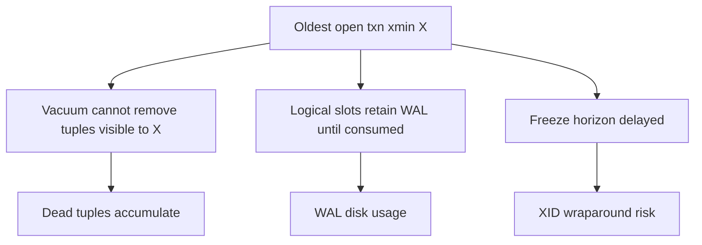
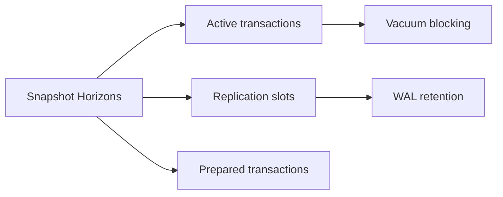
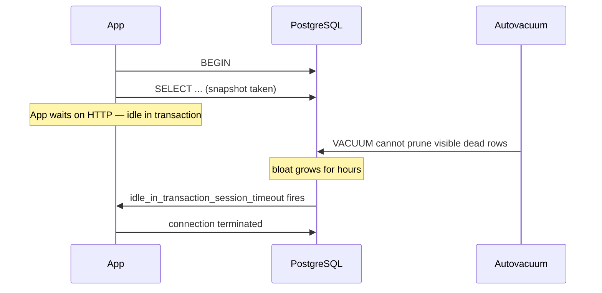

# Long Transactions and Snapshot Horizons

## Overview

An open transaction pins a **snapshot horizon**: vacuum cannot remove dead tuple versions still visible to it, **xmin** advancement stalls, **wraparound** defense weakens, and **replication slots** may retain WAL. **Idle in transaction** sessions—often from ORMs or leaked connections—are a common cause. Long analytics transactions on OLTP primaries create the same engine-level damage as intentional batch jobs run on wrong tier.

## Learning Objectives

- Explain how oldest xmin blocks vacuum and bloat reclamation
- Identify `idle in transaction` and long queries in `pg_stat_activity`
- Relate snapshot horizons to replication slot lag and disk growth
- Set timeouts (`idle_in_transaction_session_timeout`) appropriately
- Route long reads to replicas with lag awareness

## Prerequisites

- [[08-Databases/06-Concurrency-Internals/Vacuum Version GC and Bloat|Vacuum Version GC and Bloat]]
- [[08-Databases/05-Transactions-and-Isolation/Locking vs MVCC|Locking vs MVCC]]

## Difficulty

`advanced`

## Estimated Time

- Reading: 2 hours
- Exercises: 3 hours
- Mini project: 3 hours

## History

MVCC engines always had horizon problems; web apps amplified them with connection pools holding transactions open across HTTP requests. PostgreSQL added `idle_in_transaction_session_timeout`, progress views, and slot monitoring. Incidents of **multi-TB WAL retention** from forgotten replication slots became runbook staples.

## Problem It Solves

- **Runaway bloat** when vacuum cannot prune dead tuples
- **WAL disk fill** from slots pinned by old xmin
- **Mysterious table growth** despite autovacuum "running"
- **Lock pileups** from idle transactions holding row locks

## Internal Implementation

### Horizon chain



PostgreSQL tracks **global xmin horizon** from all active snapshots including replication decoding snapshots.

## Mermaid Diagrams

### Structure



### Sequence / Lifecycle — idle in transaction



## Examples

### Minimal Example — find offenders

```sql
SELECT pid, state, xact_start, state_change, query
FROM pg_stat_activity
WHERE state = 'idle in transaction'
ORDER BY xact_start;

SELECT slot_name, active, pg_size_pretty(pg_wal_lsn_diff(pg_current_wal_lsn(), restart_lsn)) AS retained
FROM pg_replication_slots;
```

### Production-Shaped Example — pool guardrails

```typescript
// Node 20+ — set timeouts on pool connect + always release
import pg from "pg";

export function createPool(connectionString: string): pg.Pool {
  const pool = new pg.Pool({
    connectionString,
    max: 20,
    idleTimeoutMillis: 30_000,
    connectionTimeoutMillis: 5_000,
  });
  pool.on("connect", (client) => {
    void client.query(`
      SET statement_timeout = '30s';
      SET lock_timeout = '5s';
      SET idle_in_transaction_session_timeout = '60s';
    `);
  });
  return pool;
}

export async function withTransaction<T>(
  pool: pg.Pool,
  fn: (c: pg.PoolClient) => Promise<T>,
): Promise<T> {
  const client = await pool.connect();
  try {
    await client.query("BEGIN");
    const result = await fn(client);
    await client.query("COMMIT");
    return result;
  } catch (e) {
    await client.query("ROLLBACK");
    throw e;
  } finally {
    client.release(); // never hold client across await fetch()
  }
}
```

## Trade-offs

| Dimension | Upside | Downside | When it matters |
| --- | --- | --- | --- |
| idle timeout | Stops horizon leaks | Kills slow legit txn | web OLTP |
| Short txns | Healthy vacuum | More round trips | all MVCC |
| Replica reads | Offload snapshots | Stale/lag reads | analytics |
| Serializable long reports | Consistency | Blocks vacuum | avoid on primary |

### When to Use

- `idle_in_transaction_session_timeout` on app roles
- Read-only replica for long reports
- Monitor replication slot lag bytes

### When Not to Use

- Do not run hour-long BI queries on primary without coordination
- Do not leave logical slots on dev clones pointing at prod
- Do not disable timeouts globally for one bad endpoint

## Exercises

1. Open BEGIN + sleep 10m; observe dead tuple count and vacuum behavior.
2. Create logical replication slot; stop consumer; watch WAL growth.
3. Configure idle timeout; verify session termination and app error handling.
4. Query `age(datfrozenxid)` before/after long txn experiment.
5. Write alert rule for `idle in transaction` > 5 minutes.

## Mini Project

**Horizon watchdog.** Cron job kills/ alerts on pg_stat_activity + slot retention.

## Portfolio Project

Long transaction scenarios in [[08-Databases/projects/Database Engines Workbench/README|Database Engines Workbench]].

## Interview Questions

1. How do long transactions affect vacuum?
2. What is `idle in transaction`?
3. How can replication slots cause WAL bloat?
4. What timeout settings reduce horizon leaks?
5. Where should long analytics queries run?

### Stretch / Staff-Level

1. Explain difference between xmin and xmax horizons for visibility.
2. How does hot standby feedback interact with vacuum on primary?

## Common Mistakes

- ORM session open across external API calls inside transaction
- Migration tools leaving idle transactions
- Logical slots on forgotten staging consumers
- Pool `max` so high idle sessions accumulate

## Best Practices

- Transaction scope only around DB work
- Separate OLTP and analytics tiers
- Alert on slot retention and oldest xmin age
- Read-your-writes at connection level → [[08-Databases/07-Replication-Mechanics/Replica Lag and Read-Your-Writes at Connection Level|Replica Lag and Read-Your-Writes at Connection Level]]

## Summary

Long-lived transactions extend the snapshot horizon vacuum and freeze logic must respect, causing bloat and XID pressure; replication slots can compound WAL retention. Idle-in-transaction sessions are preventable with timeouts, disciplined transaction scopes in application code, and routing heavy reads away from the primary. Engine health depends as much on session lifecycle as on query tuning.

## Further Reading

- [[00-References/Databases/README|Databases References]]
- PostgreSQL — Monitoring Database Activity and Replication Slots
- PostgreSQL — Preventing Transaction ID Wraparound Failures

## Related Notes

- [[08-Databases/06-Concurrency-Internals/Vacuum Version GC and Bloat|Vacuum Version GC and Bloat]]
- [[08-Databases/07-Replication-Mechanics/WAL Shipping and Streaming Replication|WAL Shipping and Streaming Replication]]
- [[08-Databases/12-Production-Database-Ops/Connection Pooling at Engine and Proxy|Connection Pooling at Engine and Proxy]]
- [[07-Backend/08-Data-Access-and-Persistence-Patterns/Transactions as Used by Services|Transactions as Used by Services]]

## Progress Checklist

- [ ] Explained from first principles
- [ ] Drew at least one Mermaid diagram
- [ ] Implemented a minimal version
- [ ] Documented trade-offs and non-goals
- [ ] Completed exercises
- [ ] Practiced interview questions aloud
- [ ] Linked prerequisites and dependents
