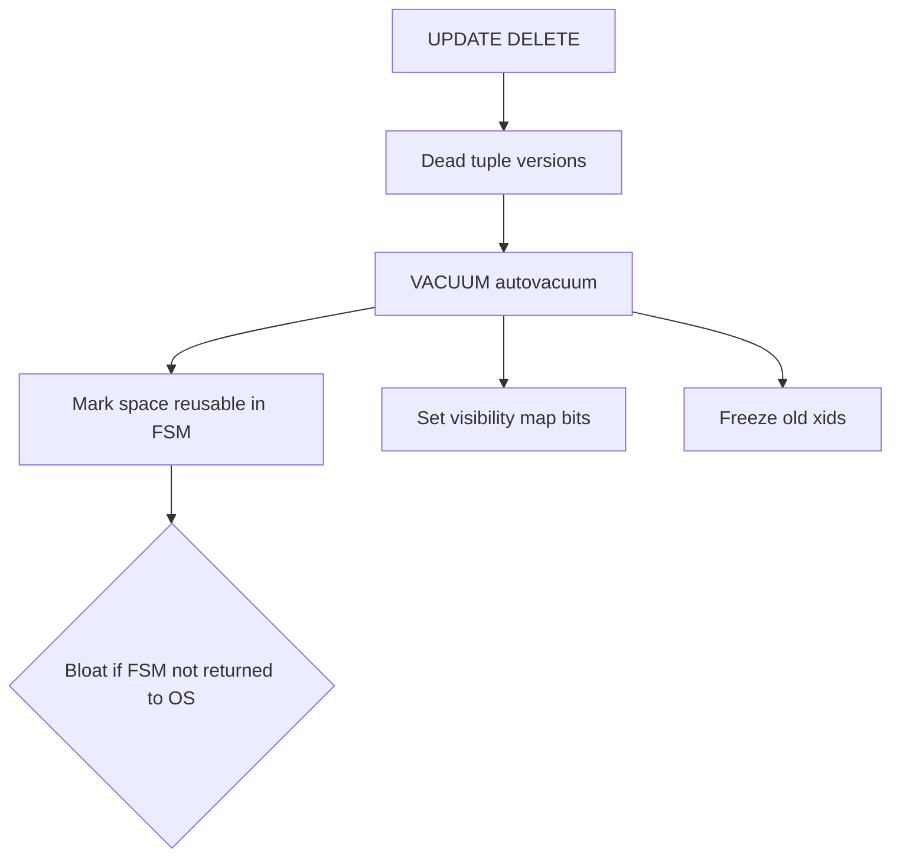
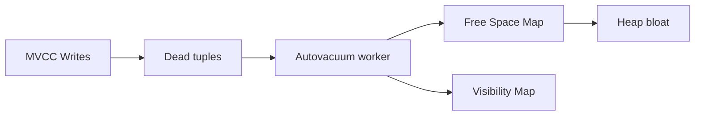
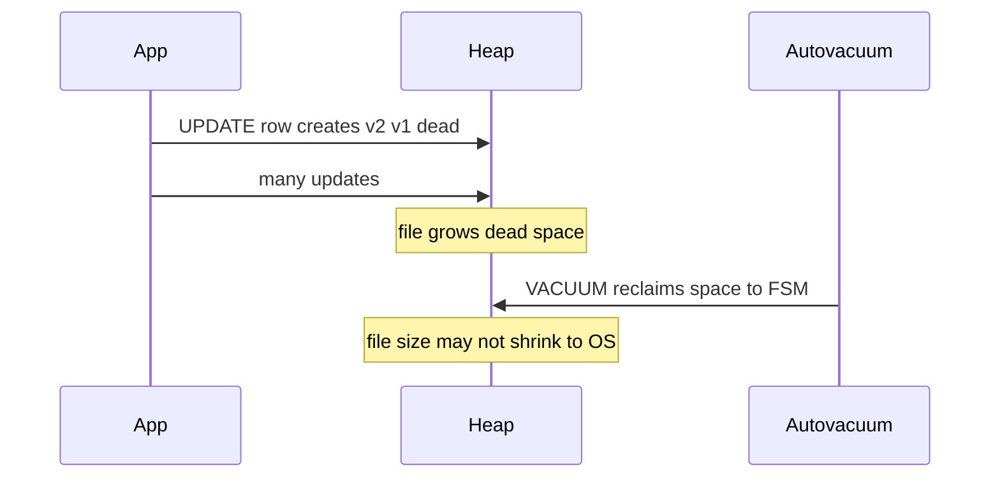

# Vacuum Version GC and Bloat

## Overview

MVCC leaves **dead tuple versions** when rows are updated or deleted. **VACUUM** (and **autovacuum**) reclaims space for reuse, updates visibility maps, prevents **transaction ID wraparound**, and optionally **FREEZE**s old xmin values. When vacuum cannot keep pace—or space is not returned to OS—**bloat** grows: tables and indexes larger than live data, slower seq scans, and bloated indexes hurting cache efficiency.

## Learning Objectives

- Explain dead tuples, HOT chains, and visibility map bits
- Describe autovacuum triggers (`autovacuum_vacuum_scale_factor`, cost delay)
- Distinguish bloat (dead + free space in file) from live row growth
- Monitor `n_dead_tup`, last autovacuum, table bloat estimates
- Choose VACUUM FULL vs pg_repack vs routine autovacuum tuning

## Prerequisites

- [[08-Databases/05-Transactions-and-Isolation/Locking vs MVCC|Locking vs MVCC]]
- [[08-Databases/01-Storage-and-Buffer-Pool/Free Space Maps Fillfactor and Fragmentation|Free Space Maps Fillfactor and Fragmentation]]

## Difficulty

`advanced`

## Estimated Time

- Reading: 2.5 hours
- Exercises: 3.5 hours
- Mini project: 4 hours

## History

PostgreSQL inherited Ingres-style MVCC without inline compaction. Vacuum was always the GC mechanism; autovacuum (2005+) automated what DBAs previously scheduled manually. Wraparound failures (database shutdown to prevent XID reuse) remain a classic operational footgun. Index bloat from non-HOT updates motivated fillfactor tuning and repack tools.

## Problem It Solves

- **Disk growth** despite stable row counts
- **Slow scans** on bloated heaps
- **Index-only scan failure** when visibility map stale
- **Emergency shutdown** from frozen XID horizon breach

## Internal Implementation

### Vacuum responsibilities

1. Scan heap pages; remove dead tuples eligible for reuse (no active snapshot needs them).
2. Truncate empty pages at relation end (sometimes).
3. Update **FSM** (free space map) and **visibility map**.
4. Freeze xmin to advance **relfrozenxid** horizon.



### HOT (Heap-Only Tuple) updates

When updated columns are not indexed and page has space, PostgreSQL chains new version in same page **without new index entries**—reducing index bloat. Otherwise index entries multiply.

## Mermaid Diagrams

### Structure



### Sequence / Lifecycle — update without vacuum



## Examples

### Minimal Example — observe dead tuples

```sql
-- PostgreSQL 15+
UPDATE accounts SET balance = balance + 1 WHERE id <= 10000;
SELECT relname, n_live_tup, n_dead_tup, last_autovacuum
FROM pg_stat_user_tables
WHERE relname = 'accounts';

VACUUM (VERBOSE, ANALYZE) accounts;
```

### Production-Shaped Example — bloat monitoring query

```typescript
// Node 20+ — surface tables needing vacuum attention
import pg from "pg";

export async function tablesWithVacuumDebt(pool: pg.Pool) {
  const sql = `
    SELECT
      schemaname,
      relname,
      n_live_tup,
      n_dead_tup,
      round(100.0 * n_dead_tup / NULLIF(n_live_tup + n_dead_tup, 0), 2) AS dead_pct,
      last_autovacuum,
      last_autoanalyze
    FROM pg_stat_user_tables
    WHERE n_dead_tup > 10000
    ORDER BY n_dead_tup DESC
    LIMIT 20
  `;
  return (await pool.query(sql)).rows;
}
```

### Autovacuum tuning (SQL comments)

```sql
-- Per-table aggressive autovacuum for churn table
ALTER TABLE events SET (
  autovacuum_vacuum_scale_factor = 0.02,
  autovacuum_analyze_scale_factor = 0.01,
  autovacuum_vacuum_cost_delay = 2
);

-- Reduce update bloat via leave page headroom
ALTER TABLE events SET (fillfactor = 80);
```

## Trade-offs

| Dimension | Upside | Downside | When it matters |
| --- | --- | --- | --- |
| Autovacuum | Hands-off GC | IO during peak if mis-tuned | all MVCC DBs |
| fillfactor | HOT-friendly | Larger initial size | update-heavy |
| VACUUM FULL | Returns space to OS | Exclusive lock, rewrite | emergency |
| pg_repack | Online compact | Extension ops | large bloat |

### When to Use

- Tune autovacuum on high-churn tables proactively
- Lower fillfactor on wide indexed update tables
- Monitor wraparound ` age(relfrozenxid) `

### When Not to Use

- Do not disable autovacuum globally
- Do not VACUUM FULL in production without maintenance window
- Do not assume DELETE immediately shrinks file size

## Exercises

1. Generate 1M updates; plot dead_pct vs time until autovacuum fires.
2. Compare index size with HOT-friendly vs indexed-column update.
3. Query `pg_stat_progress_vacuum` during manual VACUUM.
4. Document when visibility map blocks index-only scan on lab table.
5. Write runbook entry for wraparound warning alert.

## Mini Project

**Bloat dashboard.** Weekly snapshot of estimated bloat + autovacuum lag per table.

## Portfolio Project

Vacuum simulator in [[08-Databases/projects/Database Engines Workbench/README|Database Engines Workbench]].

## Interview Questions

1. Why does PostgreSQL need VACUUM?
2. What is table bloat?
3. What is HOT update?
4. Does VACUUM always shrink file size on disk?
5. What is transaction ID wraparound?

### Stretch / Staff-Level

1. Explain visibility map role in index-only scans.
2. How do long transactions block vacuum progress?

## Common Mistakes

- `idle in transaction` sessions blocking horizon
- Disabling autovacuum on "small" fast-growing tables
- Indexing every column on update-heavy tables
- Running ANALYZE without addressing dead tuple debt

## Best Practices

- Alert on dead_pct and autovacuum lag
- Use connection pool timeouts to kill idle transactions
- Schedule repack for chronic bloat tables
- PostgreSQL depth → [[08-Databases/08-PostgreSQL-Engine/PostgreSQL MVCC and Autovacuum|PostgreSQL MVCC and Autovacuum]]

## Summary

Vacuum is MVCC's garbage collector: dead versions accumulate after writes until vacuum reclaims space into the free space map and maintains visibility/freeze metadata. Bloat inflates storage and slows scans when reclamation lags or space is not returned to the OS. Operational health requires autovacuum tuning, short transactions, and monitoring—not one-off manual VACUUM alone.

## Further Reading

- [[00-References/Databases/README|Databases References]]
- PostgreSQL — Routine Vacuuming and Bloat
- PostgreSQL — HOT

## Related Notes

- [[08-Databases/06-Concurrency-Internals/Long Transactions and Snapshot Horizons|Long Transactions and Snapshot Horizons]]
- [[08-Databases/03-Indexing-on-Disk/Index-Only Scans and Visibility Map Hooks|Index-Only Scans and Visibility Map Hooks]]
- [[08-Databases/08-PostgreSQL-Engine/PostgreSQL MVCC and Autovacuum|PostgreSQL MVCC and Autovacuum]]
- [[08-Databases/12-Production-Database-Ops/Monitoring Checkpoints Lag Bloat Cache Hit|Monitoring Checkpoints Lag Bloat Cache Hit]]

## Progress Checklist

- [ ] Explained from first principles
- [ ] Drew at least one Mermaid diagram
- [ ] Implemented a minimal version
- [ ] Documented trade-offs and non-goals
- [ ] Completed exercises
- [ ] Practiced interview questions aloud
- [ ] Linked prerequisites and dependents
