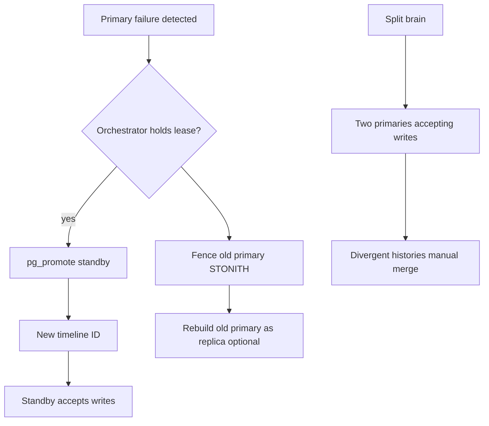
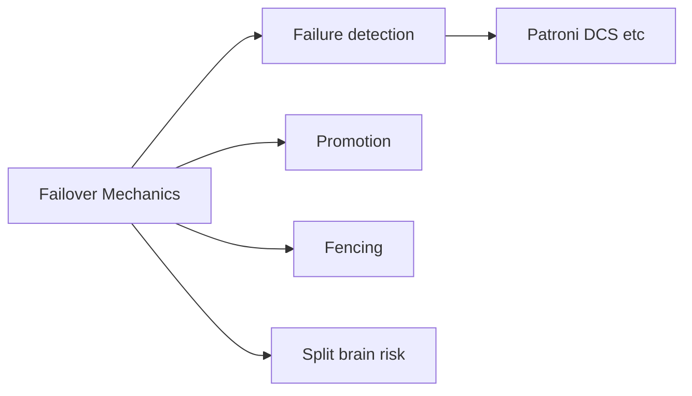
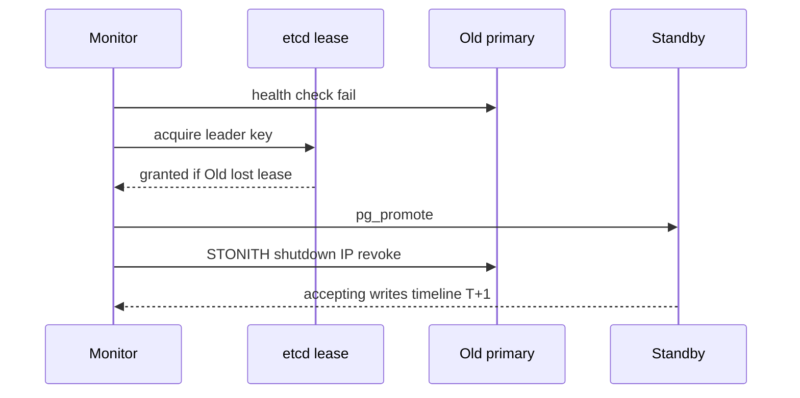

# Failover Promote and Split-Brain Mechanics

## Overview

**Failover** promotes a replica to primary when the old primary is failed or demoted. **Promotion** ends recovery, advances timeline, and accepts writes. **Split-brain** occurs when two nodes both believe they are primary— risking divergent writes and irrecoverable conflicts without operator tooling (STONITH, consensus leases, managed control planes). Engine mechanics stop at promotion; orchestration (Patroni, RDS failover, Pacemaker) implements safe leadership.

## Learning Objectives

- Describe PostgreSQL promotion steps and timeline ID changes
- Explain split-brain causes: network partition, mis-tuned timeouts, manual mistakes
- Contrast manual `pg_promote()` vs orchestrated failover
- Define fencing/STONITH and why "hope the old primary stays down" fails
- Hand off multi-region leader design to System Design

## Prerequisites

- [[08-Databases/07-Replication-Mechanics/WAL Shipping and Streaming Replication|WAL Shipping and Streaming Replication]]
- [[08-Databases/07-Replication-Mechanics/Synchronous vs Asynchronous Durability|Synchronous vs Asynchronous Durability]]

## Difficulty

`expert`

## Estimated Time

- Reading: 3 hours
- Exercises: 4 hours
- Mini project: 5 hours

## History

Pre-orchestration era failovers were manual pg_ctl promote with long outages. Tools (Patroni, repmgr, Stolon) integrated DCS locks (etcd, Consul). Cloud managed databases hide promotion but expose failover events. Split-brain incidents in self-hosted clusters motivated mandatory fencing runbooks.

## Problem It Solves

- **Extended outage** fear causing premature dual-primary
- **Divergent timelines** after async promote with lost WAL
- **Application split writes** during unclear leadership
- **Runbook gaps** on rejoining old primary as replica

## Internal Implementation



### Promotion essentials (PostgreSQL)

1. Standby ends recovery (`pg_ctl promote` or `pg_promote()`).
2. Creates **timeline** branch; future WAL diverges.
3. Old primary must not resume writes without **rewind** or rebuild.

## Mermaid Diagrams

### Structure



### Sequence / Lifecycle — orchestrated failover



## Examples

### Minimal Example — manual promote (lab only)

```sql
-- On standby after primary confirmed dead in lab
SELECT pg_is_in_recovery();  -- true before
-- shell: pg_ctl promote -D $PGDATA
SELECT pg_is_in_recovery();  -- false after
SELECT timeline_id FROM pg_control_checkpoint();
```

### Rejoin old primary (conceptual)

```bash
# After old primary mistakenly came back — do NOT accept writes
pg_rewind --target-pgdata=/var/lib/postgresql/data --source-server="host=newprimary ..."
# then reconfigure as standby
```

### Production-Shaped Example — app behavior during failover

```typescript
// Node 20+ — retry on connection failure during DNS/leader change
import pg from "pg";

function sleep(ms: number): Promise<void> {
  return new Promise((r) => setTimeout(r, ms));
}

export async function queryWithFailoverRetry<T>(
  pool: pg.Pool,
  sql: string,
  params: unknown[],
  maxAttempts = 5,
): Promise<T> {
  let lastErr: unknown;
  for (let i = 0; i < maxAttempts; i++) {
    try {
      const { rows } = await pool.query(sql, params);
      return rows as T;
    } catch (err: unknown) {
      lastErr = err;
      if (!isTransientConnectionError(err)) throw err;
      await sleep(Math.min(1000 * 2 ** i, 8000));
    }
  }
  throw lastErr;
}

function isTransientConnectionError(err: unknown): boolean {
  const code = typeof err === "object" && err !== null ? (err as pg.DatabaseError).code : undefined;
  return code === "57P01" || code === "08006" || code === "08001";
}
```

## Trade-offs

| Dimension | Upside | Downside | When it matters |
| --- | --- | --- | --- |
| Manual promote | Simple lab | Human error split-brain | never prod alone |
| Orchestrated HA | Automated fencing | DCS dependency | self-hosted |
| Managed cloud failover | Operator burden low | Less control | many teams |
| Sync rep before promote | Lower RPO | Doesn't prevent split-brain alone | combined with fencing |

### When to Use

- Patroni/managed failover for production leadership changes
- STONITH or cloud API stop instance on promote
- `pg_rewind` or rebuild for rejoining old primary

### When Not to Use

- Do not promote standby while old primary may still write
- Do not rely on DNS TTL alone as fencing mechanism
- Multi-region active-active design → [[09-System-Design/07-Multi-Region-and-Geo/Multi-Region Active-Passive Active-Active Patterns|Multi-Region Active-Passive Active-Active Patterns]]

## Exercises

1. Lab promote standby; observe timeline_id increment and new WAL filenames.
2. Simulate split-brain (lab VMs): two primaries insert different rows—document recovery pain.
3. Draw Patroni-style DCS timeline for partition scenario.
4. Write failover runbook: detect → promote → fence → verify → rejoin.
5. Measure app recovery time with connection retry vs without.

## Mini Project

**Failover game day.** Staging orchestrated failover with observability checklist.

## Portfolio Project

Failover scenarios in [[08-Databases/projects/Database Engines Workbench/README|Database Engines Workbench]].

## Interview Questions

1. What is split-brain in database HA?
2. What does PostgreSQL promotion do?
3. Why is fencing necessary?
4. RPO implications promoting async standby?
5. How to rejoin old primary safely?

### Stretch / Staff-Level

1. Compare etcd lease failover vs Raft embedded control plane trade-offs.
2. Explain timeline history files and pg_rewind mechanism at high level.

## Common Mistakes

- Promoting without stopping old primary
- No application retry during leader change
- Assuming sync rep eliminates need for orchestration
- Testing failover only on paper

## Best Practices

- Quarterly game days with write traffic during failover
- Immutable alert if two nodes report primary role
- Document RPO/RTO with async lag at promote time
- Backups/PITR → [[08-Databases/12-Production-Database-Ops/Backups PITR and Restore Drills|Backups PITR and Restore Drills]]

## Summary

Failover promotes a standby by ending recovery and branching WAL timelines; split-brain arises when two nodes accept writes without fencing. Engine primitives (`pg_promote`, timeline IDs, pg_rewind) require orchestration layers and runbooks—multi-region topology and CAP product choices belong in system design, not ad hoc promotion.

## Further Reading

- [[00-References/Databases/README|Databases References]]
- PostgreSQL — High Availability and pg_rewind
- Patroni documentation — failover and DCS

## Related Notes

- [[08-Databases/07-Replication-Mechanics/WAL Shipping and Streaming Replication|WAL Shipping and Streaming Replication]]
- [[08-Databases/07-Replication-Mechanics/Synchronous vs Asynchronous Durability|Synchronous vs Asynchronous Durability]]
- [[08-Databases/07-Replication-Mechanics/Replica Lag and Read-Your-Writes at Connection Level|Replica Lag and Read-Your-Writes at Connection Level]]
- [[09-System-Design/README|System Design]]

## Progress Checklist

- [ ] Explained from first principles
- [ ] Drew at least one Mermaid diagram
- [ ] Implemented a minimal version
- [ ] Documented trade-offs and non-goals
- [ ] Completed exercises
- [ ] Practiced interview questions aloud
- [ ] Linked prerequisites and dependents
