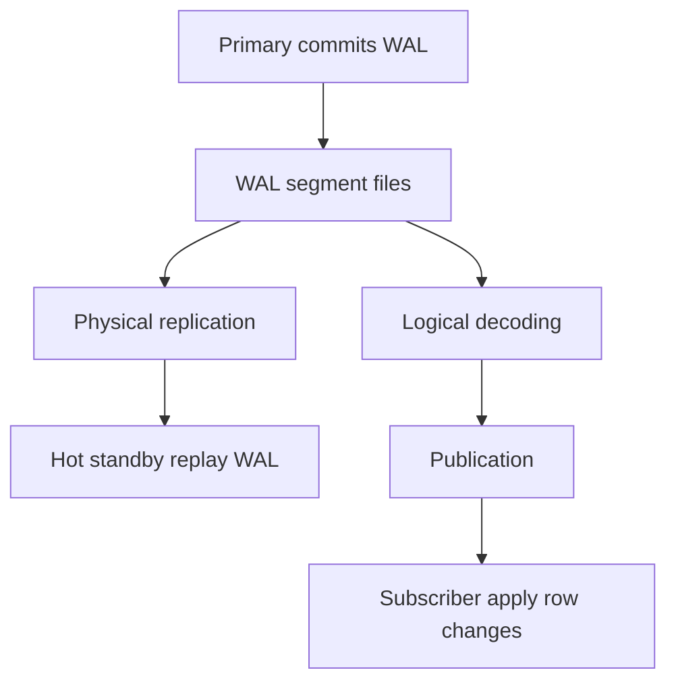
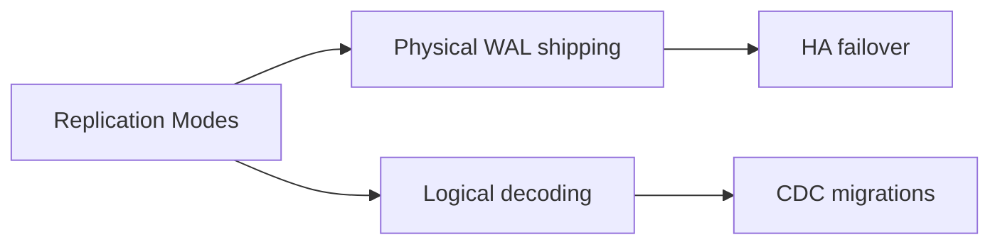
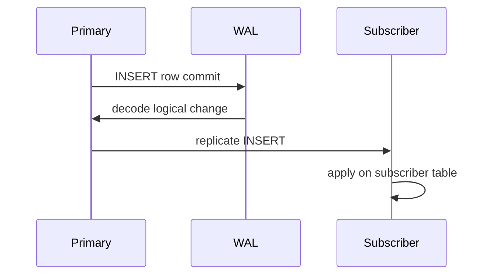

# Physical vs Logical Replication

## Overview

**Physical replication** ships **WAL bytes** (or block changes) to replicas that replay identical storage mutations—standbys are byte-level copies of the primary. **Logical replication** decodes WAL into **logical row changes** (INSERT/UPDATE/DELETE) and applies them to subscribers, enabling selective tables, version upgrades, and cross-engine CDC. Both build on WAL; they differ in flexibility, fidelity, and operational constraints.

## Learning Objectives

- Contrast physical standby vs logical subscriber architecture
- Explain why physical replication requires same major version and layout
- Describe logical replication publications/subscriptions and limitations
- Choose replication mode for HA vs analytics vs migration vs CDC
- Hand off multi-region product topology to System Design track

## Prerequisites

- [[08-Databases/02-WAL-Durability-and-Recovery/Write-Ahead Logging Protocol|Write-Ahead Logging Protocol]]
- [[08-Databases/02-WAL-Durability-and-Recovery/Crash Recovery Redo and Undo Concepts|Crash Recovery Redo and Undo Concepts]]

## Difficulty

`advanced`

## Estimated Time

- Reading: 2.5 hours
- Exercises: 3 hours
- Mini project: 4 hours

## History

PostgreSQL physical streaming replication (9.0+) standardized HA standbys. Logical decoding (9.4+) and native logical replication (10+) enabled selective replication without shared storage. MySQL binlog is logically oriented; MongoDB oplog sits between logical change stream and physical-ish journal. Cloud RDS/Aurora expose physical replication internally with logical CDC products layered on top.

## Problem It Solves

- **HA read scaling** with hot standbys (physical)
- **Zero-downtime major upgrades** via logical replication to new cluster
- **Selective warehouse sync** without full database copy
- **CDC to Kafka** from decoded change stream

## Internal Implementation



| Aspect | Physical | Logical |
| --- | --- | --- |
| Unit shipped | WAL records | Row-level changes |
| Standby identity | Full cluster copy | Target schema may differ |
| DDL replication | Yes (same major) | Limited / manual |
| Selective tables | No (whole instance) | Yes (publication) |
| Failover target | Promote standby | Usually not automatic HA |

## Mermaid Diagrams

### Structure



### Sequence / Lifecycle — logical publication



## Examples

### Minimal Example — physical standby status

```sql
-- On primary PostgreSQL
SELECT application_name, state, sync_state, replay_lag
FROM pg_stat_replication;

-- On standby
SELECT pg_is_in_recovery();  -- true
```

### Logical replication setup

```sql
-- Primary
CREATE PUBLICATION orders_pub FOR TABLE orders, order_items;

-- Subscriber (connected to primary for initial copy options vary)
CREATE SUBSCRIPTION orders_sub
CONNECTION 'host=primary dbname=app user=repl'
PUBLICATION orders_pub;
```

### Production-Shaped Example — monitor replication mode health

```typescript
// Node 20+ — primary-side replication lag probe
import pg from "pg";

export type ReplStat = {
  app: string;
  state: string;
  syncState: string;
  replayLagSec: number | null;
};

export async function fetchPhysicalReplicaStats(pool: pg.Pool): Promise<ReplStat[]> {
  const { rows } = await pool.query(`
    SELECT
      application_name AS app,
      state,
      sync_state AS "syncState",
      EXTRACT(EPOCH FROM replay_lag)::float AS "replayLagSec"
    FROM pg_stat_replication
  `);
  return rows;
}
```

## Trade-offs

| Dimension | Upside | Downside | When it matters |
| --- | --- | --- | --- |
| Physical | Simple HA, full fidelity | All-or-nothing copy | Postgres HA |
| Logical | Selective, upgrades | Conflicts, schema drift | CDC, migrations |
| Cross-region physical | RPO with sync | Latency on commit | DR |
| Logical filters | Lower fanout | Not all DDL replicated | warehouses |

### When to Use

- Physical streaming for HA failover pairs
- Logical for table subset to analytics DB
- Logical for major version migration cutover

### When Not to Use

- Do not use logical replication alone as HA without orchestration
- Do not expect physical replica for per-table warehouse without overload
- Multi-region CAP product design → [[09-System-Design/03-Consistency-Models-and-CAP/CAP and PACELC as Product Constraints|CAP and PACELC as Product Constraints]]

## Exercises

1. Set up physical replica in lab; measure replay lag under write load.
2. Create logical publication for one table; modify schema on subscriber—observe breakage modes.
3. Compare WAL volume vs logical message size for same workload (conceptual measurement).
4. Document which DDL operations replicate physically but not logically.
5. Draw failover flow physical vs logical-only subscriber.

## Mini Project

**Replication mode chooser.** Decision worksheet for three company scenarios (HA, CDC, upgrade).

## Portfolio Project

Replication module in [[08-Databases/projects/Database Engines Workbench/README|Database Engines Workbench]].

## Interview Questions

1. Physical vs logical replication?
2. What is shipped in PostgreSQL streaming replication?
3. Can logical replication replicate single table?
4. Why is standby same major version for physical replication?
5. Use case for logical replication in upgrade?

### Stretch / Staff-Level

1. Explain logical replication conflict handlers on subscriber.
2. Compare Aurora storage replication vs Postgres physical streaming at architecture level.

## Common Mistakes

- Treating logical subscriber as HA failover target without tooling
- Forgetting replication slot disk retention on primary
- Assuming DDL automatically flows in logical replication
- Using cross-region async physical replication but expecting sync commits

## Best Practices

- Physical for HA; logical for selective data movement
- Monitor lag and slot retention on primary
- Test promote/failover on physical standbys regularly
- WAL shipping details → [[08-Databases/07-Replication-Mechanics/WAL Shipping and Streaming Replication|WAL Shipping and Streaming Replication]]

## Summary

Physical replication replays WAL for full-instance standbys—ideal for HA. Logical replication decodes committed changes into row operations for selective subscribers and migration paths. Both originate from WAL but serve different operational contracts; multi-region capacity and CAP trade-offs belong in system design, while this track covers engine mechanics.

## Further Reading

- [[00-References/Databases/README|Databases References]]
- PostgreSQL — High Availability and Logical Replication
- PostgreSQL — Logical Decoding

## Related Notes

- [[08-Databases/07-Replication-Mechanics/WAL Shipping and Streaming Replication|WAL Shipping and Streaming Replication]]
- [[08-Databases/07-Replication-Mechanics/Synchronous vs Asynchronous Durability|Synchronous vs Asynchronous Durability]]
- [[08-Databases/07-Replication-Mechanics/Failover Promote and Split-Brain Mechanics|Failover Promote and Split-Brain Mechanics]]
- [[09-System-Design/README|System Design]]

## Progress Checklist

- [ ] Explained from first principles
- [ ] Drew at least one Mermaid diagram
- [ ] Implemented a minimal version
- [ ] Documented trade-offs and non-goals
- [ ] Completed exercises
- [ ] Practiced interview questions aloud
- [ ] Linked prerequisites and dependents
