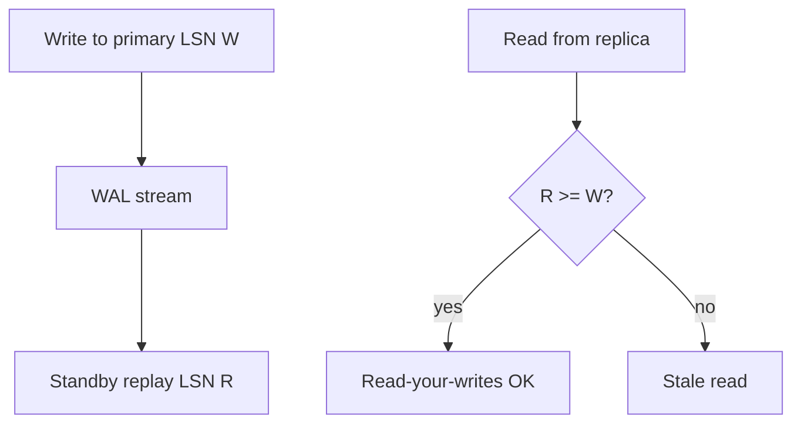
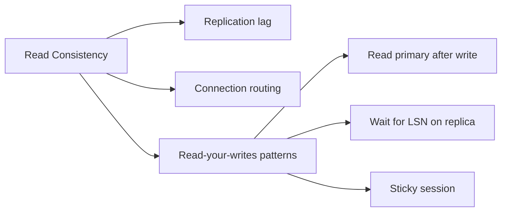
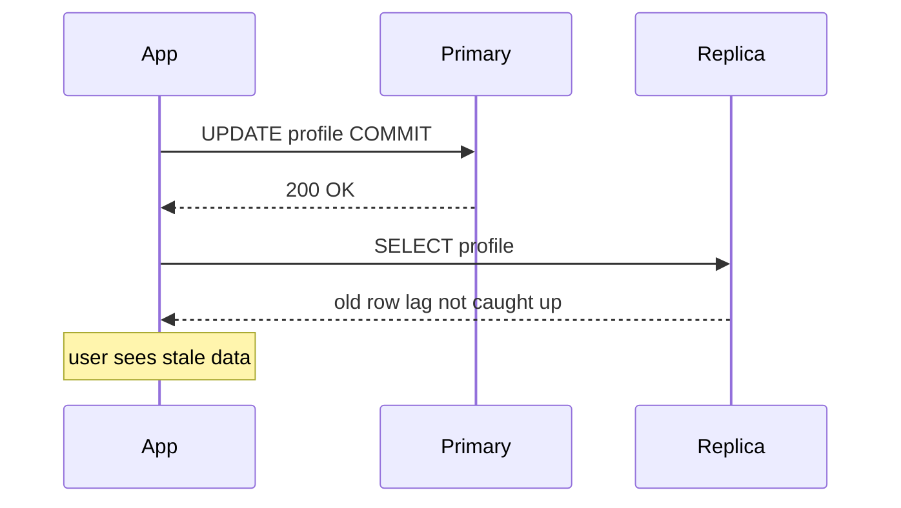

# Replica Lag and Read-Your-Writes at Connection Level

## Overview

**Replica lag** is delay between primary commit and visibility on standbys—measured as time (`replay_lag`) or bytes (`pg_wal_lsn_diff`). Applications reading from replicas may observe **stale data**. **Read-your-writes** consistency requires a session that wrote to primary to read its own updates—a property **not automatic** when load balancers route reads to random replicas. Solutions: primary reads after write, session stickiness, ** synchronous_commit=remote_apply**, or application-level **LSN/wait** guards.

## Learning Objectives

- Measure lag via `pg_stat_replication` and standby views
- Explain why connection pooling breaks naive read-your-writes
- Implement post-write primary read or `pg_logical_emit`/`pg_wait_for` patterns where available
- Design API semantics under eventual read replica consistency
- Separate engine lag mechanics from product UX guarantees

## Prerequisites

- [[08-Databases/07-Replication-Mechanics/WAL Shipping and Streaming Replication|WAL Shipping and Streaming Replication]]
- [[08-Databases/07-Replication-Mechanics/Synchronous vs Asynchronous Durability|Synchronous vs Asynchronous Durability]]

## Difficulty

`advanced`

## Estimated Time

- Reading: 2 hours
- Exercises: 3 hours
- Mini project: 4 hours

## History

Read replicas scaled analytics before cloud OLTP read scaling became default. User-facing bugs ("I saved but profile shows old name") traced to read replica routing after POST. Patterns emerged: **write-follow-read-to-primary**, **cursor/session stickiness**, and **version tokens** in APIs. PostgreSQL added helpers like `pg_current_wal_lsn()` comparisons for advanced waiting on standbys.

## Problem It Solves

- **Stale UI** immediately after form submit
- **Flaky integration tests** reading replica too fast after write
- **Incorrect autoscaling** ignoring lag bytes
- **False confidence** in "read replica" without consistency contract

## Internal Implementation



Lag sources: network, replay load, hot standby conflicts pausing apply, I/O saturation on replica.

## Mermaid Diagrams

### Structure



### Sequence / Lifecycle — stale read after write



## Examples

### Minimal Example — measure lag

```sql
-- Primary
SELECT application_name,
       replay_lag,
       pg_wal_lsn_diff(sent_lsn, replay_lsn) AS lag_bytes
FROM pg_stat_replication;

-- Standby
SELECT now() - pg_last_xact_replay_timestamp() AS replay_delay;
```

### Production-Shaped Example — read primary after mutation

```typescript
// Node 20+ — route writes and immediate reads to primary pool
import pg from "pg";

export class DbRouter {
  constructor(
    private readonly primary: pg.Pool,
    private readonly replica: pg.Pool,
  ) {}

  async updateProfile(userId: string, name: string): Promise<void> {
    await this.primary.query(
      `UPDATE profiles SET name = $2 WHERE user_id = $1`,
      [userId, name],
    );
  }

  /** Call after update in same request — avoids replica lag UX bug */
  async getProfileAfterWrite(userId: string): Promise<{ name: string }> {
    const { rows } = await this.primary.query(
      `SELECT name FROM profiles WHERE user_id = $1`,
      [userId],
    );
    return rows[0];
  }

  /** Historical/list reads — replica OK with stale tolerance */
  async listPublicPosts(): Promise<Array<{ id: string; title: string }>> {
    const { rows } = await this.replica.query(
      `SELECT id, title FROM posts WHERE published = true ORDER BY created_at DESC LIMIT 50`,
    );
    return rows;
  }
}
```

### Advanced — wait for LSN on replica (PostgreSQL)

```sql
-- After write on primary, capture LSN
SELECT pg_current_wal_insert_lsn();  -- W

-- On replica session (same app request if routed)
SELECT pg_wait_for_lsn('W');  -- blocks until replay reaches W (extension/alternate patterns vary)
-- Production often uses primary read instead for simplicity
```

## Trade-offs

| Dimension | Upside | Downside | When it matters |
| --- | --- | --- | --- |
| Primary read after write | Simple RYW | Primary load | user settings pages |
| Replica reads | Scale reads | Stale | feeds, analytics |
| remote_apply sync | Standby fresh | Commit latency | strict RYW all reads |
| LSN wait on replica | Targeted | Complex, blocks | custom middleware |

### When to Use

- Primary for read-after-write in same HTTP request/session
- Replica for lag-tolerant queries with UX disclosure if needed
- Monitor lag bytes p99 for autoscaling replica count

### When Not to Use

- Do not round-robin reads after write without stickiness
- Do not use replica for uniqueness checks immediately after insert
- Global multi-region consistency → [[09-System-Design/README|System Design]]

## Exercises

1. Write row on primary; poll replica until visible—measure lag distribution.
2. Implement `DbRouter` pattern in test app; verify RYW fixed.
3. Simulate PgBouncer transaction mode breaking session stickiness—document fix.
4. Graph lag_bytes vs replica CPU during replay conflict storm.
5. Define consistency tier table for your API endpoints.

## Mini Project

**Lag-aware router.** Middleware chooses primary when cookie `last_write_at` within N seconds.

## Portfolio Project

Read routing module in [[08-Databases/projects/Database Engines Workbench/README|Database Engines Workbench]].

## Interview Questions

1. What is replication lag?
2. Why doesn't read replica automatically give read-your-writes?
3. Simplest fix for stale read after profile update?
4. Metrics for lag besides replay_lag interval?
5. How does connection pooling affect stickiness?

### Stretch / Staff-Level

1. Design version-token API (`etag` from write LSN) for replica reads.
2. Compare Google Spanner trueTime vs Postgres async replica semantics.

## Common Mistakes

- ORM read replica helper used globally including after save
- Assuming synchronous_commit on primary means replica reads are instant without remote_apply
- Load test writes on primary, reads on replica, miss flake rate
- Ignoring hot standby replay pause in lag metrics

## Best Practices

- Document per-endpoint consistency tier
- Monitor `pg_stat_replication` lag bytes p99
- Use primary for read-after-write; replicas for analytics
- Service transaction scope → [[07-Backend/08-Data-Access-and-Persistence-Patterns/Transactions as Used by Services|Transactions as Used by Services]]
- Pooling → [[08-Databases/12-Production-Database-Ops/Connection Pooling at Engine and Proxy|Connection Pooling at Engine and Proxy]]

## Summary

Replica lag is inherent in asynchronous physical replication; read-your-writes fails when applications write to primary then read from an arbitrary lagging standby. Engine metrics expose lag time and bytes; application patterns—primary read after write, careful routing, or advanced LSN waits—define user-visible consistency. Multi-region active-active semantics exceed this note and belong in system design.

## Further Reading

- [[00-References/Databases/README|Databases References]]
- PostgreSQL — Monitoring Replication and Hot Standby
- Kleppmann — consistency sections on read replicas

## Related Notes

- [[08-Databases/07-Replication-Mechanics/WAL Shipping and Streaming Replication|WAL Shipping and Streaming Replication]]
- [[08-Databases/07-Replication-Mechanics/Failover Promote and Split-Brain Mechanics|Failover Promote and Split-Brain Mechanics]]
- [[08-Databases/07-Replication-Mechanics/Synchronous vs Asynchronous Durability|Synchronous vs Asynchronous Durability]]
- [[09-System-Design/README|System Design]]

## Progress Checklist

- [ ] Explained from first principles
- [ ] Drew at least one Mermaid diagram
- [ ] Implemented a minimal version
- [ ] Documented trade-offs and non-goals
- [ ] Completed exercises
- [ ] Practiced interview questions aloud
- [ ] Linked prerequisites and dependents
