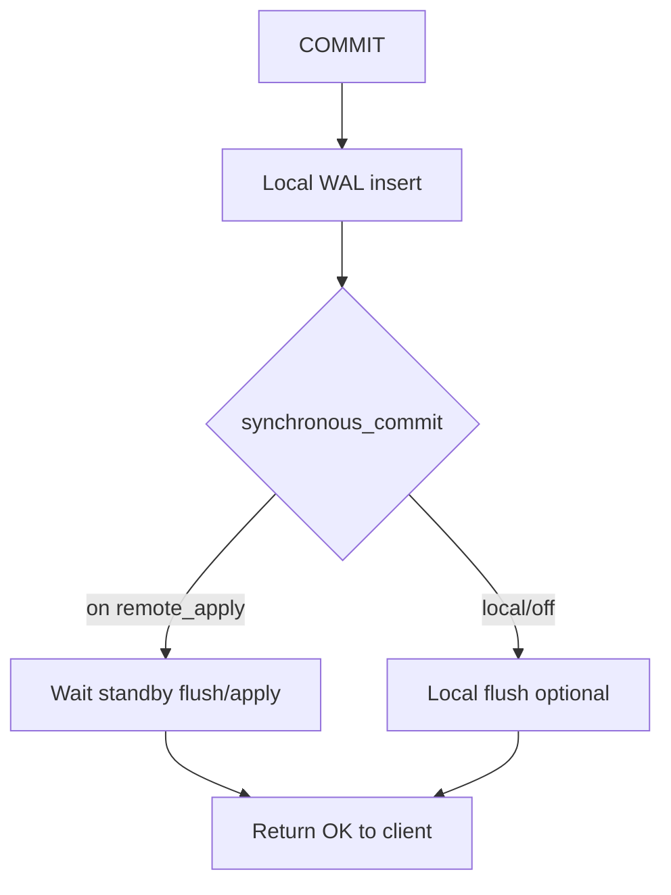
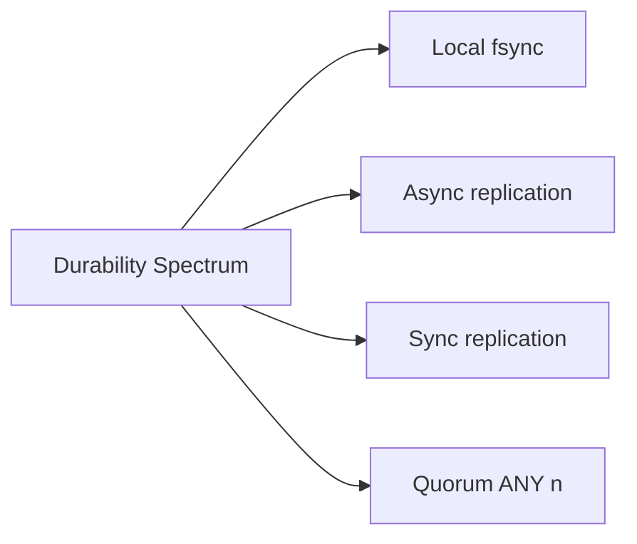
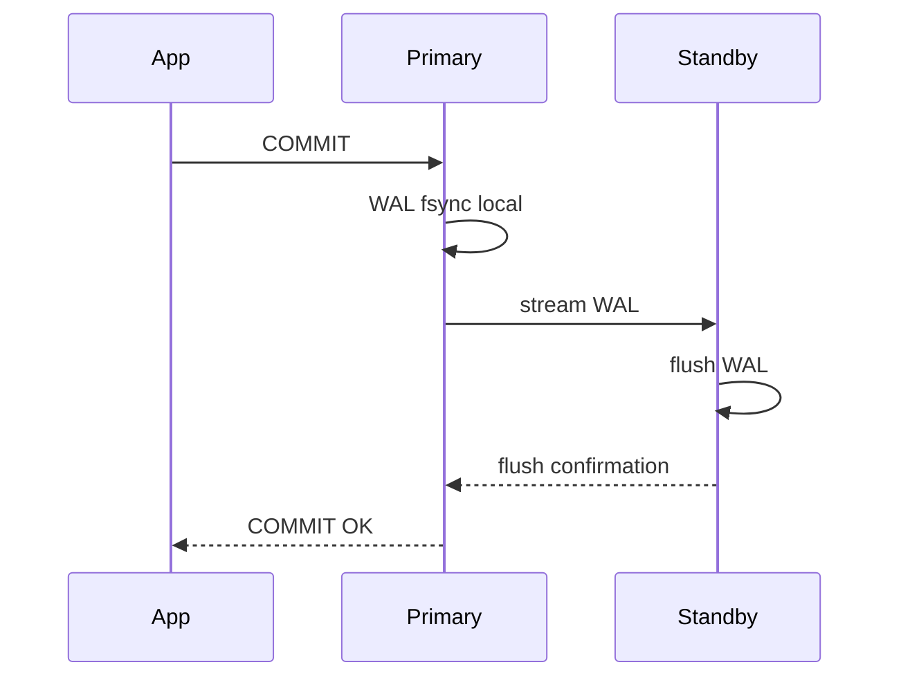

# Synchronous vs Asynchronous Durability

## Overview

**Durability** at commit time is graded: local WAL **fsync**, **synchronous replication** to standbys, and **quorum** policies define what "committed" means before the client receives success. **Asynchronous** replication acknowledges commit after local durability while replicas catch up later—lower latency, non-zero **RPO** on primary loss. **Synchronous** modes wait for remote flush—higher latency, tighter RPO/RTO trade space.

## Learning Objectives

- Map PostgreSQL `synchronous_commit` levels to durability guarantees
- Configure `synchronous_standby_names` and understand quorum (ANY n)
- Quantify RPO for async vs sync replication on primary failure
- Relate group commit to local durability without replication
- Distinguish engine durability from application-level ack semantics

## Prerequisites

- [[08-Databases/07-Replication-Mechanics/Physical vs Logical Replication|Physical vs Logical Replication]]
- [[08-Databases/02-WAL-Durability-and-Recovery/fsync Group Commit and Durability Levels|fsync Group Commit and Durability Levels]]

## Difficulty

`advanced`

## Estimated Time

- Reading: 2 hours
- Exercises: 3 hours
- Mini project: 3 hours

## History

Early async replication maximized throughput; financial systems demanded **zero data loss** configs (MySQL semi-sync, Postgres sync rep). Cloud providers expose durability tiers (Aurora 6-way, RDS Multi-AZ sync). Misconfigured `synchronous_commit=off` caused famous "we thought it was durable" incidents.

## Problem It Solves

- **False durability** when app assumes commit means replicated
- **Latency spikes** when sync standbys slow or absent
- **Split policy** between financial ledger vs telemetry tables
- **Runbook gaps** documenting RPO per environment

## Internal Implementation



### PostgreSQL knobs (subset)

| Setting | Effect |
| --- | --- |
| `synchronous_commit=on` | Wait local flush + sync rep policy |
| `remote_write` | Wait standby receive, not necessarily flush |
| `remote_apply` | Wait apply on standby (visible reads there) |
| `synchronous_commit=off` | Async local flush—window of loss |

`synchronous_standby_names = 'ANY 2 (s1, s2, s3)'` — quorum commit.

## Mermaid Diagrams

### Structure



### Sequence / Lifecycle — sync commit wait



## Examples

### Minimal Example — configure sync standby

```sql
-- Primary
ALTER SYSTEM SET synchronous_standby_names = 'FIRST 1 (standby1)';
ALTER SYSTEM SET synchronous_commit = 'on';
SELECT pg_reload_conf();

-- Verify
SELECT application_name, sync_state FROM pg_stat_replication;
-- sync_state = sync for qualifying standby
```

### Per-session durability trade-off

```sql
BEGIN;
SET LOCAL synchronous_commit = off;
INSERT INTO metrics VALUES (now(), 1);
COMMIT;  -- fast, can lose last seconds on crash
```

### Production-Shaped Example — document effective durability

```typescript
// Node 20+ — separate pools for strict vs best-effort writes
import pg from "pg";

export function createStrictPool(url: string): pg.Pool {
  const pool = new pg.Pool({ connectionString: url });
  pool.on("connect", (c) => {
    void c.query(`SET synchronous_commit = 'on'`);
  });
  return pool;
}

export function createMetricsPool(url: string): pg.Pool {
  const pool = new pg.Pool({ connectionString: url });
  pool.on("connect", (c) => {
    void c.query(`SET synchronous_commit = off`);
  });
  return pool;
}
```

## Trade-offs

| Dimension | Upside | Downside | When it matters |
| --- | --- | --- | --- |
| Sync rep | Minimal RPO on primary death | Commit latency + coupling | ledger |
| Async rep | Low latency | Lost unreplicated WAL | analytics |
| Quorum ANY n | AZ fault tolerance | Complexity | cloud HA |
| local off | Throughput | Crash window | metrics |

### When to Use

- Sync replication for financial/identity writes
- Quorum when AZ loss must not halt commits
- Explicit `SET LOCAL` downgrade only for named best-effort paths

### When Not to Use

- Do not globally disable synchronous_commit without RPO sign-off
- Do not point sync rep at slow cross-region standby without latency budget
- Multi-region product CAP → [[09-System-Design/03-Consistency-Models-and-CAP/CAP and PACELC as Product Constraints|CAP and PACELC as Product Constraints]]

## Exercises

1. Benchmark commit latency sync vs async under identical load.
2. Kill primary after commits with async rep; measure data loss window on promote.
3. Configure `ANY 2` quorum; stop one standby; verify commits continue.
4. Document RPO/RTO paragraph for your staging config.
5. Relate `synchronous_commit=remote_apply` to read-your-writes on standby.

## Mini Project

**Durability matrix.** Table of endpoints → commit settings → expected RPO.

## Portfolio Project

Durability benchmarks in [[08-Databases/projects/Database Engines Workbench/README|Database Engines Workbench]].

## Interview Questions

1. Async vs sync replication durability difference?
2. What does `synchronous_commit=off` risk?
3. Purpose of `synchronous_standby_names`?
4. What is RPO in replication context?
5. remote_write vs remote_apply?

### Stretch / Staff-Level

1. Explain group commit interaction with synchronous replication wait.
2. How does quorum ANY differ from FIRST in PostgreSQL sync rep?

## Common Mistakes

- Assuming Multi-AZ means zero RPO without reading cloud docs
- Sync rep to single distant replica — latency kills app
- Mixing durability levels in one transaction without LOCAL SET discipline
- Confusing **committed on primary** with **visible on replica**

## Best Practices

- Document durability tier per data class
- Monitor sync standby count and `sync_state`
- Load test failover + data loss boundaries
- ACID durability → [[08-Databases/05-Transactions-and-Isolation/ACID as Engine Contracts|ACID as Engine Contracts]]

## Summary

Synchronous replication extends durability beyond local WAL flush by waiting for standbys; asynchronous replication trades RPO for latency. PostgreSQL exposes fine-grained `synchronous_commit` levels and quorum standby naming—operators must align settings with business RPO, measure commit latency, and avoid assuming all commits are equally durable across connection pools.

## Further Reading

- [[00-References/Databases/README|Databases References]]
- PostgreSQL — Synchronous Replication
- PostgreSQL — runtime-config synchronous_commit

## Related Notes

- [[08-Databases/07-Replication-Mechanics/WAL Shipping and Streaming Replication|WAL Shipping and Streaming Replication]]
- [[08-Databases/02-WAL-Durability-and-Recovery/fsync Group Commit and Durability Levels|fsync Group Commit and Durability Levels]]
- [[08-Databases/07-Replication-Mechanics/Failover Promote and Split-Brain Mechanics|Failover Promote and Split-Brain Mechanics]]
- [[09-System-Design/README|System Design]]

## Progress Checklist

- [ ] Explained from first principles
- [ ] Drew at least one Mermaid diagram
- [ ] Implemented a minimal version
- [ ] Documented trade-offs and non-goals
- [ ] Completed exercises
- [ ] Practiced interview questions aloud
- [ ] Linked prerequisites and dependents
