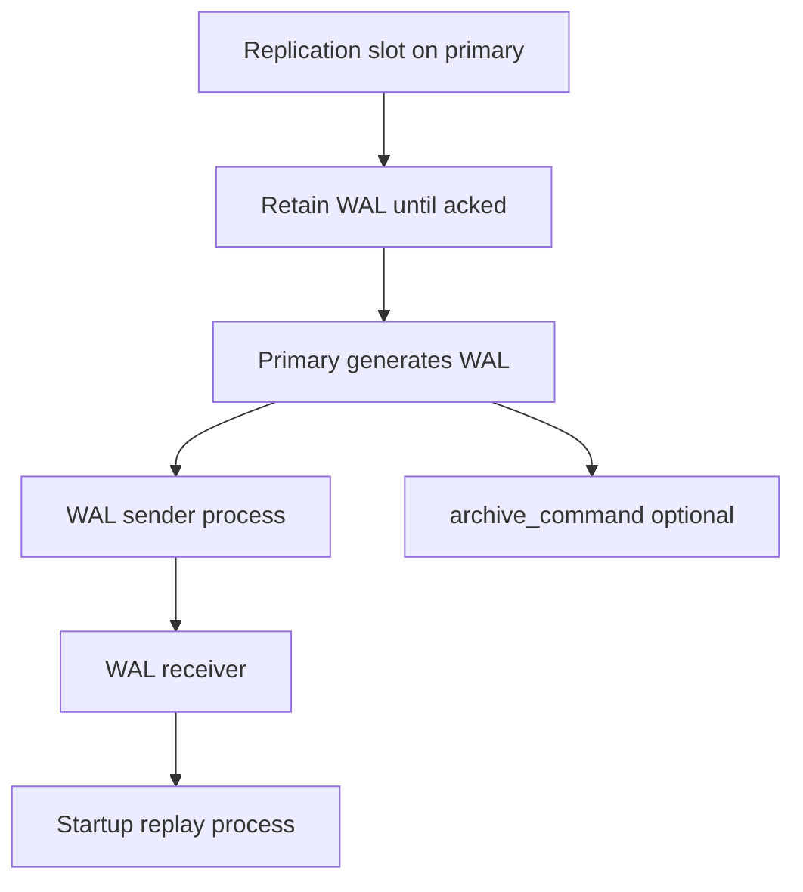
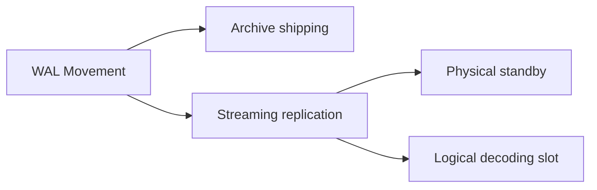
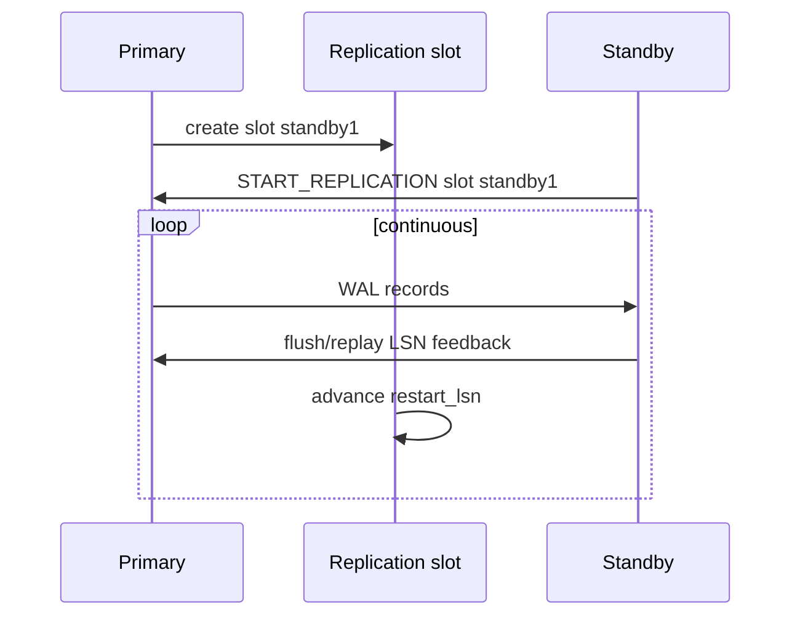

# WAL Shipping and Streaming Replication

## Overview

**WAL shipping** moves write-ahead log from primary to standbys—historically via archived **WAL segments** (`archive_command`), modernly via **streaming replication** (continuous TCP stream of WAL records). **Replication slots** track consumer progress on the primary, preventing WAL deletion until consumed—eliminating lag-induced gaps but risking **disk fill** if consumers stall. Standbys **replay** WAL into recovery mode until promotion.

## Learning Objectives

- Contrast archive-based WAL shipping vs streaming replication
- Explain replication slot `restart_lsn` and retained WAL sizing
- Configure primary/replica `wal_level`, `max_wal_senders`, `hot_standby`
- Monitor `pg_stat_replication`, lag bytes, and replay pause states
- Diagnose stuck replication from network, slots, and conflicts

## Prerequisites

- [[08-Databases/07-Replication-Mechanics/Physical vs Logical Replication|Physical vs Logical Replication]]
- [[08-Databases/02-WAL-Durability-and-Recovery/Write-Ahead Logging Protocol|Write-Ahead Logging Protocol]]

## Difficulty

`advanced`

## Estimated Time

- Reading: 2.5 hours
- Exercises: 3.5 hours
- Mini project: 4 hours

## History

PostgreSQL PITR archiving predates streaming; DBAs restored timelines from WAL files. Streaming replication (9.0) reduced RPO for HA. Replication slots (9.4+) fixed "standby too far behind missing WAL" at cost of retention hazards. Logical slots power CDC pipelines with same retention semantics.

## Problem It Solves

- **Missing WAL segments** when standby falls behind archive retention
- **Primary disk full** from unreclaimed WAL with orphaned slot
- **False healthy** when `state=streaming` but lag bytes huge
- **Hot standby conflicts** pausing replay on long queries

## Internal Implementation



### Key processes (PostgreSQL)

| Process | Role |
| --- | --- |
| walsender | Streams WAL to standby/client |
| walreceiver | Receives on standby, writes pg_wal |
| startup | Replays WAL during recovery |

## Mermaid Diagrams

### Structure



### Sequence / Lifecycle — streaming with slot



## Examples

### Minimal Example — replication status

```sql
-- Primary
SELECT pid, application_name, client_addr, state, sent_lsn, write_lsn, flush_lsn, replay_lsn,
       pg_size_pretty(pg_wal_lsn_diff(sent_lsn, replay_lsn)) AS replay_gap
FROM pg_stat_replication;

SELECT slot_name, active, restart_lsn,
       pg_size_pretty(pg_wal_lsn_diff(pg_current_wal_lsn(), restart_lsn)) AS retained
FROM pg_replication_slots;
```

### Standby base backup + streaming (shell reference)

```bash
# Educational — follow official docs for production
pg_basebackup -h primary -D /var/lib/postgresql/data -U repl -Fp -Xs -P -R
# -R writes primary_conninfo + slot settings in postgresql.auto.conf
```

### Production-Shaped Example — lag alert

```typescript
// Node 20+ — alert when replay gap exceeds threshold
import pg from "pg";

export async function walReplayGapBytes(pool: pg.Pool): Promise<number> {
  const { rows } = await pool.query(`
    SELECT coalesce(
      max(pg_wal_lsn_diff(sent_lsn, replay_lsn)),
      0
    )::bigint AS gap
    FROM pg_stat_replication
  `);
  return Number(rows[0].gap);
}

export async function slotRetentionBytes(pool: pg.Pool): Promise<Array<{ name: string; bytes: number }>> {
  const { rows } = await pool.query(`
    SELECT slot_name AS name,
           pg_wal_lsn_diff(pg_current_wal_lsn(), restart_lsn)::bigint AS bytes
    FROM pg_replication_slots
  `);
  return rows.map((r) => ({ name: r.name, bytes: Number(r.bytes) }));
}
```

## Trade-offs

| Dimension | Upside | Downside | When it matters |
| --- | --- | --- | --- |
| Streaming | Low RPO, continuous | Network coupling | HA pairs |
| Archive shipping | Simple DR copies | Coarser, restore work | long-term DR |
| Replication slots | No WAL gap | Retention disk risk | mandatory standbys |
| No slot | WAL recycled | Standby rebuild if lag | dev only |

### When to Use

- Physical replication slots for all production standbys
- Monitor slot retention + replay lag together
- `pg_basebackup` + streaming for new replica bootstrap

### When Not to Use

- Do not leave inactive logical slots on production after experiments
- Do not disable archives if regulatory DR requires WAL vault
- Do not ignore hot standby conflict cancellations without app fix

## Exercises

1. Create replication slot; stop standby; watch primary WAL directory growth.
2. Measure replay lag under write burst vs steady state.
3. Trigger hot standby conflict (`pg_cancel_backend` on replay pause query).
4. Compare archive-only DR restore steps vs streaming failover timeline.
5. Plot `pg_wal_lsn_diff` metrics over 24h load test.

## Mini Project

**Replication health panel.** Grafana: lag bytes, slot retention, state, sync_state.

## Portfolio Project

WAL streaming lab in [[08-Databases/projects/Database Engines Workbench/README|Database Engines Workbench]].

## Interview Questions

1. Streaming replication vs WAL archiving?
2. What is a replication slot?
3. How can slots cause primary disk full?
4. Difference between flush_lsn and replay_lsn?
5. What is hot standby?

### Stretch / Staff-Level

1. Explain timeline switches and pg_wal continuity after promote.
2. How does cascading replication change lag topology?

## Common Mistakes

- No slot + lag beyond wal_keep_size → rebuild standby
- Monitoring `state=streaming` only, not byte lag
- Logical CDC slot on dev pointing at prod clone forgotten
- Long standby queries blocking replay without timeout policy

## Best Practices

- Alert on slot retention bytes and max lag
- Document bootstrap procedure for new replicas
- Set `hot_standby_feedback` thoughtfully with vacuum impact
- Long txn horizons → [[08-Databases/06-Concurrency-Internals/Long Transactions and Snapshot Horizons|Long Transactions and Snapshot Horizons]]

## Summary

WAL shipping delivers durability extensions and HA by moving log data to standbys—streaming for continuous apply, archives for DR vaults. Replication slots prevent destructive WAL recycling but require consumer health monitoring. Operational excellence tracks byte lag, slot retention, and replay conflicts—not merely replication connection state.

## Further Reading

- [[00-References/Databases/README|Databases References]]
- PostgreSQL — Streaming Replication and Replication Slots
- PostgreSQL — Continuous Archiving and Point-in-Time Recovery

## Related Notes

- [[08-Databases/07-Replication-Mechanics/Synchronous vs Asynchronous Durability|Synchronous vs Asynchronous Durability]]
- [[08-Databases/07-Replication-Mechanics/Failover Promote and Split-Brain Mechanics|Failover Promote and Split-Brain Mechanics]]
- [[08-Databases/07-Replication-Mechanics/Replica Lag and Read-Your-Writes at Connection Level|Replica Lag and Read-Your-Writes at Connection Level]]
- [[08-Databases/02-WAL-Durability-and-Recovery/Checkpoints and Dirty Page Flushing|Checkpoints and Dirty Page Flushing]]

## Progress Checklist

- [ ] Explained from first principles
- [ ] Drew at least one Mermaid diagram
- [ ] Implemented a minimal version
- [ ] Documented trade-offs and non-goals
- [ ] Completed exercises
- [ ] Practiced interview questions aloud
- [ ] Linked prerequisites and dependents
