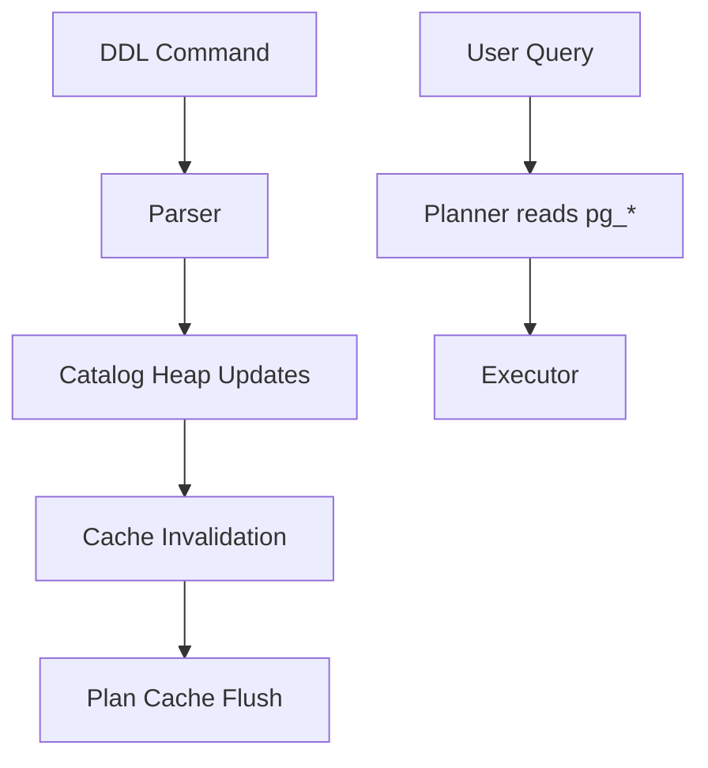
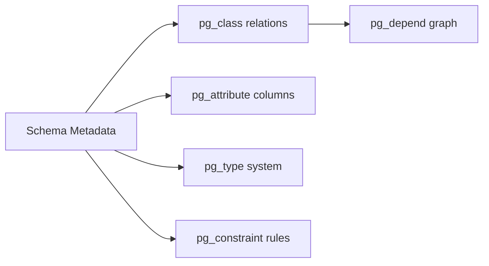
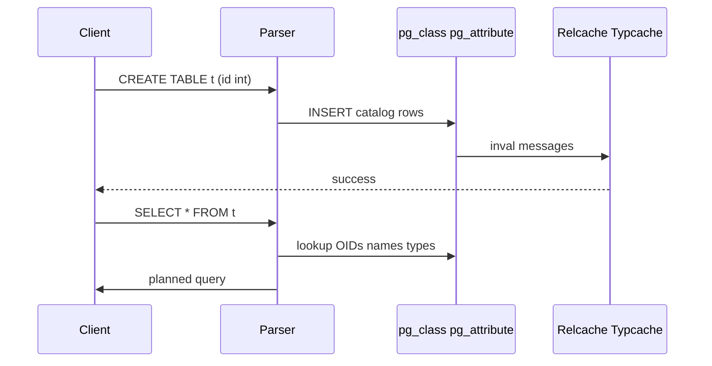

# Catalogs System Tables and Types

## Overview

PostgreSQL stores **all schema metadata**—tables, columns, types, constraints, functions, access methods—in ordinary **heap relations** called **system catalogs**, primarily under the `pg_catalog` schema. The planner, executor, and DDL commands read and mutate these catalogs like any other table, but with special bootstrap rules at cluster init.

Understanding catalogs is how you reason about **type coercion**, **OID assignment**, **dependency graphs**, and why `DROP`/`ALTER` can lock catalog rows.

## Learning Objectives

- Explain how PostgreSQL represents schema as catalog heap tables
- Navigate `pg_class`, `pg_attribute`, `pg_type`, and `pg_constraint`
- Distinguish `pg_catalog` from `information_schema` views
- Describe how custom types and domains appear in catalogs
- Use catalog queries to diagnose planner/type issues in production

## Prerequisites

- [[08-Databases/01-Storage-and-Buffer-Pool/Pages Blocks and I/O Units|Pages Blocks and I/O Units]]
- [[08-Databases/04-Query-Processing-and-Planning/Parse Bind Plan Execute Pipeline|Parse Bind Plan Execute Pipeline]]

## Difficulty

`intermediate`

## Estimated Time

- Reading: 2 hours
- Exercises: 2.5 hours
- Mini project: 3 hours

## History

Early Postgres inherited Ingres' catalog design: metadata as queryable relations rather than opaque binary headers. OIDs (object identifiers) were once user-visible primary keys; modern Postgres prefers **stable names** and `reg*` cast types while retaining OIDs internally for bootstrap and C extensions.

## Problem It Solves

- **"Why can't I cast this?"** — answer lives in `pg_cast` and `pg_type`
- **Orphan objects after failed migration** — trace `pg_depend`
- **Extension uninstall order** — dependency graph in catalogs
- **Mystery index/table bloat attribution** — `pg_class.reltuples`, `relkind`

## Internal Implementation

PostgreSQL bootstraps catalogs from `template1` at `initdb`. Each user object gets rows in:

| Catalog | Role |
| --- | --- |
| `pg_class` | Relations: tables, indexes, views, sequences (`relkind`) |
| `pg_attribute` | Columns per relation (`attnum`, `atttypid`) |
| `pg_type` | Base types, domains, enums, composite types |
| `pg_constraint` | PK, FK, CHECK, UNIQUE definitions |
| `pg_depend` | Object dependency edges for DROP/ALTER |
| `pg_proc` | Functions and procedures |



Type system: SQL types map to `pg_type` entries with **typelem** (array element), **typcategory**, and **typinput/typoutput** routines. Domains add `pg_constraint` CHECK rows on top of base types.

## Mermaid Diagrams

### Structure



### Sequence / Lifecycle — CREATE TABLE



## Examples

### Minimal Example — inspect a table's physical catalog rows

```sql
-- PostgreSQL 15+
SELECT c.oid,
       c.relname,
       c.relkind,
       c.relpages,
       c.reltuples
FROM pg_catalog.pg_class c
JOIN pg_catalog.pg_namespace n ON n.oid = c.relnamespace
WHERE n.nspname = 'public'
  AND c.relname = 'orders';

SELECT a.attnum,
       a.attname,
       t.typname,
       a.attnotnull
FROM pg_catalog.pg_attribute a
JOIN pg_catalog.pg_type t ON t.oid = a.atttypid
JOIN pg_catalog.pg_class c ON c.oid = a.attrelid
WHERE c.relname = 'orders'
  AND a.attnum > 0
  AND NOT a.attisdropped
ORDER BY a.attnum;
```

### Production-Shaped Example — TypeScript migration guard using catalog introspection

```typescript
// Node 20+ / pg 8.x — verify column types before zero-downtime deploy
import pg from "pg";

type ColumnExpectation = { table: string; column: string; typname: string };

const EXPECTED: ColumnExpectation[] = [
  { table: "orders", column: "total_cents", typname: "int8" },
  { table: "orders", column: "status", typname: "order_status" }, // enum
];

export async function assertSchema(pool: pg.Pool): Promise<void> {
  const sql = `
    SELECT c.relname AS table_name,
           a.attname AS column_name,
           t.typname
    FROM pg_catalog.pg_attribute a
    JOIN pg_catalog.pg_class c ON c.oid = a.attrelid
    JOIN pg_catalog.pg_namespace n ON n.oid = c.relnamespace
    JOIN pg_catalog.pg_type t ON t.oid = a.atttypid
    WHERE n.nspname = 'public'
      AND c.relkind = 'r'
      AND a.attnum > 0
      AND NOT a.attisdropped
  `;
  const { rows } = await pool.query(sql);
  const byKey = new Map(rows.map((r) => [`${r.table_name}.${r.column_name}`, r.typname]));

  for (const exp of EXPECTED) {
    const key = `${exp.table}.${exp.column}`;
    const actual = byKey.get(key);
    if (actual !== exp.typname) {
      throw new Error(`Schema drift: ${key} expected ${exp.typname}, got ${actual ?? "missing"}`);
    }
  }
}
```

## Trade-offs

| Dimension | Upside | Downside | When it matters |
| --- | --- | --- | --- |
| Catalogs as tables | Introspectable, SQL-queryable | DDL touches shared metadata | migration tooling |
| OIDs internally | Fast C-level references | Opaque to operators | extension authors |
| information_schema | Portable SQL standard | Incomplete vs pg_catalog | multi-DB tools |
| Custom types/enums | Domain modeling in engine | Migration complexity | financial enums |

### When to Use

- Query `pg_catalog` for authoritative Postgres-specific diagnostics
- Use `information_schema` when building portable schema tools
- Define enums/domains when constraints belong at storage layer

### When Not to Use

- Do not poll catalogs on every request—cache schema in connection pool / ORM
- Do not treat `information_schema` as complete for index-only scan hints

## Exercises

1. Draw dependency edges for a table with FK, index, and view—query `pg_depend`.
2. Create a domain with CHECK; locate its rows in `pg_type` and `pg_constraint`.
3. Compare `pg_class.relpages` estimate to `pg_relation_size` for a 1M-row table.
4. List all enum labels via catalog joins without `\dT+`.
5. Explain why `DROP TYPE` fails when a column still references it.

## Mini Project

**Catalog explorer CLI.** TypeScript tool that prints table DDL reconstructed from `pg_catalog` (columns, types, constraints)—not `pg_dump`, hand-rolled joins.

## Portfolio Project

Schema validation gate in [[08-Databases/projects/Database Engines Workbench/README|Database Engines Workbench]] pre-deploy checks.

## Interview Questions

1. Where does PostgreSQL store table and column definitions?
2. What is `relkind` in `pg_class` and which values matter operationally?
3. Difference between `pg_catalog` and `information_schema`?
4. How do custom enums appear in catalogs?
5. Why does DDL invalidate plan cache?

### Stretch / Staff-Level

1. Explain bootstrap catalog creation at `initdb` and why some catalogs have fixed OIDs.
2. How would a corrupted `pg_attribute` row manifest at query planning time?

## Common Mistakes

- Assuming `\d` output is magic—it is catalog queries
- Using `oid` columns in application schemas (deprecated pattern)
- Ignoring `attisdropped` when reading `pg_attribute`
- Confusing type name with storage type (e.g., `timestamp` vs `timestamptz`)

## Best Practices

- Version-control migrations; use catalog checks in CI for drift detection
- Prefer `regclass` / `regtype` casts in ad hoc DBA scripts
- Document custom types in migration notes with rollback plan
- Cross-check [[08-Databases/08-PostgreSQL-Engine/Constraints as Engine Invariants|Constraints as Engine Invariants]] when adding domains

## Summary

PostgreSQL's schema **is** data: system catalogs are heap tables the engine reads on every parse and plan. Mastering `pg_class`, `pg_attribute`, `pg_type`, and `pg_constraint` turns opaque DDL errors into inspectable graphs. Production engineers use catalog literacy for migration safety, type correctness, and dependency-aware operations—not for hot-path queries.

## Further Reading

- [[00-References/Databases/README|Databases References]]
- PostgreSQL System Catalogs documentation
- `pg_catalog` chapter in PostgreSQL Internals literature

## Related Notes

- [[08-Databases/08-PostgreSQL-Engine/Constraints as Engine Invariants|Constraints as Engine Invariants]]
- [[08-Databases/04-Query-Processing-and-Planning/Parse Bind Plan Execute Pipeline|Parse Bind Plan Execute Pipeline]]
- [[08-Databases/01-Storage-and-Buffer-Pool/Heap Tables vs Clustered Layouts|Heap Tables vs Clustered Layouts]]
- [[08-Databases/08-PostgreSQL-Engine/Extensions and Procedural Surfaces Concepts|Extensions and Procedural Surfaces Concepts]]

## Progress Checklist

- [ ] Explained from first principles
- [ ] Drew at least one Mermaid diagram
- [ ] Implemented a minimal version
- [ ] Documented trade-offs and non-goals
- [ ] Completed exercises
- [ ] Practiced interview questions aloud
- [ ] Linked prerequisites and dependents
