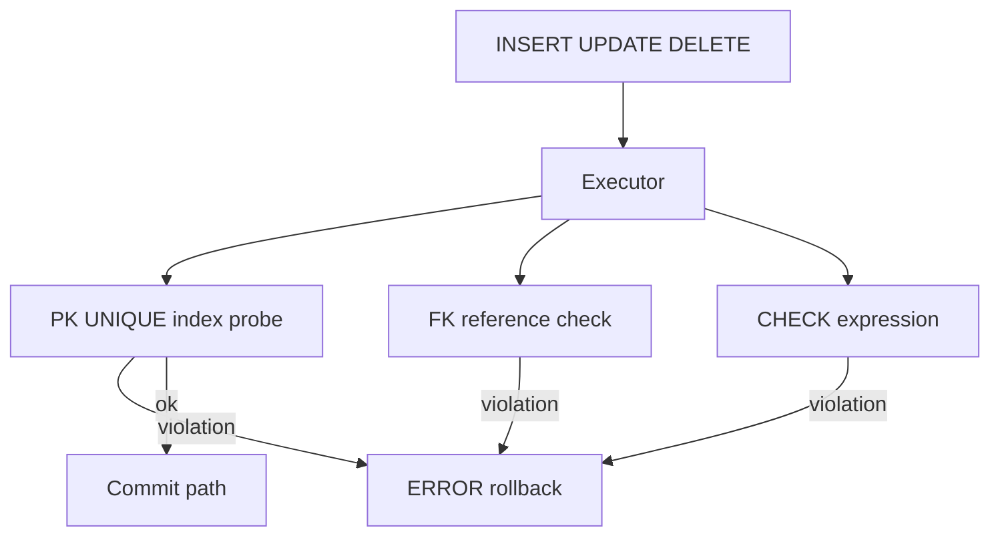
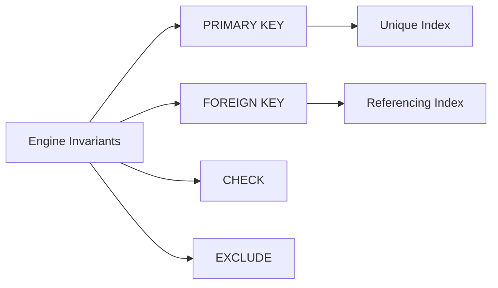
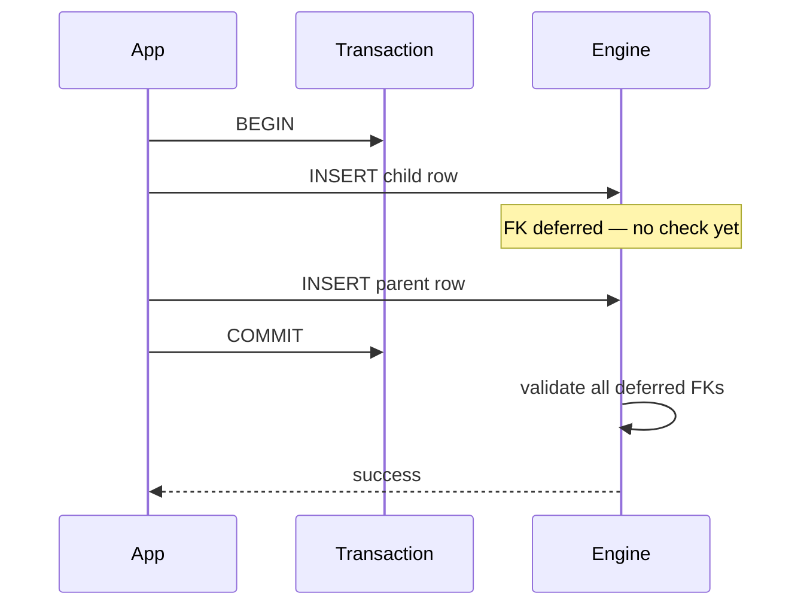

# Constraints as Engine Invariants

## Overview

**Constraints** are declarative **invariants** enforced by the database engine at write time: PRIMARY KEY, UNIQUE, FOREIGN KEY, CHECK, NOT NULL, EXCLUDE. Unlike application validation, constraints survive all clients, ad hoc SQL, and failed deploy rollbacks—making them the durable contract layer for relational data.

PostgreSQL stores constraints in `pg_constraint` and validates them using index structures (unique/PK) or trigger-like check paths (FK, CHECK).

## Learning Objectives

- Map each constraint type to enforcement mechanism and catalog representation
- Choose between engine constraints and application validation with explicit trade-offs
- Use deferrable constraints for multi-statement business transactions
- Predict FK locking and validation cost on bulk loads
- Design constraints that cooperate with MVCC and index access paths

## Prerequisites

- [[08-Databases/05-Transactions-and-Isolation/ACID as Engine Contracts|ACID as Engine Contracts]]
- [[08-Databases/08-PostgreSQL-Engine/Catalogs System Tables and Types|Catalogs System Tables and Types]]

## Difficulty

`intermediate`

## Estimated Time

- Reading: 2 hours
- Exercises: 2.5 hours
- Mini project: 3 hours

## History

SQL standardized declarative integrity in the 1980s–90s as systems moved business rules out of client apps. Postgres added EXCLUDE constraints and deferrable FKs for temporal and scheduling domains where immediate per-row validation is insufficient.

## Problem It Solves

- **Duplicate rows** despite "we check in the API"
- **Orphan references** after partial migration failures
- **Silent invalid states** when multiple services write same tables
- **Race conditions** on uniqueness without transactional index enforcement

## Internal Implementation

| Constraint | Typical enforcement |
| --- | --- |
| PRIMARY KEY / UNIQUE | Unique B-tree index; NULL handling differs |
| FOREIGN KEY | Trigger-like RI checks + index on referencing column recommended |
| CHECK | Expression evaluated per row at INSERT/UPDATE |
| NOT NULL | Attnotnull catalog flag; fast path |
| EXCLUDE | GiST/spgist index enforcing exclusion among rows |



FK checks on parent DELETE/UPDATE may cascade (ON DELETE CASCADE) or restrict. **Deferrable** constraints queue checks until COMMIT—essential for reordering inserts in complex migrations.

## Mermaid Diagrams

### Structure



### Sequence / Lifecycle — deferred FK



## Examples

### Minimal Example — constraint failure modes

```sql
CREATE TABLE customers (
  id bigint PRIMARY KEY,
  email text NOT NULL UNIQUE
);

CREATE TABLE orders (
  id bigint PRIMARY KEY,
  customer_id bigint NOT NULL REFERENCES customers(id),
  total_cents bigint CHECK (total_cents >= 0)
);

INSERT INTO orders VALUES (1, 999, -50);  -- CHECK violation
INSERT INTO orders VALUES (2, 999, 100);  -- FK violation
```

Deferrable FK for load reordering:

```sql
ALTER TABLE orders
  ALTER CONSTRAINT orders_customer_id_fkey
  DEFERRABLE INITIALLY DEFERRED;
```

### Production-Shaped Example — bulk load with constraint staging

```typescript
// Node 20+ — pattern: load staging without FK, validate, merge
import pg from "pg";

export async function mergeStagingOrders(pool: pg.Pool): Promise<number> {
  const client = await pool.connect();
  try {
    await client.query("BEGIN");
    // Staging table has CHECK but FK added only after dedupe
    await client.query(`
      INSERT INTO orders (id, customer_id, total_cents)
      SELECT s.id, s.customer_id, s.total_cents
      FROM orders_staging s
      WHERE EXISTS (SELECT 1 FROM customers c WHERE c.id = s.customer_id)
        AND s.total_cents >= 0
      ON CONFLICT (id) DO UPDATE
        SET total_cents = EXCLUDED.total_cents
    `);
    const { rowCount } = await client.query(`
      DELETE FROM orders_staging s
      WHERE EXISTS (SELECT 1 FROM orders o WHERE o.id = s.id)
    `);
    await client.query("COMMIT");
    return rowCount ?? 0;
  } catch (e) {
    await client.query("ROLLBACK");
    throw e;
  } finally {
    client.release();
  }
}
```

## Trade-offs

| Dimension | Upside | Downside | When it matters |
| --- | --- | --- | --- |
| Engine enforcement | All clients covered | Migration ordering harder | multi-service writes |
| FK indexes | Faster checks | Extra write amplification | high insert rate |
| Deferrable FK | Flexible load order | Errors at COMMIT | ETL pipelines |
| CHECK constraints | Simple rules in engine | Hard to version rapidly | financial invariants |

### When to Use

- Uniqueness and referential integrity at engine layer always
- CHECK for stable domain rules (non-negative amounts, enum ranges)
- Deferrable FK when load order cannot guarantee parent-first

### When Not to Use

- Do not duplicate every API validation in CHECK—use engine for invariants that must never break
- Avoid FK without index on referencing column in OLTP

## Exercises

1. Create FK without index; measure INSERT latency vs indexed FK at 10k rows.
2. Implement deferrable FK migration loading parents after children in one transaction.
3. Query `pg_constraint` to list all CHECK expressions on a schema.
4. Explain EXCLUDE constraint use case (non-overlapping reservations).
5. Design PK as bigint vs UUID—impact on index size and FK cascades.

## Mini Project

**Constraint clinic.** Given broken legacy data, write SQL to find violations before adding FK/CHECK safely.

## Portfolio Project

Constraint-aware migration module in [[08-Databases/projects/Database Engines Workbench/README|Database Engines Workbench]].

## Interview Questions

1. Difference between UNIQUE and PRIMARY KEY in Postgres?
2. Why index the referencing column of a foreign key?
3. When would you use DEFERRABLE constraints?
4. CHECK vs application validation—where draw the line?
5. What happens on FK violation mid-transaction?

### Stretch / Staff-Level

1. Explain FK locking behavior on concurrent parent DELETE and child INSERT.
2. How do exclusion constraints use GiST indexes?

## Common Mistakes

- Relying on application-only uniqueness under concurrent writers
- Adding FK to multi-terabyte table without validation strategy
- CASCADE DELETE without operational runbook
- CHECK constraints referencing volatile functions

## Best Practices

- Name constraints explicitly (`orders_customer_id_fkey`)
- Validate existing data before `NOT VALID` → `VALIDATE CONSTRAINT` pattern on large tables
- Keep CHECK expressions immutable and fast
- Service-layer transactions still defer to [[07-Backend/08-Data-Access-and-Persistence-Patterns/Transactions as Used by Services|Transactions as Used by Services]]

## Summary

Constraints are the engine's **guaranteed invariants**—not suggestions. Postgres implements them via catalog metadata plus indexes and per-row checks, with deferrable FK for complex transactions. Production schema design places non-negotiable rules in the engine and uses application validation for UX—not as the sole integrity layer.

## Further Reading

- [[00-References/Databases/README|Databases References]]
- PostgreSQL Constraints documentation
- Deferrable constraints patterns for ETL

## Related Notes

- [[08-Databases/08-PostgreSQL-Engine/Catalogs System Tables and Types|Catalogs System Tables and Types]]
- [[08-Databases/03-Indexing-on-Disk/Secondary Covering and Partial Indexes|Secondary Covering and Partial Indexes]]
- [[08-Databases/05-Transactions-and-Isolation/ACID as Engine Contracts|ACID as Engine Contracts]]
- [[08-Databases/08-PostgreSQL-Engine/Online DDL Costs vs Migration Process|Online DDL Costs vs Migration Process]]

## Progress Checklist

- [ ] Explained from first principles
- [ ] Drew at least one Mermaid diagram
- [ ] Implemented a minimal version
- [ ] Documented trade-offs and non-goals
- [ ] Completed exercises
- [ ] Practiced interview questions aloud
- [ ] Linked prerequisites and dependents
