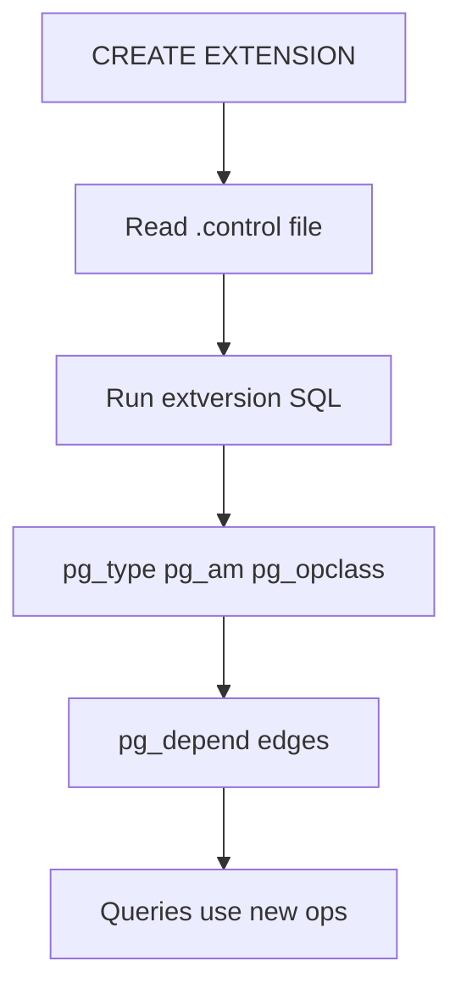
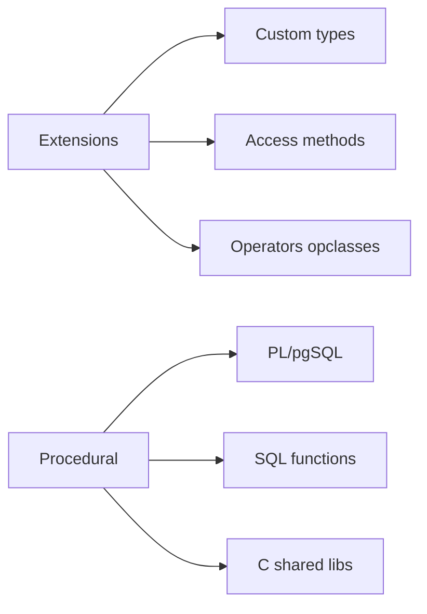
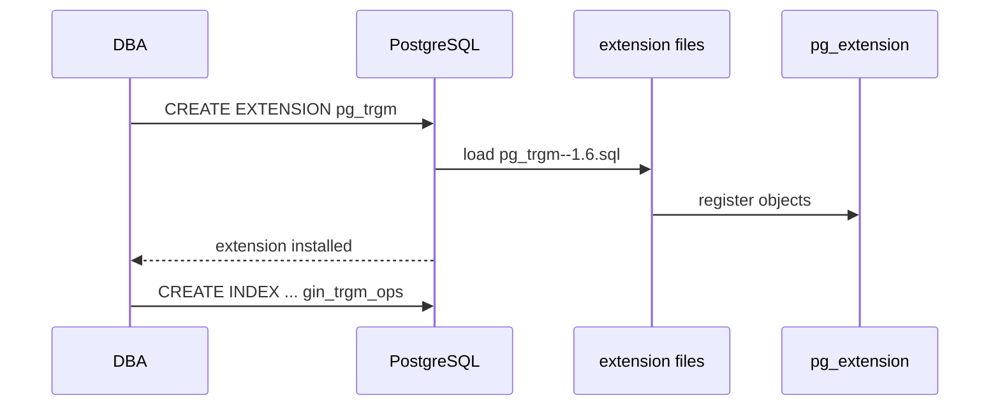

# Extensions and Procedural Surfaces Concepts

## Overview

PostgreSQL **extensions** package optional engine capabilities—types, operators, index access methods, background workers—into installable units via `CREATE EXTENSION`. **Procedural surfaces** (PL/pgSQL, SQL functions, trusted/untrusted languages) let you run logic **inside** the database process with shared memory and catalog access.

This note covers **engine-level** extension mechanics and when in-DB logic is appropriate—not application business logic that belongs in [[07-Backend/README|Backend]] services.

## Learning Objectives

- Explain extension packaging: control file, scripts, `pg_extension` catalog rows
- Distinguish trusted vs untrusted procedural languages
- Recognize common extensions (`pg_trgm`, `citext`, `pgcrypto`) and their engine hooks
- Assess security and upgrade implications of C extensions
- Decide when functions belong in Postgres vs application tier

## Prerequisites

- [[08-Databases/08-PostgreSQL-Engine/Catalogs System Tables and Types|Catalogs System Tables and Types]]
- [[08-Databases/03-Indexing-on-Disk/GIN GiST and Bitmap Index Concepts|GIN GiST and Bitmap Index Concepts]]

## Difficulty

`advanced`

## Estimated Time

- Reading: 2 hours
- Exercises: 2.5 hours
- Mini project: 4 hours

## History

Extensions formalized what were ad hoc `contrib/` modules. PostGIS and pgvector popularized **domain-specific index access methods** inside Postgres rather than external search engines for many workloads—at the cost of operational complexity.

## Problem It Solves

- **Repeated complex SQL** without portable application deployment
- **Missing index types** (trigram, GiST geo) for specialized queries
- **Crypto/hashing at data layer** with single round-trip
- **Consistent migration** of optional engine features across environments

## Internal Implementation

Extension install flow:

1. Read `EXTENSION.control` (name, default_version, relocatable)
2. Run versioned SQL scripts registering types/operators/opclasses
3. Insert `pg_extension` row linking dependent objects via `pg_depend`



Procedural languages register handlers in `pg_language`. PL/pgSQL compiles to executor steps; C functions link as shared libraries in `libdir`.

## Mermaid Diagrams

### Structure



### Sequence / Lifecycle — CREATE EXTENSION



## Examples

### Minimal Example — trigram extension for fuzzy search

```sql
CREATE EXTENSION IF NOT EXISTS pg_trgm;

CREATE TABLE products (id bigint PRIMARY KEY, name text NOT NULL);
CREATE INDEX products_name_trgm ON products USING gin (name gin_trgm_ops);

SELECT id, name, similarity(name, 'wireles keybord') AS score
FROM products
WHERE name % 'wireles keybord'
ORDER BY score DESC
LIMIT 10;
```

### Production-Shaped Example — guarded extension bootstrap in migration

```typescript
// Node 20+ — idempotent extension install with privilege check
import pg from "pg";

const ALLOWED_EXTENSIONS = new Set(["pg_trgm", "citext", "pgcrypto"]);

export async function ensureExtensions(
  pool: pg.Pool,
  names: string[],
): Promise<void> {
  for (const name of names) {
    if (!ALLOWED_EXTENSIONS.has(name)) {
      throw new Error(`Extension not allowlisted: ${name}`);
    }
  }
  const client = await pool.connect();
  try {
    await client.query("BEGIN");
    for (const name of names) {
      await client.query(`CREATE EXTENSION IF NOT EXISTS ${name}`);
    }
    await client.query("COMMIT");
  } catch (e) {
    await client.query("ROLLBACK");
    throw e;
  } finally {
    client.release();
  }
}
```

PL/pgSQL function for atomic inventory decrement:

```sql
CREATE OR REPLACE FUNCTION reserve_stock(p_sku text, p_qty int)
RETURNS boolean
LANGUAGE plpgsql
AS $$
DECLARE
  current int;
BEGIN
  SELECT quantity INTO current
  FROM inventory
  WHERE sku = p_sku
  FOR UPDATE;

  IF current IS NULL OR current < p_qty THEN
    RETURN false;
  END IF;

  UPDATE inventory SET quantity = quantity - p_qty WHERE sku = p_sku;
  RETURN true;
END;
$$;
```

## Trade-offs

| Dimension | Upside | Downside | When it matters |
| --- | --- | --- | --- |
| Extensions | Engine-native features | Upgrade coupling | search/geo |
| PL/pgSQL | Low latency; atomic | Hard to test/version | hot financial rules |
| C extensions | Maximum performance | Supply-chain risk | custom AM |
| In-DB logic | Single round-trip | Blurs service boundaries | small teams |

### When to Use

- Extensions for index types and operators Postgres lacks natively
- PL/pgSQL for short transactional primitives colocated with data
- `pgcrypto` for hashing at rest when policy requires DB-side transforms

### When Not to Use

- Do not put orchestration, HTTP calls, or cache-aside in PL/pgSQL
- Do not install untrusted extensions from unknown sources

## Exercises

1. Install `citext`; compare query plans for case-insensitive equality vs `lower(col)`.
2. List all objects owned by an extension via `pg_depend`.
3. Write PL/pgSQL function with `FOR UPDATE`—explain lock scope.
4. Simulate extension upgrade path (`ALTER EXTENSION ... UPDATE`).
5. Document allowlist policy for extensions in a production cluster.

## Mini Project

**Extension manifest linter.** Parse migration SQL for `CREATE EXTENSION` and validate against team allowlist + version pins.

## Portfolio Project

Extension compatibility matrix in [[08-Databases/projects/Database Engines Workbench/README|Database Engines Workbench]].

## Interview Questions

1. What does `CREATE EXTENSION` do internally?
2. Difference between SQL and PL/pgSQL functions for performance?
3. Why are C extensions a security concern?
4. Name an extension that adds a new index access method.
5. When should business logic live in application vs database?

### Stretch / Staff-Level

1. Explain relocatable vs non-relocatable extensions.
2. How does PostGIS hook into GiST opclasses?

## Common Mistakes

- Installing extensions manually in prod without migration tracking
- Using PL/pgSQL for I/O-heavy workflows better in Backend
- Trigram index without understanding `%` vs `LIKE` cost
- Upgrading Postgres major without checking extension compatibility

## Best Practices

- Pin extension versions in migrations; test upgrades on staging
- Allowlist extensions; restrict `CREATE` to migration role
- Keep functions small, deterministic, and covered by SQL tests
- Defer cache-aside and outbox patterns to [[07-Backend/README|Backend]]

## Summary

Extensions extend Postgres **inside the engine process**—new types, operators, and index methods registered in catalogs. Procedural languages run transactional logic with direct heap access, which is powerful but operationally coupled. Use extensions for engine capabilities you cannot replicate safely in app code; defer service orchestration and caching patterns to Backend.

## Further Reading

- [[00-References/Databases/README|Databases References]]
- PostgreSQL Extensions documentation
- PL/pgSQL guide

## Related Notes

- [[08-Databases/08-PostgreSQL-Engine/Catalogs System Tables and Types|Catalogs System Tables and Types]]
- [[08-Databases/03-Indexing-on-Disk/GIN GiST and Bitmap Index Concepts|GIN GiST and Bitmap Index Concepts]]
- [[08-Databases/08-PostgreSQL-Engine/Online DDL Costs vs Migration Process|Online DDL Costs vs Migration Process]]
- [[07-Backend/08-Data-Access-and-Persistence-Patterns/Handing Off to Database Engines|Handing Off to Database Engines]]

## Progress Checklist

- [ ] Explained from first principles
- [ ] Drew at least one Mermaid diagram
- [ ] Implemented a minimal version
- [ ] Documented trade-offs and non-goals
- [ ] Completed exercises
- [ ] Practiced interview questions aloud
- [ ] Linked prerequisites and dependents
