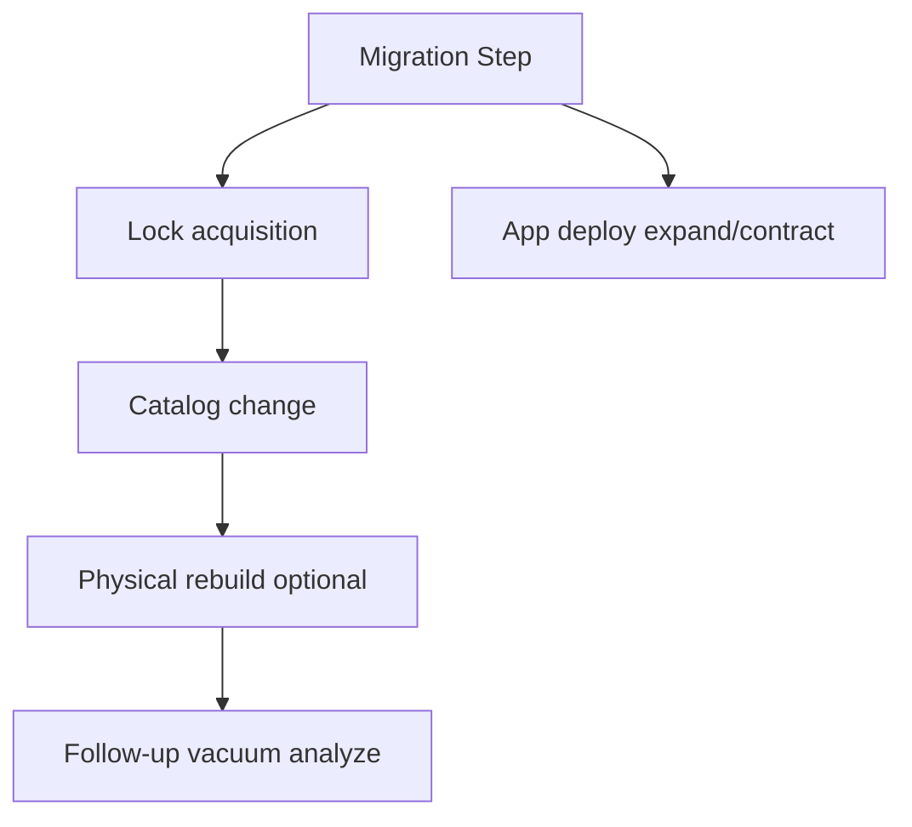
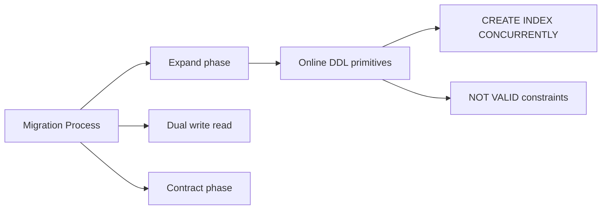
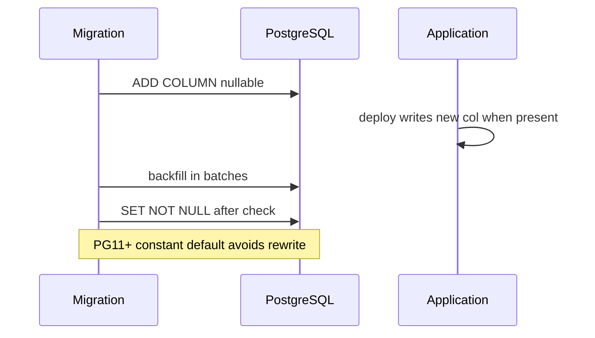

# Online DDL Costs vs Migration Process

## Overview

**DDL** (Data Definition Language) mutates catalogs and physical structures—tables, indexes, columns, constraints. In PostgreSQL, many DDL operations require **locks** that block or are blocked by DML. **Online** variants (e.g., `CREATE INDEX CONCURRENTLY`, `VALIDATE CONSTRAINT`) reduce outage risk at the cost of **longer duration**, **more IO**, and **failure modes** requiring cleanup.

This note connects **engine lock behavior** to **migration process** design—not ORM migration UX, which lives in [[07-Backend/README|Backend]].

## Learning Objectives

- Classify DDL by lock level: ACCESS EXCLUSIVE vs SHARE UPDATE EXCLUSIVE
- Plan expand/contract migrations for zero-downtime column changes
- Use `CREATE INDEX CONCURRENTLY` and `NOT VALID` constraints safely
- Estimate IO and vacuum impact of table rewrites (`ALTER TABLE ... TYPE`)
- Recognize when external tools (pg_repack, logical replication cutover) are required

## Prerequisites

- [[08-Databases/08-PostgreSQL-Engine/Constraints as Engine Invariants|Constraints as Engine Invariants]]
- [[08-Databases/08-PostgreSQL-Engine/PostgreSQL MVCC and Autovacuum|PostgreSQL MVCC and Autovacuum]]

## Difficulty

`advanced`

## Estimated Time

- Reading: 2.5 hours
- Exercises: 3 hours
- Mini project: 5 hours

## History

Early Postgres migrations implied maintenance windows. `CREATE INDEX CONCURRENTLY` (8.2+) and expand/contract patterns from large SaaS migrations shaped modern **continuous deployment** schema evolution without stopping traffic.

## Problem It Solves

- **Production deploy blocked** by `ACCESS EXCLUSIVE` lock on hot table
- **Failed CONCURRENTLY** leaving invalid index requiring `REINDEX`
- **Column type change** rewriting entire table unexpectedly
- **Long FK validation** blocking writes without `NOT VALID` staging

## Internal Implementation

Lock hierarchy (simplified operational view):

| Operation | Typical lock | Blocks writes? |
| --- | --- | --- |
| `CREATE INDEX` | SHARE | reads ok; blocks writes |
| `CREATE INDEX CONCURRENTLY` | SHARE UPDATE EXCLUSIVE | mostly online |
| `ADD COLUMN` default NULL | brief | minimal |
| `ADD COLUMN` with volatile default (pre-PG11) | rewrite | heavy |
| `ALTER TYPE` | ACCESS EXCLUSIVE | full block |
| `VALIDATE CONSTRAINT` | SHARE UPDATE EXCLUSIVE | brief validation scan |



**Expand/contract** pattern: add new column/index → dual-write/dual-read in app → backfill → switch reads → drop old—coordinates engine capabilities with deploy sequencing.

## Mermaid Diagrams

### Structure



### Sequence / Lifecycle — add non-null column online



## Examples

### Minimal Example — concurrent index lifecycle

```sql
-- PostgreSQL 15+
CREATE INDEX CONCURRENTLY idx_orders_customer
  ON orders (customer_id);

-- If build fails:
-- DROP INDEX CONCURRENTLY idx_orders_customer;
-- or REINDEX INDEX CONCURRENTLY idx_orders_customer;

SELECT indexrelid::regclass, indisvalid, indisready
FROM pg_index
JOIN pg_class ON pg_class.oid = indexrelid
WHERE relname = 'idx_orders_customer';
```

Safe FK add on large table:

```sql
ALTER TABLE orders
  ADD CONSTRAINT orders_customer_fk
  FOREIGN KEY (customer_id) REFERENCES customers(id)
  NOT VALID;

ALTER TABLE orders VALIDATE CONSTRAINT orders_customer_fk;
```

### Production-Shaped Example — batched backfill with statement timeout

```typescript
// Node 20+ — batched backfill avoiding long locks
import pg from "pg";

export async function backfillOrdersTier(
  pool: pg.Pool,
  batchSize = 5000,
): Promise<void> {
  for (;;) {
    const client = await pool.connect();
    try {
      await client.query("SET statement_timeout = '30s'");
      await client.query("BEGIN");
      const { rowCount } = await client.query(`
        WITH batch AS (
          SELECT id FROM orders
          WHERE tier IS NULL
          ORDER BY id
          LIMIT $1
          FOR UPDATE SKIP LOCKED
        )
        UPDATE orders o
        SET tier = CASE WHEN total_cents > 100000 THEN 'enterprise' ELSE 'standard' END
        FROM batch b
        WHERE o.id = b.id
      `, [batchSize]);
      await client.query("COMMIT");
      if (!rowCount) break;
      console.log(JSON.stringify({ event: "backfill_batch", rows: rowCount }));
    } catch (e) {
      await client.query("ROLLBACK");
      throw e;
    } finally {
      client.release();
    }
  }
}
```

## Trade-offs

| Dimension | Upside | Downside | When it matters |
| --- | --- | --- | --- |
| CONCURRENTLY | Keeps serving traffic | 2x index build work | large tables |
| NOT VALID FK | Fast add | Invalid until validate | billion-row FK |
| Expand/contract | True zero downtime | App complexity | column renames |
| Table rewrite DDL | Simple mental model | Hours of lock/IO | small tables only |

### When to Use

- `CREATE INDEX CONCURRENTLY` on production tables with writes
- Expand/contract for rename/type semantic changes
- Batch backfills with `SKIP LOCKED` and statement timeouts

### When Not to Use

- Do not use plain `CREATE INDEX` on multi-TB hot tables without window
- Do not `VALIDATE CONSTRAINT` during peak without monitoring

## Exercises

1. Measure lock wait from `ALTER TABLE ... ADD COLUMN` with default on PG15 vs legacy behavior (documented).
2. Intentionally fail `CREATE INDEX CONCURRENTLY`; clean up invalid index.
3. Write expand/contract plan for renaming `email` → `contact_email`.
4. Map each migration in a sample repo to lock level using Postgres docs.
5. Estimate disk space for concurrent index build on 100GB table.

## Mini Project

**Migration lock simulator.** Run DDL against table with concurrent pgbench; capture `pg_locks` wait events.

## Portfolio Project

Online migration playbook in [[08-Databases/projects/Database Engines Workbench/README|Database Engines Workbench]].

## Interview Questions

1. What lock does `CREATE INDEX CONCURRENTLY` take?
2. How does expand/contract avoid renaming column under load?
3. Purpose of `NOT VALID` on foreign keys?
4. Why can failed concurrent index leave invalid index?
5. When is table rewrite unavoidable?

### Stretch / Staff-Level

1. Compare logical replication cutover vs pg_repack for cluster resize.
2. Explain `ACCESS EXCLUSIVE` queue blocking behind long SELECT.

## Common Mistakes

- Running blocking DDL during peak without `lock_timeout`
- Deploying app expecting new column before migration completes
- Forgetting `ANALYZE` after large index build
- Using `CONCURRENTLY` inside a transaction block (not allowed)

## Best Practices

- Set `lock_timeout` and `statement_timeout` on migration sessions
- One concurrent index build per table at a time
- Monitor `pg_stat_progress_create_index`
- Coordinate deploy order with [[07-Backend/08-Data-Access-and-Persistence-Patterns/Transactions as Used by Services|Transactions as Used by Services]]

## Summary

Online DDL in Postgres is a **trade-off catalog**: CONCURRENTLY and NOT VALID reduce blocking but increase duration and operational sharp edges. Real zero-downtime schema change pairs engine primitives with **expand/contract** application deploys. Treat every DDL as lock + IO + vacuum story—not a metadata-only toggle.

## Further Reading

- [[00-References/Databases/README|Databases References]]
- PostgreSQL DDL lock documentation
- Strong Migrations / expand-contract guides

## Related Notes

- [[08-Databases/08-PostgreSQL-Engine/Constraints as Engine Invariants|Constraints as Engine Invariants]]
- [[08-Databases/08-PostgreSQL-Engine/PostgreSQL MVCC and Autovacuum|PostgreSQL MVCC and Autovacuum]]
- [[08-Databases/03-Indexing-on-Disk/Secondary Covering and Partial Indexes|Secondary Covering and Partial Indexes]]
- [[08-Databases/12-Production-Database-Ops/Operational Readiness for Database Engines|Operational Readiness for Database Engines]]

## Progress Checklist

- [ ] Explained from first principles
- [ ] Drew at least one Mermaid diagram
- [ ] Implemented a minimal version
- [ ] Documented trade-offs and non-goals
- [ ] Completed exercises
- [ ] Practiced interview questions aloud
- [ ] Linked prerequisites and dependents
