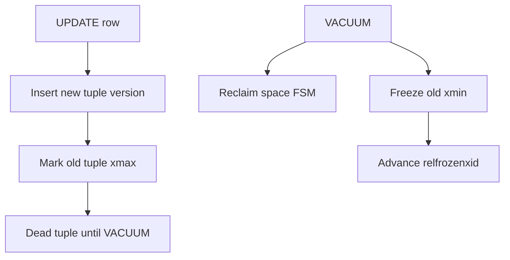
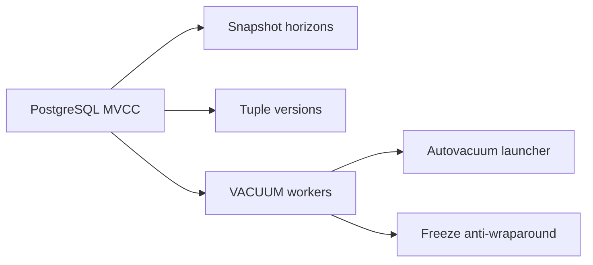
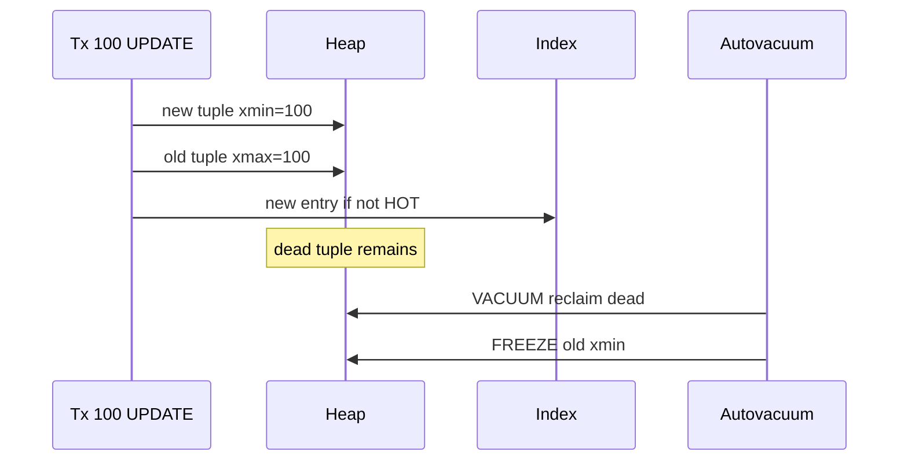

# PostgreSQL MVCC and Autovacuum

## Overview

PostgreSQL implements multi-version concurrency control (MVCC) by storing **multiple row versions** in heap pages, tagged with **transaction IDs** (`xmin`, `xmax`) and **hint bits**. Readers take **snapshots** and never block writers; writers create new tuple versions. **VACUUM** (often via **autovacuum**) reclaims dead tuple space and advances **freeze horizons** to prevent XID wraparound.

This note focuses on **Postgres-specific** MVCC mechanics and autovacuum tuning—not generic isolation theory covered in [[08-Databases/05-Transactions-and-Isolation/Snapshot Isolation and SSI Concepts|Snapshot Isolation and SSI Concepts]].

## Learning Objectives

- Explain tuple visibility using `xmin`, `xmax`, and snapshot horizons
- Relate UPDATE/DELETE to version chains and index pointers
- Configure autovacuum triggers for high-churn tables
- Diagnose bloat and wraparound risk from catalog views
- Connect long transactions to vacuum blockage and table growth

## Prerequisites

- [[08-Databases/05-Transactions-and-Isolation/Locking vs MVCC|Locking vs MVCC]]
- [[08-Databases/06-Concurrency-Internals/Vacuum Version GC and Bloat|Vacuum Version GC and Bloat]]

## Difficulty

`advanced`

## Estimated Time

- Reading: 2.5 hours
- Exercises: 3 hours
- Mini project: 4 hours

## History

Postgres chose MVCC over in-place locking updates to maximize read concurrency on OLTP workloads. Autovacuum evolved from manual DBA scripts to default background workers as ORMs increased update/delete churn without corresponding vacuum discipline.

## Problem It Solves

- **Table bloat** from dead tuples never reclaimed
- **Transaction id wraparound** emergencies blocking all writes
- **Index bloat** when HOT updates cannot apply
- **Autovacuum never keeping up** on hot tables due to mis-tuned cost delay

## Internal Implementation

Each heap tuple carries:

| Field | Meaning |
| --- | --- |
| `xmin` | Inserting transaction ID |
| `xmax` | Deleting/updating transaction ID (0 if live) |
| `ctid` | Physical location; UPDATE chains via `(page, slot)` |
| Hint bits | Cached commit status to avoid CLOG lookups |

Visibility rule (simplified): a tuple is visible to snapshot S if `xmin` committed before S and (`xmax` is null OR aborted OR transaction after S).



**HOT updates** (Heap-Only Tuple): when updated columns are not indexed and space exists on same page, Postgres avoids new index entries—critical for update-heavy indexed tables.

Autovacuum launcher schedules workers based on `autovacuum_vacuum_threshold`, scale factors, and anti-wraparound urgency.

## Mermaid Diagrams

### Structure



### Sequence / Lifecycle — UPDATE and vacuum



## Examples

### Minimal Example — observe version churn

```sql
-- PostgreSQL 15+ — run in repeatable read to hold snapshot
CREATE TABLE accounts (id int PRIMARY KEY, balance numeric);
INSERT INTO accounts VALUES (1, 100.00);

-- Session A
BEGIN ISOLATION LEVEL REPEATABLE READ;
SELECT * FROM accounts WHERE id = 1;  -- balance 100

-- Session B
UPDATE accounts SET balance = 150.00 WHERE id = 1;

-- Session A still sees 100; Session B sees 150
SELECT xmin, xmax, ctid, balance FROM accounts WHERE id = 1;
```

### Production-Shaped Example — autovacuum monitoring query

```typescript
// Node 20+ — export bloat + wraparound signals to metrics
import pg from "pg";

export async function collectVacuumHealth(pool: pg.Pool) {
  const sql = `
    SELECT c.relname,
           age(c.relfrozenxid) AS xid_age,
           pg_stat_get_live_tuples(c.oid) AS live,
           pg_stat_get_dead_tuples(c.oid) AS dead,
           s.last_autovacuum,
           s.n_dead_tup
    FROM pg_class c
    JOIN pg_namespace n ON n.oid = c.relnamespace
    LEFT JOIN pg_stat_user_tables s ON s.relid = c.oid
    WHERE n.nspname = 'public'
      AND c.relkind = 'r'
    ORDER BY n_dead_tup DESC
    LIMIT 20
  `;
  const { rows } = await pool.query(sql);
  for (const row of rows) {
    console.log(JSON.stringify({
      metric: "pg_table_vacuum_health",
      table: row.relname,
      xid_age: Number(row.xid_age),
      dead_tuples: Number(row.dead),
      last_autovacuum: row.last_autovacuum,
    }));
  }
  return rows;
}
```

Per-table autovacuum tuning example:

```sql
ALTER TABLE event_log SET (
  autovacuum_vacuum_scale_factor = 0.02,
  autovacuum_vacuum_cost_delay = 2,
  autovacuum_vacuum_cost_limit = 1000
);
```

## Trade-offs

| Dimension | Upside | Downside | When it matters |
| --- | --- | --- | --- |
| MVCC reads | Readers don't block writers | Storage for versions | read-heavy OLTP |
| UPDATE model | Simple isolation story | Index bloat without HOT | high update rate |
| Autovacuum | Automatic reclamation | IO spikes; tuning needed | 24/7 services |
| Aggressive freeze | Prevents wraparound | Extra vacuum work | old clusters |

### When to Use

- Default MVCC for mixed read/write OLTP on Postgres
- Per-table autovacuum settings for append-only vs churn-heavy tables
- Monitor `n_dead_tup` and `age(relfrozenxid)` in production

### When Not to Use

- Do not disable autovacuum globally—wraparound is catastrophic
- Do not run long idle transactions in REPEATABLE READ on busy tables

## Exercises

1. Demonstrate REPEATABLE READ snapshot blocking vacuum reclaim (conceptually via `pg_stat_activity`).
2. Update a non-indexed column repeatedly; verify HOT updates via `pageinspect` if available.
3. Simulate autovacuum lag: bulk DELETE 50% rows; watch `n_dead_tup`.
4. Explain when `xmax` is set vs cleared for DELETE vs UPDATE.
5. Draft alert thresholds for `xid_age` on production Postgres.

## Mini Project

**Churn lab.** Script that UPDATEs rows in a loop while measuring table size and dead tuples; tune autovacuum until dead tuple plateau stabilizes.

## Portfolio Project

Vacuum/bloat dashboard panel in [[08-Databases/projects/Database Engines Workbench/README|Database Engines Workbench]].

## Interview Questions

1. How does PostgreSQL implement MVCC at the tuple level?
2. What do `xmin` and `xmax` represent?
3. Why do tables grow after heavy UPDATE/DELETE without vacuum?
4. What triggers autovacuum on a table?
5. What is transaction ID wraparound and how does freeze prevent it?

### Stretch / Staff-Level

1. Explain HOT update conditions and when they fail.
2. How does `old_snapshot_threshold` interact with long snapshots?

## Common Mistakes

- Treating VACUUM as optional maintenance
- One-size autovacuum settings for append-only and hot-row tables alike
- Long ORM sessions holding snapshots open
- Confusing `VACUUM FULL` (rewrite, locks) with regular `VACUUM`

## Best Practices

- Index only columns that appear in WHERE/JOIN—reduce UPDATE index pressure
- Set `idle_in_transaction_session_timeout` in production
- Monitor dead tuples and autovacuum duration per table
- Pair with [[08-Databases/06-Concurrency-Internals/Long Transactions and Snapshot Horizons|Long Transactions and Snapshot Horizons]]

## Summary

PostgreSQL MVCC keeps readers fast by retaining dead row versions until vacuum reclaims them. UPDATE is insert-new + mark-old-dead, not in-place overwrite. Autovacuum is not housekeeping—it is **correctness infrastructure** preventing bloat and XID wraparound. Production Postgres health requires tuning vacuum for churn patterns and eliminating long snapshots.

## Further Reading

- [[00-References/Databases/README|Databases References]]
- PostgreSQL MVCC documentation
- `pg_stat_user_tables` monitoring guides

## Related Notes

- [[08-Databases/06-Concurrency-Internals/Vacuum Version GC and Bloat|Vacuum Version GC and Bloat]]
- [[08-Databases/06-Concurrency-Internals/Long Transactions and Snapshot Horizons|Long Transactions and Snapshot Horizons]]
- [[08-Databases/05-Transactions-and-Isolation/Locking vs MVCC|Locking vs MVCC]]
- [[08-Databases/12-Production-Database-Ops/Monitoring Checkpoints Lag Bloat Cache Hit|Monitoring Checkpoints Lag Bloat Cache Hit]]

## Progress Checklist

- [ ] Explained from first principles
- [ ] Drew at least one Mermaid diagram
- [ ] Implemented a minimal version
- [ ] Documented trade-offs and non-goals
- [ ] Completed exercises
- [ ] Practiced interview questions aloud
- [ ] Linked prerequisites and dependents
