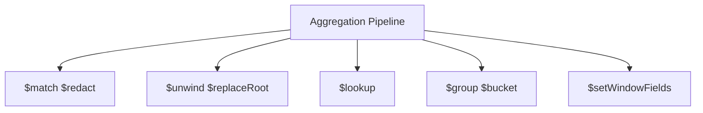
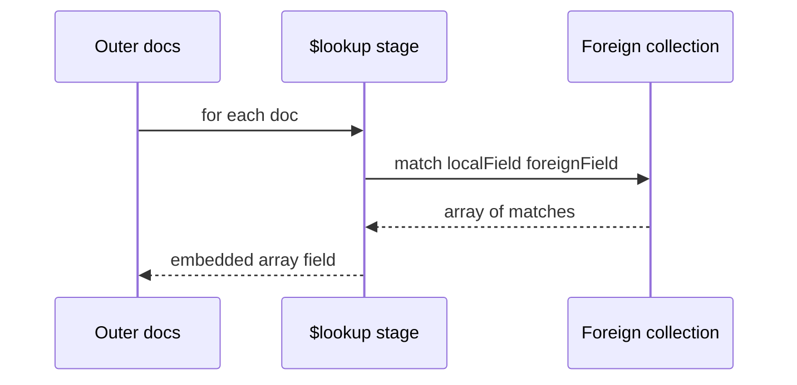

# Aggregation Pipeline as Execution

## Overview

MongoDB's **aggregation pipeline** is a staged computation model: each stage transforms a stream of documents (`$match`, `$group`, `$lookup`, `$sort`, `$project`, ...). The executor **pushes down** `$match` and `$sort` when indexes allow—similar in spirit to relational planner optimization but with **document-shaped** intermediates.

Understanding pipeline **order**, **memory limits**, and **spill to disk** is essential for analytics and operational reporting without exporting to a warehouse prematurely.

## Learning Objectives

- Describe stage-by-stage data flow and working set memory
- Push `$match` early and align with compound indexes
- Explain `$lookup` as nested loop join with cost profile
- Use `$facet`, `$bucket`, and window stages for reporting patterns
- Read `explain("executionStats")` on aggregation pipelines

## Prerequisites

- [[08-Databases/09-Document-Engines-MongoDB/Indexes on Documents and Multikey Behavior|Indexes on Documents and Multikey Behavior]]
- [[08-Databases/04-Query-Processing-and-Planning/Parse Bind Plan Execute Pipeline|Parse Bind Plan Execute Pipeline]]

## Difficulty

`advanced`

## Estimated Time

- Reading: 2.5 hours
- Exercises: 3 hours
- Mini project: 5 hours

## History

Aggregation framework replaced map/reduce for most server-side analytics. Stage additions (`$lookup` improvements, `$setWindowFields`) narrowed gaps with SQL GROUP BY and window functions while keeping document pipeline ergonomics.

## Problem It Solves

- **Full collection scan analytics** from `$match` placed after `$unwind`
- **100MB sort limit** errors on large `$group` outputs
- **N+1 `$lookup`** patterns blowing latency
- **Duplicate work** when `$project` could shrink documents early

## Internal Implementation

Pipeline execution model:


Optimizer behaviors (conceptual):

- **Index merge** for `$match` + `$sort` when index order matches
- **`allowDiskUse`** permits spill for large sorts/groups
- **`$lookup`** executes subpipeline per outer doc (correlated) unless `$lookup` with pipeline + index on foreign side

## Mermaid Diagrams

### Structure



### Sequence / Lifecycle — $lookup join



## Examples

### Minimal Example — revenue by day with index-friendly match

```javascript
db.orders.aggregate([
  { $match: { status: "paid", placedAt: { $gte: ISODate("2026-07-01") } } },
  { $project: { day: { $dateTrunc: { date: "$placedAt", unit: "day" } }, totalCents: 1 } },
  { $group: { _id: "$day", revenue: { $sum: "$totalCents" }, count: { $sum: 1 } } },
  { $sort: { _id: 1 } },
], { allowDiskUse: true });
```

### Production-Shaped Example — TypeScript aggregation with explain gate

```typescript
// Node 20+ — operational dashboard query with guardrails
import { MongoClient } from "mongodb";

export async function dailyRevenue(client: MongoClient, from: Date) {
  const col = client.db("shop").collection("orders");
  const pipeline = [
    { $match: { status: "paid", placedAt: { $gte: from } } },
    {
      $group: {
        _id: { $dateTrunc: { date: "$placedAt", unit: "day" } },
        revenueCents: { $sum: "$totalCents" },
        orders: { $sum: 1 },
      },
    },
    { $sort: { _id: 1 } },
    { $limit: 90 },
  ];

  const explain = await col.aggregate(pipeline).explain("executionStats");
  const examined = explain.stages?.[0]?.$cursor?.executionStats?.totalDocsExamined;
  if (examined && examined > 5_000_000) {
    throw new Error(`Aggregation examined too many docs: ${examined}`);
  }

  return col.aggregate(pipeline, { allowDiskUse: true }).toArray();
}
```

Efficient `$lookup` with indexed foreign key:

```javascript
db.orders.aggregate([
  { $match: { status: "paid" } },
  {
    $lookup: {
      from: "customers",
      localField: "customerId",
      foreignField: "_id",
      as: "customer",
    },
  },
  { $unwind: "$customer" },
  { $project: { orderId: "$_id", email: "$customer.email", totalCents: 1 } },
]);
```

## Trade-offs

| Dimension | Upside | Downside | When it matters |
| --- | --- | --- | --- |
| Pipeline | Composable server-side logic | Memory/spill complexity | dashboards |
| Early $match | Index use | Wrong order scans all | large collections |
| $lookup | SQL-like join in Mongo | Correlated cost | enrichment |
| allowDiskUse | Completes big sorts | Disk latency | ad hoc analytics |

### When to Use

- Server-side transforms reducing wire volume
- Reporting within Mongo when data fits working set with indexes
- `$facet` for multi-dimensional summaries in one round-trip

### When Not to Use

- Heavy cross-collection analytics → warehouse or Postgres
- Pipelines without `$match` index support on billion-doc collections

## Exercises

1. Move `$match` after `$unwind`; compare docs examined before/after fix.
2. Hit 100MB sort limit; enable `allowDiskUse`; observe spill metrics.
3. Rewrite `$lookup` to `$group` + `$merge` batch pattern for bulk jobs.
4. Add `$setWindowFields` running total per customer.
5. Explain pipeline with `explain()`—identify IXSCAN stage.

## Mini Project

**Pipeline linter.** Statically warn when `$match` follows `$group` or `$lookup` without indexed foreign field.

## Portfolio Project

Aggregation performance section in [[08-Databases/projects/Database Engines Workbench/README|Database Engines Workbench]].

## Interview Questions

1. Why should `$match` be as early as possible?
2. How does `$lookup` execute conceptually?
3. What does `allowDiskUse` enable?
4. Difference between `$group` and `$bucket`?
5. How do indexes interact with `$sort` stage?

### Stretch / Staff-Level

1. Explain `$lookup` pipeline syntax optimization vs classic local/foreign field.
2. When does aggregation use merge sort vs hash aggregation?

## Common Mistakes

- `$unwind` before `$match` on nested array field
- `$lookup` without index on foreignField at scale
- Returning full documents after `$group` without `$project`
- Running analytics on primary without read preference routing

## Best Practices

- Align `$match` + `$sort` with compound indexes (ESR)
- Cap result size; paginate with `$limit` + indexed sort key
- Use `$project` early to shrink documents
- For relational analytics at scale, see [[08-Databases/11-Modeling-and-Engine-Selection/PostgreSQL vs MongoDB vs Redis Decision Matrix|Decision Matrix]]

## Summary

Aggregation pipelines are MongoDB's **execution graph** for document transforms—stage order determines index use, memory, and join cost. Treat `$match` as planner input, `$lookup` as expensive join, and large sorts as spill candidates. Engine literacy prevents running map/reduce-era anti-patterns on modern clusters.

## Further Reading

- [[00-References/Databases/README|Databases References]]
- MongoDB Aggregation Pipeline documentation
- Pipeline optimization notes

## Related Notes

- [[08-Databases/09-Document-Engines-MongoDB/Indexes on Documents and Multikey Behavior|Indexes on Documents and Multikey Behavior]]
- [[08-Databases/04-Query-Processing-and-Planning/Join Algorithms Nested Loop Hash Merge|Join Algorithms Nested Loop Hash Merge]]
- [[08-Databases/04-Query-Processing-and-Planning/EXPLAIN and EXPLAIN ANALYZE Literacy|EXPLAIN and EXPLAIN ANALYZE Literacy]]
- [[08-Databases/09-Document-Engines-MongoDB/When Document Engines Win or Lose|When Document Engines Win or Lose]]

## Progress Checklist

- [ ] Explained from first principles
- [ ] Drew at least one Mermaid diagram
- [ ] Implemented a minimal version
- [ ] Documented trade-offs and non-goals
- [ ] Completed exercises
- [ ] Practiced interview questions aloud
- [ ] Linked prerequisites and dependents
