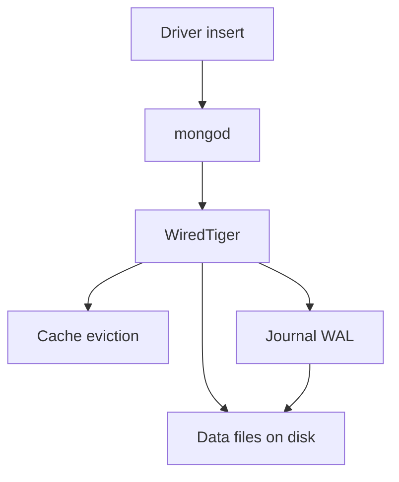
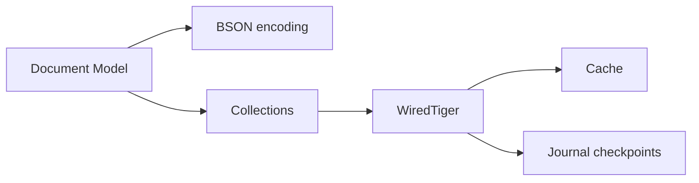
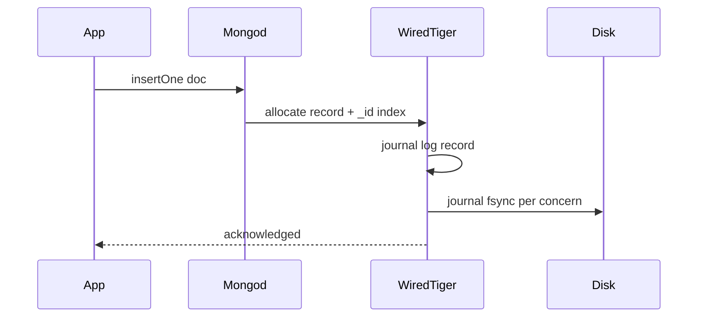

# Document Model and Storage Engines

## Overview

MongoDB stores **documents**—self-contained BSON records with nested fields and arrays—in **collections** without enforcing a global relational schema. The default **WiredTiger** storage engine organizes data in B-tree keyed by `_id`, with **document-level** locking, compression, and a **journal** for durability.

This note explains **engine-level** document layout and WiredTiger behavior—not driver/repository patterns in [[07-Backend/README|Backend]].

## Learning Objectives

- Describe BSON types, `_id` semantics, and document size limits
- Explain WiredTiger cache, checkpoints, and journal at engine level
- Contrast collection-per-entity vs embedded document modeling trade-offs
- Relate document growth to update rewrite and index maintenance
- Identify when schema flexibility helps vs when relational constraints win

## Prerequisites

- [[08-Databases/00-Orientation/Relational Document and KV Contracts|Relational Document and KV Contracts]]
- [[08-Databases/01-Storage-and-Buffer-Pool/Pages Blocks and IO Units|Pages Blocks and I/O Units]]

## Difficulty

`intermediate`

## Estimated Time

- Reading: 2 hours
- Exercises: 2.5 hours
- Mini project: 4 hours

## History

MongoDB began with mmapv1 (collection-level locking). WiredTiger (default since 3.2+) brought document-level concurrency, compression, and predictable cache management—aligning Mongo closer to mainstream storage engine design while keeping the document abstraction.

## Problem It Solves

- **Schema variance** across records without ALTER TABLE migrations
- **Nested aggregates** fetched in one round-trip vs multi-table joins
- **Horizontal document growth** for content/catalog use cases
- **Engine trade-off clarity** when teams choose Mongo for wrong reasons

## Internal Implementation

Document path:



WiredTiger essentials:

| Component | Role |
| --- | --- |
| Cache | In-memory btree pages; dirty eviction |
| Journal | Sequential WAL; fsync policy via write concern |
| Checkpoints | Periodic consistent snapshots to data files |
| Compression | snappy/zstd on pages |

Documents live in **records** addressed by `_id` index (default unique B-tree). Large docs may move on update if record space insufficient—similar rewrite costs to Postgres heap updates.

## Mermaid Diagrams

### Structure



### Sequence / Lifecycle  Einsert document



## Examples

### Minimal Example  EBSON types and document limits

```javascript
// mongosh  EMongoDB 6+
db.products.insertOne({
  _id: ObjectId(),
  sku: "KB-001",
  name: "Mechanical Keyboard",
  tags: ["mechanical", "rgb"],
  specs: { switches: "brown", layout: "ISO" },
  price: NumberDecimal("129.99"),
  createdAt: ISODate(),
});
// Max document size: 16 MB
```

### Production-Shaped Example  ETypeScript insert with schema validation at engine

```typescript
// Node 20+ / mongodb driver 6.x
import { MongoClient, ObjectId } from "mongodb";

const client = new MongoClient(process.env.MONGODB_URI!);
await client.connect();
const db = client.db("shop");

await db.createCollection("orders", {
  validator: {
    $jsonSchema: {
      bsonType: "object",
      required: ["customerId", "lines", "totalCents"],
      properties: {
        customerId: { bsonType: "objectId" },
        totalCents: { bsonType: "int", minimum: 0 },
        lines: {
          bsonType: "array",
          minItems: 1,
          items: {
            bsonType: "object",
            required: ["sku", "qty"],
          },
        },
      },
    },
  },
  validationLevel: "moderate", // existing docs not revalidated on read
});

await db.collection("orders").insertOne({
  _id: new ObjectId(),
  customerId: new ObjectId(),
  totalCents: 4999,
  lines: [{ sku: "KB-001", qty: 1 }],
});
```

## Trade-offs

| Dimension | Upside | Downside | When it matters |
| --- | --- | --- | --- |
| Flexible schema | Fast iteration | Drift without discipline | early product |
| Embedding | Single read | Document bloat; write amplification | order lines |
| WiredTiger cache | Predictable tuning | RAM sizing critical | production clusters |
| No joins (classic) | Simple sharding story | $lookup cost | analytics |

### When to Use

- Documents map naturally to aggregate roots (order + lines)
- Schema evolves frequently with acceptable validation rules
- Workload fits document access paths with indexes

### When Not to Use

- Heavy multi-entity constraints and reporting joins ↁEPostgres
- Financial ledger requiring strict relational invariants without app discipline

## Exercises

1. Model `user + addresses` embedded vs referenced—size and read/write trade-offs.
2. Insert document hitting 16MB limit—observe error.
3. Explain WiredTiger cache vs MongoDB "wiredTigerCacheSizeGB".
4. Compare `NumberDecimal` vs double for money fields.
5. Draw document update path when embedded array grows unbounded.

## Mini Project

**Collection profiler.** Script comparing embedded vs referenced fetch patterns with `explain()` execution stats.

## Portfolio Project

Document modeling case study in [[08-Databases/projects/Database Engines Workbench/README|Database Engines Workbench]].

## Interview Questions

1. What is BSON and how does it differ from JSON?
2. Default storage engine in modern MongoDB and its key features?
3. Why is `_id` indexed automatically?
4. Document size limit and implications for embedding?
5. WiredTiger journal vs checkpoint—roles?

### Stretch / Staff-Level

1. Explain document move on update in WiredTiger record store.
2. When does schema validation at collection level fail moderate vs strict?

## Common Mistakes

- Unbounded embedded arrays causing 16MB breaches and hot document rewrites
- Using float for currency
- Treating Mongo as "schemaless" in production without validation
- Ignoring cache sizing on dedicated nodes

## Best Practices

- Define `_id` strategy (ObjectId vs UUID) up front
- Use `$jsonSchema` validation for production collections
- Monitor average document size and index size ratio
- Cross-read [[08-Databases/09-Document-Engines-MongoDB/When Document Engines Win or Lose|When Document Engines Win or Lose]]

## Summary

MongoDB's document model trades relational rigidity for **aggregate-oriented storage** in BSON collections. WiredTiger provides cache, journal, and B-tree persistence familiar from other engines—but access patterns still dominate performance. Engine literacy means knowing rewrite costs, size limits, and when flexibility becomes schema debt.

## Further Reading

- [[00-References/Databases/README|Databases References]]
- MongoDB WiredTiger storage engine documentation
- BSON specification

## Related Notes

- [[08-Databases/09-Document-Engines-MongoDB/Indexes on Documents and Multikey Behavior|Indexes on Documents and Multikey Behavior]]
- [[08-Databases/09-Document-Engines-MongoDB/Write Concern and Journaling Mechanics|Write Concern and Journaling Mechanics]]
- [[08-Databases/02-WAL-Durability-and-Recovery/Write-Ahead Logging Protocol|Write-Ahead Logging Protocol]]
- [[08-Databases/00-Orientation/Relational Document and KV Contracts|Relational Document and KV Contracts]]

## Progress Checklist

- [ ] Explained from first principles
- [ ] Drew at least one Mermaid diagram
- [ ] Implemented a minimal version
- [ ] Documented trade-offs and non-goals
- [ ] Completed exercises
- [ ] Practiced interview questions aloud
- [ ] Linked prerequisites and dependents
