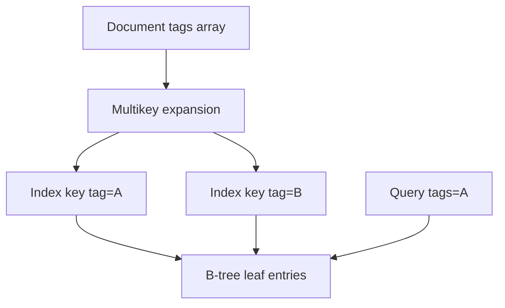
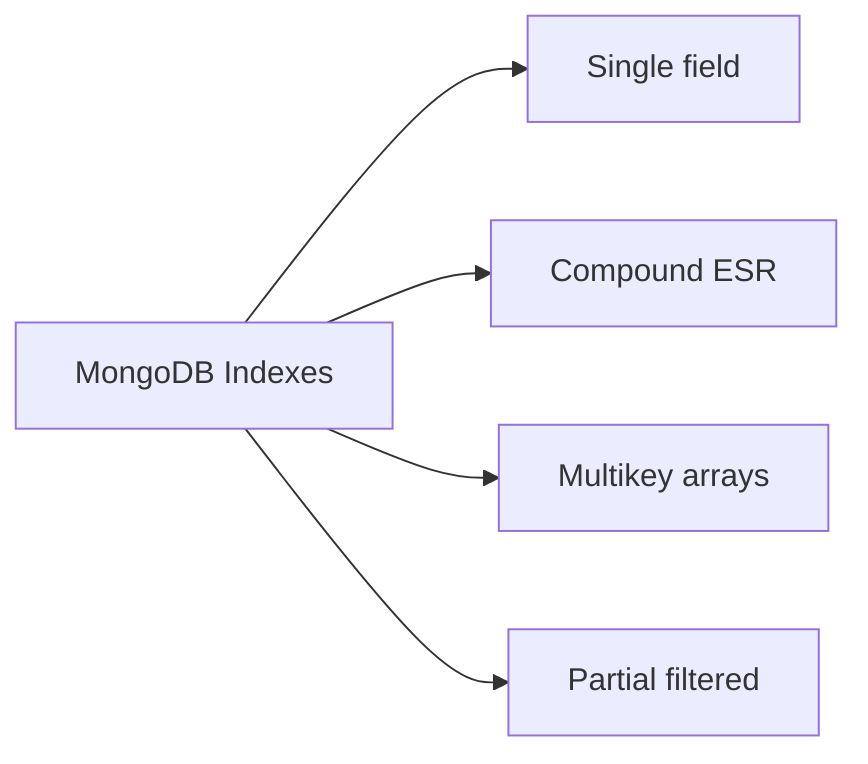
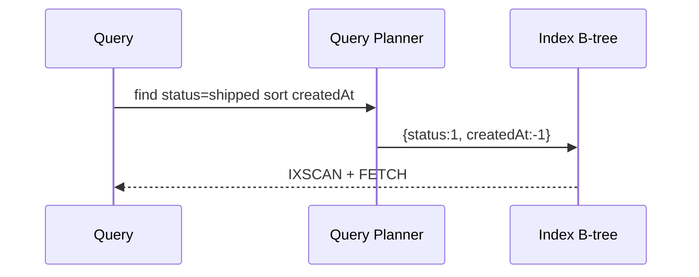

# Indexes on Documents and Multikey Behavior

## Overview

MongoDB indexes are **B-tree** structures over field paths in documents. When an indexed field is an **array**, the index becomes **multikey**: one index entry per array element, which affects uniqueness, compound index bounds, and write amplification.

Designing indexes on documents requires understanding **multikey rules**, **ESR (Equality, Sort, Range)** compound ordering, and **partial/filtered** indexes—engine concepts distinct from ORM index hints in Backend.

## Learning Objectives

- Explain multikey index creation and uniqueness constraints
- Apply ESR rule to compound index field order
- Use covered queries and index intersection limitations
- Diagnose COLLSCAN vs IXSCAN with `explain("executionStats")`
- Predict write cost when indexing high-cardinality array fields

## Prerequisites

- [[08-Databases/09-Document-Engines-MongoDB/Document Model and Storage Engines|Document Model and Storage Engines]]
- [[08-Databases/03-Indexing-on-Disk/B-Plus Trees as Page Structures|B-Plus Trees as Page Structures]]

## Difficulty

`intermediate`

## Estimated Time

- Reading: 2 hours
- Exercises: 3 hours
- Mini project: 4 hours

## History

Multikey indexing existed from early Mongo to support tag arrays and facets. Compound index rules evolved as aggregation pipelines and sort stages exposed index mismatch costs—leading to community ESR guidance formalized in MongoDB docs.

## Problem It Solves

- **Collection scans** on growing collections
- **Failed unique indexes** on array fields
- **Sort memory limits** when index order mismatches query
- **Index explosion** from indexing every nested array element

## Internal Implementation

Multikey mechanics:

- Array field → index keys `(doc_id, each_element_value)`
- Compound index: **at most one** array field across indexed paths (multikey limitation)
- Unique index cannot enforce uniqueness across array expansions the way developers expect



Index types: single, compound, multikey, text, geospatial (2dsphere), hashed (`_id` default).

## Mermaid Diagrams

### Structure



### Sequence / Lifecycle — query index selection



## Examples

### Minimal Example — multikey and compound

```javascript
// mongosh
db.events.createIndex({ userId: 1, tags: 1 }); // tags multikey
db.events.createIndex({ status: 1, createdAt: -1 }); // ESR: equality + sort

db.events.find({ status: "open", createdAt: { $gte: ISODate("2026-01-01") } })
  .sort({ createdAt: -1 })
  .explain("executionStats");
```

Partial index for hot subset:

```javascript
db.orders.createIndex(
  { customerId: 1, placedAt: -1 },
  { partialFilterExpression: { status: { $in: ["pending", "paid"] } } }
);
```

### Production-Shaped Example — index guard in TypeScript migration

```typescript
// Node 20+ — ensure compound index exists before deploy
import { MongoClient } from "mongodb";

export async function ensureOrderIndex(client: MongoClient): Promise<void> {
  const col = client.db("shop").collection("orders");
  const indexes = await col.indexes();
  const has = indexes.some(
    (i) => i.key.status === 1 && i.key.placedAt === -1 && i.name !== "_id_",
  );
  if (!has) {
    await col.createIndex({ status: 1, placedAt: -1 }, { background: true });
  }
}

// Explain helper for slow query triage
export async function explainHotQuery(client: MongoClient) {
  const col = client.db("shop").collection("orders");
  return col
    .find({ status: "paid" })
    .sort({ placedAt: -1 })
    .limit(50)
    .explain("executionStats");
}
```

## Trade-offs

| Dimension | Upside | Downside | When it matters |
| --- | --- | --- | --- |
| Multikey index | Fast array membership | Many keys per doc | tagging |
| Compound ESR | Sort covered | Wrong order useless | feed queries |
| Partial index | Smaller; faster writes | Query must match filter | open orders |
| Many indexes | Read flexibility | Write amplification | churn tables |

### When to Use

- Compound indexes matching equality + sort + range patterns
- Partial indexes for status-filtered hot paths
- Multikey on low-cardinality tag arrays with bounded size

### When Not to Use

- Unique constraint on array field without understanding multikey semantics
- Index every filter field without query-driven design

## Exercises

1. Build query that COLLSCANs; fix with compound index; compare `totalDocsExamined`.
2. Demonstrate ESR violation: range before sort field in compound index.
3. Create unique index on scalar; attempt duplicate—then on array field behavior.
4. Size index vs collection with `db.collection.stats()`.
5. Write partial index predicate matching only subset of queries.

## Mini Project

**Index advisor script.** Parse slow query log patterns; suggest compound/partial indexes with ESR ordering.

## Portfolio Project

Mongo index workbook in [[08-Databases/projects/EXPLAIN Literacy Workbench/README|EXPLAIN Literacy Workbench]] adapted for Mongo.

## Interview Questions

1. What makes an index multikey in MongoDB?
2. State the ESR rule for compound indexes.
3. Difference between IXSCAN and FETCH stages?
4. Can you have two array fields in one compound multikey index?
5. Purpose of partial indexes?

### Stretch / Staff-Level

1. Explain index intersection and when planner prefers single compound.
2. How does wildcard index differ from multikey on one array path?

## Common Mistakes

- Indexing `{a:1,b:1}` when queries filter `b` without `a`
- Large arrays indexed → massive index bloat
- Assuming unique index on array enforces doc-level uniqueness
- Ignoring `background: true` operational impact on IO

## Best Practices

- Design indexes from [[08-Databases/11-Modeling-and-Engine-Selection/Schema Design Driven by Queries|Schema Design Driven by Queries]]
- Monitor `totalKeysExamined` / `totalDocsExamined` ratio
- Drop unused indexes after review
- Align with [[08-Databases/04-Query-Processing-and-Planning/EXPLAIN and EXPLAIN ANALYZE Literacy|EXPLAIN Literacy]]

## Summary

MongoDB indexes are B-trees over document paths; arrays trigger **multikey expansion** with strict compound rules. Production performance comes from **query-shaped compound and partial indexes**, not indexing every field. Multikey behavior explains many "impossible" uniqueness and size surprises—diagnose with execution stats, not guesswork.

## Further Reading

- [[00-References/Databases/README|Databases References]]
- MongoDB Indexes documentation
- ESR rule reference

## Related Notes

- [[08-Databases/09-Document-Engines-MongoDB/Document Model and Storage Engines|Document Model and Storage Engines]]
- [[08-Databases/09-Document-Engines-MongoDB/Aggregation Pipeline as Execution|Aggregation Pipeline as Execution]]
- [[08-Databases/03-Indexing-on-Disk/Secondary Covering and Partial Indexes|Secondary Covering and Partial Indexes]]
- [[08-Databases/11-Modeling-and-Engine-Selection/Keys Cardinality and Access Paths|Keys Cardinality and Access Paths]]

## Progress Checklist

- [ ] Explained from first principles
- [ ] Drew at least one Mermaid diagram
- [ ] Implemented a minimal version
- [ ] Documented trade-offs and non-goals
- [ ] Completed exercises
- [ ] Practiced interview questions aloud
- [ ] Linked prerequisites and dependents
