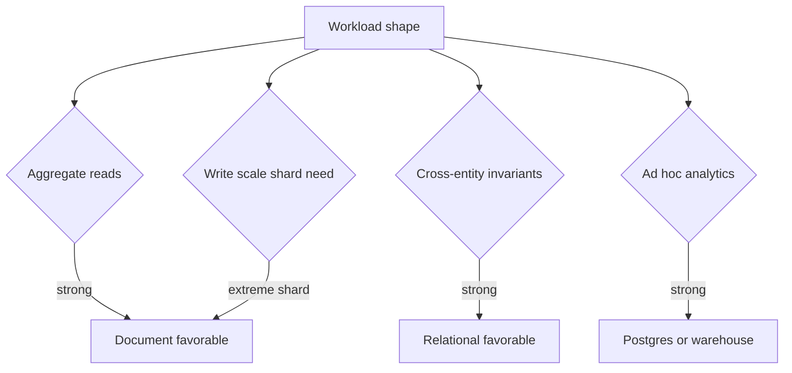
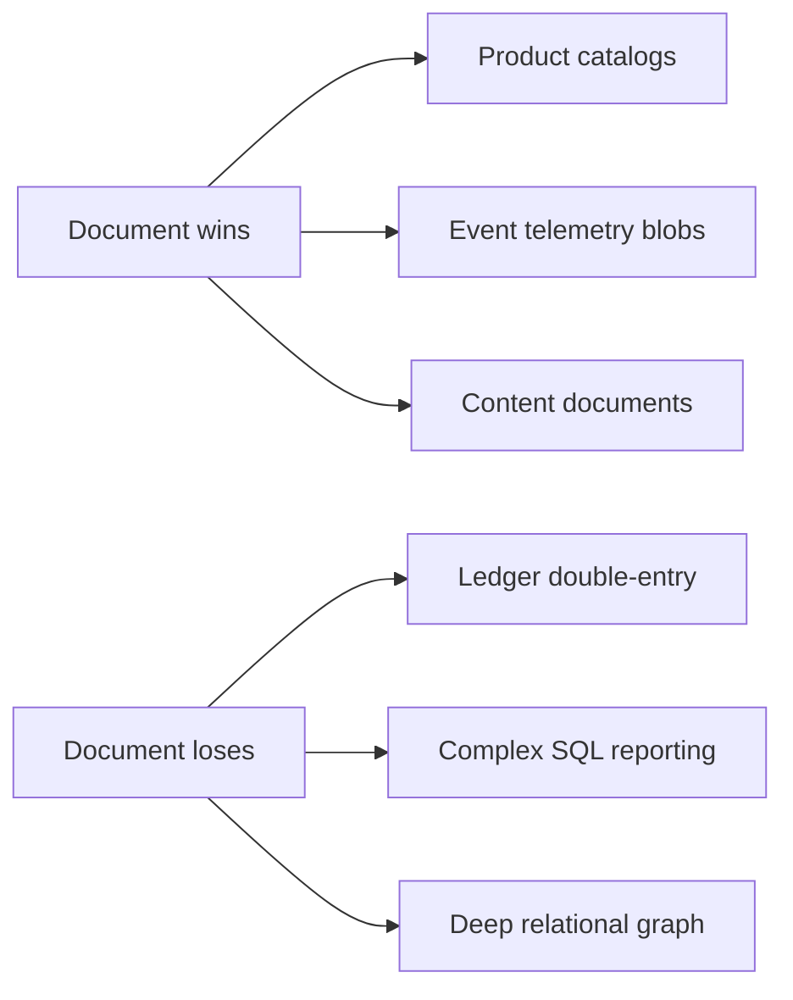
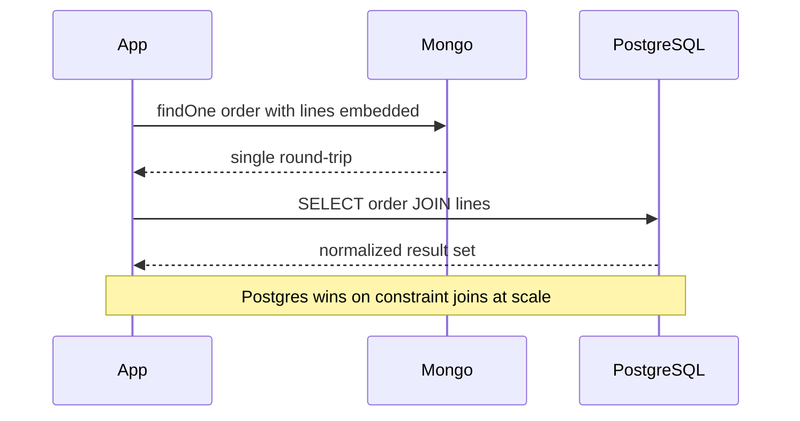

# When Document Engines Win or Lose

## Overview

Document engines like MongoDB excel when **access patterns align with aggregate-shaped reads**, schema evolves quickly, and horizontal scaling of **shardable** workloads matters. They lose when **relational invariants**, complex joins, ad hoc analytics, and mature operational tooling for strict ACID reporting dominate.

This note is **engine selection at the storage layer**—not "Mongo vs Postgres" hype. Cache-aside and repository patterns belong in [[07-Backend/README|Backend]].

## Learning Objectives

- List workloads where document storage reduces round-trips and migration friction
- Identify red flags: unbounded embeds, cross-aggregate constraints, heavy joins
- Compare Mongo multi-document transactions to Postgres relational model honestly
- Map operational costs: index bloat, working set, replica lag, shard ops
- Produce a written decision record for a sample product domain

## Prerequisites

- [[08-Databases/09-Document-Engines-MongoDB/Document Model and Storage Engines|Document Model and Storage Engines]]
- [[08-Databases/09-Document-Engines-MongoDB/Aggregation Pipeline as Execution|Aggregation Pipeline as Execution]]

## Difficulty

`intermediate`

## Estimated Time

- Reading: 1.5 hours
- Exercises: 2 hours
- Mini project: 3 hours

## History

Document databases surged with mobile/web JSON APIs and agile schema rhetoric. Reality checks—financial services returning to Postgres, analytics moving to warehouses— clarified **fit over fashion**.

## Problem It Solves

- **Wrong engine choice** costing years of `$lookup` workarounds
- **False schemaless claim** hiding production validation debt
- **Sharding premature** when relational DB still fits
- **Missing handoff** to Postgres when constraints dominate

## Internal Implementation

Decision dimensions:



## Mermaid Diagrams

### Structure



### Sequence / Lifecycle — embedded read vs join read



## Examples

### Minimal Example — fit matrix snippet

```text
Domain: IoT device readings (high insert, time-range by deviceId)
→ Document WIN: shard by deviceId, TTL indexes, flexible metadata map

Domain: Accounts payable with FK to vendors, audit trail, SQL reports
→ Document LOSE: use PostgreSQL constraints + views

Domain: Session cart (ephemeral, recomputable)
→ Redis WIN (see Redis track); Mongo acceptable if already in stack
```

### Production-Shaped Example — decision record TypeScript

```typescript
// Engineering decision record — not runtime code
type Criterion = {
  name: string;
  weight: number;
  postgres: number;
  mongo: number;
  notes: string;
};

const CRITERIA: Criterion[] = [
  {
    name: "Aggregate read ratio",
    weight: 3,
    postgres: 6,
    mongo: 9,
    notes: "Order+lines fetched together 95% of reads",
  },
  {
    name: "Referential integrity",
    weight: 5,
    postgres: 10,
    mongo: 4,
    notes: "Strict FK across customers/invoices/tax jurisdictions",
  },
  {
    name: "Ad hoc BI",
    weight: 4,
    postgres: 9,
    mongo: 5,
    notes: "Finance uses SQL + Metabase",
  },
];

function score(engine: "postgres" | "mongo"): number {
  return CRITERIA.reduce((sum, c) => {
    const s = engine === "postgres" ? c.postgres : c.mongo;
    return sum + s * c.weight;
  }, 0);
}

// console.log({ postgres: score("postgres"), mongo: score("mongo") });
```

## Trade-offs

| Dimension | Document upside | Document downside | When it matters |
| --- | --- | --- | --- |
| Schema | Flexible fields | Validation discipline required | rapid product |
| Reads | Single-doc fetch | Large embed rewrites | order details |
| Joins | $lookup possible | Expensive vs SQL planner | dashboards |
| Transactions | Multi-doc since 4.0 | Higher overhead vs Postgres | limited cross-doc |
| Ops | Replica sets mature | Shard ops complex | growth stage |

### When to Use

- Content, catalogs, profiles with nested optional fields
- High-volume telemetry with natural shard key
- Teams standardized on document API with bounded relational needs

### When Not to Use

- Ledger, inventory with strong FK and reporting SQL
- Frequent cross-collection joins without denormalization budget
- Replacing Postgres because "JSON column is hard"

## Exercises

1. Write win/lose paragraph for: bug tracker, payment ledger, news feed.
2. Model same domain embedded vs normalized—estimate document size at 1M orders.
3. Identify three `$lookup`-heavy queries that suggest Postgres migration.
4. Draft validation schema for "schemaless" collection in production.
5. Compare Mongo shard key choice vs Postgres partitioning for time-series.

## Mini Project

**ADR workshop.** Pick portfolio app feature; score Postgres vs Mongo using weighted criteria; present to peer.

## Portfolio Project

Engine selection case library in [[08-Databases/projects/Database Engines Workbench/README|Database Engines Workbench]].

## Interview Questions

1. Name two workloads ideal for document engines and two poor fits.
2. How do multi-document transactions change Mongo positioning?
3. Why is embedding not free?
4. When does `$lookup` signal wrong engine choice?
5. Mongo vs Postgres for event sourcing read models?

### Stretch / Staff-Level

1. Design hybrid: Postgres system of record + Mongo read projection—boundaries.
2. Cost model: shard cluster ops vs single large Postgres instance.

## Common Mistakes

- Choosing Mongo for relational reporting to avoid migrations
- Unbounded document growth in embedded arrays
- Ignoring write concern / durability when promoting Mongo to system of record
- Sharding before indexing and schema discipline

## Best Practices

- Start with access path list before picking engine
- Enforce `$jsonSchema` in production Mongo
- Revisit decision at scale thresholds (working set, join pain)
- Use [[08-Databases/11-Modeling-and-Engine-Selection/PostgreSQL vs MongoDB vs Redis Decision Matrix|Decision Matrix]] for tri-engine choices

## Summary

Document engines win on **aggregate-aligned, evolving schema** workloads—not on every JSON API. They lose when relational integrity, SQL analytics, and join-heavy access dominate. Honest selection weighs access paths, operational maturity, and durability contracts—not marketing labels like "schemaless."

## Further Reading

- [[00-References/Databases/README|Databases References]]
- MongoDB data modeling documentation
- PostgreSQL vs MongoDB architecture comparisons (vendor-neutral)

## Related Notes

- [[08-Databases/11-Modeling-and-Engine-Selection/PostgreSQL vs MongoDB vs Redis Decision Matrix|PostgreSQL vs MongoDB vs Redis Decision Matrix]]
- [[08-Databases/11-Modeling-and-Engine-Selection/Schema Design Driven by Queries|Schema Design Driven by Queries]]
- [[08-Databases/00-Orientation/Relational Document and KV Contracts|Relational Document and KV Contracts]]
- [[07-Backend/08-Data-Access-and-Persistence-Patterns/Handing Off to Database Engines|Handing Off to Database Engines]]

## Progress Checklist

- [ ] Explained from first principles
- [ ] Drew at least one Mermaid diagram
- [ ] Implemented a minimal version
- [ ] Documented trade-offs and non-goals
- [ ] Completed exercises
- [ ] Practiced interview questions aloud
- [ ] Linked prerequisites and dependents
