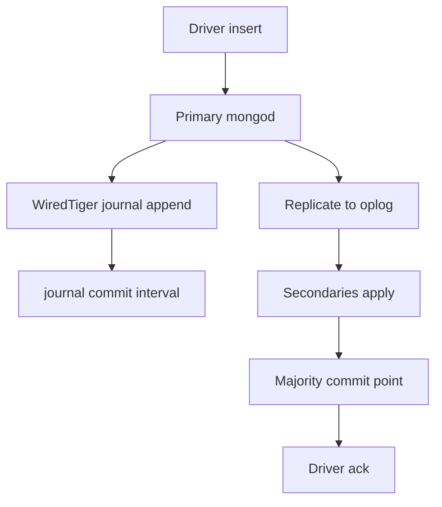
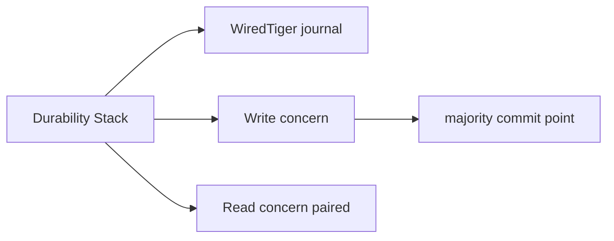
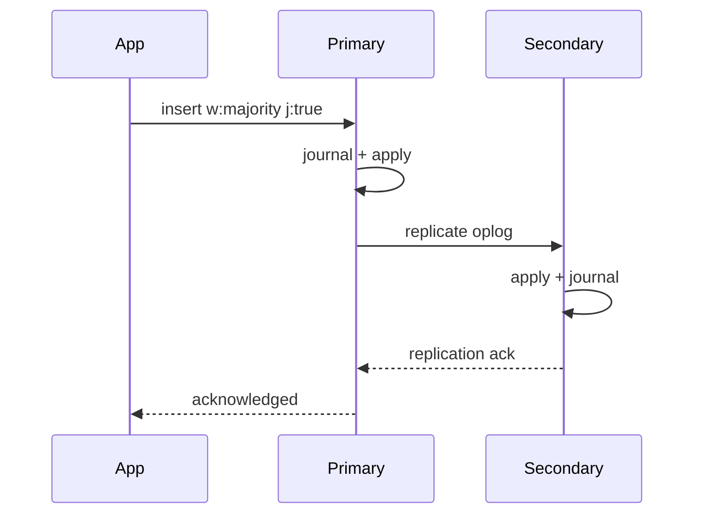

# Write Concern and Journaling Mechanics

## Overview

MongoDB **write concern** defines **acknowledgment conditions** for writes: how many replica set members must persist data before the driver returns success. **Journaling** (WiredTiger WAL) provides crash recovery on a single node; **majority** concern ties durability to replicated oplog entries.

Misconfigured `{ w: 1 }` on critical financial writes loses data on failover; `{ w: "majority" }` with wrong read concern breaks read-your-writes expectations.

## Learning Objectives

- Map write concern `{ w, j, wtimeout }` to engine and replication behavior
- Explain journal commit interval vs application acknowledgment
- Choose concern levels for idempotent vs critical writes
- Relate write concern to transaction commit in multi-doc ACID (4.0+)
- Diagnose "write concern failed" timeouts under replica lag

## Prerequisites

- [[08-Databases/09-Document-Engines-MongoDB/Document Model and Storage Engines|Document Model and Storage Engines]]
- [[08-Databases/02-WAL-Durability-and-Recovery/fsync Group Commit and Durability Levels|fsync Group Commit and Durability Levels]]

## Difficulty

`advanced`

## Estimated Time

- Reading: 2 hours
- Exercises: 2.5 hours
- Mini project: 4 hours

## History

MongoDB's early default `{ w: 1 }` prioritized latency over durability—acceptable for caches, catastrophic for primary stores. Replica set defaults shifted toward `{ w: "majority" }` as operational maturity increased and "ack without replicate" incidents were publicized.

## Problem It Solves

- **Lost writes** after primary election before replication
- **False confidence** from acknowledged writes not journaled (`j: false`)
- **Timeout storms** when secondaries lag under load
- **Mismatch** between write concern and read concern for sessions

## Internal Implementation

Write path on primary:



| Parameter | Meaning |
| --- | --- |
| `w: 1` | Primary applied (not necessarily replicated) |
| `w: "majority"` | Durability on majority of voting nodes |
| `j: true` | Wait for journal sync on primary (node-level) |
| `wtimeout` | Max wait before error (not rollback guarantee) |

Journal commit interval (`journalCommitIntervalMs`) batches fsync—similar group commit trade-offs as Postgres [[08-Databases/02-WAL-Durability-and-Recovery/fsync Group Commit and Durability Levels|fsync Group Commit]].

## Mermaid Diagrams

### Structure



### Sequence / Lifecycle — majority write



## Examples

### Minimal Example — concern levels

```javascript
// mongosh — replica set required for majority
db.orders.insertOne(
  { _id: ObjectId(), totalCents: 5000 },
  { writeConcern: { w: "majority", j: true, wtimeout: 5000 } }
);

// Faster but weaker — cache-like telemetry only
db.metrics.insertOne(
  { ts: new Date(), value: 1 },
  { writeConcern: { w: 1, j: false } }
);
```

### Production-Shaped Example — TypeScript client default concern

```typescript
// Node 20+ — enforce majority at client level for money path
import { MongoClient, WriteConcern } from "mongodb";

const client = new MongoClient(process.env.MONGODB_URI!, {
  writeConcern: new WriteConcern("majority", undefined, true), // w, wtimeout, j
});

export async function recordPayment(orderId: string, cents: number) {
  const session = client.startSession();
  try {
    await session.withTransaction(async () => {
      const orders = client.db("shop").collection("orders");
      const ledger = client.db("shop").collection("ledger");
      await orders.updateOne(
        { _id: orderId, status: "pending" },
        { $set: { status: "paid", paidCents: cents } },
        { session },
      );
      await ledger.insertOne(
        { orderId, cents, at: new Date() },
        { session },
      );
    }, {
      writeConcern: { w: "majority", j: true },
      readConcern: { level: "snapshot" },
    });
  } finally {
    await session.endSession();
  }
}
```

## Trade-offs

| Dimension | Upside | Downside | When it matters |
| --- | --- | --- | --- |
| w:1 | Lower latency | Lost on failover | metrics |
| majority | Survives election | Latency + lag sensitivity | orders |
| j:true | Node crash safety | Extra fsync cost | single-node prod |
| wtimeout | Fail fast | App must handle retry | degraded cluster |

### When to Use

- `{ w: "majority", j: true }` for authoritative business writes
- Transactions with matching read/write concern for consistency
- `{ w: 1 }` only for derived/recomputable data

### When Not to Use

- Do not use w:1 for financial ledger without external reconciliation
- Do not set infinite wtimeout on user-facing paths

## Exercises

1. Simulate primary kill after w:1 ack vs majority—observe data on new primary.
2. Measure insert latency w:1 j:false vs majority j:true on replica set.
3. Explain relationship between oplog and majority commit point.
4. Configure `wtimeout` and implement idempotent retry in TypeScript.
5. Pair read concern `majority` vs `local` after write—observe stale read.

## Mini Project

**Durability drill.** Chaos script: write with varying concerns during induced secondary lag; document outcomes.

## Portfolio Project

Write concern matrix in [[08-Databases/projects/Database Engines Workbench/README|Database Engines Workbench]].

## Interview Questions

1. What does `{ w: "majority" }` guarantee?
2. Difference between journal (`j`) and write concern `w`?
3. What happens when wtimeout fires?
4. Default write concern risks in older MongoDB deployments?
5. How do multi-document transactions interact with write concern?

### Stretch / Staff-Level

1. Explain rollback of uncommitted writes after election with w:1.
2. Compare Mongo majority commit to Postgres synchronous replication.

## Common Mistakes

- Assuming acknowledgment equals cross-region durability
- Using transactions without majority on financial paths
- Ignoring secondary lag causing wtimeout cascades
- Mixing causal consistency sessions with wrong read concern

## Best Practices

- Set safe defaults on `MongoClient` for production services
- Monitor replication lag and election metrics
- Idempotent writes with business keys for retry after wtimeout
- Defer cache-aside durability to [[07-Backend/README|Backend]] patterns explicitly

## Summary

Write concern is MongoDB's **acknowledgment contract**—separate from single-node journaling. Majority concern aligns with replica set failover safety; w:1 optimizes latency at durability cost. Production Mongo as primary store requires explicit concern/read concern pairing and retry discipline—not driver defaults from a decade ago.

## Further Reading

- [[00-References/Databases/README|Databases References]]
- MongoDB Write Concern documentation
- Replica set elections and rollback

## Related Notes

- [[08-Databases/09-Document-Engines-MongoDB/Document Model and Storage Engines|Document Model and Storage Engines]]
- [[08-Databases/07-Replication-Mechanics/Synchronous vs Asynchronous Durability|Synchronous vs Asynchronous Durability]]
- [[08-Databases/02-WAL-Durability-and-Recovery/Write-Ahead Logging Protocol|Write-Ahead Logging Protocol]]
- [[08-Databases/07-Replication-Mechanics/Replica Lag and Read-Your-Writes at Connection Level|Replica Lag and Read-Your-Writes at Connection Level]]

## Progress Checklist

- [ ] Explained from first principles
- [ ] Drew at least one Mermaid diagram
- [ ] Implemented a minimal version
- [ ] Documented trade-offs and non-goals
- [ ] Completed exercises
- [ ] Practiced interview questions aloud
- [ ] Linked prerequisites and dependents
