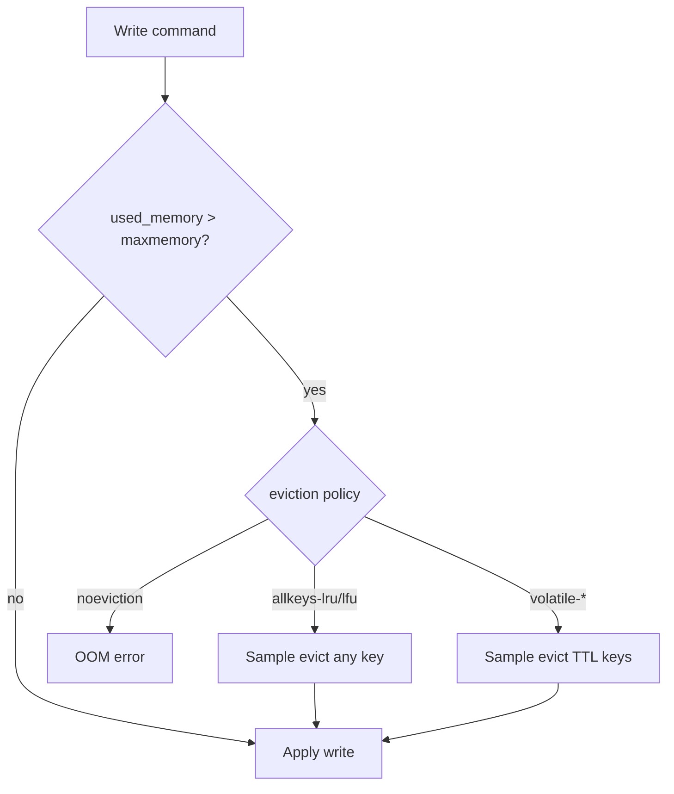
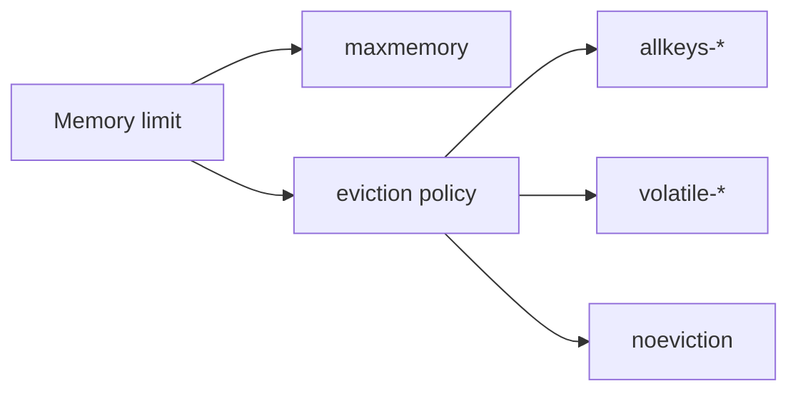
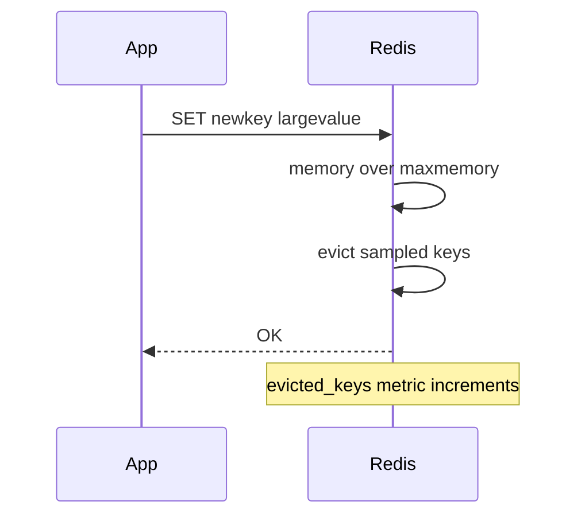

# Eviction Policies and Memory Limits

## Overview

Redis is **in-memory-first**: when `maxmemory` is reached, behavior depends on **eviction policy**—which keys to remove—or writes fail if `noeviction`. Policies (`allkeys-lru`, `volatile-lfu`, etc.) approximate LRU/LFU with **sampled** eviction for constant-time performance.

Misconfigured `maxmemory` causes OOM kills at OS level or sudden write errors—critical for cache **and** primary-store Redis deployments.

## Learning Objectives

- Configure `maxmemory` and policy for cache vs durable store scenarios
- Distinguish volatile policies (keys with TTL) from allkeys policies
- Explain approximate LRU/LFU via `maxmemory-samples`
- Monitor evicted_keys and memory fragmentation ratio
- Relate eviction to cache-aside patterns in Backend without duplicating that curriculum

## Prerequisites

- [[08-Databases/10-Redis-and-In-Memory-Engines/Redis Data Structures as Persistence API|Redis Data Structures as Persistence API]]
- [[01-Computer-Science/02-Machine-Model/Cache Hierarchy and Locality|Cache Hierarchy and Locality]]

## Difficulty

`intermediate`

## Estimated Time

- Reading: 1.5 hours
- Exercises: 2 hours
- Mini project: 3 hours

## History

Redis added LFU (4.0+) for workloads where frequency matters more than recency (hot keys vs one-time scans). Sampled eviction avoids true LRU list overhead on millions of keys.

## Problem It Solves

- **OOM killer** terminating Redis without graceful eviction
- **Cache stampede** after mass eviction event
- **Primary store data loss** when allkeys-lru evicts non-TTL keys unexpectedly
- **Hot key imbalance** without understanding LFU vs LRU

## Internal Implementation



Approximate algorithm: pick `maxmemory-samples` random keys; evict best candidate per policy (LRU idle time, LFU counter, shortest TTL).

## Mermaid Diagrams

### Structure



### Sequence / Lifecycle — write triggers eviction



## Examples

### Minimal Example — policy configuration

```conf
maxmemory 2gb
maxmemory-policy allkeys-lfu
maxmemory-samples 10
```

```bash
redis-cli INFO memory
# used_memory, maxmemory, mem_fragmentation_ratio
redis-cli INFO stats | grep evicted
```

### Production-Shaped Example — cache vs store split

```typescript
// Node 20+ — document key TTL strategy for cache tier
import { createClient } from "redis";

// Cache client: expect eviction — always TTL
const cache = createClient({ url: process.env.REDIS_CACHE_URL });

export async function cacheGet<T>(key: string, loader: () => Promise<T>, ttlSec: number): Promise<T> {
  const hit = await cache.get(key);
  if (hit) return JSON.parse(hit) as T;
  const value = await loader();
  // Cache-aside write — pattern owned by Backend track pedagogically
  await cache.set(key, JSON.stringify(value), { EX: ttlSec });
  return value;
}

// Primary Redis (if used): keys WITHOUT TTL + noeviction + monitoring
// See [[08-Databases/10-Redis-and-In-Memory-Engines/Redis as Cache vs Primary Store]]
```

## Trade-offs

| Dimension | Upside | Downside | When it matters |
| --- | --- | --- | --- |
| allkeys-lru | Simple cache | Evicts anything | pure cache |
| volatile-ttl | Protects non-TTL keys | Needs TTL discipline | mixed dataset |
| noeviction | No silent data loss | Writes fail at limit | primary Redis |
| LFU vs LRU | Resists scan pollution | Tuning learning period | hot key skew |

### When to Use

- `allkeys-lfu` for CDN-like object cache with TTL optional
- `volatile-lru` when permanent config keys coexist with cache keys (TTL required on cache)
- `noeviction` when Redis holds non-rebuildable state

### When Not to Use

- Do not use allkeys eviction on primary store without rebuild path
- Do not set maxmemory at 100% RAM—leave fork/fragmentation headroom

## Exercises

1. Fill Redis to maxmemory; compare `allkeys-lru` vs `noeviction` write behavior.
2. Run SCAN-heavy workload; observe LFU vs LRU eviction differences.
3. Set fragmentation; evaluate `activedefrag` trade-offs (lab).
4. Graph `evicted_keys` rate vs application miss rate.
5. Design TTL policy for cache-aside keys naming convention.

## Mini Project

**Eviction simulator.** Generate skewed access; compare hit ratio under LRU vs LFU policies at fixed memory.

## Portfolio Project

Memory/eviction dashboard in [[08-Databases/projects/Database Engines Workbench/README|Database Engines Workbench]].

## Interview Questions

1. What happens when Redis hits maxmemory with `noeviction`?
2. Difference between `allkeys-lru` and `volatile-lru`?
3. Why is Redis LRU "approximate"?
4. When choose LFU over LRU?
5. Relationship between TTL and volatile policies?

### Stretch / Staff-Level

1. Explain mem_fragmentation_ratio operational thresholds.
2. How does active defrag interact with latency?

## Common Mistakes

- No maxmemory on cache Redis → host OOM
- allkeys policy on mixed durable/ephemeral keys without TTL
- Ignoring evicted_keys alerts until cache hit collapses
- Confusing Redis eviction with Postgres buffer eviction

## Best Practices

- Separate cache Redis from store Redis instances when possible
- Always TTL cache keys; monitor evicted_keys
- Leave 20–30% RAM headroom on persistence-enabled nodes
- Cache-aside orchestration: [[07-Backend/README|Backend]]

## Summary

Redis memory is bounded by `maxmemory`; eviction policies decide what disappears when full. Approximate LRU/LFU keeps eviction O(1) at scale. Cache deployments embrace eviction with TTL; primary-store deployments use `noeviction` and rigorous monitoring—never surprise data loss.

## Further Reading

- [[00-References/Databases/README|Databases References]]
- Redis eviction policies documentation
- Memory optimization guide

## Related Notes

- [[08-Databases/10-Redis-and-In-Memory-Engines/Redis as Cache vs Primary Store|Redis as Cache vs Primary Store]]
- [[08-Databases/01-Storage-and-Buffer-Pool/Buffer Pool vs OS Page Cache|Buffer Pool vs OS Page Cache]]
- [[08-Databases/10-Redis-and-In-Memory-Engines/RDB Snapshots and AOF|RDB Snapshots and AOF]]
- [[07-Backend/08-Data-Access-and-Persistence-Patterns/Handing Off to Database Engines|Handing Off to Database Engines]]

## Progress Checklist

- [ ] Explained from first principles
- [ ] Drew at least one Mermaid diagram
- [ ] Implemented a minimal version
- [ ] Documented trade-offs and non-goals
- [ ] Completed exercises
- [ ] Practiced interview questions aloud
- [ ] Linked prerequisites and dependents
