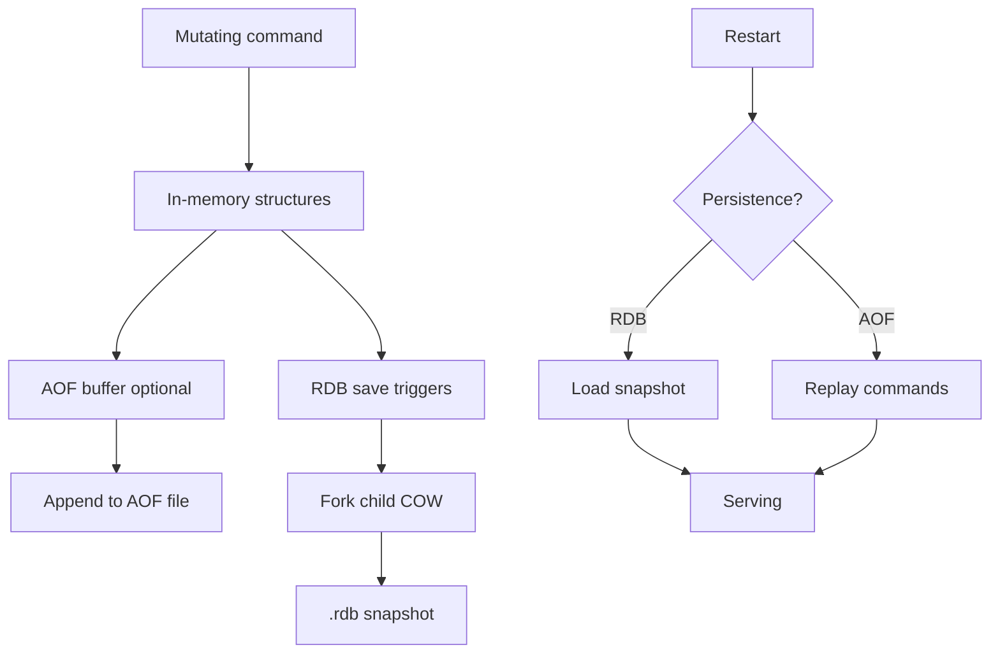
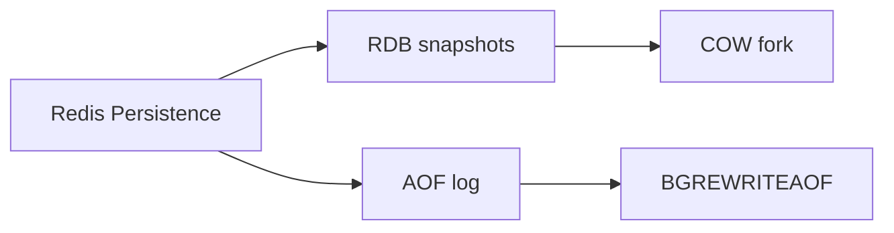
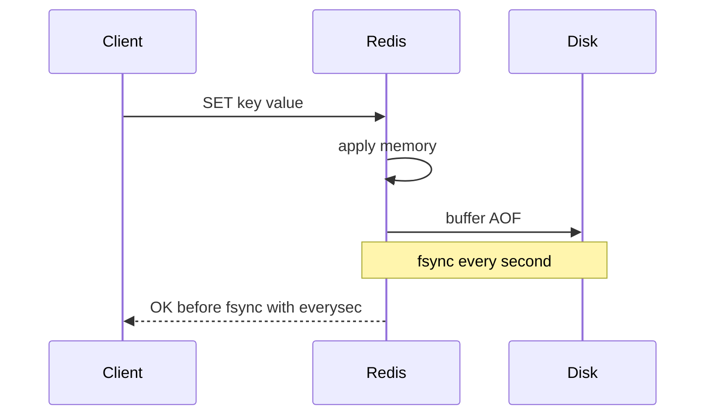

# RDB Snapshots and AOF

## Overview

Redis offers two persistence mechanisms: **RDB** (point-in-time snapshots of memory dataset) and **AOF** (append-only log of mutating commands). RDB enables fast restarts and compact backups; AOF provides finer durability granularity at higher disk cost. **Hybrid** (`appendonly yes` + periodic RDB) is common in production primary-store Redis—still not a substitute for Postgres durability semantics.

## Learning Objectives

- Compare RDB fork/COW snapshot process vs AOF append fsync policies
- Configure `appendfsync always/everysec/no` trade-offs
- Explain AOF rewrite (BGREWRITEAOF) and multi-part AOF (Redis 7+)
- Estimate recovery time from RDB vs AOF replay
- Choose persistence mode for cache vs durable Redis workloads

## Prerequisites

- [[08-Databases/10-Redis-and-In-Memory-Engines/Redis Data Structures as Persistence API|Redis Data Structures as Persistence API]]
- [[08-Databases/02-WAL-Durability-and-Recovery/Write-Ahead Logging Protocol|Write-Ahead Logging Protocol]]

## Difficulty

`advanced`

## Estimated Time

- Reading: 2 hours
- Exercises: 3 hours
- Mini project: 4 hours

## History

Early Redis was ephemeral; RDB satisfied backup needs. AOF arrived for durability-sensitive users. `everysec` became the pragmatic default—accepting up to ~1s loss vs `always` latency cost—mirroring group commit debates in other engines.

## Problem It Solves

- **Total data loss** on restart with persistence disabled
- **Fork latency spikes** during RDB on large memory instances
- **AOF file bloat** without rewrite discipline
- **False durability** assuming Redis equals Postgres WAL guarantees

## Internal Implementation



| Mode | Durability | Recovery | Cost |
| --- | --- | --- | --- |
| RDB only | Minutes window (save intervals) | Fast load | Fork IO spike |
| AOF everysec | ~1s window | Slower replay | Steady append |
| AOF always | Per command | Slowest | Highest latency |
| None | Process lifetime | Empty | Lowest |

## Mermaid Diagrams

### Structure



### Sequence / Lifecycle — everysec AOF



## Examples

### Minimal Example — redis.conf snippets

```conf
# RDB triggers
save 900 1
save 300 10
save 60 10000

# AOF
appendonly yes
appendfsync everysec
no-appendfsync-on-rewrite yes
auto-aof-rewrite-percentage 100
auto-aof-rewrite-min-size 64mb
```

Inspect persistence:

```bash
redis-cli INFO persistence
redis-cli LASTSAVE
```

### Production-Shaped Example — TypeScript health check

```typescript
// Node 20+ — scrape persistence metrics for alerting
import { createClient } from "redis";

export async function persistenceHealth(redisUrl: string) {
  const client = createClient({ url: redisUrl });
  await client.connect();
  const info = await client.info("persistence");
  const map = Object.fromEntries(
    info.split("\r\n").filter(Boolean).map((line) => {
      const [k, v] = line.split(":");
      return [k, v];
    }),
  );
  await client.quit();
  return {
    rdb_last_bgsave_status: map.rdb_last_bgsave_status,
    aof_enabled: map.aof_enabled === "1",
    aof_last_write_status: map.aof_last_write_status,
    aof_current_size: Number(map.aof_current_size ?? 0),
  };
}
```

## Trade-offs

| Dimension | Upside | Downside | When it matters |
| --- | --- | --- | --- |
| RDB | Compact; fast boot | Window of loss | cache warm |
| AOF everysec | Good durability/latency | Up to 1s loss | session store |
| AOF always | Strongest Redis durability | Latency | small critical sets |
| Hybrid | Backup + granular log | Ops complexity | primary Redis |

### When to Use

- AOF everysec for durable-enough primary Redis with monitored loss window
- RDB for disaster recovery baseline + copy to object storage
- Disable persistence for pure cache with rebuild path from Postgres

### When Not to Use

- Do not rely on Redis alone for ledger requiring Postgres-level guarantees
- Avoid RDB-only on large datasets without accepting save-interval loss

## Exercises

1. Kill Redis during write load with AOF everysec—measure lost last-second writes.
2. Trigger BGSAVE; observe latency spike and `latest_fork_usec` in INFO.
3. Run BGREWRITEAOF; compare file size before/after.
4. Boot from corrupted AOF tail—use `redis-check-aof` repair flow (lab only).
5. Document recovery RTO for 10GB dataset RDB vs AOF.

## Mini Project

Extend [[08-Databases/projects/Mini Redis Persistence Lab/README|Mini Redis Persistence Lab]] with RDB + AOF replay verification tests.

## Portfolio Project

Persistence tuning runbook in [[08-Databases/projects/Database Engines Workbench/README|Database Engines Workbench]].

## Interview Questions

1. RDB vs AOF—purpose and trade-offs?
2. What does `appendfsync everysec` guarantee?
3. Why can RDB save cause latency spikes?
4. Purpose of AOF rewrite?
5. Recovery procedure after Redis crash with both enabled?

### Stretch / Staff-Level

1. Explain copy-on-write memory doubling risk during RDB fork.
2. Compare Redis AOF to Postgres WAL durability model honestly.

## Common Mistakes

- Persistence disabled in production "Redis database"
- Ignoring disk IO limits during simultaneous rewrite and save
- Assuming OK response means fsync completed with everysec
- Storing RDB only on same machine without off-site backup

## Best Practices

- Monitor `aof_last_write_status`, `rdb_last_bgsave_status`
- Off-site backup of RDB; test restore drills
- Size memory leaving headroom for fork COW
- See [[08-Databases/12-Production-Database-Ops/Backups PITR and Restore Drills|Backups and Restore Drills]]

## Summary

Redis persistence is **RDB snapshots plus optional AOF command log**—not ACID WAL semantics. RDB trades granularity for compact fast recovery; AOF trades disk and replay time for finer durability. Production configures both with eyes open about `everysec` loss windows and fork costs—never as silent Postgres replacement.

## Further Reading

- [[00-References/Databases/README|Databases References]]
- Redis persistence documentation
- Latency during BGSAVE analysis

## Related Notes

- [[08-Databases/10-Redis-and-In-Memory-Engines/Single-Threaded Execution and Persistence Trade-offs|Single-Threaded Execution and Persistence Trade-offs]]
- [[08-Databases/02-WAL-Durability-and-Recovery/Write-Ahead Logging Protocol|Write-Ahead Logging Protocol]]
- [[08-Databases/10-Redis-and-In-Memory-Engines/Redis as Cache vs Primary Store|Redis as Cache vs Primary Store]]
- [[08-Databases/12-Production-Database-Ops/Backups PITR and Restore Drills|Backups PITR and Restore Drills]]

## Progress Checklist

- [ ] Explained from first principles
- [ ] Drew at least one Mermaid diagram
- [ ] Implemented a minimal version
- [ ] Documented trade-offs and non-goals
- [ ] Completed exercises
- [ ] Practiced interview questions aloud
- [ ] Linked prerequisites and dependents
