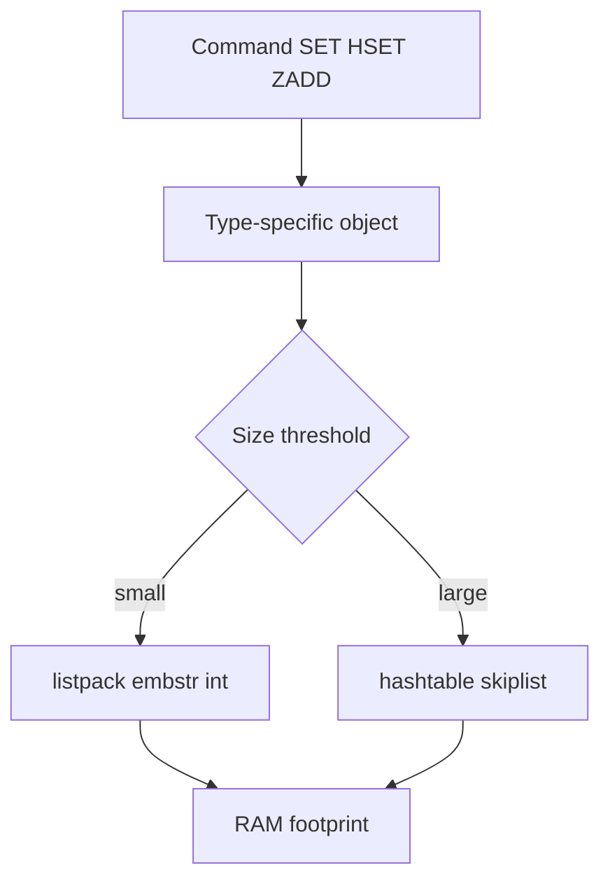
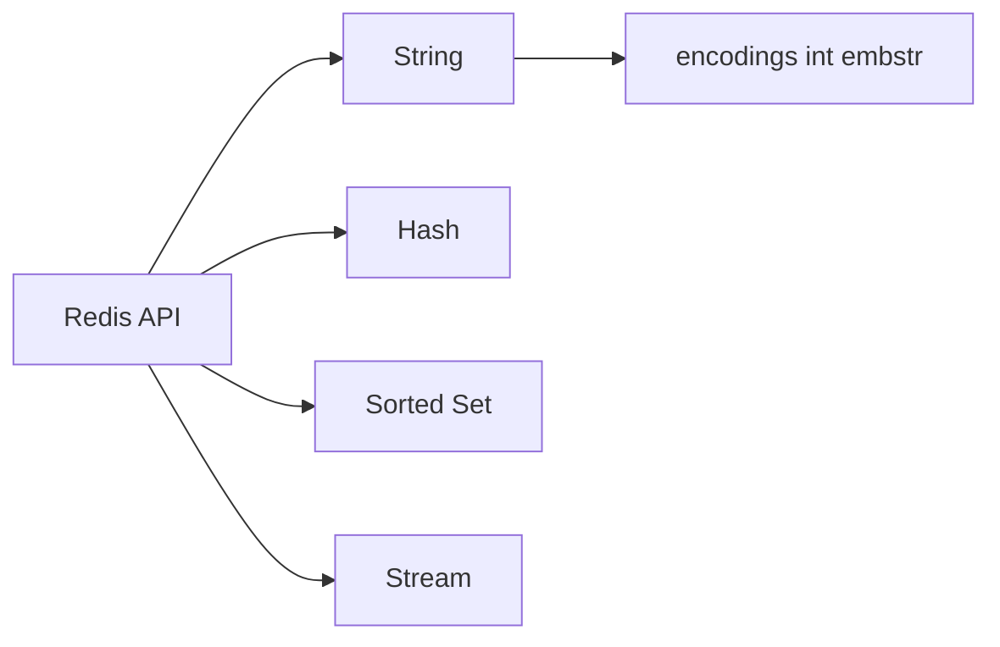
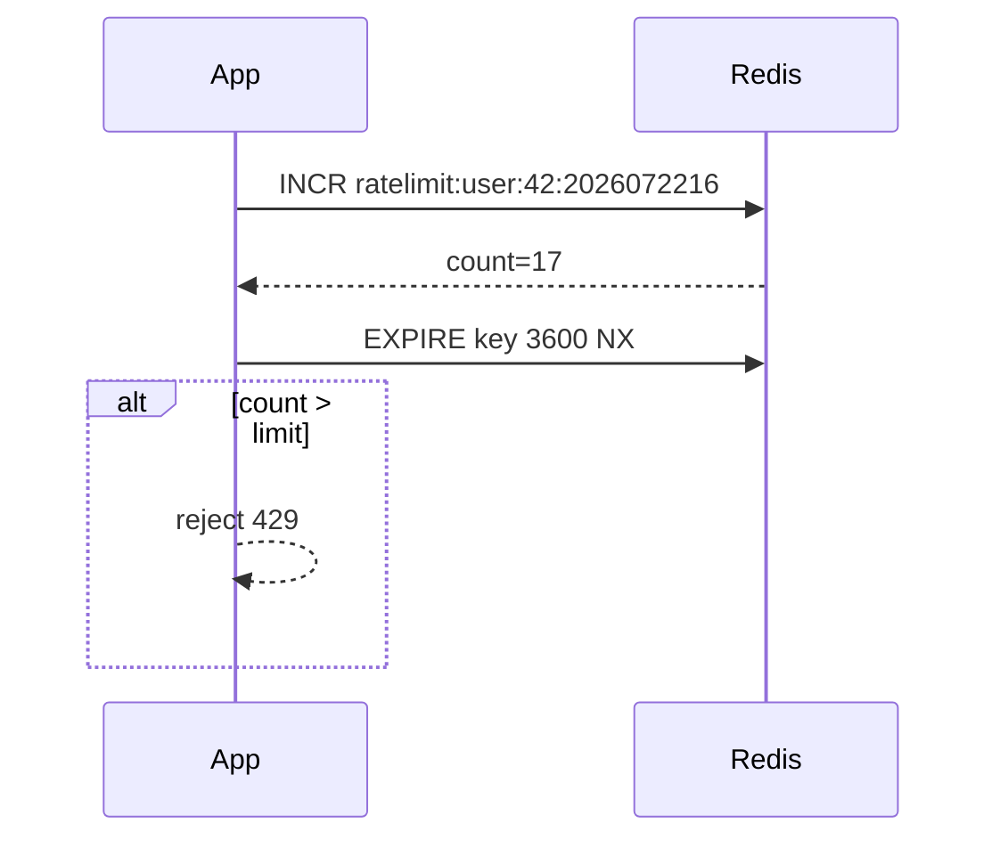

# Redis Data Structures as Persistence API

## Overview

Redis exposes **in-memory data structures** as the primary API—not opaque pages you SQL-query. Strings, hashes, lists, sets, sorted sets (zsets), streams, and HyperLogLog each have distinct **encoding strategies** (int, embstr, hashtable, skiplist+dict) chosen by size and type, affecting memory and latency.

Understanding structures as **engine primitives** clarifies when Redis fits vs when Postgres/Mongo should hold authoritative state. Application cache-aside belongs in [[07-Backend/README|Backend]].

## Learning Objectives

- Map Redis types to underlying encodings and Big-O behaviors
- Choose structures for leaderboard, rate limit, session, and queue patterns
- Explain TTL semantics per type and lazy vs active expiration
- Relate memory overhead of small keys to production key naming discipline
- Connect structure choice to persistence replay (RDB/AOF) in companion notes

## Prerequisites

- [[08-Databases/00-Orientation/Relational Document and KV Contracts|Relational Document and KV Contracts]]
- [[04-Data-Structures/04-Hash-Tables-and-Dictionary-Structures/Hash Tables and Collision Strategies|Hash Tables and Collision Strategies]]

## Difficulty

`intermediate`

## Estimated Time

- Reading: 2 hours
- Exercises: 2.5 hours
- Mini project: 4 hours

## History

Redis began as a cache; data structures expanded it into message broker, rate limiter, and session store roles. Encodings evolved (ziplist/listpack transitions) to reduce memory for small collections while keeping O(1) or O(log N) hot paths.

## Problem It Solves

- **Wrong type choice** (string JSON blob vs hash fields)
- **Memory explosions** from millions of `{prefix}:{id}` tiny keys
- **Misusing lists** where streams or consumer groups fit
- **Treating Redis as opaque KV** without TTL and eviction plan

## Internal Implementation

Type selection (conceptual):



| Type | Typical use | Core ops |
| --- | --- | --- |
| String | cache blob, counter | GET SET INCR |
| Hash | object field map | HGET HSET HMGET |
| Zset | leaderboard | ZADD ZRANGE ZRANK |
| Stream | event log, CG | XADD XREADGROUP |
| Set | unique tags | SADD SISMEMBER |

## Mermaid Diagrams

### Structure



### Sequence / Lifecycle — rate limit with string counter



## Examples

### Minimal Example — structure selection

```bash
# redis-cli 7+
SET session:abc '{"userId":1}' EX 3600
# Prefer hash for field updates:
HSET session:abc userId 1 role admin
EXPIRE session:abc 3600

ZADD leaderboard 9850 user:alice 9200 user:bob
ZRANGE leaderboard 0 9 REV WITHSCORES

XADD orders-stream * orderId o-1 total 4999
```

### Production-Shaped Example — TypeScript structure patterns

```typescript
// Node 20+ / redis 4.x
import { createClient } from "redis";

const redis = createClient({ url: process.env.REDIS_URL });
await redis.connect();

// Rate limit — string counter + TTL
export async function allowRequest(userId: string, limit: number): Promise<boolean> {
  const bucket = `rl:${userId}:${new Date().toISOString().slice(0, 13)}`;
  const count = await redis.incr(bucket);
  if (count === 1) await redis.expire(bucket, 3600);
  return count <= limit;
}

// Leaderboard — zset
export async function recordScore(userId: string, score: number): Promise<void> {
  await redis.zAdd("game:scores", { score, value: userId });
}

// Session — hash not JSON string for partial updates
export async function setSession(sid: string, fields: Record<string, string>): Promise<void> {
  const key = `sess:${sid}`;
  await redis.hSet(key, fields);
  await redis.expire(key, 86400);
}
```

## Trade-offs

| Dimension | Upside | Downside | When it matters |
| --- | --- | --- | --- |
| Rich types | O(1)/O(log N) ops | Memory per key overhead | millions of keys |
| Hash vs JSON string | Field updates cheap | No nested docs natively | sessions |
| Zset | Rank queries | Memory vs plain set | leaderboards |
| Streams | Consumer groups | Not Kafka replacement | moderate throughput |

### When to Use

- Latency-sensitive derived state: limits, ranks, ephemeral sessions
- Structures matching algorithmic needs (INCR, ZRANK)
- TTL-backed ephemeral data with eviction policy configured

### When Not to Use

- Authoritative financial records without durability plan
- Large blob storage cheaper on object store + Postgres metadata

## Exercises

1. Compare memory of 100k small keys vs one hash with 100k fields (INFO memory).
2. Implement sliding window rate limit with zset scores as timestamps.
3. Use streams consumer group; acknowledge and claim pending messages.
4. Explain why `KEYS *` is forbidden in production.
5. Map each structure to persistence replay command in AOF.

## Mini Project

**Structure benchmark.** Same logical model as string JSON vs hash; measure memory and update latency.

## Portfolio Project

Mini Redis lab in [[08-Databases/projects/Mini Redis Persistence Lab/README|Mini Redis Persistence Lab]].

## Interview Questions

1. Redis types and one use case each?
2. Difference between list and stream for queues?
3. How does ZADD maintain ordering internally (conceptually)?
4. TTL behavior on hash fields vs key?
5. Why prefer HSET over SET for session objects?

### Stretch / Staff-Level

1. Explain listpack vs hashtable encoding transition thresholds.
2. When would RedisJSON module change structure selection?

## Common Mistakes

- Storing large JSON strings without field-level access needs
- No TTL on cache keys → memory fill → eviction surprises
- Using lists as durable queue without visibility timeout pattern
- Key naming without hierarchy causing hot spots (see cluster slots)

## Best Practices

- Namespace keys: `{service}:{entity}:{id}`
- Monitor memory, evicted_keys, expired_keys
- Match structure to access pattern; document TTL policy
- Pair with [[08-Databases/10-Redis-and-In-Memory-Engines/Eviction Policies and Memory Limits|Eviction Policies]]

## Summary

Redis is a **structure server**, not a generic disk-backed database. Each type encodes differently in memory and exposes specific commands with well-defined complexity. Engine literacy means picking the right primitive, sizing TTL/eviction, and knowing persistence replays commands—not treating Redis as a faster Postgres.

## Further Reading

- [[00-References/Databases/README|Databases References]]
- Redis data types documentation
- Memory optimization guide

## Related Notes

- [[08-Databases/10-Redis-and-In-Memory-Engines/RDB Snapshots and AOF|RDB Snapshots and AOF]]
- [[08-Databases/10-Redis-and-In-Memory-Engines/Eviction Policies and Memory Limits|Eviction Policies and Memory Limits]]
- [[08-Databases/10-Redis-and-In-Memory-Engines/Redis as Cache vs Primary Store|Redis as Cache vs Primary Store]]
- [[04-Data-Structures/05-Trees-and-Ordered-Maps/Skip Lists and Probabilistic Balance|Skip Lists and Probabilistic Balance]]

## Progress Checklist

- [ ] Explained from first principles
- [ ] Drew at least one Mermaid diagram
- [ ] Implemented a minimal version
- [ ] Documented trade-offs and non-goals
- [ ] Completed exercises
- [ ] Practiced interview questions aloud
- [ ] Linked prerequisites and dependents
