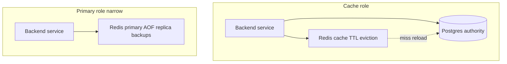
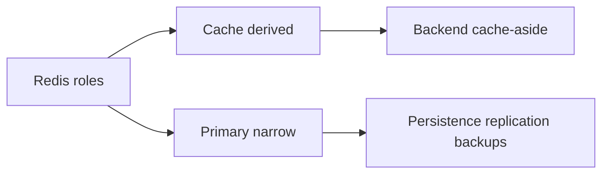
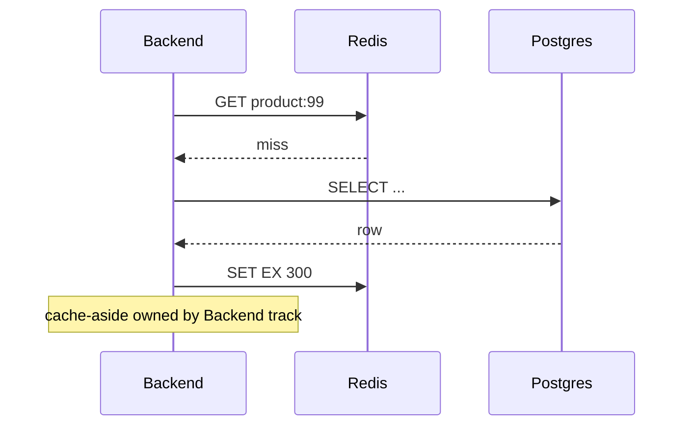

# Redis as Cache vs Primary Store

## Overview

Redis commonly serves as **cache** (derived, rebuildable, TTL + eviction) or **primary store** (authoritative, durability + backup required)—with radically different **operational contracts**. This note defines engine-level requirements for each role. **Cache-aside**, **write-through**, and **invalidation orchestration** are Backend concerns—hand off to [[07-Backend/README|Backend]] for application patterns.

Redis does **not** replace Postgres/Mongo for general durable relational/document workloads without explicit engineering.

## Learning Objectives

- Define cache vs primary store durability and recovery requirements
- Configure Redis differently per role (eviction, persistence, replication)
- Identify data safe to lose vs requiring Postgres system of record
- Document RPO/RTO for Redis-primary subsets honestly
- Draw architecture boundary between Redis engine ops and Backend cache patterns

## Prerequisites

- [[08-Databases/10-Redis-and-In-Memory-Engines/Eviction Policies and Memory Limits|Eviction Policies and Memory Limits]]
- [[08-Databases/10-Redis-and-In-Memory-Engines/RDB Snapshots and AOF|RDB Snapshots and AOF]]

## Difficulty

`intermediate`

## Estimated Time

- Reading: 1.5 hours
- Exercises: 2 hours
- Mini project: 3 hours

## History

Teams promoted Redis to primary store for speed, then learned painful lessons on AOF everysec loss windows, eviction deleting "database" keys, and lack of ad hoc query/reporting. Mature architectures use Redis as **acceleration layer** with Postgres authority except narrow domains (sessions, rate limits, leaderboards).

## Problem It Solves

- **Cache treated as source of truth** after outage
- **allkeys-lru evicting** "persistent" keys
- **No rebuild path** when Redis cluster fails
- **Duplicating Backend cache-aside** curriculum in Databases track

## Internal Implementation



| Aspect | Cache | Primary store (narrow) |
| --- | --- | --- |
| Authority | Postgres/Mongo | Redis for specific domain |
| Eviction | allkeys-lru/lfu OK | noeviction |
| Persistence | Optional | AOF + replicas + backups |
| TTL | Required on keys | Only where domain expires |
| Loss tolerance | Rebuild from source | Defined RPO |

## Mermaid Diagrams

### Structure



### Sequence / Lifecycle — cache miss (conceptual)



## Examples

### Minimal Example — role configuration contrast

```conf
# Cache instance
maxmemory 4gb
maxmemory-policy allkeys-lfu
appendonly no

# Primary instance (sessions example)
maxmemory 8gb
maxmemory-policy noeviction
appendonly yes
appendfsync everysec
```

### Production-Shaped Example — authority documentation

```typescript
/**
 * Data authority map — engine ops reference
 * NOT runtime code; documents contracts for on-call
 */
export const DATA_AUTHORITY = {
  orders: { store: "postgres", redis: "none" },
  productCatalog: { store: "postgres", redis: "cache-aside-5m-ttl" },
  sessions: { store: "redis-primary", redis: "aof-everysec-replica" },
  rateLimits: { store: "redis-primary", redis: "ephemeral-ok" },
  leaderboard: { store: "redis-primary", redis: "rebuild-from-postgres-scores" },
} as const;

// cache-aside implementation → [[07-Backend/README|Backend]]
// Do not claim educational TypeScript engines replace Redis/Postgres
```

## Trade-offs

| Dimension | Cache upside | Primary upside | Risk |
| --- | --- | --- | --- |
| Latency | Mask DB load | Sub-ms reads | Stale cache |
| Simplicity | Easy invalidate | Fewer moving parts than SQL | Eviction data loss |
| Durability | N/A | Fast enough for sessions | Not Postgres-grade |
| Ops | Low | Replicas + backups required | False confidence |

### When to Use Redis as Cache

- Read-heavy hot keys rebuildable from Postgres/Mongo
- TTL + eviction acceptable; stale reads bounded by product

### When to Use Redis as Primary (narrow)

- Sessions, rate limits, leaderboards with defined loss/rebuild policy
- Explicit AOF, replication, backups, `noeviction`, monitoring

### When Not to Use Redis as Primary

- Financial ledger, inventory truth, audit trails → Postgres
- Complex queries/reporting → relational/document engine

## Exercises

1. Classify ten data types in a sample app as cache vs primary vs Postgres-only.
2. Write RPO/RTO for session store with AOF everysec + daily RDB backup.
3. Design rebuild procedure for leaderboard after total Redis loss.
4. Explain why cache-aside invalidation belongs in Backend track.
5. Compare Redis primary to Postgres for same session schema—ops cost.

## Mini Project

**Authority matrix ADR.** One-page decision doc with persistence, eviction, and escalation paths.

## Portfolio Project

Role separation diagram in [[08-Databases/projects/Database Engines Workbench/README|Database Engines Workbench]].

## Interview Questions

1. Difference operating Redis as cache vs primary store?
2. Why must cache keys have TTL under allkeys eviction?
3. What persistence config for primary Redis sessions?
4. Can Redis replace Postgres for orders? Justify.
5. Where does cache-aside pattern live in this curriculum?

### Stretch / Staff-Level

1. Design dual-write anti-pattern pitfalls between Redis and Postgres.
2. Redis Cluster failover session stickiness concerns.

## Common Mistakes

- Single Redis instance mixing cache and primary without key isolation
- No rebuild runbook for "Redis database"
- Using cache Redis persistence as durability guarantee
- Teaching cache-aside here instead of Backend

## Best Practices

- Separate Redis clusters/instances by role when budget allows
- Document authority matrix in service README
- Test restore drills for primary Redis subsets
- Hand off repositories to [[08-Databases/11-Modeling-and-Engine-Selection/Handoff Back to Backend Repositories|Backend Handoff]]

## Summary

Redis as **cache** accepts loss and eviction with Postgres/Mongo authority. Redis as **primary store** demands narrow scope, `noeviction`, persistence, replication, backups, and honest RPO—not generic SQL replacement. Engine track owns durability mechanics; Backend owns cache-aside orchestration.

## Further Reading

- [[00-References/Databases/README|Databases References]]
- Redis administration persistence/replication guides
- Cache-aside pattern (Backend track)

## Related Notes

- [[07-Backend/08-Data-Access-and-Persistence-Patterns/Handing Off to Database Engines|Handing Off to Database Engines]]
- [[08-Databases/11-Modeling-and-Engine-Selection/PostgreSQL vs MongoDB vs Redis Decision Matrix|PostgreSQL vs MongoDB vs Redis Decision Matrix]]
- [[08-Databases/10-Redis-and-In-Memory-Engines/Eviction Policies and Memory Limits|Eviction Policies and Memory Limits]]
- [[08-Databases/12-Production-Database-Ops/Backups PITR and Restore Drills|Backups PITR and Restore Drills]]

## Progress Checklist

- [ ] Explained from first principles
- [ ] Drew at least one Mermaid diagram
- [ ] Implemented a minimal version
- [ ] Documented trade-offs and non-goals
- [ ] Completed exercises
- [ ] Practiced interview questions aloud
- [ ] Linked prerequisites and dependents
