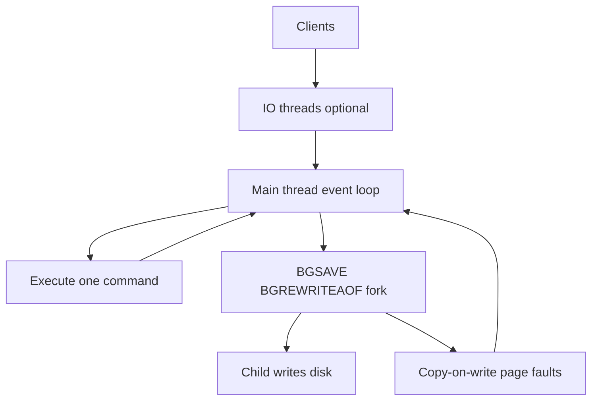
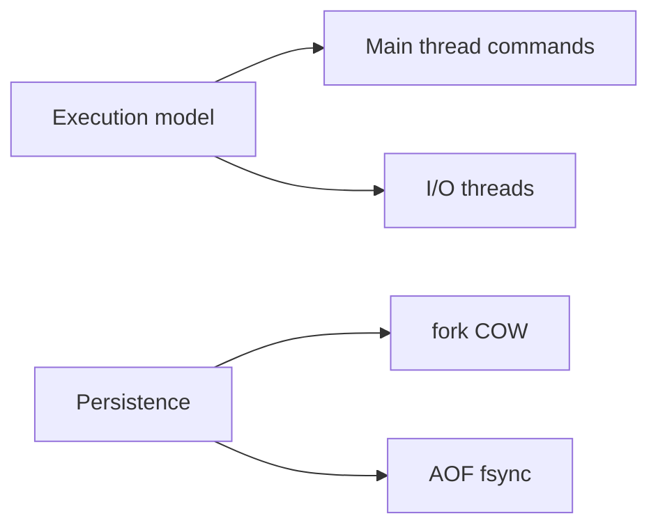
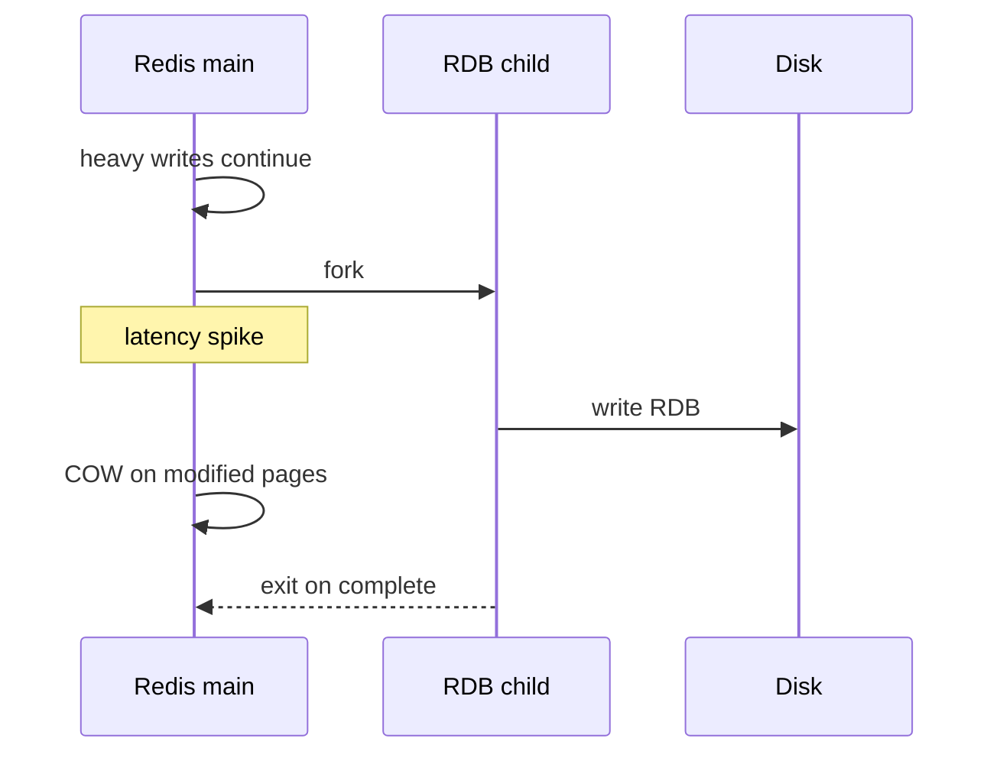

# Single-Threaded Execution and Persistence Trade-offs

## Overview

Redis (classic model) executes commands on a **single main thread**—no lock contention on data structures, but **long commands block all clients**. Persistence operations (`BGSAVE`, `BGREWRITEAOF`) **fork** child processes using copy-on-write, causing latency jitter and memory pressure. Redis 6+ **I/O threads** offload read/write to sockets but command execution remains single-threaded.

Understanding this model explains why `KEYS`, huge `SMEMBERS`, and unbounded `LRANGE` cause outages—and why persistence tuning is latency tuning.

## Learning Objectives

- Explain single-threaded command execution vs I/O threads
- Relate fork/COW during RDB/AOF rewrite to latency spikes
- Identify O(N) commands forbidden at scale
- Use `SLOWLOG`, `LATENCY DOCTOR`, and command introspection in ops
- Balance persistence settings against p99 latency SLOs

## Prerequisites

- [[08-Databases/10-Redis-and-In-Memory-Engines/RDB Snapshots and AOF|RDB Snapshots and AOF]]
- [[06-NodeJS/02-Event-Loop-and-libuv/Event Loop Phases|Event Loop Phases]]

## Difficulty

`advanced`

## Estimated Time

- Reading: 2 hours
- Exercises: 2.5 hours
- Mini project: 4 hours

## History

Redis' single-threaded design was a deliberate simplicity bet—predictable per-core performance vs multi-threaded complexity. As datasets grew, fork latency became the dominant ops issue, leading to diskless replication options, active defrag, and I/O threading without full multi-threaded data sharding on one node.

## Problem It Solves

- **Mystery latency spikes** during BGSAVE
- **Global blocking** from one client's `KEYS *`
- **Memory doubling** myths vs COW reality during fork
- **Wrong expectation** that Redis scales vertically with CPU cores for commands

## Internal Implementation



Blocking categories:

| Source | Effect |
| --- | --- |
| O(N) command | Blocks main thread N proportional |
| Fork | Pause + COW faults on write-heavy load |
| AOF fsync always | Sync write per command |
| MODULE blocking cmd | Depends on module |

## Mermaid Diagrams

### Structure



### Sequence / Lifecycle — fork during write load



## Examples

### Minimal Example — slow command detection

```bash
redis-cli CONFIG SET slowlog-log-slower-than 10000
redis-cli CONFIG SET slowlog-max-len 128
redis-cli SLOWLOG GET 10
redis-cli LATENCY DOCTOR
```

Avoid:

```bash
# O(N) — never in production
redis-cli KEYS "user:*"
# Use SCAN cursor iteration instead
redis-cli SCAN 0 MATCH "user:*" COUNT 100
```

### Production-Shaped Example — latency-aware persistence config

```typescript
// Node 20+ — monitor latency + persistence status together
import { createClient } from "redis";

export async function redisLatencySnapshot(url: string) {
  const c = createClient({ url });
  await c.connect();
  const [stats, persistence, slowlog] = await Promise.all([
    c.info("stats"),
    c.info("persistence"),
    c.sendCommand(["SLOWLOG", "GET", "5"]),
  ]);
  await c.quit();
  return {
    instantaneous_ops_per_sec: stats.match(/instantaneous_ops_per_sec:(\d+)/)?.[1],
    latest_fork_usec: persistence.match(/latest_fork_usec:(\d+)/)?.[1],
    slowlog,
  };
}
```

Recommended production posture:

```conf
appendfsync everysec
no-appendfsync-on-rewrite yes
# Stagger saves off peak; prefer replica for RDB backups on large instances
save ""
```

## Trade-offs

| Dimension | Upside | Downside | When it matters |
| --- | --- | --- | --- |
| Single thread | Simple; fast small ops | No parallel commands | hot instances |
| Fork persistence | Non-blocking ideal case | COW under write load | large RAM |
| everysec AOF | Balanced | 1s loss window | default prod |
| I/O threads | Better network throughput | Commands still serial | high QPS |

### When to Use

- Short O(1) commands; SCAN not KEYS
- Offload RDB to replica; primary avoids `save` triggers
- `latency-monitor-threshold` alerting in production

### When Not to Use

- Do not run analytics scans on shared primary Redis
- Do not enable `appendfsync always` without latency budget proof

## Exercises

1. Run `DEBUG SLEEP 5` (lab only); observe all clients block.
2. Trigger BGSAVE under write load; graph `latest_fork_usec`.
3. Compare p99 latency: AOF always vs everysec vs RDB-only.
4. Enumerate O(N) commands in docs; write banned-command lint for team.
5. Explain why Redis Cluster scales writes horizontally vs single instance.

## Mini Project

**Latency lab.** Synthetic load + BGSAVE; capture slowlog and fork metrics; tune config.

## Portfolio Project

Redis latency runbook in [[08-Databases/projects/Database Engines Workbench/README|Database Engines Workbench]].

## Interview Questions

1. Why is Redis single-threaded for command execution?
2. How does BGSAVE affect latency?
3. What is copy-on-write in Redis fork context?
4. Name three O(N) commands to avoid.
5. What do Redis I/O threads do?

### Stretch / Staff-Level

1. Compare Redis model to Node event loop similarities/differences.
2. When use diskless replication to reduce primary fork pain?

## Common Mistakes

- Running `KEYS` in production scripts
- Scheduling RDB saves during peak on multi-GB instances
- Expecting 32 cores to speed single Redis instance command throughput
- Ignoring slowlog until customers complain

## Best Practices

- Use SCAN, pipelines, and bounded commands
- Run persistence-heavy ops on replicas
- Monitor fork duration and fragmentation
- Pair with [[08-Databases/12-Production-Database-Ops/Monitoring Checkpoints Lag Bloat Cache Hit|Monitoring]]

## Summary

Redis achieves speed through **single-threaded, lock-free structure access**—but that means one slow command stalls everyone. Persistence forks add **COW memory and latency** under write pressure. Production Redis treats command choice and persistence scheduling as **latency engineering**, not afterthought configuration.

## Further Reading

- [[00-References/Databases/README|Databases References]]
- Redis latency troubleshooting documentation
- Fork latency deep dives

## Related Notes

- [[08-Databases/10-Redis-and-In-Memory-Engines/RDB Snapshots and AOF|RDB Snapshots and AOF]]
- [[06-NodeJS/02-Event-Loop-and-libuv/Starvation Backpressure and Loop Health|Starvation Backpressure and Loop Health]]
- [[08-Databases/10-Redis-and-In-Memory-Engines/Eviction Policies and Memory Limits|Eviction Policies and Memory Limits]]
- [[08-Databases/12-Production-Database-Ops/Monitoring Checkpoints Lag Bloat Cache Hit|Monitoring Checkpoints Lag Bloat Cache Hit]]

## Progress Checklist

- [ ] Explained from first principles
- [ ] Drew at least one Mermaid diagram
- [ ] Implemented a minimal version
- [ ] Documented trade-offs and non-goals
- [ ] Completed exercises
- [ ] Practiced interview questions aloud
- [ ] Linked prerequisites and dependents
