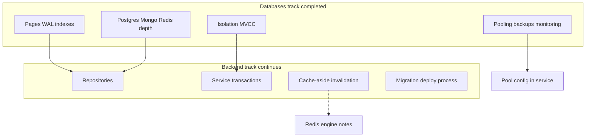
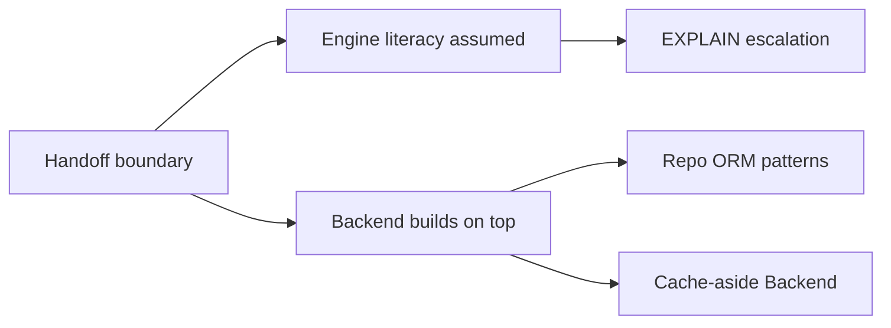
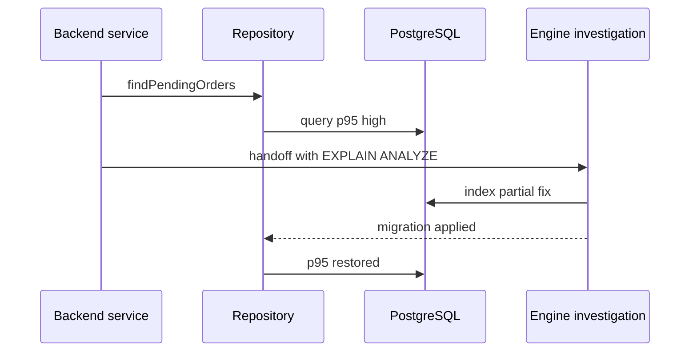

# Handoff Back to Backend Repositories

## Overview

The Databases track ends at the **engine boundary**: pages, WAL, indexes, isolation, replication mechanics, engine selection, and DB ops. The **Backend track** resumes for **repositories**, ORMs/query builders, **transactions as service boundaries**, **cache-aside**, outbox patterns, migration orchestration in CI, and API-level error handling.

This note closes the loop started in [[07-Backend/08-Data-Access-and-Persistence-Patterns/Handing Off to Database Engines|Handing Off to Database Engines]]—what you carry forward vs what you stop re-teaching.

## Learning Objectives

- List Databases-track outcomes Backend repos should assume
- Map engine concepts to repository responsibilities (pooling, retries, read routes)
- Escalate from app slow query to EXPLAIN/index work using handoff triggers
- Avoid duplicating engine internals in service code
- Navigate related tracks: System Design (sharding), DevOps (containers), Career (on-call)

## Prerequisites

- [[08-Databases/11-Modeling-and-Engine-Selection/PostgreSQL vs MongoDB vs Redis Decision Matrix|PostgreSQL vs MongoDB vs Redis Decision Matrix]]
- [[07-Backend/08-Data-Access-and-Persistence-Patterns/Handing Off to Database Engines|Handing Off to Database Engines]]

## Difficulty

`intermediate`

## Estimated Time

- Reading: 1 hour
- Exercises: 2 hours
- Mini project: 3 hours

## History

Splitting Databases from Backend prevents shallow "use Prisma" tutorials without WAL literacy—and prevents every backend lesson re-explaining B-trees. Explicit handoff notes reduce curriculum gaps.

## Problem It Solves

- **Re-implementing planners** in application code
- **Missing escalation** when repo latency is index-bound
- **Cache-aside taught twice** or never connected to Redis engine ops
- **Graduates unsure** which track owns failover product design

## Internal Implementation



## Mermaid Diagrams

### Structure



### Sequence / Lifecycle — slow query escalation



## Examples

### Minimal Example — ownership table

| Concern | Databases track | Backend track |
| --- | --- | --- |
| B-tree page splits | Yes | No |
| Repository interface | No | Yes |
| Connection pool sizing theory | Yes | App config |
| cache-aside pattern | Redis engine only | Yes full pattern |
| Multi-region CAP | Replication mechanics only | System Design |
| Docker Postgres | No | DevOps |

### Production-Shaped Example — repository with engine-aware comments

```typescript
// Node 20+ — Backend repository; engine knowledge informs, not reimplemented
import pg from "pg";

export class OrderRepository {
  constructor(private pool: pg.Pool) {}

  /** Uses partial index (tenant_id, created_at) WHERE status='pending' — see Databases track migration 042 */
  async listPendingByTenant(tenantId: number, limit: number) {
    const { rows } = await this.pool.query(
      `SELECT id, total_cents, created_at
       FROM orders
       WHERE tenant_id = $1 AND status = 'pending'
       ORDER BY created_at DESC
       LIMIT $2`,
      [tenantId, limit],
    );
    return rows;
  }

  // Transaction boundary — Backend [[07-Backend/.../Transactions as Used by Services]]
  async markPaid(orderId: string, client: pg.PoolClient) {
    await client.query(
      `UPDATE orders SET status = 'paid', updated_at = now() WHERE id = $1`,
      [orderId],
    );
  }
}

// Cache-aside for product catalog → implement in Backend, not here
// Redis TTL/eviction → [[08-Databases/10-Redis-and-In-Memory-Engines/...]]
```

Handoff triggers (escalate to engine work):

```typescript
export const ENGINE_HANDOFF_TRIGGERS = [
  "seq scan on hot query after ANALYZE",
  "replica lag breaking read-your-writes",
  "dead tuples / bloat metrics alerting",
  "write concern timeouts on Mongo primary path",
  "Redis evicted_keys spike on supposed primary store",
] as const;
```

## Trade-offs

| Dimension | Deep engine study upside | Stay in Backend upside | When it matters |
| --- | --- | --- | --- |
| Boundary clarity | Faster root cause | Faster feature ship | team size |
| Duplication risk | Low if handoff clear | High if blurred | curriculum |
| On-call | DBA/SRE partnership | App fixes only | incidents |

### When to Escalate to Engine Track Practices

- Planner-bound latency after repo SQL review
- Isolation anomalies reproducible in SQL not app
- Durability misconfiguration (Mongo WC, Redis persistence)

### When to Stay in Backend

- N+1 query pattern in ORM
- Missing transaction boundary in service
- Cache invalidation bug

## Exercises

1. Label ten tasks Postgres vs Backend vs DevOps vs System Design owner.
2. Write handoff ticket template with EXPLAIN attach slot.
3. Implement repository method; document which index it requires.
4. Describe cache-aside without re-explaining Redis AOF.
5. Draft study plan: finish Databases track → next Backend modules.

## Mini Project

**Boundary audit.** Review sample microservice; list violations (engine logic in app, cache without TTL).

## Portfolio Project

End-to-end diagram linking [[08-Databases/projects/Database Engines Workbench/README|Database Engines Workbench]] to Backend mini ORM project.

## Interview Questions

1. What does Databases track own vs Backend?
2. When escalate slow query from repo to index work?
3. Where is cache-aside taught and implemented?
4. Who owns multi-region sharding product decision?
5. Connection pooling—engine vs app responsibilities?

### Stretch / Staff-Level

1. Design on-call runbook spanning app pool exhaustion vs Postgres max_connections.
2. Educational engine lab vs production Postgres—state explicitly in interview.

## Common Mistakes

- Implementing deduplication/locking in Node that Postgres advisory locks solve better
- Skipping EXPLAIN because "ORM handles it"
- Teaching containers in Databases track
- Claiming toy WAL lab replaces Postgres

## Best Practices

- Reference index names in repository docstrings
- Log query id from [[08-Databases/11-Modeling-and-Engine-Selection/Schema Design Driven by Queries|query catalog]]
- Partner with SRE on [[08-Databases/12-Production-Database-Ops/Operational Readiness for Database Engines|Operational Readiness]]
- Continue on [[07-Backend/README|Backend README]]

## Summary

Databases track delivers **engine literacy**—storage, durability, planning, concurrency, tri-engine selection, ops. Backend track builds **services on top**: repositories, transactions, cache-aside, deploy coordination. Hand off explicitly; escalate with EXPLAIN and metrics; never confuse educational labs with production engines.

## Further Reading

- [[07-Backend/README|Backend]]
- [[07-Backend/08-Data-Access-and-Persistence-Patterns/Handing Off to Database Engines|Handing Off to Database Engines]]
- [[08-Databases/README|Databases]]

## Related Notes

- [[07-Backend/08-Data-Access-and-Persistence-Patterns/Mini ORM Concepts and Query Builders|Mini ORM Concepts and Query Builders]]
- [[07-Backend/08-Data-Access-and-Persistence-Patterns/Transactions as Used by Services|Transactions as Used by Services]]
- [[08-Databases/12-Production-Database-Ops/Connection Pooling at Engine and Proxy|Connection Pooling at Engine and Proxy]]
- [[09-System-Design/README|System Design]]
- [[16-DevOps/README|DevOps]]

## Progress Checklist

- [ ] Explained from first principles
- [ ] Drew at least one Mermaid diagram
- [ ] Implemented a minimal version
- [ ] Documented trade-offs and non-goals
- [ ] Completed exercises
- [ ] Practiced interview questions aloud
- [ ] Linked prerequisites and dependents
