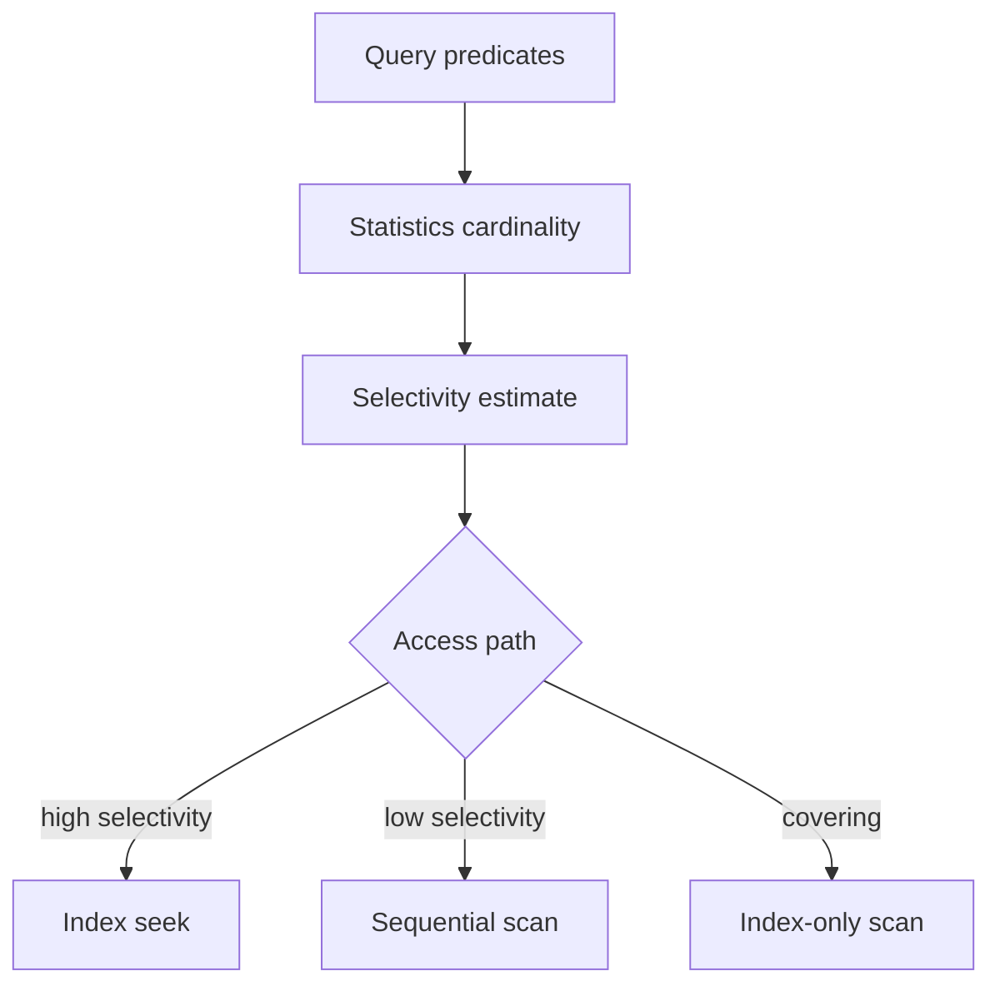
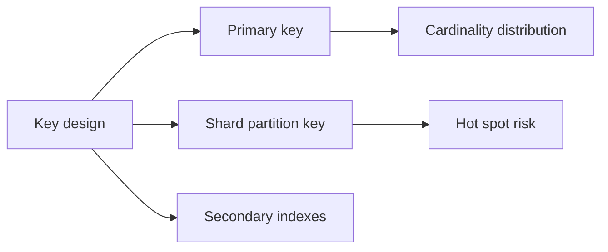
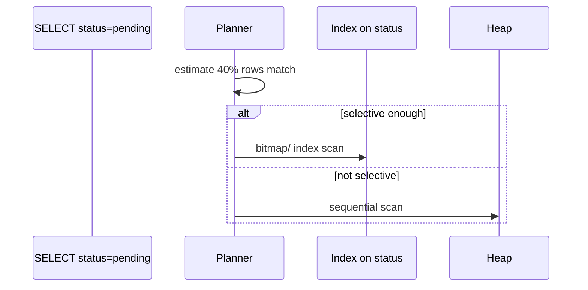

# Keys Cardinality and Access Paths

## Overview

**Cardinality** measures distinct values in a key or index prefix—driving **selectivity** and planner choices. **Access paths** are how engines reach rows: primary/secondary index seek, seq/coll scan, index-only scan, multikey expansion. Poor key choices (low-cardinality index alone, random UUID insert pattern without clustering consideration) destroy performance regardless of ORM quality.

## Learning Objectives

- Define cardinality and selectivity; relate to planner row estimates
- Choose primary keys for insert locality and join size
- Design compound index leading columns by equality selectivity
- Evaluate shard/partition keys for even distribution and query isolation
- Diagnose bad access paths with EXPLAIN and Mongo executionStats

## Prerequisites

- [[08-Databases/03-Indexing-on-Disk/Secondary Covering and Partial Indexes|Secondary Covering and Partial Indexes]]
- [[08-Databases/04-Query-Processing-and-Planning/Cost Models Statistics and Cardinality|Cost Models Statistics and Cardinality]]

## Difficulty

`intermediate`

## Estimated Time

- Reading: 2 hours
- Exercises: 3 hours
- Mini project: 4 hours

## History

Early databases taught B-tree efficiency assuming sequential keys; UUID v4 random PKs exposed insert fragmentation. Mongo sharding lessons emphasized **monotonic shard keys** causing hot chunks—cardinality alone insufficient without distribution shape.

## Problem It Solves

- **Index on boolean/status** with 50/50 split scanning half table
- **Hot shard** from `_id` or time-only shard key
- **UUID PK** causing Postgres page splits and bloat
- **Wrong compound order** negating index for common filters

## Internal Implementation



Selectivity ≈ matching_rows / total_rows. Compound index `(a,b)` usable when query filters leading prefix `a`.

## Mermaid Diagrams

### Structure



### Sequence / Lifecycle — planner path choice



## Examples

### Minimal Example — Postgres cardinality stats

```sql
CREATE TABLE events (
  id bigserial PRIMARY KEY,
  tenant_id int NOT NULL,
  status text NOT NULL,
  created_at timestamptz NOT NULL
);

CREATE INDEX events_tenant_status ON events (tenant_id, status);
ANALYZE events;

SELECT attname, n_distinct, correlation
FROM pg_stats
WHERE tablename = 'events' AND attname IN ('tenant_id', 'status');

EXPLAIN (ANALYZE, BUFFERS)
SELECT * FROM events WHERE tenant_id = 7 AND status = 'pending';
```

Prefer partial index for low-cardinality hot subset:

```sql
CREATE INDEX events_pending ON events (tenant_id, created_at DESC)
  WHERE status = 'pending';
```

### Production-Shaped Example — key choice checklist TypeScript

```typescript
// Design review artifact — access path driven keys
type AccessPathReview = {
  query: string;
  frequency: "hot" | "warm" | "cold";
  predicateSelectivity: string;
  proposedIndex: string;
  shardKeyFit?: string;
};

export const REVIEW: AccessPathReview[] = [
  {
    query: "list pending orders by tenant",
    frequency: "hot",
    predicateSelectivity: "tenant_id high; status filters to ~2%",
    proposedIndex: "(tenant_id, created_at DESC) WHERE status='pending'",
  },
  {
    query: "point lookup by order id",
    frequency: "hot",
    predicateSelectivity: "unique",
    proposedIndex: "PK on id (bigint serial or time-ordered UUIDv7)",
    shardKeyFit: "shard by tenant_id if multi-tenant scale",
  },
];
```

Mongo shard key caution:

```javascript
// Bad: monotonic _id only → hot chunk
// Better: { tenantId: 1, _id: 1 } for tenant-scoped growth
sh.shardCollection("shop.orders", { tenantId: 1, orderId: 1 });
```

## Trade-offs

| Dimension | High cardinality key | Low cardinality index | When it matters |
| --- | --- | --- | --- |
| Selectivity | Index useful | Seq scan cheaper | status flags |
| Insert pattern | Sequential PK local | Random UUID scatter | write rate |
| Shard key | Even spread | Hot spots | horizontal scale |
| Join width | Narrow PK types | Fat composite keys | memory |

### When to Use

- Partial indexes for low-cardinality hot subsets
- Compound indexes with equality columns first (ESR)
- Time-ordered IDs (bigint, UUIDv7) for insert locality when needed

### When Not to Use

- Index alone on boolean without partial predicate
- Shard key that doesn't appear in majority queries (scatter/gather)

## Exercises

1. Compare seq scan vs index scan for `status` with skewed distribution.
2. Measure insert throughput serial PK vs UUID v4 on Postgres.
3. Design compound index for three query patterns—justify column order.
4. Identify hot shard scenario in Mongo with monotonic key.
5. Read `pg_stats` before/after ANALYZE on bulk load.

## Mini Project

**Selectivity lab.** Generate skewed data; plot planner choices vs statistics accuracy.

## Portfolio Project

Access path workbook in [[08-Databases/projects/EXPLAIN Literacy Workbench/README|EXPLAIN Literacy Workbench]].

## Interview Questions

1. Define cardinality and selectivity.
2. Why index on low-cardinality column may be ignored?
3. UUID v4 PK downsides in B-trees?
4. Compound index leading column rule?
5. Shard key requirements beyond high cardinality?

### Stretch / Staff-Level

1. BRIN vs B-tree on time-series with correlation.
2. Extended statistics on correlated columns (Postgres).

## Common Mistakes

- Index every filter column independently
- Using only created_at as shard key
- Ignoring ANALYZE after large data changes
- Assuming ORM-generated PK is optimal for access paths

## Best Practices

- List hot queries before keys/indexes
- Monitor planner estimates vs actuals (EXPLAIN ANALYZE)
- Revisit keys at scale thresholds
- Link [[08-Databases/04-Query-Processing-and-Planning/EXPLAIN and EXPLAIN ANALYZE Literacy|EXPLAIN Literacy]]

## Summary

Keys and indexes exist to serve **access paths**, not ER diagrams alone. Cardinality drives selectivity and planner decisions; shard keys need even distribution and query alignment. Production modeling iterates with statistics and EXPLAIN evidence—high cardinality alone does not guarantee a good index.

## Further Reading

- [[00-References/Databases/README|Databases References]]
- PostgreSQL performance cardinality guides
- MongoDB shard key selection documentation

## Related Notes

- [[08-Databases/04-Query-Processing-and-Planning/Cost Models Statistics and Cardinality|Cost Models Statistics and Cardinality]]
- [[08-Databases/11-Modeling-and-Engine-Selection/Schema Design Driven by Queries|Schema Design Driven by Queries]]
- [[08-Databases/09-Document-Engines-MongoDB/Indexes on Documents and Multikey Behavior|Indexes on Documents and Multikey Behavior]]
- [[08-Databases/03-Indexing-on-Disk/Index-Only Scans and Visibility Map Hooks|Index-Only Scans and Visibility Map Hooks]]

## Progress Checklist

- [ ] Explained from first principles
- [ ] Drew at least one Mermaid diagram
- [ ] Implemented a minimal version
- [ ] Documented trade-offs and non-goals
- [ ] Completed exercises
- [ ] Practiced interview questions aloud
- [ ] Linked prerequisites and dependents
