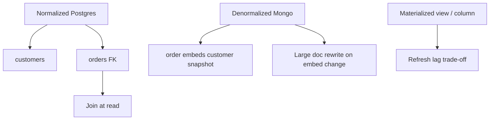
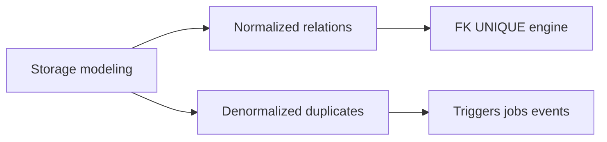
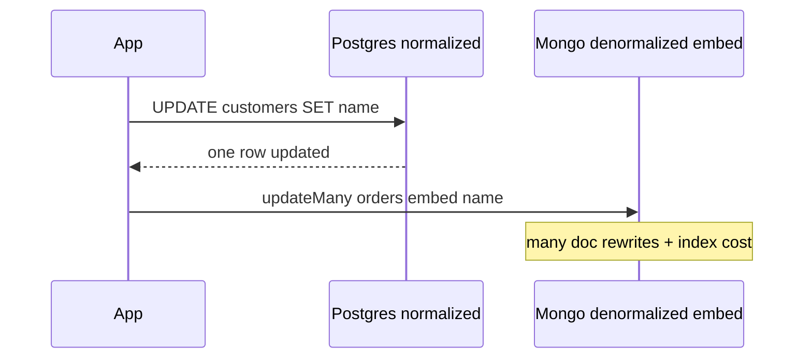

# Normalization vs Denormalization at Storage

## Overview

**Normalization** decomposes data to eliminate redundancy and update anomalies—natural in relational engines with constraints. **Denormalization** duplicates data to match read access paths—common in document embeds and materialized caches. At the **storage layer**, the choice affects write amplification, index size, vacuum/bloat, and join cost—not just ER diagram aesthetics.

This note focuses on **engine consequences** of normalized vs denormalized physical layouts.

## Learning Objectives

- Relate 1NF–3NF goals to update anomaly prevention at engine level
- Quantify read vs write trade-offs of denormalized columns/embeds
- Choose normalization for authoritative domains; denormalize with refresh strategy
- Connect Postgres FK/index story to Mongo embed story honestly
- Avoid denormalization without invalidation or rebuild plan

## Prerequisites

- [[08-Databases/00-Orientation/Relational Document and KV Contracts|Relational Document and KV Contracts]]
- [[08-Databases/01-Storage-and-Buffer-Pool/Heap Tables vs Clustered Layouts|Heap Tables vs Clustered Layouts]]

## Difficulty

`intermediate`

## Estimated Time

- Reading: 2 hours
- Exercises: 2.5 hours
- Mini project: 4 hours

## History

Normalization theory predates disk-oriented databases; denormalization returned with read-heavy web scales and document stores—often rediscovering maintenance cost when source columns change frequently.

## Problem It Solves

- **Update anomalies** when duplicated customer name changes in one place only
- **Join storms** when over-normalized schemas serve hot read paths
- **Document bloat** when embedding rarely-read history
- **Accidental denormalization** in Redis without TTL/invalidation (Backend handoff)

## Internal Implementation



Postgres normalized update touches one row + indexes on changed columns. Denormalized embed update may rewrite entire document and all multikey indexes touching changed fields.

## Mermaid Diagrams

### Structure



### Sequence / Lifecycle — customer rename propagation



## Examples

### Minimal Example — normalized Postgres

```sql
CREATE TABLE customers (id bigint PRIMARY KEY, name text NOT NULL);
CREATE TABLE orders (
  id bigint PRIMARY KEY,
  customer_id bigint NOT NULL REFERENCES customers(id),
  total_cents bigint NOT NULL
);

-- Single source of truth for name
UPDATE customers SET name = 'Acme Corp' WHERE id = 42;
```

Controlled denormalization:

```sql
ALTER TABLE orders ADD COLUMN customer_name text;
-- Maintain via trigger or application job — document refresh strategy
CREATE OR REPLACE FUNCTION sync_customer_name() RETURNS trigger AS $$
BEGIN
  UPDATE orders SET customer_name = NEW.name WHERE customer_id = NEW.id;
  RETURN NEW;
END;
$$ LANGUAGE plpgsql;
```

### Production-Shaped Example — read path comparison

```typescript
// Node 20+ — same logical read, different storage costs
import pg from "pg";
import { MongoClient } from "mongodb";

// Normalized: join cost, small updates
export async function getOrderPostgres(pool: pg.Pool, orderId: string) {
  const { rows } = await pool.query(
    `SELECT o.id, o.total_cents, c.name AS customer_name
     FROM orders o JOIN customers c ON c.id = o.customer_id
     WHERE o.id = $1`,
    [orderId],
  );
  return rows[0];
}

// Denormalized embed: one read, rewrite on customer name change
export async function getOrderMongo(client: MongoClient, orderId: string) {
  return client.db("shop").collection("orders").findOne({ _id: orderId });
}
```

## Trade-offs

| Dimension | Normalized | Denormalized | When it matters |
| --- | --- | --- | --- |
| Writes | Single row | Many duplicates | frequent renames |
| Reads | Join/index | Single fetch | read-heavy feeds |
| Integrity | FK engine | App/trigger discipline | compliance |
| Storage | Less duplicate | More bytes | archival scale |

### When to Use Normalization

- Authoritative entities with frequent updates (customers, prices)
- Reporting needing consistent joins
- Strong constraints required

### When to Use Denormalization

- Stable snapshot fields on read-heavy aggregates (ship-to address on order)
- Document engines with dominant single-doc read path
- Materialized summaries with batch refresh

## Exercises

1. Model orders/lines normalized 3NF; count joins for checkout read path.
2. Embed customer in Mongo order; estimate rewrite cost on email change at 1M orders.
3. Add denormalized column + trigger in Postgres; measure UPDATE customer cost.
4. Identify update anomaly scenario if denormalized without sync.
5. When is materialized view better than embed?

## Mini Project

**Rename storm benchmark.** Customer field change under normalized vs denormalized schemas; measure duration and IO.

## Portfolio Project

Normalization case studies in [[08-Databases/projects/Database Engines Workbench/README|Database Engines Workbench]].

## Interview Questions

1. Define update anomaly with example.
2. Engine-level cost of denormalized embed update in Mongo?
3. How can Postgres denormalize safely?
4. When is 3NF overkill?
5. Redis role in denormalization vs authority?

### Stretch / Staff-Level

1. Eventual consistency of denormalized projections in CQRS—boundary with System Design.
2. Partial denormalization via generated columns (Postgres).

## Common Mistakes

- Denormalizing every field "for speed" without measuring joins
- Embedded unbounded history in documents
- Denormalized Redis cache without invalidation (Backend)
- Confusing JSON column in Postgres with Mongo document model

## Best Practices

- Normalize first; denormalize with measured hot path evidence
- Document refresh strategy for every denormalized field
- Use constraints where engine supports them
- See [[08-Databases/11-Modeling-and-Engine-Selection/Schema Design Driven by Queries|Schema Design Driven by Queries]]

## Summary

Normalization minimizes redundant **write paths and anomalies** at the storage layer; denormalization buys **read path efficiency** with duplicate maintenance cost. Engine choice amplifies the trade-off: Postgres excels at normalized integrity; Mongo embeds shift cost to document rewrites. Denormalize deliberately with refresh contracts—not by default.

## Further Reading

- [[00-References/Databases/README|Databases References]]
- Database normalization references
- MongoDB embedding vs referencing guide

## Related Notes

- [[08-Databases/11-Modeling-and-Engine-Selection/Schema Design Driven by Queries|Schema Design Driven by Queries]]
- [[08-Databases/09-Document-Engines-MongoDB/Document Model and Storage Engines|Document Model and Storage Engines]]
- [[08-Databases/08-PostgreSQL-Engine/Constraints as Engine Invariants|Constraints as Engine Invariants]]
- [[08-Databases/11-Modeling-and-Engine-Selection/Keys Cardinality and Access Paths|Keys Cardinality and Access Paths]]

## Progress Checklist

- [ ] Explained from first principles
- [ ] Drew at least one Mermaid diagram
- [ ] Implemented a minimal version
- [ ] Documented trade-offs and non-goals
- [ ] Completed exercises
- [ ] Practiced interview questions aloud
- [ ] Linked prerequisites and dependents
