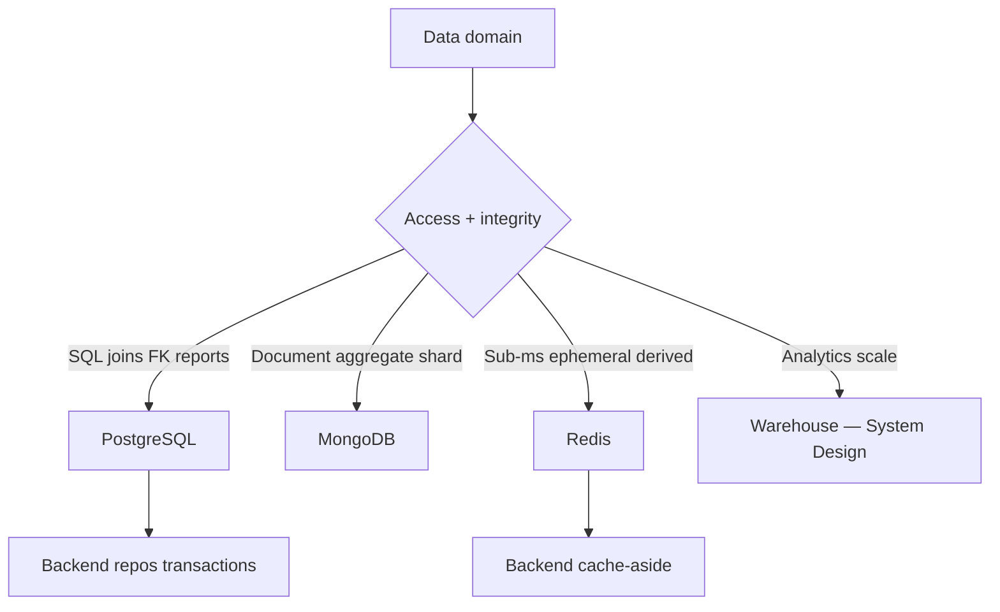
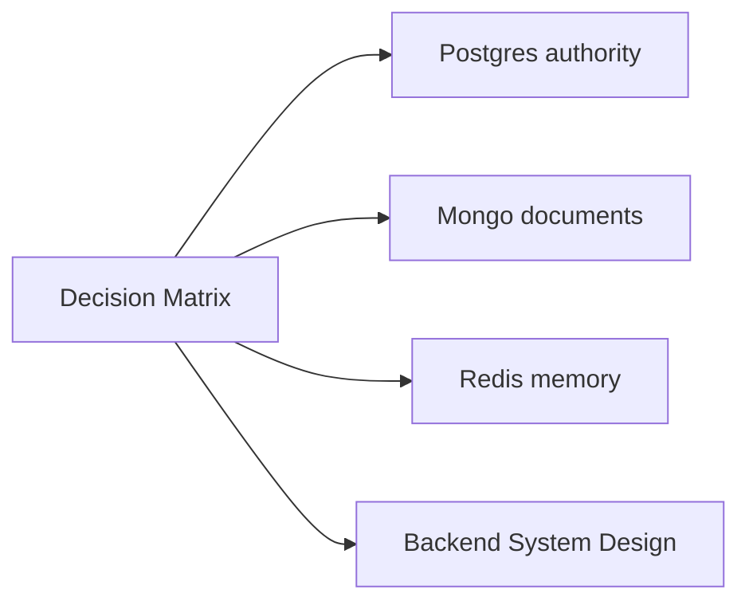
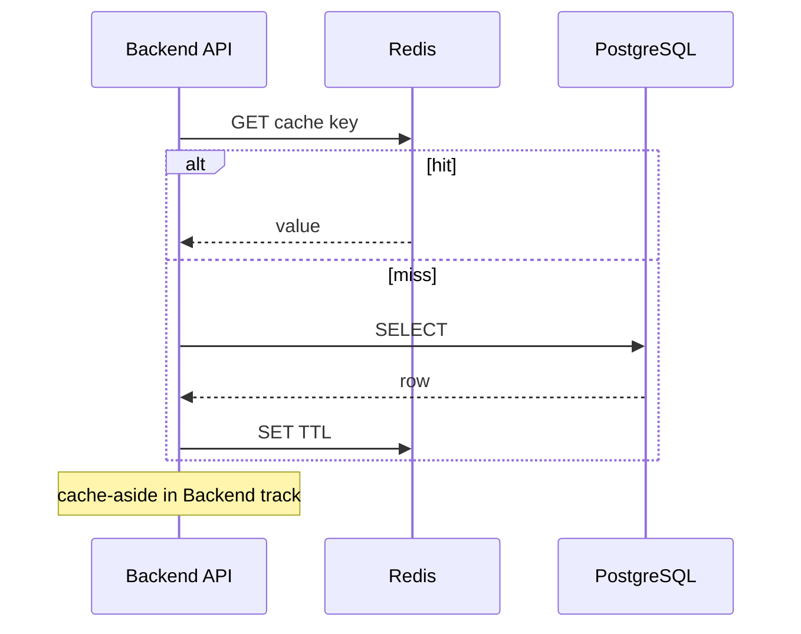

# PostgreSQL vs MongoDB vs Redis Decision Matrix

## Overview

Production systems often use **all three engines** in distinct roles. This matrix compares **engine capabilities**—durability, query model, consistency, ops—not "pick one winner." Postgres is default **system of record** for relational invariants; Mongo for aggregate/document workloads; Redis for **in-memory** acceleration and narrow primary domains.

Educational TypeScript labs in this track **do not replace** real engines.

## Learning Objectives

- Apply weighted criteria to engine choice with explicit trade-offs
- Assign data domains to Postgres, Mongo, Redis, or warehouse
- Avoid Redis-as-database and Mongo-as-warehouse anti-patterns
- Document handoffs to Backend (repos, cache-aside) and System Design (sharding CAP)
- Produce ADR-ready decision for sample product

## Prerequisites

- [[08-Databases/08-PostgreSQL-Engine/Catalogs System Tables and Types|Catalogs System Tables and Types]]
- [[08-Databases/09-Document-Engines-MongoDB/When Document Engines Win or Lose|When Document Engines Win or Lose]]
- [[08-Databases/10-Redis-and-In-Memory-Engines/Redis as Cache vs Primary Store|Redis as Cache vs Primary Store]]

## Difficulty

`intermediate`

## Estimated Time

- Reading: 1.5 hours
- Exercises: 2 hours
- Mini project: 3 hours

## History

"Pick one database" debates ignored complementary roles. Mature stacks standardized **Postgres authority + Redis cache + optional Mongo/warehouse** with written boundaries.

## Problem It Solves

- **Single-engine force-fit** causing `$lookup` hell or Redis data loss
- **Missing matrix** in ADRs—decisions by hype
- **Blurred ownership** between Databases, Backend, System Design tracks

## Internal Implementation



## Decision Matrix

| Criterion | PostgreSQL | MongoDB | Redis |
| --- | --- | --- | --- |
| Durability default | WAL + fsync strong | Journal + write concern | AOF optional; memory bound |
| Query model | SQL joins planner | Documents aggregation | Key structure commands |
| Integrity | FK CHECK constraints | Schema validation app | None engine-level |
| Latency | ms OLTP tuned | ms document paths | sub-ms in-memory |
| Scale vertical | Large single node | Sharding native story | Cluster memory scale |
| Ops maturity | PITR backups rich | Replica set ops | Eviction persistence tuning |
| Best role | System of record | Flexible aggregates | Cache / narrow primary |

## Mermaid Diagrams

### Structure



### Sequence / Lifecycle — typical request path



## Examples

### Minimal Example — domain assignment

```text
Payments ledger        → PostgreSQL (ACID, FK, reporting SQL)
Product CMS blobs      → MongoDB (nested content, flexible fields)
Session tokens         → Redis primary (TTL, fast revoke list)
Product detail cache   → Redis cache-aside ← Backend pattern
Cross-region CAP plan  → System Design track (not this matrix alone)
```

### Production-Shaped Example — weighted scorer

```typescript
type Engine = "postgres" | "mongo" | "redis";

type Row = {
  criterion: string;
  weight: number;
  scores: Record<Engine, number>; // 0-10
};

const MATRIX: Row[] = [
  { criterion: "Referential integrity", weight: 5, scores: { postgres: 10, mongo: 5, redis: 0 } },
  { criterion: "Aggregate document reads", weight: 3, scores: { postgres: 6, mongo: 9, redis: 2 } },
  { criterion: "Sub-ms read SLA", weight: 4, scores: { postgres: 5, mongo: 6, redis: 10 } },
  { criterion: "Ad hoc SQL BI", weight: 4, scores: { postgres: 10, mongo: 4, redis: 0 } },
  { criterion: "Operational durability", weight: 5, scores: { postgres: 10, mongo: 7, redis: 4 } },
];

export function score(engine: Engine): number {
  return MATRIX.reduce((s, r) => s + r.weight * r.scores[engine], 0);
}
```

## Trade-offs

| Dimension | Multi-engine upside | Multi-engine downside | When it matters |
| --- | --- | --- | --- |
| Right tool | Optimal per domain | Ops complexity | growing teams |
| Postgres center | One source of truth | Not all shapes fit | default architecture |
| Redis cache | Latency | Staleness | read-heavy |
| Mongo middle | Flexible | Join/report pain | content catalogs |

### When to Use Each

- **Postgres**: money, inventory, users, anything needing FK + SQL reports
- **Mongo**: document-native aggregates, flexible schema with validation
- **Redis**: cache, rate limits, leaderboards, sessions (with durability plan)

### When Not to Use

- Redis for ledger; Mongo for complex relational BI without migration plan
- Postgres JSON alone vs full Mongo without access path justification

## Exercises

1. Score three hypothetical products using weighted matrix; defend winner per domain.
2. Identify anti-pattern in architecture diagram using all Redis.
3. Write one-paragraph handoff to System Design for global sharding need.
4. Map Backend concerns (outbox, cache-aside) out of this matrix explicitly.
5. Red-team: Mongo chosen for payments—list failure modes.

## Mini Project

**ADR template fill.** Real or fictional feature; complete matrix + domain table + ops checklist.

## Portfolio Project

Tri-engine reference architecture in [[08-Databases/projects/Database Engines Workbench/README|Database Engines Workbench]].

## Interview Questions

1. Default system of record choice and why?
2. When Mongo over Postgres despite JSON columns?
3. Redis durability vs Postgres—honest comparison?
4. What belongs in System Design not this matrix?
5. cache-aside—why Backend track?

### Stretch / Staff-Level

1. Hybrid transactional outbox Postgres → Mongo projection boundaries.
2. Cost model: managed Postgres + Redis vs self-hosted Mongo cluster.

## Common Mistakes

- Claiming educational engines replace production databases
- One Redis cluster for cache + primary without isolation
- Mongo for everything "because JSON API"
- Ignoring warehouse for analytics at Postgres scale

## Best Practices

- Postgres by default; exceptions require ADR
- Separate Redis roles/instances
- Write concern / WAL settings match domain authority
- Link [[08-Databases/11-Modeling-and-Engine-Selection/Handoff Back to Backend Repositories|Backend Handoff]]

## Summary

The tri-engine matrix assigns **Postgres for integrity and SQL**, **Mongo for document aggregates**, **Redis for memory-speed derived or narrow primary data**—often together. Decisions weigh durability, access paths, and ops honestly. Backend owns cache-aside and repositories; System Design owns multi-region CAP; this track owns engine mechanics.

## Further Reading

- [[00-References/Databases/README|Databases References]]
- Vendor-neutral architecture patterns
- [[07-Backend/08-Data-Access-and-Persistence-Patterns/Handing Off to Database Engines|Handing Off to Database Engines]]

## Related Notes

- [[08-Databases/09-Document-Engines-MongoDB/When Document Engines Win or Lose|When Document Engines Win or Lose]]
- [[08-Databases/10-Redis-and-In-Memory-Engines/Redis as Cache vs Primary Store|Redis as Cache vs Primary Store]]
- [[08-Databases/11-Modeling-and-Engine-Selection/Schema Design Driven by Queries|Schema Design Driven by Queries]]
- [[09-System-Design/README|System Design]]

## Progress Checklist

- [ ] Explained from first principles
- [ ] Drew at least one Mermaid diagram
- [ ] Implemented a minimal version
- [ ] Documented trade-offs and non-goals
- [ ] Completed exercises
- [ ] Practiced interview questions aloud
- [ ] Linked prerequisites and dependents
