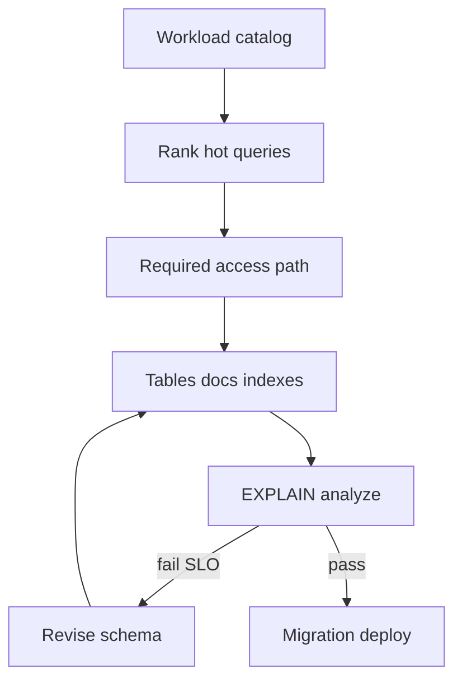
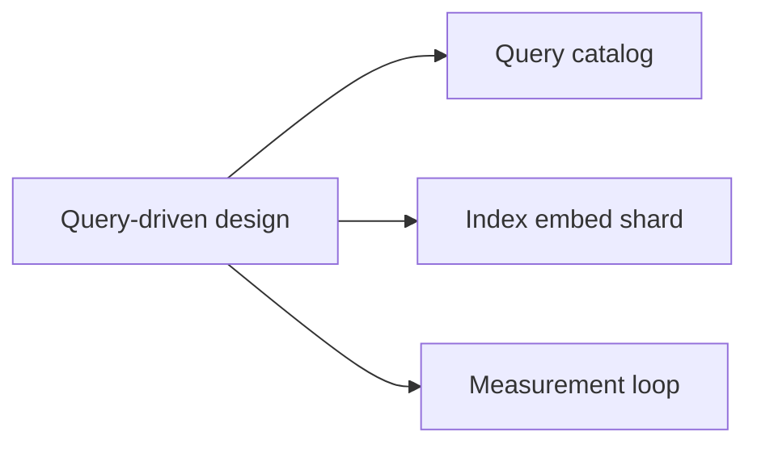
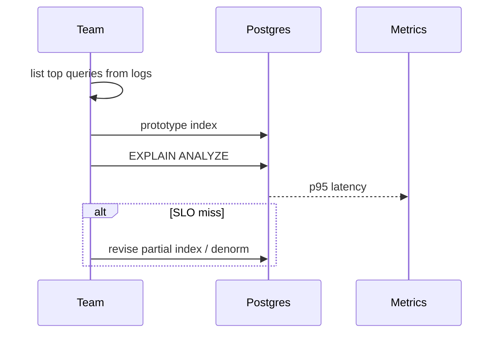

# Schema Design Driven by Queries

## Overview

**Query-driven schema design** starts from **workload**: list hot reads/writes, latency SLOs, consistency needs—then choose tables/documents, keys, indexes, and denormalization. ER diagrams alone produce normalized schemas that join poorly at scale. This method aligns physical layout with **engine access paths** across Postgres, Mongo, and Redis roles.

## Learning Objectives

- Produce a workload catalog (QPS, payload, consistency) before DDL
- Map each hot query to index/access path or embed decision
- Iterate schema with EXPLAIN/executionStats feedback loops
- Document anti-queries (analytics) routed to replicas/warehouse
- Reject schema changes that optimize cold paths at hot path expense

## Prerequisites

- [[08-Databases/11-Modeling-and-Engine-Selection/Keys Cardinality and Access Paths|Keys Cardinality and Access Paths]]
- [[08-Databases/04-Query-Processing-and-Planning/Access Paths Seq Scan vs Index|Access Paths Seq Scan vs Index]]

## Difficulty

`intermediate`

## Estimated Time

- Reading: 2 hours
- Exercises: 3 hours
- Mini project: 5 hours

## History

"NoSQL" era sometimes skipped schema design entirely; performance regressions revived **access-path-first** thinking—now standard in Postgres (partial indexes) and Mongo (compound ESR) alike.

## Problem It Solves

- **Schema by analogy** copying tutorials unrelated to workload
- **Missing indexes** on production's top ten queries
- **Over-indexing** slowing writes for rare reports
- **Wrong engine** for access pattern (see decision matrix note)

## Internal Implementation



## Mermaid Diagrams

### Structure



### Sequence / Lifecycle — design iteration



## Examples

### Minimal Example — workload table

```text
| Query ID | Pattern                          | QPS | p95 target | Consistency |
|----------|----------------------------------|-----|------------|-------------|
| Q1       | get order by id                  | 800 | 20ms       | strong      |
| Q2       | list pending by tenant + sort  | 400 | 50ms       | strong      |
| Q3       | nightly revenue aggregate        | 1   | 30min ok   | snapshot ok |
```

Schema response:

```sql
-- Q1: PK on orders.id
-- Q2: partial index (tenant_id, created_at) WHERE status='pending'
-- Q3: route to replica or warehouse — not OLTP index explosion
```

### Production-Shaped Example — query catalog in repo

```typescript
// Node 20+ — typed query catalog linking to migrations
export type QuerySpec = {
  id: string;
  sqlOrFilter: string;
  engine: "postgres" | "mongo" | "redis";
  sloMs: number;
  indexOrStructure: string;
};

export const QUERY_CATALOG: QuerySpec[] = [
  {
    id: "Q1",
    sqlOrFilter: "SELECT * FROM orders WHERE id = $1",
    engine: "postgres",
    sloMs: 20,
    indexOrStructure: "PRIMARY KEY (id)",
  },
  {
    id: "Q2",
    sqlOrFilter: "{ tenantId, status:'pending' } sort createdAt",
    engine: "mongo",
    sloMs: 50,
    indexOrStructure: "{ tenantId:1, status:1, createdAt:-1 }",
  },
  {
    id: "Q4",
    sqlOrFilter: "GET product:{id}",
    engine: "redis",
    sloMs: 5,
    indexOrStructure: "cache-aside TTL 300s — Backend owns pattern",
  },
];
```

## Trade-offs

| Dimension | Upside | Downside | When it matters |
| --- | --- | --- | --- |
| Query-first | Fast hot paths | Cold query pain | OLTP products |
| Partial indexes | Small; targeted | Must match predicate | status filters |
| Embed | One read | Write amplification | order lines |
| Many indexes | Flexible reads | Write cost | churn tables |

### When to Use

- Every production schema revision tied to measured query
- Partial/compound indexes matching exact filters + sort
- Explicit routing for analytics off primary

### When Not to Use

- Do not optimize schema for admin-only queries at OLTP expense
- Do not skip validation after migration (ANALYZE, canary EXPLAIN)

## Exercises

1. Build workload catalog from hypothetical API routes; derive Postgres DDL.
2. Take one slow query; fix with partial index; document before/after EXPLAIN.
3. Same for Mongo with compound ESR index.
4. Mark queries that must not hit primary—replica/warehouse plan.
5. Peer review: find orphan indexes unused by catalog.

## Mini Project

**Query catalog repo.** Markdown + CI check that each hot query id appears in migration index comments.

## Portfolio Project

Query-driven redesign exercise in [[08-Databases/projects/EXPLAIN Literacy Workbench/README|EXPLAIN Literacy Workbench]].

## Interview Questions

1. Steps in query-driven schema design?
2. Purpose of partial index with example?
3. How decide embed vs reference in Mongo from queries?
4. When move query off OLTP primary?
5. Role of EXPLAIN in design loop?

### Stretch / Staff-Level

1. Multi-tenant schema: shared table vs schema-per-tenant access paths.
2. Generated columns vs denormalized copy for read optimization.

## Common Mistakes

- Designing schema in vacuum without production query logs
- Indexing for ORM default queries not real API traffic
- Optimizing aggregates on primary during peak
- Forgetting Redis is not query engine for ad hoc SQL

## Best Practices

- Maintain query catalog alongside migrations
- Review quarterly with slow query logs
- Canary EXPLAIN after deploy
- Cross-link [[08-Databases/11-Modeling-and-Engine-Selection/PostgreSQL vs MongoDB vs Redis Decision Matrix|Decision Matrix]]

## Summary

Schema follows **queries**, not the reverse. Catalog hot paths, assign access structures, measure with EXPLAIN/executionStats, and route cold analytics elsewhere. Query-driven design is how engine knowledge converts to predictable latency—not theoretical normalization alone.

## Further Reading

- [[00-References/Databases/README|Databases References]]
- Use The Index, Luke (concepts apply cross-engine)
- MongoDB schema design patterns

## Related Notes

- [[08-Databases/11-Modeling-and-Engine-Selection/Keys Cardinality and Access Paths|Keys Cardinality and Access Paths]]
- [[08-Databases/11-Modeling-and-Engine-Selection/Normalization vs Denormalization at Storage|Normalization vs Denormalization at Storage]]
- [[08-Databases/04-Query-Processing-and-Planning/EXPLAIN and EXPLAIN ANALYZE Literacy|EXPLAIN and EXPLAIN ANALYZE Literacy]]
- [[08-Databases/09-Document-Engines-MongoDB/Aggregation Pipeline as Execution|Aggregation Pipeline as Execution]]

## Progress Checklist

- [ ] Explained from first principles
- [ ] Drew at least one Mermaid diagram
- [ ] Implemented a minimal version
- [ ] Documented trade-offs and non-goals
- [ ] Completed exercises
- [ ] Practiced interview questions aloud
- [ ] Linked prerequisites and dependents
