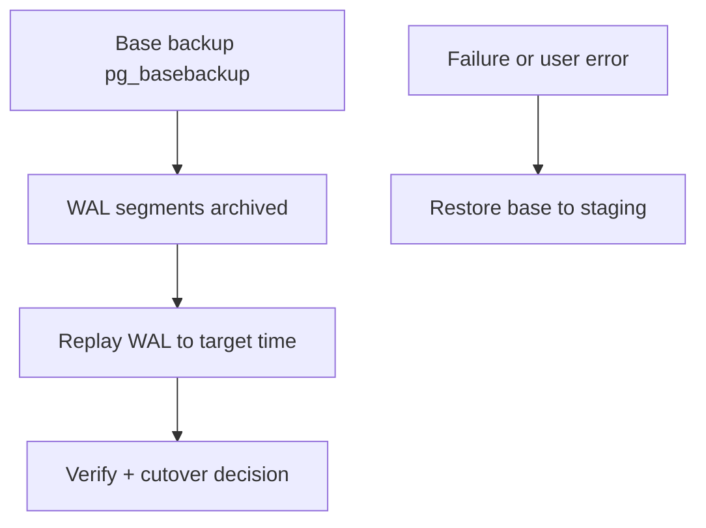
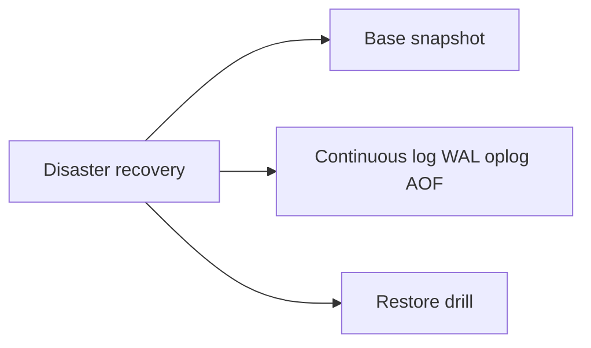
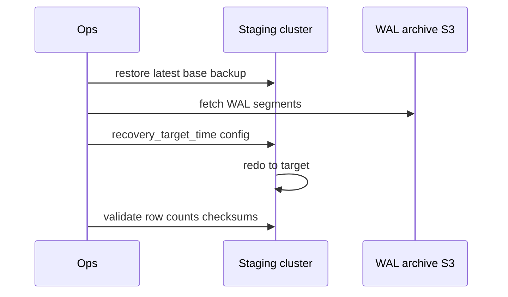

# Backups PITR and Restore Drills

## Overview

**Backups** capture recoverable state; **PITR (Point-In-Time Recovery)** replays WAL/archive logs to restore to a moment before accidental DELETE or corruption. **Restore drills** prove RPO/RTO claims—untested backups are folklore. Engines differ: Postgres PITR is mature; MongoDB oplog/continuous backup; Redis RDB/AOF snapshots.

Container orchestration of backup jobs → [[16-DevOps/README|DevOps]]; this note owns **engine recovery mechanics**.

## Learning Objectives

- Define RPO/RTO for Postgres, Mongo, Redis roles in architecture
- Explain Postgres base backup + WAL archive → PITR flow
- Document Mongo restore from snapshot + oplog (conceptual)
- Plan Redis restore limitations with AOF/RDB honestly
- Execute quarterly restore drill checklist

## Prerequisites

- [[08-Databases/02-WAL-Durability-and-Recovery/Checkpoints and Dirty Page Flushing|Checkpoints and Dirty Page Flushing]]
- [[08-Databases/02-WAL-Durability-and-Recovery/Crash Recovery Redo and Undo Concepts|Crash Recovery Redo and Undo Concepts]]

## Difficulty

`advanced`

## Estimated Time

- Reading: 2.5 hours
- Exercises: 3 hours
- Mini project: 6 hours

## History

PITR saved organizations from operator `DROP TABLE` incidents since archived WAL became standard. Cloud managed databases productized PITR sliders—shifting skill to **drill discipline** and **restore verification** not tape ops.

## Problem It Solves

- **Backup exists but restore untested** until ransomware event
- **Wrong RPO assumption** with daily snapshots only
- **Redis mistaken as backed-up** system of record
- **Partial restore** confusion (table vs cluster)

## Internal Implementation

Postgres PITR:



| Engine | Primary mechanism | PITR granularity |
| --- | --- | --- |
| PostgreSQL | Base backup + WAL archive | Timestamp/LSN |
| MongoDB | Cloud backup / filesystem snapshot + oplog | Depends on product |
| Redis | RDB + AOF files | Seconds window (AOF everysec) |

## Mermaid Diagrams

### Structure



### Sequence / Lifecycle — Postgres PITR



## Examples

### Minimal Example — Postgres archive config

```conf
# postgresql.conf
archive_mode = on
archive_command = 'aws s3 cp %p s3://mybucket/wal/%f'
wal_level = replica
```

Restore target (conceptual):

```conf
# recovery.signal + postgresql.conf on restored instance
restore_command = 'aws s3 cp s3://mybucket/wal/%f %p'
recovery_target_time = '2026-07-22 14:30:00+00'
recovery_target_action = 'promote'
```

### Production-Shaped Example — drill runbook TypeScript checklist

```typescript
export type DrillStep = {
  id: string;
  action: string;
  owner: "DBA" | "SRE" | "App";
  verify: string;
  maxMinutes: number;
};

export const POSTGRES_PITR_DRILL: DrillStep[] = [
  {
    id: "1",
    action: "Restore latest base backup to isolated staging",
    owner: "DBA",
    verify: "pg_ctl status healthy",
    maxMinutes: 60,
  },
  {
    id: "2",
    action: "Apply WAL to T-5min before synthetic incident time",
    owner: "DBA",
    verify: "recovery_target reached; no errors in log",
    maxMinutes: 90,
  },
  {
    id: "3",
    action: "Run app read-only smoke queries against staging",
    owner: "App",
    verify: "order count within 0.1% of expected",
    maxMinutes: 30,
  },
  {
    id: "4",
    action: "Document actual RTO; update runbook gaps",
    owner: "SRE",
    verify: "postmortem ticket if RTO > SLO",
    maxMinutes: 30,
  },
];

// Redis drill: restore RDB+AOF to staging; measure data loss window — see Redis persistence notes
```

MongoDB Atlas PITR (operational concept):

```text
1. Enable continuous cloud backup on cluster
2. Choose restore time via UI/API to new cluster
3. Repoint app via connection string cutover (Backend deploy)
4. Validate oplog window covers incident discovery delay
```

## Trade-offs

| Dimension | Upside | Downside | When it matters |
| --- | --- | --- | --- |
| PITR | Minute-level recovery | Storage + ops cost | operator errors |
| Daily snapshot only | Simple | Hours RPO | low-stakes dev |
| Redis AOF | Fast restore | Not full PITR | sessions only |
| Cross-region copy | Survives region loss | Replication lag | DR tier |

### When to Use

- Postgres WAL archiving + PITR for system of record
- Quarterly automated restore drills to staging
- Separate backup retention from production access (least privilege)

### When Not to Use

- Do not claim Redis AOF equals Postgres PITR for ledger
- Do not skip drill because "managed service handles it"

## Exercises

1. Calculate RPO with hourly snapshots vs continuous WAL.
2. Walk through restoring Postgres base backup locally (lab).
3. Simulate `DROP TABLE`; restore to pre-drop time on staging.
4. Redis: restore AOF; document commands lost under everysec.
5. Write drill postmortem template for failed restore step.

## Mini Project

**Staging restore automation.** Script base restore + WAL fetch (lab S3/minio) with verification SQL.

## Portfolio Project

DR section in [[08-Databases/projects/Database Engines Workbench/README|Database Engines Workbench]].

## Interview Questions

1. Difference backup vs PITR?
2. Postgres components needed for PITR?
3. Define RPO and RTO with example.
4. Redis restore limitations vs Postgres?
5. Why restore drills mandatory?

### Stretch / Staff-Level

1. Table-level recovery via pg_restore into temp schema vs full PITR.
2. Legal hold backups vs retention policy conflict.

## Common Mistakes

- WAL archive misconfigured silently (archive_command failures ignored)
- Restoring into production without isolation
- No checksum validation after restore
- Assuming Mongo snapshot without oplog covers all windows

## Best Practices

- Monitor archive failures immediately
- Immutable off-site backups
- Test app connection to restored staging
- Pair with [[08-Databases/12-Production-Database-Ops/Roles TLS and Least Privilege to the Database|Least Privilege]]

## Summary

Backups prove nothing until **restore drills succeed**. Postgres PITR via base backup + WAL is the gold standard for relational authority; Mongo and Redis have narrower recovery stories requiring honest RPO. Engine ops owns recovery mechanics; DevOps owns job scheduling; Backend owns cutover deploys.

## Further Reading

- [[00-References/Databases/README|Databases References]]
- PostgreSQL continuous archiving documentation
- MongoDB backup methods documentation

## Related Notes

- [[08-Databases/02-WAL-Durability-and-Recovery/Write-Ahead Logging Protocol|Write-Ahead Logging Protocol]]
- [[08-Databases/10-Redis-and-In-Memory-Engines/RDB Snapshots and AOF|RDB Snapshots and AOF]]
- [[08-Databases/07-Replication-Mechanics/WAL Shipping and Streaming Replication|WAL Shipping and Streaming Replication]]
- [[16-DevOps/README|DevOps]]

## Progress Checklist

- [ ] Explained from first principles
- [ ] Drew at least one Mermaid diagram
- [ ] Implemented a minimal version
- [ ] Documented trade-offs and non-goals
- [ ] Completed exercises
- [ ] Practiced interview questions aloud
- [ ] Linked prerequisites and dependents
