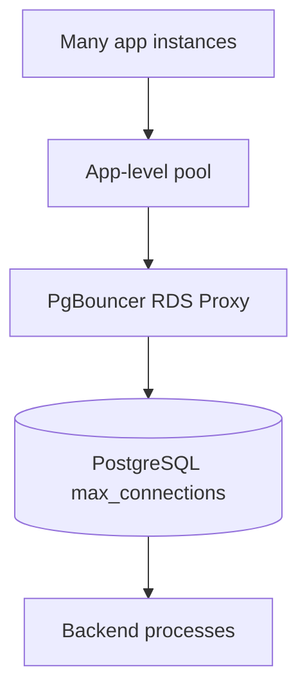
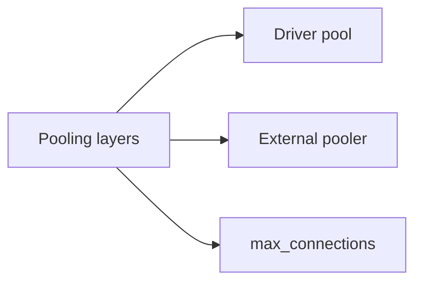
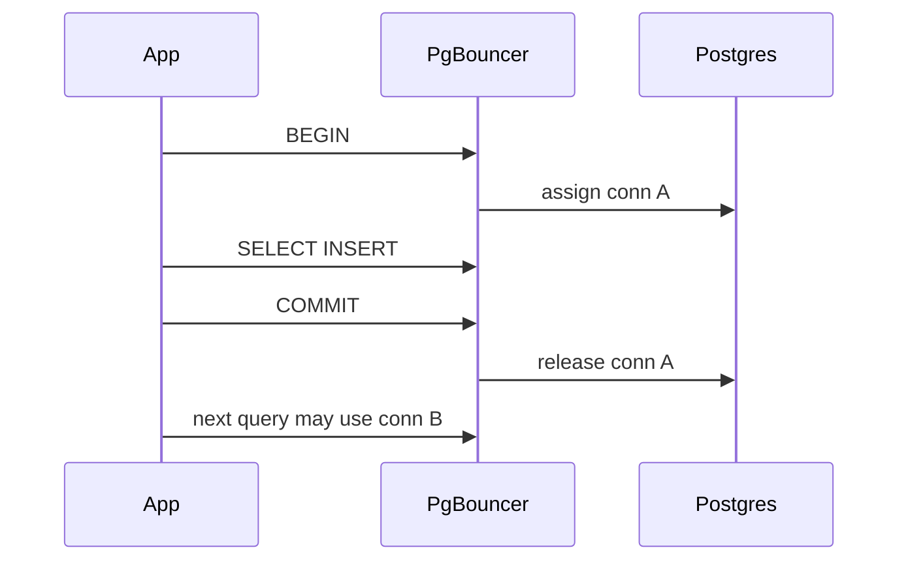

# Connection Pooling at Engine and Proxy

## Overview

Each database **connection** consumes memory and file descriptors on the engine. Application **connection pools** reuse TCP sessions; **poolers** (PgBouncer, RDS Proxy, Mongo pool at driver) multiplex many clients onto fewer backend connections. Misconfigured pooling causes **connection storms**, **prepared statement breakage**, and **idle transaction** pileups.

This note covers **engine-side limits** and pooler modes—not Express app architecture (Backend).

## Learning Objectives

- Explain Postgres `max_connections` vs app pool size vs PgBouncer pool
- Choose PgBouncer transaction vs session pooling trade-offs
- Configure Node `pg` pool and Mongo driver maxPoolSize responsibly
- Diagnose "too many connections" and pool wait timeouts
- Place RDS Proxy / HAProxy in architecture without duplicating DevOps container content

## Prerequisites

- [[08-Databases/12-Production-Database-Ops/Operational Readiness for Database Engines|Operational Readiness for Database Engines]]
- [[07-Backend/08-Data-Access-and-Persistence-Patterns/Handing Off to Database Engines|Handing Off to Database Engines]]

## Difficulty

`intermediate`

## Estimated Time

- Reading: 2 hours
- Exercises: 2.5 hours
- Mini project: 4 hours

## History

Postgres fork-per-connection model made poolers essential at microservice scale. Serverless spikes drove **transaction-mode** poolers and managed proxies—each with prepared statement and advisory lock caveats.

## Problem It Solves

- **Postgres OOM** from 500 microservices × 20 connections each
- **Latency tail** from connection establishment per request
- **Pool exhaustion** when transactions hold connections minutes
- **Serverless thundering herd** on cold start

## Internal Implementation



Postgres connection cost: ~5–10MB RAM each (work_mem not included). Rule: **total client pools ≤ max_connections − admin headroom**, often solved by pooler not raising max_connections blindly.

PgBouncer modes:

| Mode | Backend conn hold | Prepared stmts | Advisory locks |
| --- | --- | --- | --- |
| Session | Whole client session | OK | OK |
| Transaction | Per transaction | Tricky | Risky |
| Statement | Per statement | Limited | Risky |

## Mermaid Diagrams

### Structure



### Sequence / Lifecycle — transaction pooling



## Examples

### Minimal Example — Postgres limits

```sql
SHOW max_connections;
SELECT count(*) FROM pg_stat_activity;

-- Kill idle in transaction
SELECT pg_terminate_backend(pid)
FROM pg_stat_activity
WHERE state = 'idle in transaction'
  AND now() - xact_start > interval '5 minutes';
```

PgBouncer snippet:

```ini
[databases]
app = host=postgres port=5432 dbname=app

[pgbouncer]
pool_mode = transaction
default_pool_size = 50
max_client_conn = 2000
```

### Production-Shaped Example — TypeScript pool config

```typescript
// Node 20+ / pg 8.x — size pool from concurrency not pod count alone
import pg from "pg";

const pool = new pg.Pool({
  host: process.env.PGHOST,
  database: process.env.PGDATABASE,
  user: process.env.PGUSER,
  password: process.env.PGPASSWORD,
  max: Number(process.env.PG_POOL_MAX ?? 10), // per process
  idleTimeoutMillis: 30_000,
  connectionTimeoutMillis: 5_000,
  // transaction pooling: avoid session-level SET without DISCARD
});

pool.on("error", (err) => {
  console.error(JSON.stringify({ event: "pg_pool_error", message: err.message }));
});

export async function withTransaction<T>(fn: (c: pg.PoolClient) => Promise<T>): Promise<T> {
  const client = await pool.connect();
  try {
    await client.query("BEGIN");
    const result = await fn(client);
    await client.query("COMMIT");
    return result;
  } catch (e) {
    await client.query("ROLLBACK");
    throw e;
  } finally {
    client.release(); // return to pool promptly
  }
}
```

Mongo driver:

```typescript
import { MongoClient } from "mongodb";

const client = new MongoClient(process.env.MONGODB_URI!, {
  maxPoolSize: 50,
  minPoolSize: 5,
  maxIdleTimeMS: 30_000,
  waitQueueTimeoutMS: 5_000,
});
```

## Trade-offs

| Dimension | Upside | Downside | When it matters |
| --- | --- | --- | --- |
| App pool | Simple | N×pods connections | small deploys |
| PgBouncer | Massive multiplex | Mode constraints | microservices |
| High max_connections | Avoids pooler | RAM exhaustion | avoid |
| Long transactions | Business need | Pool starvation | checkout flows |

### When to Use

- PgBouncer transaction mode for many stateless API workers
- Pool size tuned from measured concurrent queries per process
- `idle_in_transaction_session_timeout` on Postgres

### When Not to Use

- Session pooling features (temp tables, SET per session) with transaction pooler without care
- Pool max = 100 per pod × 100 pods without proxy

## Exercises

1. Calculate total connections: pods × pool max vs max_connections.
2. Demonstrate prepared statement issue under transaction pooling (document workaround).
3. Simulate pool exhaustion with held transactions; observe wait timeouts.
4. Compare Mongo `maxPoolSize` tuning vs Postgres for same service.
5. Write runbook snippet for "too many connections" incident.

## Mini Project

**Pool stress test.** pgbench or k6 against app with varying pool sizes; graph latency vs connection count.

## Portfolio Project

Pooling calculator in [[08-Databases/projects/Database Engines Workbench/README|Database Engines Workbench]].

## Interview Questions

1. Why pool connections at app and proxy layers?
2. PgBouncer transaction vs session mode?
3. What is idle in transaction and why dangerous for pools?
4. How size pg pool per Node process?
5. Mongo driver pool parameters?

### Stretch / Staff-Level

1. RDS Proxy vs PgBouncer feature comparison.
2. Serverless connection storm mitigation patterns.

## Common Mistakes

- `max_connections = 10000` instead of pooler
- Holding connections across await to external HTTP
- Ignoring `pg_stat_activity` wait events
- Prepared statements with transaction pooling without DISCARD ALL strategy

## Best Practices

- Release connections immediately after transaction
- Set statement and idle-in-transaction timeouts
- Monitor pool wait time and active connections
- Container/k8s deployment → [[16-DevOps/README|DevOps]]

## Summary

Connection pooling protects the **engine from connection memory death** while keeping app latency low. Size pools from concurrency; multiplex with PgBouncer or managed proxy at scale; avoid long idle transactions hogging slots. Pooling is joint Backend config and engine ops—not unlimited connections on Postgres.

## Further Reading

- [[00-References/Databases/README|Databases References]]
- PgBouncer documentation
- PostgreSQL connection management best practices

## Related Notes

- [[08-Databases/12-Production-Database-Ops/Operational Readiness for Database Engines|Operational Readiness for Database Engines]]
- [[08-Databases/06-Concurrency-Internals/Long Transactions and Snapshot Horizons|Long Transactions and Snapshot Horizons]]
- [[07-Backend/08-Data-Access-and-Persistence-Patterns/Transactions as Used by Services|Transactions as Used by Services]]
- [[16-DevOps/README|DevOps]]

## Progress Checklist

- [ ] Explained from first principles
- [ ] Drew at least one Mermaid diagram
- [ ] Implemented a minimal version
- [ ] Documented trade-offs and non-goals
- [ ] Completed exercises
- [ ] Practiced interview questions aloud
- [ ] Linked prerequisites and dependents
