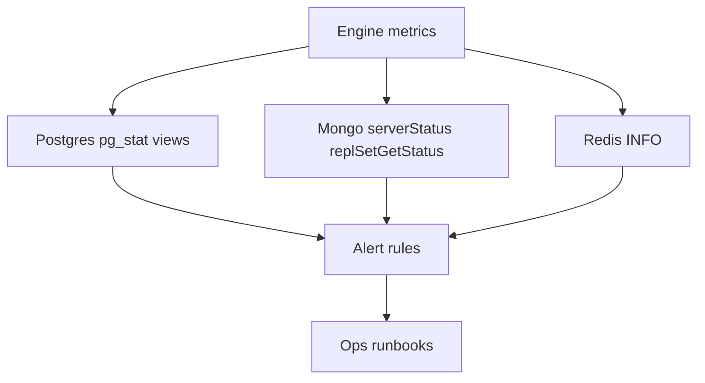
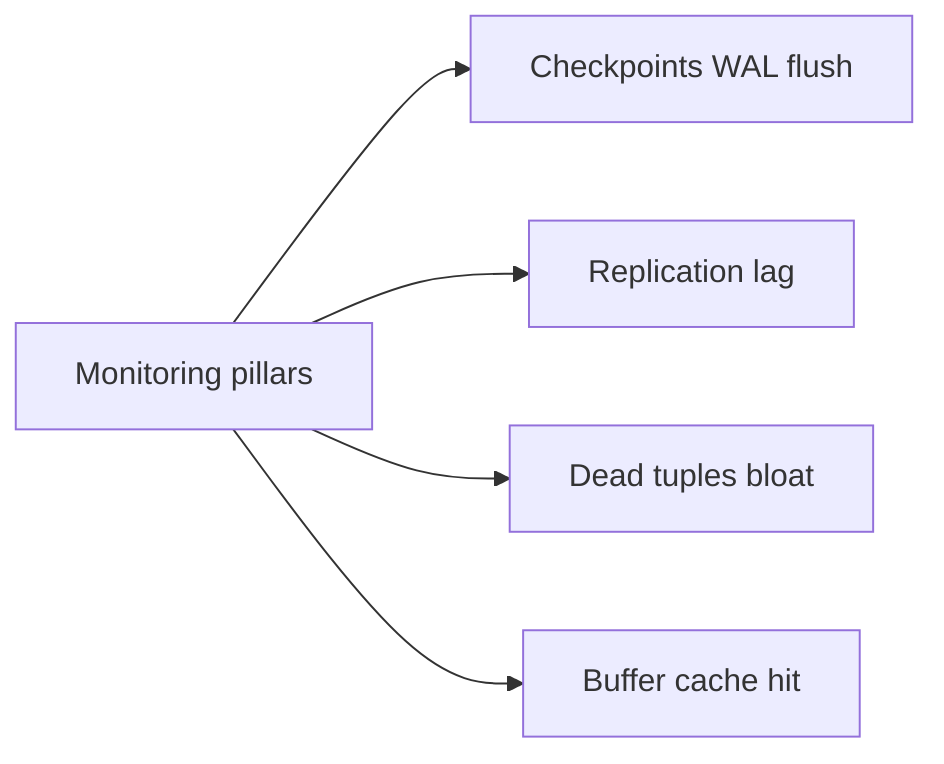
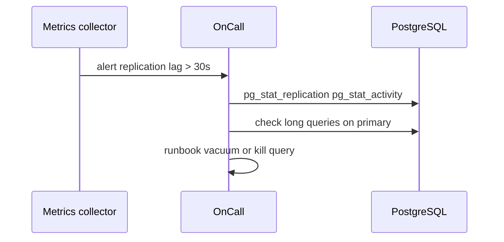

# Monitoring Checkpoints Lag Bloat Cache Hit

## Overview

Production database health surfaces through **engine metrics**: checkpoint frequency and write spikes, **replication lag**, **dead tuple bloat**, **buffer cache hit ratio**, connection saturation, and lock waits. Alerting on symptoms without engine context causes mis-tuned `shared_buffers` or panic hardware upgrades when vacuum is starved.

Application APM for slow endpoints → Backend; **engine golden signals** live here.

## Learning Objectives

- Interpret Postgres `pg_stat_*`, `pg_stat_progress_*`, and lag views
- Monitor Mongo replication lag and WiredTiger cache usage
- Track Redis memory, evictions, persistence fork latency
- Set actionable alert thresholds with runbook links
- Distinguish checkpoint IO spike from sustained write overload

## Prerequisites

- [[08-Databases/02-WAL-Durability-and-Recovery/Checkpoints and Dirty Page Flushing|Checkpoints and Dirty Page Flushing]]
- [[08-Databases/08-PostgreSQL-Engine/PostgreSQL MVCC and Autovacuum|PostgreSQL MVCC and Autovacuum]]
- [[08-Databases/07-Replication-Mechanics/Replica Lag and Read-Your-Writes at Connection Level|Replica Lag and Read-Your-Writes at Connection Level]]

## Difficulty

`advanced`

## Estimated Time

- Reading: 2.5 hours
- Exercises: 3 hours
- Mini project: 5 hours

## History

DBA dashboards evolved from custom SQL to Prometheus exporters (`postgres_exporter`, Redis INFO scraping). Cloud managed services expose lag and bloat partially—operators still need **semantic understanding** of what rising `n_dead_tup` means.

## Problem It Solves

- **mysterious IO storms** at checkpoint without WAL/checkpoint tuning visibility
- **Stale reads** from replica lag without app metric correlation
- **Table bloat** misdiagnosed as "need bigger CPU"
- **Redis evictions** silent until cache hit ratio collapses

## Internal Implementation



Key Postgres signals:

| Metric | Source | Concern |
| --- | --- | --- |
| Cache hit ratio | `pg_stat_database.blks_hit/read` | Memory pressure |
| Dead tuples | `pg_stat_user_tables.n_dead_tup` | Vacuum lag |
| Checkpoint writes | `pg_stat_bgwriter` | IO tuning |
| Replication lag | `pg_stat_replication.flush_lag` | Read replica staleness |
| XID age | `age(relfrozenxid)` | Wraparound risk |

## Mermaid Diagrams

### Structure



### Sequence / Lifecycle — alert to triage



## Examples

### Minimal Example — Postgres health SQL

```sql
-- Cache hit ratio (cluster-wide approximate)
SELECT sum(blks_hit)::float / nullif(sum(blks_hit + blks_read), 0) AS cache_hit_ratio
FROM pg_stat_database;

-- Top dead tuples
SELECT relname, n_dead_tup, last_autovacuum
FROM pg_stat_user_tables
ORDER BY n_dead_tup DESC LIMIT 10;

-- Replication lag
SELECT application_name, state,
       write_lag, flush_lag, replay_lag
FROM pg_stat_replication;
```

### Production-Shaped Example — TypeScript metrics exporter sketch

```typescript
// Node 20+ — periodic scrape for Prometheus-style logs
import pg from "pg";

export async function scrapePostgresMetrics(pool: pg.Pool) {
  const q = async (sql: string) => (await pool.query(sql)).rows[0];

  const hit = await q(`
    SELECT sum(blks_hit)::float / nullif(sum(blks_hit + blks_read), 0) AS ratio
    FROM pg_stat_database
  `);
  const lag = await pool.query(`
    SELECT COALESCE(MAX(EXTRACT(EPOCH FROM replay_lag)), 0) AS max_replay_lag_sec
    FROM pg_stat_replication
  `);
  const bloat = await pool.query(`
    SELECT relname, n_dead_tup FROM pg_stat_user_tables
    ORDER BY n_dead_tup DESC LIMIT 5
  `);

  console.log(JSON.stringify({
    pg_cache_hit_ratio: hit.ratio,
    pg_max_replay_lag_sec: lag.rows[0].max_replay_lag_sec,
    pg_top_dead_tuples: bloat.rows,
  }));
}
```

Redis scrape:

```typescript
import { createClient } from "redis";

export async function scrapeRedis(url: string) {
  const c = createClient({ url });
  await c.connect();
  const mem = await c.info("memory");
  const stats = await c.info("stats");
  await c.quit();
  return {
    used_memory: mem.match(/used_memory:(\d+)/)?.[1],
    evicted_keys: stats.match(/evicted_keys:(\d+)/)?.[1],
  };
}
```

## Trade-offs

| Dimension | Upside | Downside | When it matters |
| --- | --- | --- | --- |
| Many metrics | Early detection | Alert fatigue | on-call |
| Cache hit ratio | Memory tuning signal | Misread on small DBs | steady state |
| Lag alerts | Protects read consistency | False positives burst | replicas |
| Bloat tracking | Vacuum scheduling | Needs baseline | churn tables |

### When to Use

- Dashboards with lag, dead tuples, cache hit, connections, checkpoints
- SLO-linked alerts (p95 query + lag + pool wait)
- Engine metrics correlated with deploy markers

### When Not to Use

- Do not alert on cache hit alone without workload context
- Do not use `KEYS` for Redis monitoring scripts

## Exercises

1. Induce autovacuum lag; watch `n_dead_tup` and `last_autovacuum`.
2. Generate checkpoint IO; graph `pg_stat_bgwriter` counters.
3. Pause replica; observe lag metrics; resume and recovery time.
4. Define alert thresholds document for sample SaaS.
5. Compare Mongo `replSetGetStatus` lag fields to Postgres.

## Mini Project

**Golden signals dashboard.** Postgres + Redis scraper + markdown runbook links per alert.

## Portfolio Project

Monitoring module in [[08-Databases/projects/Database Engines Workbench/README|Database Engines Workbench]].

## Interview Questions

1. What does low buffer cache hit ratio suggest?
2. How measure Postgres replication lag?
3. Difference dead tuples vs table bloat on disk?
4. Checkpoint causing latency spikes—what metrics?
5. Redis evicted_keys alert implies what action?

### Stretch / Staff-Level

1. Design SLI for read-your-writes with replica routing.
2. pg_stat_statements workflow tying monitoring to index fixes.

## Common Mistakes

- Alerting every autovacuum run as incident
- Ignoring `replay_lag` vs `write_lag` distinction
- Scaling CPU when vacuum blocked by long transaction
- Missing correlation between deploy and slow query regression

## Best Practices

- Baseline metrics for 7-day seasonality
- Link alerts to [[08-Databases/12-Production-Database-Ops/Operational Readiness for Database Engines|Operational Readiness]] runbooks
- Use `pg_stat_statements` for query-level drill-down
- App traces for slow endpoints → Backend

## Summary

Engine monitoring focuses on **checkpoints, lag, bloat, and cache hit**—signals of durability, replication, MVCC health, and memory fit. Postgres `pg_stat_*`, Mongo replication status, and Redis INFO form the observability core. Metrics without runbooks are noise; pair both for operable databases.

## Further Reading

- [[00-References/Databases/README|Databases References]]
- PostgreSQL monitoring checklist
- Redis observability guides

## Related Notes

- [[08-Databases/08-PostgreSQL-Engine/PostgreSQL MVCC and Autovacuum|PostgreSQL MVCC and Autovacuum]]
- [[08-Databases/02-WAL-Durability-and-Recovery/Checkpoints and Dirty Page Flushing|Checkpoints and Dirty Page Flushing]]
- [[08-Databases/12-Production-Database-Ops/Connection Pooling at Engine and Proxy|Connection Pooling at Engine and Proxy]]
- [[08-Databases/10-Redis-and-In-Memory-Engines/Eviction Policies and Memory Limits|Eviction Policies and Memory Limits]]

## Progress Checklist

- [ ] Explained from first principles
- [ ] Drew at least one Mermaid diagram
- [ ] Implemented a minimal version
- [ ] Documented trade-offs and non-goals
- [ ] Completed exercises
- [ ] Practiced interview questions aloud
- [ ] Linked prerequisites and dependents
