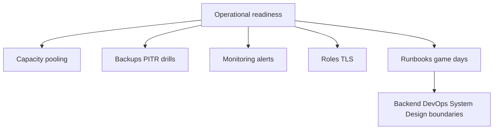
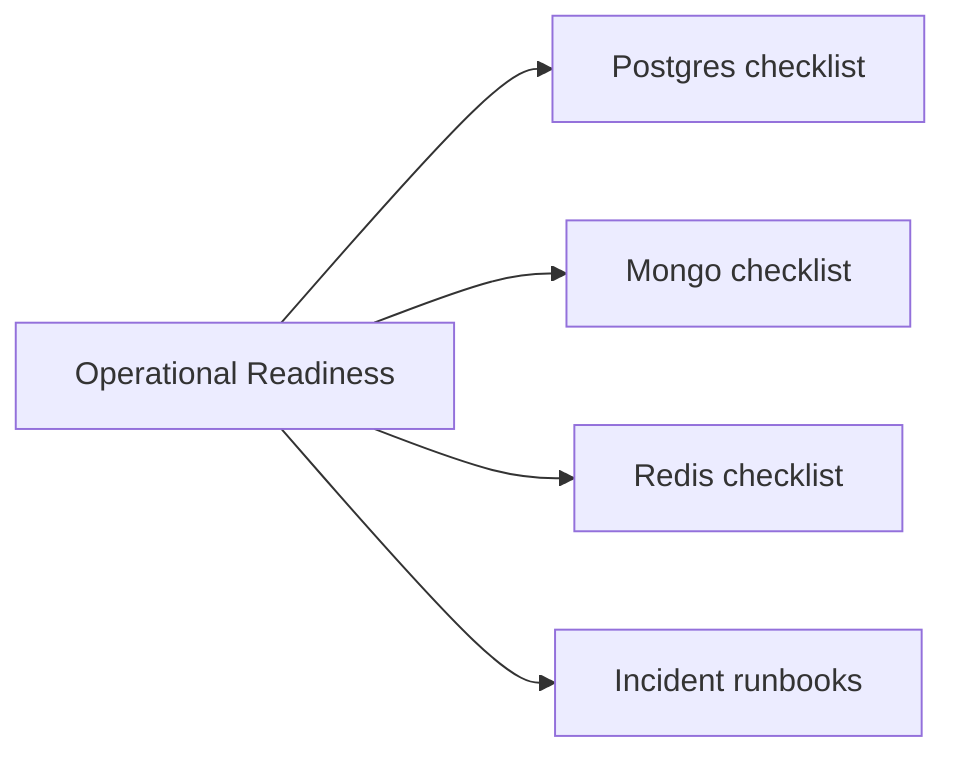
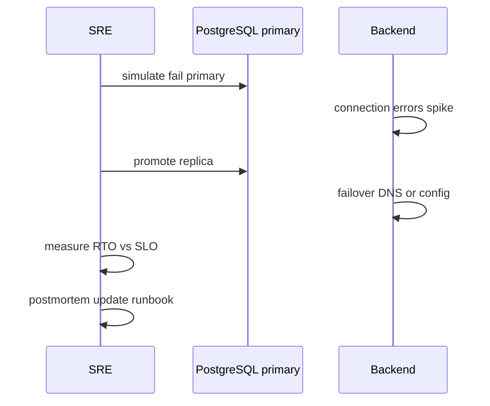

# Operational Readiness for Database Engines

## Overview

**Operational readiness** is the capstone checklist before production traffic: capacity, pooling, backups/PITR drills, monitoring alerts, least privilege, failover runbooks, and documented RPO/RTO per engine role. It synthesizes module 12 and the full Databases track into **on-call actionable** artifacts—without claiming multi-region product design (System Design) or container platforms (DevOps).

Educational engine labs complement but **do not replace** production Postgres/Mongo/Redis.

## Learning Objectives

- Complete engine-specific readiness checklist for Postgres, Mongo, Redis
- Document escalation paths: app → engine metrics → DBA/SRE
- Define SLOs for lag, availability, restore time, connection health
- Run game day scenarios: failover, restore, pool exhaustion, vacuum crisis
- Hand off steady-state ops boundaries to Backend and DevOps clearly

## Prerequisites

- [[08-Databases/12-Production-Database-Ops/Connection Pooling at Engine and Proxy|Connection Pooling at Engine and Proxy]]
- [[08-Databases/12-Production-Database-Ops/Backups PITR and Restore Drills|Backups PITR and Restore Drills]]
- [[08-Databases/12-Production-Database-Ops/Monitoring Checkpoints Lag Bloat Cache Hit|Monitoring Checkpoints Lag Bloat Cache Hit]]
- [[08-Databases/12-Production-Database-Ops/Roles TLS and Least Privilege to the Database|Roles TLS and Least Privilege to the Database]]

## Difficulty

`advanced`

## Estimated Time

- Reading: 2 hours
- Exercises: 4 hours
- Mini project: 8 hours (game day)

## History

"Works on my laptop" Postgres incidents drove formal readiness reviews at SaaS scale—merging backup drills, pooling math, and lag alerts into single launch gate similar to [[06-NodeJS/10-Production-Node/Operational Readiness Checklist for Node Processes|Node Operational Readiness]].

## Problem It Solves

- **Launch without restore drill** discovering broken WAL archive
- **No runbook** when replica lag breaks read-your-writes
- **Redis primary** without persistence/eviction policy documented
- **Blurry ownership** during incidents between app and engine teams

## Internal Implementation



## Readiness Checklist (Engine Layer)

### PostgreSQL (system of record)

- [ ] `max_connections` sized with pooler; app pool math documented
- [ ] WAL archiving healthy; PITR drill ≤ target RTO in last quarter
- [ ] Autovacuum monitored; `n_dead_tup` and XID age alerts
- [ ] Replication lag alerts; read replica routing rules documented
- [ ] `pg_stat_statements` enabled; top queries reviewed
- [ ] Roles: app_rw, app_ro, migrator; TLS verify-full
- [ ] Checkpoint/WAL IO baseline captured

### MongoDB

- [ ] Write concern `{ w: majority, j: true }` on authoritative writes
- [ ] Backup/PITR or cloud continuous backup tested restore
- [ ] Indexes match query catalog; shard key reviewed if sharded
- [ ] Oplog window covers detection delay
- [ ] Monitoring: lag, opcounters, cache pressure

### Redis

- [ ] Role documented: cache vs primary per key namespace
- [ ] `maxmemory` + eviction policy matches role
- [ ] Persistence configured for primary subsets; off for pure cache
- [ ] ACL + TLS; dangerous commands restricted
- [ ] Backup/restore drill for primary Redis if any
- [ ] `evicted_keys`, fork latency monitored

## Mermaid Diagrams

### Structure



### Sequence / Lifecycle — game day



## Examples

### Minimal Example — readiness sign-off table

```text
| Gate                         | Owner | Evidence                          | Status |
|------------------------------|-------|-----------------------------------|--------|
| PITR drill                   | DBA   | staging restore 2026-07-15 ticket | pass   |
| Pool sizing                  | SRE   | calc sheet max_conn=200 pooler    | pass   |
| Lag alert                    | SRE   | alert replay lag >30s             | pass   |
| Redis authority matrix       | App   | DATA_AUTHORITY.md                 | pass   |
| Cache-aside invalidation     | App   | Backend PR #123                   | pass   |
```

### Production-Shaped Example — TypeScript readiness validator (CI gate)

```typescript
type Check = { id: string; required: boolean; pass: boolean; evidence?: string };

export function evaluateReadiness(checks: Check[]): { ready: boolean; failures: string[] } {
  const failures = checks
    .filter((c) => c.required && !c.pass)
    .map((c) => `${c.id}${c.evidence ? `: ${c.evidence}` : ""}`);
  return { ready: failures.length === 0, failures };
}

export const LAUNCH_CHECKS: Check[] = [
  { id: "postgres_pitr_drill_90d", required: true, pass: false, evidence: "schedule drill" },
  { id: "postgres_tls_verify_full", required: true, pass: true },
  { id: "mongo_majority_write_concern", required: true, pass: true },
  { id: "redis_cache_has_ttl_policy", required: true, pass: true },
  { id: "educational_lab_not_prod", required: true, pass: true, evidence: "no toy WAL in prod path" },
];
```

Incident runbook skeleton:

```markdown
## Symptom: replication lag > 60s
1. Check pg_stat_replication replay_lag
2. Find long transactions on primary pg_stat_activity
3. Check vacuum blocked by idle in transaction
4. Mitigate: terminate offending pid; scale reads off lagging replica
5. Escalate: Backend if app polling primary for read-your-writes
```

## Trade-offs

| Dimension | Upside | Downside | When it matters |
| --- | --- | --- | --- |
| Full checklist | Fewer launch incidents | Time to ship | regulated domains |
| Game days | Proven RTO | Engineering cost | quarterly |
| Managed DB | Reduced ops | Less visibility | small teams |
| Self-managed | Full control | You own drills | scale cost |

### When to Use

- Before production launch or major engine migration
- After architecture change (new Redis primary role, Mongo sharding)
- Quarterly readiness re-certification

### When Not to Use

- Do not treat checklist as substitute for load testing (Backend/Perf)
- Do not duplicate Kubernetes deployment steps here

## Exercises

1. Complete Postgres checklist for lab cluster; note gaps.
2. Run table-top failover without actually failing prod.
3. Write Redis incident runbook for evicted_keys spike.
4. Map each checklist item to Databases track note link.
5. Facilitate 30-min game day debrief template.

## Mini Project

**Launch gate doc.** Single markdown readiness sign-off for fictional SaaS with three engines.

## Portfolio Project

Capstone ops binder in [[08-Databases/projects/Database Engines Workbench/README|Database Engines Workbench]] linking all module 12 notes.

## Interview Questions

1. Top five Postgres production readiness items?
2. How prove backups work?
3. Redis cache vs primary readiness differences?
4. Who owns read-your-writes during replica lag?
5. What this track explicitly does NOT own?

### Stretch / Staff-Level

1. Design readiness diff for managed RDS vs self-hosted Postgres.
2. Balance launch gate rigor vs team velocity—your framework?

## Common Mistakes

- Checklist exists but drills never run
- Monitoring without runbooks
- Conflating educational TypeScript WAL lab with production
- Skipping Redis because "it's just cache" without TTL/eviction policy

## Best Practices

- Tie alerts to runbook URLs
- Store drill evidence tickets
- Revisit after every sev-1 data incident
- Return to [[08-Databases/11-Modeling-and-Engine-Selection/Handoff Back to Backend Repositories|Backend Handoff]] for app patterns

## Summary

Operational readiness merges **pooling, backups, monitoring, and security** into verified production gates per engine. Postgres demands PITR and vacuum discipline; Mongo demands write concern and restore path; Redis demands explicit role and eviction contracts. Checklists without drills are theater—game days and evidence tickets make readiness real.

## Further Reading

- [[00-References/Databases/README|Databases References]]
- [[08-Databases/README|Databases Track README]]
- SRE workbook database chapters

## Related Notes

- [[08-Databases/12-Production-Database-Ops/Connection Pooling at Engine and Proxy|Connection Pooling at Engine and Proxy]]
- [[08-Databases/12-Production-Database-Ops/Backups PITR and Restore Drills|Backups PITR and Restore Drills]]
- [[08-Databases/12-Production-Database-Ops/Monitoring Checkpoints Lag Bloat Cache Hit|Monitoring Checkpoints Lag Bloat Cache Hit]]
- [[08-Databases/12-Production-Database-Ops/Roles TLS and Least Privilege to the Database|Roles TLS and Least Privilege to the Database]]
- [[08-Databases/11-Modeling-and-Engine-Selection/Handoff Back to Backend Repositories|Handoff Back to Backend Repositories]]
- [[16-DevOps/README|DevOps]]
- [[09-System-Design/README|System Design]]

## Progress Checklist

- [ ] Explained from first principles
- [ ] Drew at least one Mermaid diagram
- [ ] Implemented a minimal version
- [ ] Documented trade-offs and non-goals
- [ ] Completed exercises
- [ ] Practiced interview questions aloud
- [ ] Linked prerequisites and dependents
