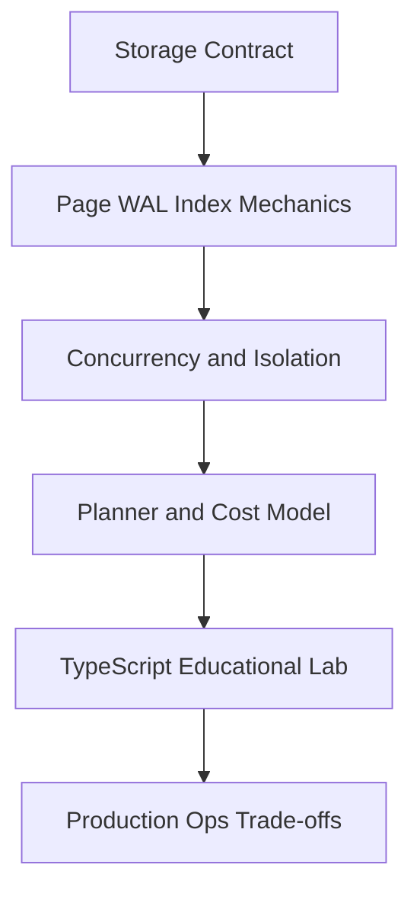
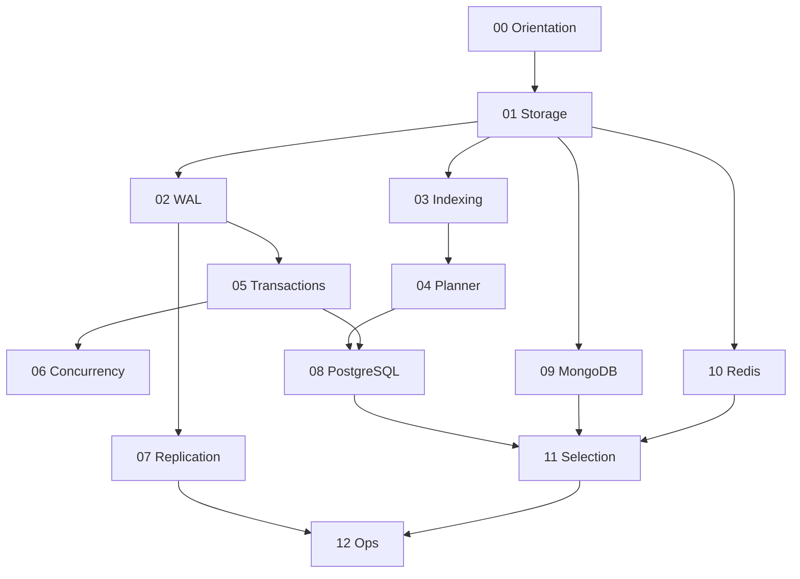

# 08 Databases

A first-principles track for **database engines**: pages and buffer pools, WAL and crash recovery, on-disk indexes, query planning, transactions and isolation, concurrency internals, replication mechanics, PostgreSQL / MongoDB / Redis engine depth, modeling for access paths, and production database operations—implemented as TypeScript educational engines and SQL fixtures.

## Objectives

- Explain how durable storage is organized into pages, buffers, and free space
- Reason about WAL, fsync, checkpoints, and crash recovery
- Choose and diagnose indexes and access paths with EXPLAIN literacy
- Predict isolation anomalies under locking and MVCC
- Distinguish physical vs logical replication and failover mechanics
- Select among relational, document, and in-memory engines with explicit trade-offs
- Operate engines: pooling, backups/PITR, monitoring, and least privilege
- Hand off repositories/ORM usage to Backend and multi-region topology to System Design

## Why This Track Matters

APIs fail when engineers treat `INSERT` as magic. Real incidents come from missing indexes, wrong isolation, WAL misconfiguration, vacuum/bloat, replica lag, and choosing Redis as a primary store without durability contracts. Backend teaches how services *use* data; this track teaches how engines *keep* it.

## Teaching Contract

Every topic note follows:

## Scope Boundaries

| This track owns | Handoff |
| --- | --- |
| Pages, buffer pools, tuple layout, free space |  E|
| WAL, fsync, checkpoints, crash recovery |  E|
| B+ *page* structures, secondary/covering indexes | B-tree *fanout/invariants* pedagogy ↁE[[04-Data-Structures/README\|Data Structures]] |
| Query planning, cost models, join algorithms, EXPLAIN | External sort *algorithms* ↁE[[05-Algorithms/README\|Algorithms]] |
| Isolation, MVCC, locks, vacuum/bloat | Transactions *as service boundaries* ↁE[[07-Backend/README\|Backend]] |
| Replication *mechanics*, lag, promote/split-brain | Multi-region capacity/CAP product design ↁE[[09-System-Design/README\|System Design]] |
| Postgres / Mongo / Redis as *engines* | Cache-aside, outbox, Mini ORM, repos ↁEBackend |
| Backups, PITR, pooling, DB roles/TLS | Containers/CI platforms ↁE[[16-DevOps/README\|DevOps]] |

## Prerequisites

- [[04-Data-Structures/05-Trees-and-Ordered-Maps/B-Trees and B-Plus Trees Concepts|B-Trees and B-Plus Trees Concepts]]
- [[04-Data-Structures/00-Orientation-and-Contracts/Memory Layout Locality and Allocation Patterns|Memory Layout Locality and Allocation Patterns]]
- [[07-Backend/08-Data-Access-and-Persistence-Patterns/Handing Off to Database Engines|Handing Off to Database Engines]]
- [[07-Backend/08-Data-Access-and-Persistence-Patterns/Transactions as Used by Services|Transactions as Used by Services]]
- [[01-Computer-Science/02-Machine-Model/Cache Hierarchy and Locality|Cache Hierarchy and Locality]]

## Roadmap

## Topics

### 00  EOrientation

- [[08-Databases/00-Orientation/Why Databases Exist|Why Databases Exist]]
- [[08-Databases/00-Orientation/Files vs Engines vs Services|Files vs Engines vs Services]]
- [[08-Databases/00-Orientation/Relational Document and KV Contracts|Relational Document and KV Contracts]]
- [[08-Databases/00-Orientation/Backend Databases and System Design Boundaries|Backend Databases and System Design Boundaries]]
- [[08-Databases/00-Orientation/Database Failure Modes Corruption and Durability|Database Failure Modes Corruption and Durability]]

### 01  EStorage and Buffer Pool

- [[08-Databases/01-Storage-and-Buffer-Pool/Pages Blocks and IO Units|Pages Blocks and I/O Units]]
- [[08-Databases/01-Storage-and-Buffer-Pool/Heap Tables vs Clustered Layouts|Heap Tables vs Clustered Layouts]]
- [[08-Databases/01-Storage-and-Buffer-Pool/Tuple Layout and Oversized Values|Tuple Layout and Oversized Values]]
- [[08-Databases/01-Storage-and-Buffer-Pool/Buffer Pool vs OS Page Cache|Buffer Pool vs OS Page Cache]]
- [[08-Databases/01-Storage-and-Buffer-Pool/Free Space Maps Fillfactor and Fragmentation|Free Space Maps Fillfactor and Fragmentation]]

### 02  EWAL Durability and Recovery

- [[08-Databases/02-WAL-Durability-and-Recovery/Write-Ahead Logging Protocol|Write-Ahead Logging Protocol]]
- [[08-Databases/02-WAL-Durability-and-Recovery/fsync Group Commit and Durability Levels|fsync Group Commit and Durability Levels]]
- [[08-Databases/02-WAL-Durability-and-Recovery/Checkpoints and Dirty Page Flushing|Checkpoints and Dirty Page Flushing]]
- [[08-Databases/02-WAL-Durability-and-Recovery/Crash Recovery Redo and Undo Concepts|Crash Recovery Redo and Undo Concepts]]
- [[08-Databases/02-WAL-Durability-and-Recovery/Torn Pages and Doublewrite Concepts|Torn Pages and Doublewrite Concepts]]

### 03  EIndexing on Disk

- [[08-Databases/03-Indexing-on-Disk/B-Plus Trees as Page Structures|B-Plus Trees as Page Structures]]
- [[08-Databases/03-Indexing-on-Disk/Secondary Covering and Partial Indexes|Secondary Covering and Partial Indexes]]
- [[08-Databases/03-Indexing-on-Disk/Hash Indexes and Equality Lookups|Hash Indexes and Equality Lookups]]
- [[08-Databases/03-Indexing-on-Disk/GIN GiST and Bitmap Index Concepts|GIN GiST and Bitmap Index Concepts]]
- [[08-Databases/03-Indexing-on-Disk/Index-Only Scans and Visibility Map Hooks|Index-Only Scans and Visibility Map Hooks]]

### 04  EQuery Processing and Planning

- [[08-Databases/04-Query-Processing-and-Planning/Parse Bind Plan Execute Pipeline|Parse Bind Plan Execute Pipeline]]
- [[08-Databases/04-Query-Processing-and-Planning/Cost Models Statistics and Cardinality|Cost Models Statistics and Cardinality]]
- [[08-Databases/04-Query-Processing-and-Planning/Access Paths Seq Scan vs Index|Access Paths Seq Scan vs Index]]
- [[08-Databases/04-Query-Processing-and-Planning/Join Algorithms Nested Loop Hash Merge|Join Algorithms Nested Loop Hash Merge]]
- [[08-Databases/04-Query-Processing-and-Planning/EXPLAIN and EXPLAIN ANALYZE Literacy|EXPLAIN and EXPLAIN ANALYZE Literacy]]

### 05  ETransactions and Isolation

- [[08-Databases/05-Transactions-and-Isolation/ACID as Engine Contracts|ACID as Engine Contracts]]
- [[08-Databases/05-Transactions-and-Isolation/Anomalies Dirty Nonrepeatable Phantom Serialization|Anomalies Dirty Nonrepeatable Phantom Serialization]]
- [[08-Databases/05-Transactions-and-Isolation/Locking vs MVCC|Locking vs MVCC]]
- [[08-Databases/05-Transactions-and-Isolation/Isolation Levels and Product Defaults|Isolation Levels and Product Defaults]]
- [[08-Databases/05-Transactions-and-Isolation/Snapshot Isolation and SSI Concepts|Snapshot Isolation and SSI Concepts]]

### 06  EConcurrency Internals

- [[08-Databases/06-Concurrency-Internals/Latches Locks and Lock Managers|Latches Locks and Lock Managers]]
- [[08-Databases/06-Concurrency-Internals/Hot Rows Write Skew and Contention|Hot Rows Write Skew and Contention]]
- [[08-Databases/06-Concurrency-Internals/Vacuum Version GC and Bloat|Vacuum Version GC and Bloat]]
- [[08-Databases/06-Concurrency-Internals/Long Transactions and Snapshot Horizons|Long Transactions and Snapshot Horizons]]
- [[08-Databases/06-Concurrency-Internals/Advisory Locks as Engine Primitives|Advisory Locks as Engine Primitives]]

### 07  EReplication Mechanics

- [[08-Databases/07-Replication-Mechanics/Physical vs Logical Replication|Physical vs Logical Replication]]
- [[08-Databases/07-Replication-Mechanics/Synchronous vs Asynchronous Durability|Synchronous vs Asynchronous Durability]]
- [[08-Databases/07-Replication-Mechanics/WAL Shipping and Streaming Replication|WAL Shipping and Streaming Replication]]
- [[08-Databases/07-Replication-Mechanics/Failover Promote and Split-Brain Mechanics|Failover Promote and Split-Brain Mechanics]]
- [[08-Databases/07-Replication-Mechanics/Replica Lag and Read-Your-Writes at Connection Level|Replica Lag and Read-Your-Writes at Connection Level]]

### 08  EPostgreSQL Engine

- [[08-Databases/08-PostgreSQL-Engine/Catalogs System Tables and Types|Catalogs System Tables and Types]]
- [[08-Databases/08-PostgreSQL-Engine/PostgreSQL MVCC and Autovacuum|PostgreSQL MVCC and Autovacuum]]
- [[08-Databases/08-PostgreSQL-Engine/Constraints as Engine Invariants|Constraints as Engine Invariants]]
- [[08-Databases/08-PostgreSQL-Engine/Extensions and Procedural Surfaces Concepts|Extensions and Procedural Surfaces Concepts]]
- [[08-Databases/08-PostgreSQL-Engine/Online DDL Costs vs Migration Process|Online DDL Costs vs Migration Process]]

### 09  EDocument Engines MongoDB

- [[08-Databases/09-Document-Engines-MongoDB/Document Model and Storage Engines|Document Model and Storage Engines]]
- [[08-Databases/09-Document-Engines-MongoDB/Indexes on Documents and Multikey Behavior|Indexes on Documents and Multikey Behavior]]
- [[08-Databases/09-Document-Engines-MongoDB/Aggregation Pipeline as Execution|Aggregation Pipeline as Execution]]
- [[08-Databases/09-Document-Engines-MongoDB/Write Concern and Journaling Mechanics|Write Concern and Journaling Mechanics]]
- [[08-Databases/09-Document-Engines-MongoDB/When Document Engines Win or Lose|When Document Engines Win or Lose]]

### 10  ERedis and In-Memory Engines

- [[08-Databases/10-Redis-and-In-Memory-Engines/Redis Data Structures as Persistence API|Redis Data Structures as Persistence API]]
- [[08-Databases/10-Redis-and-In-Memory-Engines/RDB Snapshots and AOF|RDB Snapshots and AOF]]
- [[08-Databases/10-Redis-and-In-Memory-Engines/Eviction Policies and Memory Limits|Eviction Policies and Memory Limits]]
- [[08-Databases/10-Redis-and-In-Memory-Engines/Single-Threaded Execution and Persistence Trade-offs|Single-Threaded Execution and Persistence Trade-offs]]
- [[08-Databases/10-Redis-and-In-Memory-Engines/Redis as Cache vs Primary Store|Redis as Cache vs Primary Store]]

### 11  EModeling and Engine Selection

- [[08-Databases/11-Modeling-and-Engine-Selection/Normalization vs Denormalization at Storage|Normalization vs Denormalization at Storage]]
- [[08-Databases/11-Modeling-and-Engine-Selection/Keys Cardinality and Access Paths|Keys Cardinality and Access Paths]]
- [[08-Databases/11-Modeling-and-Engine-Selection/Schema Design Driven by Queries|Schema Design Driven by Queries]]
- [[08-Databases/11-Modeling-and-Engine-Selection/PostgreSQL vs MongoDB vs Redis Decision Matrix|PostgreSQL vs MongoDB vs Redis Decision Matrix]]
- [[08-Databases/11-Modeling-and-Engine-Selection/Handoff Back to Backend Repositories|Handoff Back to Backend Repositories]]

### 12  EProduction Database Ops

- [[08-Databases/12-Production-Database-Ops/Connection Pooling at Engine and Proxy|Connection Pooling at Engine and Proxy]]
- [[08-Databases/12-Production-Database-Ops/Backups PITR and Restore Drills|Backups PITR and Restore Drills]]
- [[08-Databases/12-Production-Database-Ops/Monitoring Checkpoints Lag Bloat Cache Hit|Monitoring Checkpoints Lag Bloat Cache Hit]]
- [[08-Databases/12-Production-Database-Ops/Roles TLS and Least Privilege to the Database|Roles TLS and Least Privilege to the Database]]
- [[08-Databases/12-Production-Database-Ops/Operational Readiness for Database Engines|Operational Readiness for Database Engines]]

## Suggested Study Order

1. Orientation (00) and Storage (01) before WAL
2. WAL (02) and Indexing (03) before Planner (04)
3. Transactions (05) before Concurrency (06) and Replication (07)
4. Engine deep-dives (08 E0) after core mechanics
5. Modeling/Selection (11) and Ops (12) as synthesis

## Mini Projects

- [[08-Databases/projects/Toy Page and WAL Store/README|Toy Page and WAL Store]]
- [[08-Databases/projects/Mini B-Plus Index Lab/README|Mini B-Plus Index Lab]]
- [[08-Databases/projects/Isolation Anomaly Clinic/README|Isolation Anomaly Clinic]]
- [[08-Databases/projects/Mini Redis Persistence Lab/README|Mini Redis Persistence Lab]]
- [[08-Databases/projects/EXPLAIN Literacy Workbench/README|EXPLAIN Literacy Workbench]]

## Portfolio Project

- [[08-Databases/projects/Database Engines Workbench/README|Database Engines Workbench]]

## Exercises

Module sets live under [[08-Databases/_exercises/README|Databases Exercises]].

## Interview Questions

Module sets live under [[08-Databases/_interview/README|Databases Interview Questions]].

## Implementation Checklist

- [x] Page/slot store + buffer pool eviction
- [x] WAL append + crash recovery redo
- [x] B+ tree leaf/page split (engine-facing)
- [x] Lock manager + deadlock detect
- [x] MVCC snapshot visibility sketch
- [x] Cost-based access-path chooser
- [x] Mini Redis dict + AOF replay
- [x] SQL fixture runner (SELECT/INSERT/UPDATE/DELETE subset)
- [x] Five mini projects + Database Engines Workbench

## Code Labs

See [[08-Databases/code/README|Databases code labs]].

## References

- [[00-References/Databases/README|Databases References]]

## Related Tracks

- [[07-Backend/README|Backend]]
- [[04-Data-Structures/README|Data Structures]]
- [[05-Algorithms/README|Algorithms]]
- [[09-System-Design/README|System Design]]
- [[01-Computer-Science/README|Computer Science]]
- [[16-DevOps/README|DevOps]]
- [[Career/README|Career]]

## Stage Gate Checklist

- [ ] Can explain pages, buffer pools, WAL, and crash recovery
- [ ] Can diagnose access paths and isolation anomalies
- [ ] Can compare Postgres, MongoDB, and Redis as engines
- [ ] Can describe replication mechanics without claiming multi-region design expertise
- [ ] Labs green; at least three mini projects and portfolio docs completed
- [ ] Interview sets practiced with diagrams and production failure modes
