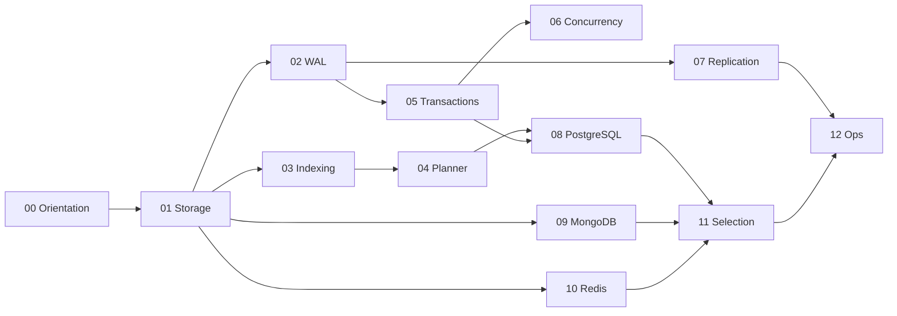

# Databases Exercises

Thirteen module sets move from engine boundaries through storage and buffer pools, WAL and crash recovery, on-disk indexes, query planning, transactions and isolation, concurrency internals, replication mechanics, PostgreSQL / MongoDB / Redis engine depth, modeling for access paths, and production database operations.

## Learning Path

## Exercise Sets

1. [[08-Databases/_exercises/Orientation Exercises.md|Orientation Exercises]] — separate files from engines from services, map relational/document/KV contracts, failure modes, and handoffs to Backend and System Design
2. [[08-Databases/_exercises/Storage and Buffer Pool Exercises.md|Storage and Buffer Pool Exercises]] — practice pages, tuple layout, heap vs clustered layouts, buffer pool vs OS cache, and free-space fragmentation
3. [[08-Databases/_exercises/WAL Durability and Recovery Exercises.md|WAL Durability and Recovery Exercises]] — implement WAL append, fsync levels, checkpoints, crash recovery redo/undo, and torn-page defenses
4. [[08-Databases/_exercises/Indexing on Disk Exercises.md|Indexing on Disk Exercises]] — build B+ page structures, secondary/covering/partial indexes, hash and GIN/GiST access paths, index-only scans
5. [[08-Databases/_exercises/Query Processing and Planning Exercises.md|Query Processing and Planning Exercises]] — trace parse/bind/plan/execute, cost models, join algorithms, seq scan vs index, EXPLAIN literacy
6. [[08-Databases/_exercises/Transactions and Isolation Exercises.md|Transactions and Isolation Exercises]] — reason about ACID contracts, anomalies, locking vs MVCC, isolation levels, snapshot isolation and SSI
7. [[08-Databases/_exercises/Concurrency Internals Exercises.md|Concurrency Internals Exercises]] — diagnose latches vs locks, hot rows, vacuum/bloat, long transactions, advisory locks
8. [[08-Databases/_exercises/Replication Mechanics Exercises.md|Replication Mechanics Exercises]] — compare physical vs logical replication, sync/async durability, WAL shipping, failover, replica lag
9. [[08-Databases/_exercises/PostgreSQL Engine Exercises.md|PostgreSQL Engine Exercises]] — navigate catalogs, MVCC/autovacuum, constraints as invariants, extensions, online DDL costs
10. [[08-Databases/_exercises/Document Engines MongoDB Exercises.md|Document Engines MongoDB Exercises]] — model documents, multikey indexes, aggregation execution, write concern, when documents win or lose
11. [[08-Databases/_exercises/Redis and In-Memory Engines Exercises.md|Redis and In-Memory Engines Exercises]] — implement dict structures, RDB/AOF persistence, eviction, single-threaded execution, cache vs primary store
12. [[08-Databases/_exercises/Modeling and Engine Selection Exercises.md|Modeling and Engine Selection Exercises]] — normalize vs denormalize at storage, keys/cardinality/access paths, schema-by-query, engine decision matrix
13. [[08-Databases/_exercises/Production Database Ops Exercises.md|Production Database Ops Exercises]] — synthesize pooling, backups/PITR, monitoring lag/bloat/checkpoints, roles/TLS, operational readiness

## Completion Standard

- State storage contracts, durability guarantees, and isolation boundaries before coding.
- Implement against shared lab vectors in [[08-Databases/code/README|code labs]] with observable engine behavior.
- Measure cache hit, WAL volume, and plan cost before optimizing; preserve correctness oracles.
- Debug drills must formalize reproduction, page/WAL ordering, and regression vectors.
- Production scenarios include telemetry, failover, restore drills, and operational failure modes.

## Related Notes

- [[08-Databases/README|Databases]]
- [[08-Databases/code/README|code labs]]
- [[08-Databases/_interview/README|Databases Interview Questions]]
- [[Career/README|Career]]
