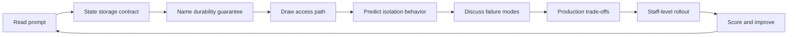

# Databases Interview Questions

Thirteen interview sets assess storage contracts, WAL durability, index and planner literacy, isolation and concurrency, replication mechanics, engine-specific depth, modeling trade-offs, and staff-level production judgment for database engines.

## Practice Loop

## Interview Sets

1. [[08-Databases/_interview/Orientation Interview.md|Orientation Interview]]
2. [[08-Databases/_interview/Storage and Buffer Pool Interview.md|Storage and Buffer Pool Interview]]
3. [[08-Databases/_interview/WAL Durability and Recovery Interview.md|WAL Durability and Recovery Interview]]
4. [[08-Databases/_interview/Indexing on Disk Interview.md|Indexing on Disk Interview]]
5. [[08-Databases/_interview/Query Processing and Planning Interview.md|Query Processing and Planning Interview]]
6. [[08-Databases/_interview/Transactions and Isolation Interview.md|Transactions and Isolation Interview]]
7. [[08-Databases/_interview/Concurrency Internals Interview.md|Concurrency Internals Interview]]
8. [[08-Databases/_interview/Replication Mechanics Interview.md|Replication Mechanics Interview]]
9. [[08-Databases/_interview/PostgreSQL Engine Interview.md|PostgreSQL Engine Interview]]
10. [[08-Databases/_interview/Document Engines MongoDB Interview.md|Document Engines MongoDB Interview]]
11. [[08-Databases/_interview/Redis and In-Memory Engines Interview.md|Redis and In-Memory Engines Interview]]
12. [[08-Databases/_interview/Modeling and Engine Selection Interview.md|Modeling and Engine Selection Interview]]
13. [[08-Databases/_interview/Production Database Ops Interview.md|Production Database Ops Interview]]

## Evaluation Standard

- Storage answers define pages, buffer pools, and I/O unit boundaries.
- Durability answers cover WAL, fsync, checkpoints, and crash recovery ordering.
- Planner answers explain cost models, access paths, and EXPLAIN evidence.
- Isolation answers predict anomalies under locking and MVCC with concrete examples.
- Replication answers distinguish physical vs logical, lag, and failover mechanics.
- Production answers include backup/restore drills, pooling, monitoring, and least privilege.

## Related Notes

- [[Career/README|Career]]
- [[08-Databases/_exercises/README|Databases Exercises]]
- [[08-Databases/code/README|code labs]]
- [[08-Databases/README|Databases]]
