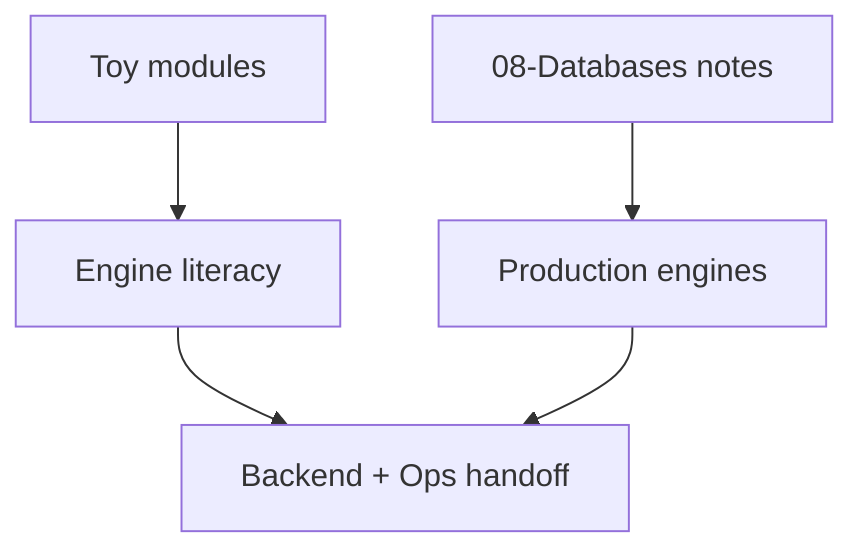

# ADR-001: Educational Engine Scope

## Status

Accepted on 2026-07-22.

## Context

Learners need inspectable implementations of pages, WAL, indexes, isolation, and persistence—but a full SQL engine or Redis clone would imply false production parity and blur handoffs to [[07-Backend/README|Backend]] and [[09-System-Design/README|System Design]].

## Decision

Implement **small, testable TypeScript modules** with explicit limits: fixed page size, redo-only WAL v1, B+ insert/search without full delete, schedule-driven isolation, Redis command subset with JSON AOF, fixture SQL runner, educational cost model. Document gaps prominently in every mini project README.

## Options Considered

| Option | Pros | Cons |
| --- | --- | --- |
| Educational modules (chosen) | Testable, honest, modular | Not production engines |
| Build mini-Postgres | Deep integration | Years of scope; misleading claims |
| Wiki-only, no code | Low maintenance | No executable evidence |
| Embed SQLite/Redis binaries | Real behavior | Hides internals; platform coupling |

## Consequences

Tests lock lab invariants, not Postgres release notes. Documentation links wiki engine depth for production. Portfolio README states non-goals: no ORM, repos, Express stack, or replacement claims.

## Follow-ups

- Track implemented vs target modules in [[08-Databases/projects/Database Engines Workbench/Known Issues|Known Issues]].
- Revisit scope only via new ADR if adding wire protocols or replication.

## Related Documents

- [[08-Databases/projects/Database Engines Workbench/Architecture|Architecture]]
- [[08-Databases/projects/Database Engines Workbench/Database|Database]]
