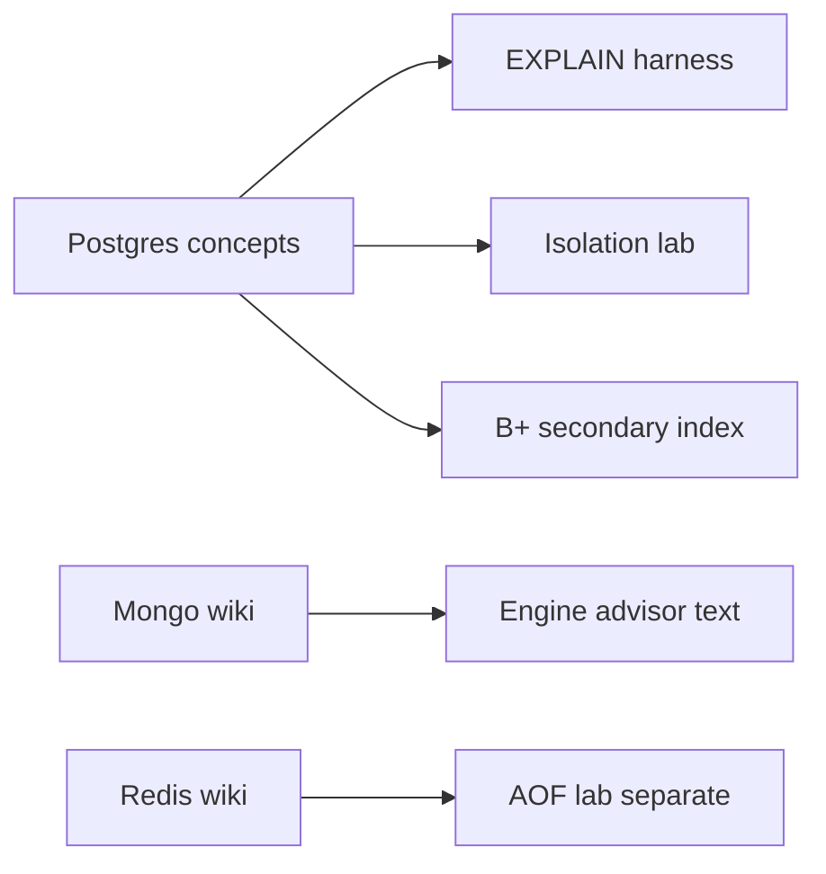

# ADR-002: Postgres-First Relational Default

## Status

Accepted on 2026-07-22.

## Context

The track covers PostgreSQL, MongoDB, and Redis, but relational access-path literacy (EXPLAIN, indexes, joins, MVCC) is the spine for backend engineers. Mongo aggregation and Redis structures have wiki depth; the workbench must prioritize one relational teaching path to ship integrated labs on schedule.

## Decision

Default relational teaching to **PostgreSQL concepts**: B+ secondary indexes, heap RIDs, MVCC tuple headers, EXPLAIN node vocabulary, and optional live `EXPLAIN (FORMAT JSON)` adapter. SQL fixture runner uses Postgres-flavored types and plan node names. Mongo-specific labs remain wiki + future ideas backlog (I-005).

## Options Considered

| Option | Pros | Cons |
| --- | --- | --- |
| Postgres-first (chosen) | Aligns with EXPLAIN + MVCC wiki; industry default OLTP | Less immediate Mongo lab code |
| Engine-neutral abstract plans | Portable | Loses EXPLAIN literacy specificity |
| Dual relational engines | Broader | Duplicates cost; confuses learners |
| Mongo-first | Document trend | Weakens index/WAL integration story |

## Consequences

EXPLAIN harness golden fixtures use Postgres plan shapes. Engine advisor still mentions Mongo/Redis with links to [[08-Databases/11-Modeling-and-Engine-Selection/PostgreSQL vs MongoDB vs Redis Decision Matrix|Decision Matrix]]. Live Postgres tests optional; fixture-first CI default.

## Follow-ups

- Document adapter env `DEB_PG_URL` in Security and Testing.
- Add normalized plan diff for one imported real plan in exercises.

## Related Documents

- [[08-Databases/projects/EXPLAIN Literacy Workbench/README|EXPLAIN Literacy Workbench]]
- [[08-Databases/08-PostgreSQL-Engine/PostgreSQL MVCC and Autovacuum|PostgreSQL MVCC and Autovacuum]]
