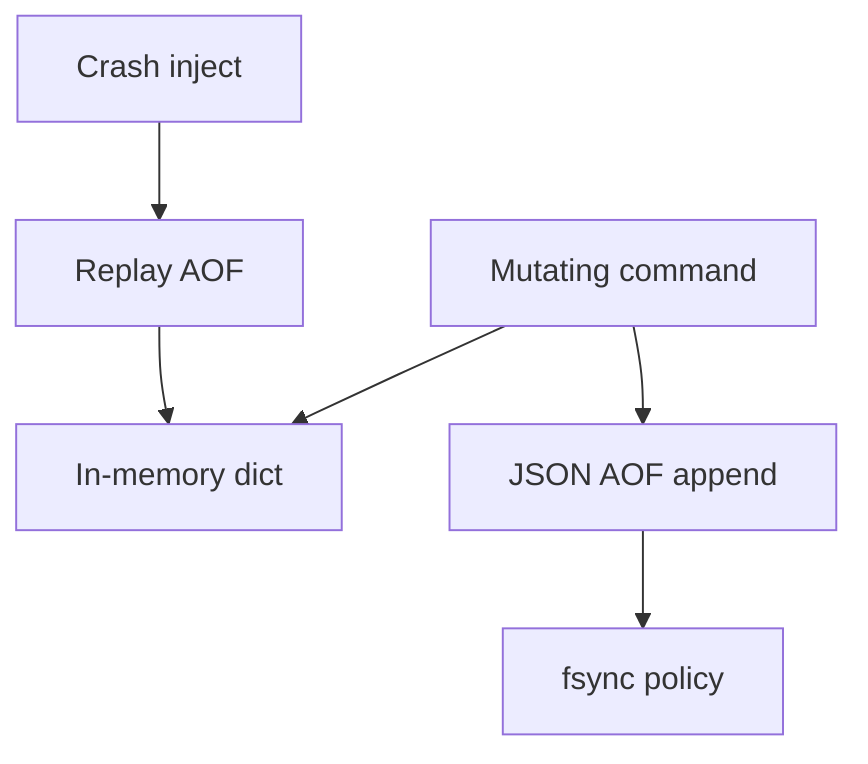

# ADR-003: Redis Persistence Teaching Model

## Status

Accepted on 2026-07-22.

## Context

Redis persistence combines single-threaded execution, AOF append, fsync policies, and rewrite compaction—topics covered in [[08-Databases/10-Redis-and-In-Memory-Engines/RDB Snapshots and AOF|RDB Snapshots and AOF]]. Implementing full RESP, RDB binary format, and fork-based rewrite would obscure the durability trade-offs the track targets.

## Decision

Ship **Mini Redis Persistence Lab** with:

- In-memory dict + command subset (`SET`, `GET`, `DEL`, `INCR`, `EXPIRE`)
- **JSON-line AOF** for testability (document mapping to RESP)
- `appendfsync always|everysec|no` modes with crash injection
- Rewrite via pause-writes + scan + atomic rename (no fork COW in v1)
- **No** wire protocol, replication, or RDB snapshot in v1

## Options Considered

| Option | Pros | Cons |
| --- | --- | --- |
| JSON AOF lab (chosen) | Easy replay tests; clear durability window | Not wire compatible |
| Full RESP + RDB | High fidelity | Large scope; binary test pain |
| Embed real Redis | Authentic | Hides implementation; CI coupling |
| Skip Redis code entirely | Minimal scope | Weak persistence hands-on |

## Consequences

Tests prove replay equivalence and fsync loss windows, not Redis release compatibility. README and CLI banner state educational scope. Ideas backlog may add RESP adapter (I-004) without changing default.

## Follow-ups

- Compare everysec loss with Postgres `synchronous_commit` in reflection exercises.
- Document when lab must not be used as primary store.

## Related Documents

- [[08-Databases/projects/Mini Redis Persistence Lab/README|Mini Redis Persistence Lab]]
- [[08-Databases/10-Redis-and-In-Memory-Engines/Redis as Cache vs Primary Store|Redis as Cache vs Primary Store]]
