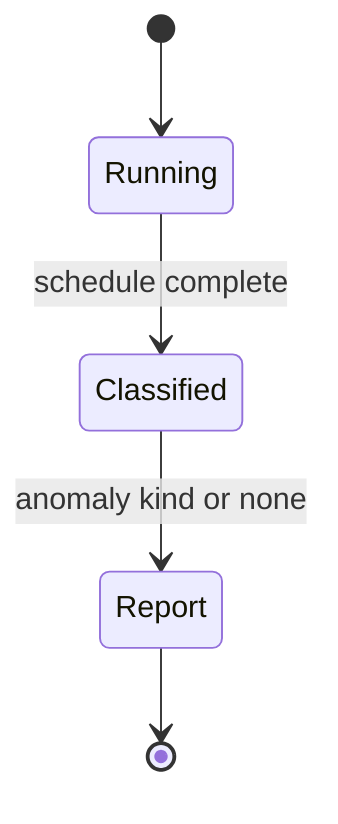

# ADR-004: Isolation Lab Defaults

## Status

Accepted on 2026-07-22.

## Context

Isolation teaching requires reproducible interleavings. Random concurrent threads produce flaky tests and obscure causality. Product defaults differ: PostgreSQL `READ COMMITTED`, MySQL `REPEATABLE READ`, etc. The lab must name presets clearly and not silently claim Postgres SSI implementation.

## Decision

Use a **declarative schedule DSL** with explicit yield points and four named presets:

| Preset | Behavior summary |
| --- | --- |
| `read-uncommitted` | dirty reads allowed |
| `read-committed` | short read locks; non-repeatable possible |
| `repeatable-read-snapshot` | snapshot reads; phantoms possible |
| `serializable-locks` | strict 2PL / predicate locks lab simplification |

Default demo mode: **`repeatable-read-snapshot`** for MVCC visibility exercises. Default grading mode for anomaly catalog: compare **weakest preset that allows anomaly** vs **strongest preset that prevents it**.

Deadlock victim policy: **lowest numeric txn id** for deterministic tests.

## Options Considered

| Option | Pros | Cons |
| --- | --- | --- |
| Schedule DSL (chosen) | Deterministic; CI stable | Less "realistic" threading |
| Random interleaving fuzz | Finds rare bugs | Flaky; hard to teach |
| Postgres-only via docker | Real engine | Slow CI; hides MVCC mechanics |
| Full SSI implementation | Accurate PG serializable | Too large for v1 |

## Consequences

Classifier maps schedules to anomaly kinds documented in [[08-Databases/05-Transactions-and-Isolation/Anomalies Dirty Nonrepeatable Phantom Serialization|Anomalies note]]. Caps: max 256 steps, max 16 transactions, max 1024 locks per run.

## Follow-ups

- Add `SKIP LOCKED` exercise hook in Ideas.
- Link each golden schedule to interview question in wiki.

## Related Documents

- [[08-Databases/projects/Isolation Anomaly Clinic/README|Isolation Anomaly Clinic]]
- [[08-Databases/05-Transactions-and-Isolation/Isolation Levels and Product Defaults|Isolation Levels and Product Defaults]]
