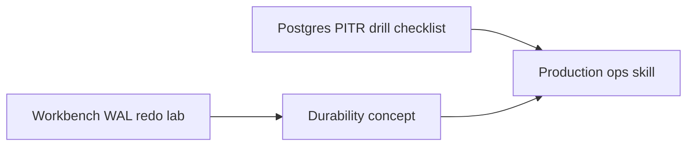

# ADR-005: Backup and PITR Drill Policy

## Status

Accepted on 2026-07-22.

## Context

[[08-Databases/12-Production-Database-Ops/Backups PITR and Restore Drills|Backups PITR and Restore Drills]] belongs to production database ops. The workbench's toy WAL/AOF labs demonstrate **durability mechanics**, not enterprise backup products. Learners still need a **documented drill policy** connecting labs to real Postgres PITR without implying the workbench performs production backup.

## Decision

1. **Workbench labs** teach point-in-time recovery *concepts* via WAL redo and AOF replay on local `--data-dir` only—no cloud backup integration.
2. **Portfolio documentation** includes a mandatory **Postgres PITR drill checklist** (script template target: `08-Databases/code/scripts/pitr-drill.md`) for learners operating a local or staging Postgres instance.
3. Drills run on **disposable instances** with synthetic data only; production credentials forbidden in repo and CI.
4. Drill frequency recommendation: once per learner before claiming ops readiness; evidence logged in Engineering Journal entry, not automated telemetry.
5. Workbench npm package **does not** ship backup agents, `pg_basebackup` wrappers, or object-store credentials.

## Drill Checklist (Postgres)

| Step | Verification |
| --- | --- |
| Take base backup | Backup artifact restorable to empty data directory |
| Generate WAL during workload | Archive or replication slot receives segments |
| Simulate failure after known timestamp | Instance stopped or data dir removed |
| Restore base + replay WAL to target time | Row count matches expected PITR cut |
| Document RPO/RTO observed | Journal entry with times and gaps |

## Options Considered

| Option | Pros | Cons |
| --- | --- | --- |
| Docs-only drill policy (chosen) | Safe; ops-aligned | Requires local Postgres setup |
| Automate in workbench CLI | Integrated | Blurs toy vs prod; credential risk |
| Skip backup entirely | Smaller scope | Ops gap in portfolio |
| Cloud vendor backup lab | Realistic | Out of scope; credential sprawl |

## Consequences

Security doc forbids production URLs in drill scripts. Monitoring tracks drill completion only as learner journal evidence, not package SLO. Toy WAL recovery tests remain the CI default.

## Follow-ups

- Add script template and synthetic schema in code/scripts when code tree lands (Ideas I-007).
- Cross-link [[08-Databases/12-Production-Database-Ops/Operational Readiness for Database Engines|Operational Readiness]] stage gate.

## Related Documents

- [[08-Databases/projects/Database Engines Workbench/Security|Security]]
- [[08-Databases/12-Production-Database-Ops/Backups PITR and Restore Drills|Backups PITR and Restore Drills]]
