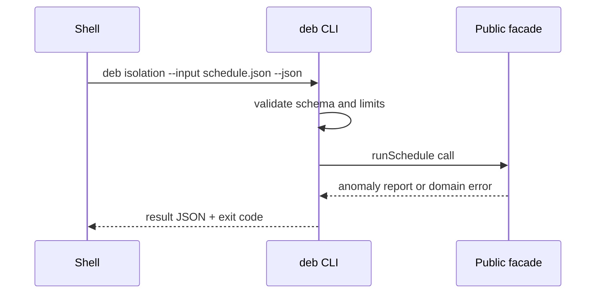

# API — Database Engines Workbench

## Library Surface

| Module | Symbols | Contract summary |
| --- | --- | --- |
| page-store | `PageStore`, `Slot`, `PageHeader` | fixed-size pages with slot directory |
| buffer-pool | `BufferPool`, `pin`, `unpin`, `evict` | pin-count eviction; not PG clock sweep |
| wal | `WalWriter`, `WalRecoverer`, `Checkpoint` | append + redo recovery |
| bplus-index | `BPlusIndex`, `explainIndexLookup`, `rangeScan` | on-disk B+ lab |
| isolation-lab | `IsolationLabEngine`, `runSchedule` | declarative txn schedules |
| lock-manager | `LockManager`, `detectDeadlock` | row locks + wait-for graph |
| mvcc | `MvccSnapshot`, `isVisible` | tuple xmin/xmax visibility |
| redis-dict | `RedisDict`, `command` | SET/GET/DEL/INCR/EXPIRE subset |
| redis-aof | `AofWriter`, `AofReplayer`, `rewriteAof` | JSON-line AOF lab |
| sql-fixture | `SqlFixtureRunner`, `loadSchema` | SELECT subset on in-memory tables |
| explain | `ExplainHarness`, `CostModel`, `diffPlan` | plan scoring + hints |
| engine-advisor | `adviseEngine`, `EngineProfile` | Postgres/Mongo/Redis guidance |

Source: [[08-Databases/code/src|08-Databases/code/src]]. Educational APIs—not drop-in replacements for Postgres, MongoDB, Redis, or ORMs.

## CLI Contract (Target)

Syntax: `deb <page|wal|index|isolation|redis|sql|explain|advisor> --input <json> --json`

The adapter reads bounded JSON, writes one JSON result to stdout, diagnostics to stderr, and never executes input as code.

## Error Model

| Exit | Code | Meaning | Caller action |
| --- | --- | --- | --- |
| 0 | OK | Completed | Consume stdout |
| 2 | INVALID_INPUT | Parse/schema failure | Correct input |
| 3 | DOMAIN_ERROR | WAL/index/isolation/plan failure | Inspect details |
| 4 | IO_ERROR | Lab path or AOF IO failure | Check data-dir permissions |
| 5 | LIMIT_EXCEEDED | Caps on pages/locks/size | Reduce workload |
| 70 | INTERNAL_ERROR | Unexpected defect | Preserve stderr and report |

## Compatibility

Semantic versioning applies after first tagged release. Export names, JSON fields, exit codes, and schedule DSL op names are compatibility surfaces. Production engine parity is not.

## Related Documents

- [[08-Databases/projects/Database Engines Workbench/Requirements|Requirements]]
- [[08-Databases/projects/Database Engines Workbench/Testing|Testing]]
