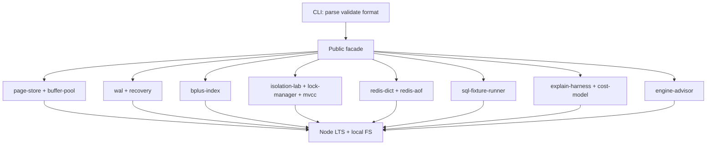
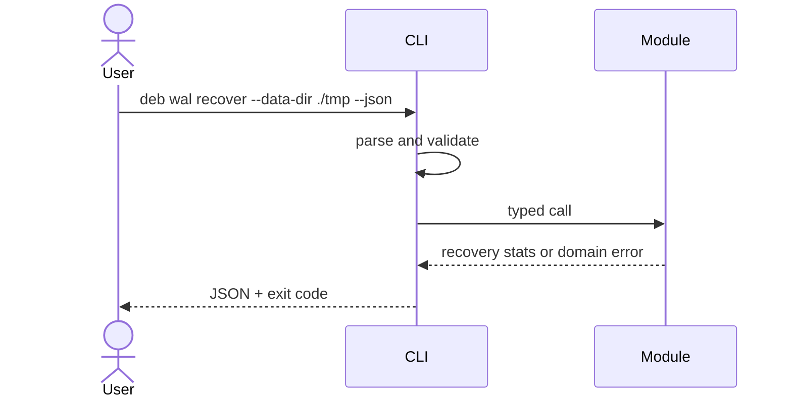

# Architecture — Database Engines Workbench

## Summary

A modular monolith: one installable package (`@seb/database-engines-workbench` target name in [[08-Databases/code|08-Databases/code]]), independent domain modules, no application server. The CLI validates and serializes input; domain modules own engine behavior.

## Data Flow

## Key Components

| Component | Responsibility | Boundary |
| --- | --- | --- |
| Public facade | Stable exports and semver | No engine policy in CLI |
| CLI adapter (`deb`) | Parsing, limits, JSON, exit codes | No domain logic |
| Page store + buffer pool | Slot pages, pin/evict | Not PostgreSQL buffer manager |
| WAL + recovery | Append, checkpoint, redo | Redo-only lab v1 |
| B+ index | Search, range, splits | Not full planner integration |
| Isolation lab | Schedules, anomalies | Simplified SSI |
| Redis AOF lab | Dict + persistence subset | Not Redis wire protocol |
| SQL fixture runner | In-memory SELECT subset | Not SQL standard |
| EXPLAIN harness | Cost model + plan diff | Fixture-first; optional PG |
| Engine advisor | Postgres/Mongo/Redis hints | Decision support only |

## Supporting Mini Projects

Each mini project README maps to one module family. Portfolio integrates them under one facade without merging unrelated invariants (WAL ordering ≠ AOF rewrite ≠ plan scoring).

## Quality Attributes

- **Correctness:** explicit WAL-before-page, split invariants, isolation schedules, AOF replay equivalence, plan rubric scoring.
- **Security:** no `eval`, jailed data dirs, read-only SQL fixtures; see [[08-Databases/projects/Database Engines Workbench/Security|Security]].
- **Performance:** bounded fanout, lock counts, AOF size; benchmarks gate demonstrated regressions only.
- **Operability:** structured stderr diagnostics; stdout remains machine-readable JSON from CLI.

## Trade-offs

One package simplifies learning but couples releases. Postgres-first relational teaching (ADR-002) prioritizes EXPLAIN/fixtures over Mongo aggregation labs in v1. Redis AOF JSON lines trade wire fidelity for test clarity (ADR-003). Isolation lab uses explicit schedules over random concurrency fuzz for reproducibility (ADR-004).

## Decisions

- [[08-Databases/projects/Database Engines Workbench/ADR/ADR-001 Educational Engine Scope|ADR-001: Educational Engine Scope]]
- [[08-Databases/projects/Database Engines Workbench/ADR/ADR-002 Postgres-First Relational Default|ADR-002: Postgres-First Relational Default]]
- [[08-Databases/projects/Database Engines Workbench/ADR/ADR-003 Redis Persistence Teaching Model|ADR-003: Redis Persistence Teaching Model]]
- [[08-Databases/projects/Database Engines Workbench/ADR/ADR-004 Isolation Lab Defaults|ADR-004: Isolation Lab Defaults]]
- [[08-Databases/projects/Database Engines Workbench/ADR/ADR-005 Backup and PITR Drill Policy|ADR-005: Backup and PITR Drill Policy]]

## Related Documents

- [[08-Databases/projects/Database Engines Workbench/API|API]]
- [[08-Databases/projects/Database Engines Workbench/Testing|Testing]]
