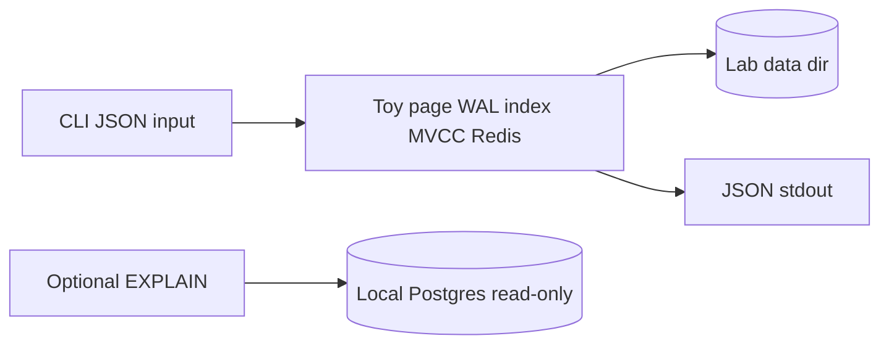

# Database — Database Engines Workbench

## Status: Educational Engines Only (Not a Product Database)

This portfolio implements **toy storage engines in TypeScript** for teaching. It does not ship a production database product, managed service, or ORM-backed application schema.

## Data Stance

| Concern | Approach |
| --- | --- |
| Authoritative product DB | **N/A** — use PostgreSQL/MongoDB/Redis in real systems |
| Lab heap pages | `PageStore` files under configurable `--data-dir` |
| WAL / AOF | Append-only segments for durability demos |
| In-memory fixtures | JSON schemas under [[08-Databases/code/tests/fixtures|tests/fixtures]] |
| Optional live Postgres | EXPLAIN adapter only; read-only `EXPLAIN` queries |
| Secrets | `DEB_PG_URL` optional; never persisted by workbench |

## Module Storage Map

| Module | Durability | Recovery |
| --- | --- | --- |
| Page + WAL | WAL segments + page files | Redo from checkpoint LSN |
| B+ index | Index pages via page store | Same WAL redo path |
| Isolation lab | In-memory tuples | Rebuild from schedule fixtures |
| Redis AOF | `appendonly.aof` | Command replay |
| SQL fixtures | In-memory tables | Reload fixture JSON |
| EXPLAIN harness | Stateless | N/A |

## Rationale

The learning goal is **engine mechanics**—pages, WAL, indexes, isolation, persistence trade-offs—not application data modeling. Repositories, migrations, and connection pooling belong to [[07-Backend/README|Backend]]; production backup topology belongs to [[08-Databases/12-Production-Database-Ops/Backups PITR and Restore Drills|Backups PITR and Restore Drills]] with drill policy in ADR-005.

## If Product Persistence Appears Later

Any future “real DB” integration must be a separate project with its own Requirements, Security, and ADR. It will not ship inside Database Engines Workbench v1.

## Related Documents

- [[08-Databases/projects/Database Engines Workbench/Architecture|Architecture]]
- [[08-Databases/projects/Database Engines Workbench/ADR/ADR-001 Educational Engine Scope|ADR-001]]
- [[08-Databases/projects/Database Engines Workbench/Security|Security]]
