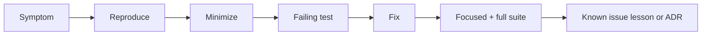

# Debug Diary — Database Engines Workbench

## Investigation Index

| Date | Observation | Finding | Prevention | Status |
| --- | --- | --- | --- | --- |
| 2026-07-22 | Portfolio requested integrated workbench while code tree is greenfield | Facade/CLI not yet present; module docs reference target paths under `08-Databases/code/src` | Mark CLI as target; gate release claims on tarball smoke + contract tests | tracked |
| 2026-07-22 | WAL recovery ordering easy to get wrong in tests | Flush-before-WAL must fail fast in debug builds | Add explicit invariant assertion in buffer pool | tracked |
| 2026-07-22 | Isolation schedules can hang if lock cap missing | Need max steps and max locks | Enforce caps in schedule runner | tracked |

## Debug Protocol

Reproduce with smallest fixture, capture Node/Vitest versions and exact command, classify contract versus implementation failure, add failing test, then fix without weakening assertions. Preserve WAL LSN traces, recovery page dumps, isolation timelines, and AOF replay diffs when relevant.

Escalate release-impacting or repeated failures to [[08-Databases/projects/Database Engines Workbench/Postmortem|Postmortem]].

## Related Documents

- [[08-Databases/projects/Database Engines Workbench/Known Issues|Known Issues]]
- [[08-Databases/12-Production-Database-Ops/Operational Readiness for Database Engines|Operational Readiness for Database Engines]]
