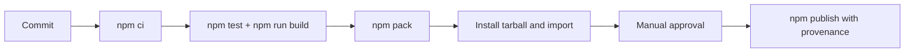

# Deployment — Database Engines Workbench

## Environments

| Environment | Purpose | Promotion rule |
| --- | --- | --- |
| local | implementation and focused tests | `npm install` and `npm test` pass |
| CI | reproducible multi-platform verification | required checks and package smoke pass |
| npm release | immutable library/CLI artifact | reviewed tag, provenance, manual approval |



## Release and Rollback

Build from [[08-Databases/code|08-Databases/code]] using `package.json` exports map. Inspect `npm pack` contents before publishing. Pin CI Node LTS versions; use least-privilege publish tokens. npm versions are immutable: rollback means deprecating the bad version, restoring last known-good recommendation, and publishing a corrected semver.

## Local Bootstrap

```bash
cd 08-Databases/code
npm install
npm test
npm run build
npm pack
```

## Lab Data Directories

Deployment artifacts exclude learner `--data-dir` contents. CI uses ephemeral temp prefixes destroyed after tests. Backup/PITR drill procedures documented in ADR-005 apply to **production Postgres labs**, not npm package install paths.

## Checklist

- [ ] Clean checkout: install and `npm test` pass.
- [ ] Tarball smoke import resolves public facade on Windows/Linux/macOS Node LTS.
- [ ] Artifact excludes tests, lab WAL files, journals, secrets, and local caches.
- [ ] Changelog, compatibility notes, and provenance recorded.

## Related Documents

- [[08-Databases/projects/Database Engines Workbench/Testing|Testing]]
- [[08-Databases/projects/Database Engines Workbench/Monitoring|Monitoring]]
